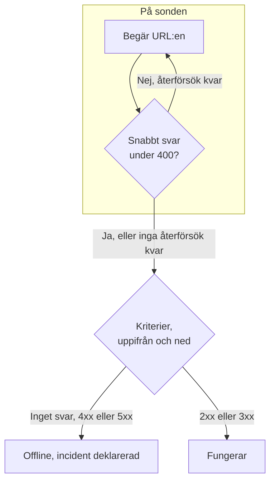

# Webbplatsövervakning

En webbplatsmonitor kontrollerar att en webbsida svarar. Vid varje kontroll begär en sond sidans URL, och monitorn går offline och deklarerar en incident när sidan inte svarar eller svarar med ett fel. För att anropa en slutpunkt med en metod, huvuden eller en kropp använder du i stället en [API-monitor](/docs/monitor/api-monitor).

:::cards
- [Skapa monitorn](#skapa-en-webbplatsmonitor): Sex steg i instrumentpanelen.
- [Konfigurationsalternativ](#konfigurationsalternativ): URL-platshållare, omdirigeringar, certifikat, tidsgränser och återförsök.
- [Övervakningskriterier](#övervakningskriterier): Vad som från början räknas som uppe eller nere.
- [Felsökning](#felsökning): När monitorn och din webbläsare inte håller med varandra.
:::

## Så fungerar det

Vid varje kontroll begär en sond URL:en, följer omdirigeringar och registrerar vad som kom tillbaka: statuskoden, svarstiden, huvudena och, när ett kriterium behöver den, kroppen. En begäran som misslyckas, når tidsgränsen, svarar med status `4xx` eller `5xx` eller tar längre än 10 sekunder görs om, upp till det antal återförsök du tillåter. Sedan kör OneUptime resultatet genom monitorns kriterier.



När inget av monitorns kriterier läser svarets kropp (ett filter **Svarstext** eller **JavaScript Expression**) skickar sonden en begäran `HEAD` i stället för en `GET`, och upprepar den som `GET` om servern avvisar `HEAD`. Serverns åtkomstloggar kan visa vilken som helst av dem.

En sond som har förlorat sin egen nätverksanslutning rapporterar inget resultat, så den kan inte markera din webbplats som offline.

## Innan du börjar

- **En roll som kan skapa monitorer**: Project Owner, Project Admin, Project Member, Monitor Admin eller Monitor Member, eller en anpassad roll med behörigheten Create Monitor.
- **En sond som når webbplatsen.** Projektets standardsonder väljs för varje ny monitor. Om en brandvägg står framför webbplatsen tillåter du [OneUptime Clouds sond-IP-adresser](/docs/configuration/ip-addresses). En webbplats i ett privat nätverk behöver en [anpassad sond](/docs/probe/custom-probe) i det nätverket, som får nå privata adresser: se [Åtkomst till privat nätverk](/docs/self-hosted/private-network-access).

## Skapa en webbplatsmonitor

:::steps
### Börja en ny monitor

Gå till **Monitorer** och klicka på **Skapa monitor**. Välj **Webbplats** under **Monitortyp**.

### Namnge den

Ange ett **Namn**, som `Marketing site`, och klicka sedan på **Nästa**.

### Ange URL:en

Ange sidans fullständiga adress under **Webbplats-URL**, inklusive `https://`, som `https://example.com`. För att ändra omdirigeringar, certifikat, tidsgränsen eller återförsök öppnar du **Fler fält** nedanför (se [Konfigurationsalternativ](#konfigurationsalternativ)).

### Testa den

Klicka på **Testa monitor**, välj en sond under **Välj sond** och klicka på **Kör test**. **Resultat av övervakningstest** visar vad sonden fick tillbaka.

### Gå igenom kriterierna

**Monitorkriterier** börjar med [standardkriterierna](#standardkriterier): offline när webbplatsen inte svarar eller svarar med ett fel, online vid varje status `2xx` eller `3xx`. Ändra dem vid behov och klicka sedan på **Nästa**.

### Välj sonder och skapa

Behåll eller ändra **Sonder** och **Övervakningsintervall** (det börjar på **Var 5:e minut**) och klicka sedan på **Skapa monitor**. Monitorns sida öppnas.
:::

## Konfigurationsalternativ

### Webbplats-URL

Sidan som ska kontrolleras, som fullständig URL med schema: `https://example.com`, `https://example.com/pricing` eller `http://example.com:8080/health`. Du kan lägga in en [övervakningshemlighet](/docs/monitor/monitor-secrets) i URL:en som `{{monitorSecrets.NAME}}`, till exempel en token i frågesträngen.

### Dynamiska URL-platshållare

När ett CDN eller en cachande proxy står framför webbplatsen kan en sond få svar från cachen i stället för från din server. För att komma förbi cachen lägger du till en platshållare i URL:en; sonden ersätter den med ett nytt värde vid varje kontroll.

| Platshållare | Ersätts med | Exempelvärde |
| --- | --- | --- |
| `{{timestamp}}` | Aktuell Unix-tid i sekunder | `1719500000` |
| `{{random}}` | En slumpmässig, unik sträng på 32 hexadecimala tecken | `3f2b8c1d9e7a4b6c8d0e1f2a3b4c5d6e` |

En URL med en platshållare:

```text
https://example.com/health?cb={{timestamp}}
```

Vad sonden begär vid två kontroller med fem minuters mellanrum:

```text
https://example.com/health?cb=1719500000
https://example.com/health?cb=1719500300
```

Använd `{{random}}` på samma sätt: `https://example.com/health?nocache={{random}}`.

### Fler fält

De här inställningarna är hopfällda under **Fler fält**, under URL:en. Den hopfällda rubriken nämner dem och visar vilka du har ändrat.

| Fält | Standard | Vad det gör |
| --- | --- | --- |
| **Följ inte omdirigeringar** | Av | Bedöm det första svaret i stället för att följa omdirigeringar. Se [nedan](#följ-inte-omdirigeringar). |
| **Tillåt självsignerade certifikat** | Av | Hoppa över valideringen av TLS-certifikatet för monitorns eget värdnamn. |
| **Använd klientcertifikat (mTLS)** | Av | Visa upp ett klientcertifikat och en privat nyckel. Se [Klientcertifikat (mTLS)](#klientcertifikat-mtls). |
| **Begärandetimeout (sekunder)** | `60` | Hur länge varje försök får vänta. Maxvärdet är 60 sekunder. |
| **Återförsök vid misslyckande** | Sondens standard, oftast `3` | Hur många gånger ett misslyckat försök görs om. Maxvärdet är 3. Se [Återförsök och tidsgränser](#återförsök-och-tidsgränser). |

#### Följ inte omdirigeringar

Som standard följer sonden omdirigeringar (`301`, `302`, `303`, `307` och `308`), upp till 10 av dem, och bedömer sidan den hamnar på. Slå på **Följ inte omdirigeringar** för att i stället bedöma själva omdirigeringssvaret, till exempel för att kontrollera att `http://` omdirigerar till `https://`. [Standardkriterierna](#standardkriterier) räknar ett omdirigeringssvar som online.

**Tillåt självsignerade certifikat** följer omdirigeringar som stannar på monitorns eget värdnamn. En omdirigering till ett annat värdnamn verifieras som vanligt.

#### Klientcertifikat (mTLS)

Om webbplatsen kräver ömsesidig TLS slår du på **Använd klientcertifikat (mTLS)** och fyller i:

| Fält | Vad du anger |
| --- | --- |
| **Klientcertifikat (PEM)** | Det PEM-kodade klientcertifikat som visas upp. |
| **Privat klientnyckel (PEM)** | Den matchande PEM-kodade privata nyckeln. |
| **Lösenfras för privat klientnyckel** | Valfritt. Lösenfrasen, bara om den privata nyckeln är krypterad. |

Det motsvarar curls flaggor `--cert` och `--key`:

```bash
curl --cert client.crt --key client.key https://example.com/health
```

För att hålla nyckeln utanför monitorns inställningar sparar du certifikatet och nyckeln som [övervakningshemligheter](/docs/monitor/monitor-secrets) och anger `{{monitorSecrets.NAME}}` i de här fälten. Hemligheter fylls i på servern, och deras värden visas aldrig i instrumentpanelen.

Klientcertifikatet visas bara upp så länge begäran stannar på monitor-URL:ens ursprung (samma schema, värd och port). Efter en omdirigering till ett annat ursprung fortsätter sonden utan det.

#### Återförsök och tidsgränser

**Återförsök vid misslyckande** räknar återförsök _efter_ det första försöket, så `0` kör kontrollen en gång och `2` upp till tre gånger. Lämnas fältet tomt används sondens standard: 3, om inte sondens `PROBE_MONITOR_RETRY_LIMIT` säger något annat. Sonden väntar en sekund mellan försöken, och varje försök får hela **Begärandetimeout (sekunder)**.

Dessa fel görs om: anslutningsfel, tidsgränser, svar `4xx` och `5xx` och svar som är långsammare än 10 sekunder. Dessa görs inte om, eftersom ett nytt försök inte kan ändra dem: en ogiltig eller blockerad URL, fler än 10 omdirigeringar och ett svar större än 512 KiB.

## Övervakningskriterier

Kriterier avgör när webbplatsen räknas som online, försämrad eller offline, och om det deklarerar en incident eller skapar ett larm. Varje kriterium kontrollerar ett eller flera filter:

| Filter | Villkor | Vad det kontrollerar |
| --- | --- | --- |
| **Is Online** | **Sant**, **Falskt** | Om webbplatsen svarade alls, oavsett statuskod. |
| **Statuskod för svar** | **Equal To**, **Not Equal To**, **Greater Than**, **Less Than**, **Greater Than Or Equal To**, **Less Than Or Equal To** | HTTP-statuskoden. |
| **Svarstid (i ms)** | **Greater Than**, **Less Than**, **Greater Than Or Equal To**, **Less Than Or Equal To** | Hur lång tid begäran tog, omdirigeringar inräknade. |
| **Svarstext** | **Innehåller**, **Not Contains** | Text i svarets kropp. Jämförelsen skiljer på versaler och gemener. |
| **Response Header** | **Innehåller**, **Not Contains** | Om svaret har ett huvud med det här namnet. Ange namnet med gemener, som `x-cache`. |
| **Response Header Value** | **Innehåller**, **Not Contains** | Om ett huvud har exakt det här värdet, jämfört med gemener, som `no-store`. |
| **JavaScript Expression** | **Evaluates To True** | Ett uttryck över svaret. Se [JavaScript-uttryck](/docs/monitor/javascript-expression). |
| **Is Request Timeout** | **Sant**, **Falskt** | Om begäran nådde tidsgränsen vid varje försök. |

**Lägg till kriterier** lägger till ett kriterium som redan är namngivet efter sitt filter, till exempel _Response Time (in ms) is above 3000_. Namnet ändras med filtren tills du skriver ett eget. En beskrivning är valfri: för att lägga till en öppnar du kriteriets **Inställningar**.

Med två eller fler filter avgör **Matchningsvillkor** om **Alla** måste matcha eller om **Valfri** av dem räcker. Ett kriteriums **Åtgärder** avgör vad det gör: ändrar monitorns status, skapar ett larm, deklarerar en incident eller flera av dessa.

### Standardkriterier

En ny webbplatsmonitor börjar med två kriterier, så den fungerar utan att du ändrar något:

- **Offline** — webbplatsen svarar inte, eller svarar med en statuskod på `400` eller högre (eller under `200`). Monitorn markeras som **Offline** och en incident skapas. Incidenten löser sig själv när webbplatsen är tillbaka.
- **Uppe** — webbplatsen svarar med valfri statuskod `2xx` eller `3xx`, som `200`, `204` eller `301`. Monitorn markeras som **Fungerar**.

I listan över kriterier är de namngivna efter monitorn: _Check if (name) is offline_ och _Check if (name) is online_.

En sida som svarar `204 No Content`, eller en omdirigering du bevakar med **Följ inte omdirigeringar** påslaget, räknas alltså som uppe. Om bara en statuskod betyder frisk för dig ändrar du båda kriterierna på monitorns sida **Konfiguration → Kriterier**: till exempel **Statuskod för svar** / **Equal To** / `200` i online-kriteriet och **Not Equal To** / `200` i offline-kriteriet, i stället för de två statuskodsfilter som vart och ett har.

Kriterier kontrolleras uppifrån och ned, och det första som matchar avgör vad som händer.

När inget matchar faller monitorn tillbaka på sin standardstatus: **Fungerar**, om du inte väljer en annan under **Fler fält** under kriterierna. Den hopfällda rubriken för **Fler fält** visar vilken status det är.

Monitorer som skapades innan OneUptime ändrade dessa standarder behåller de kriterier de skapades med, och räknar bara `200` som online. Monitorer som skapas via API:et eller Terraform använder de kriterier du skickar.

### Utvärdering över en tidsperiod

**Utvärdera dessa kriterier över en tidsperiod** är en kryssruta under ett filter, som erbjuds för **Is Online**, **Statuskod för svar** och **Svarstid (i ms)**. Slå på den för att bedöma ett fönster av tidigare kontroller i stället för bara den senaste: välj en aggregering under **Utvärdera** och ett fönster från 2 till 60 minuter under **Under de senaste (i minuter)**.

| Aggregering | Matchar när |
| --- | --- |
| **Genomsnitt**, **Summa**, **Maximum Value**, **Minimum Value** | Det värdet över fönstret uppfyller villkoret. Bara numeriska filter. |
| **All Values** | Varje kontroll i fönstret uppfyller villkoret. |
| **Any Value** | Minst en kontroll i fönstret uppfyller villkoret. |

**All Values** matchar först när fönstret verkligen täcks av data. En monitor som just skapats, eller en vars kontroller slutade registreras, har inte tillräcklig historik för att säga något om de senaste N minuterna, så kriteriet väntar i stället för att matcha på den enda mätning det har. **Any Value** är inställningen för "säg till direkt när en enda kontroll går över gränsen" och utlöses fortfarande omedelbart.

**Om ingen data** avgör vad som händer så länge fönstret inte kan bära kriteriet:

| Alternativ | Vad som händer | Använd det för |
| --- | --- | --- |
| **Ignore** (standard) | Kriteriet matchar inte. | Vanliga tröskellarm. |
| **Utlösare** | Den saknade datan räknas som problemet. | Kontroller där tystnad i sig är ett fel. |
| **Treat As Zero** | Fönstret jämförs som en enda nolla. | Räknare där inga händelser verkligen betyder noll. |

### Exempelkriterier

| Mål | Filter | Villkor | Värde |
| --- | --- | --- | --- |
| Markera webbplatsen som försämrad när den är långsam | **Svarstid (i ms)** | **Greater Than** | `3000` |
| Fånga en felsida som levereras med `200` | **Svarstext** | **Not Contains** | `Welcome` |
| Kontrollera att ett CDN-huvud finns | **Response Header** | **Innehåller** | `x-cache` |
| Godta bara `200` som frisk | **Statuskod för svar** | **Equal To** | `200` |

## Felsökning

:::details Monitorn är offline, men webbplatsen laddas i min webbläsare
Sonden fick ett annat svar än din webbläsare. Incidentens rotorsak och **Övervakningsloggar** på monitorn visar vad sonden såg. Vanliga orsaker:

- En brandvägg eller ett botfilter blockerar sonderna. Tillåt [OneUptime Clouds sond-IP-adresser](/docs/configuration/ip-addresses).
- Webbplatsen nås bara i ditt nätverk. Använd en [anpassad sond](/docs/probe/custom-probe) inuti det.
- Certifikatet är självsignerat eller från en privat certifikatutfärdare. Slå på **Tillåt självsignerade certifikat**, eller övervaka certifikatet separat med en [SSL-certifikatmonitor](/docs/monitor/ssl-certificate-monitor).
:::

:::details Kontrollen misslyckas med "Remote response exceeded the allowed size."
Sonden läser högst 512 KiB av ett svar, och den här sidan är större. Peka monitorn mot en mindre sida, som en hälsoslutpunkt, eller ta bort filtren **Svarstext** och **JavaScript Expression** så att sonden bara behöver huvudena.
:::

:::details Kontrollen misslyckas med "Monitor target exceeded 10 redirects."
URL:en omdirigerar mer än 10 gånger, oftast i en slinga. Öppna URL:en med `curl -IL` för att se kedjan, och peka monitorn mot sidan där kedjan borde sluta.
:::

:::details Kontrollen misslyckas med ett meddelande om en privat nätverksadress
URL:en slås upp till en privat adress, och sonden som körde kontrollen får inte nå privata adresser. På en egen sond slår du på det med `PROBE_ALLOW_PRIVATE_NETWORK_MONITORS`: se [Åtkomst till privat nätverk](/docs/self-hosted/private-network-access).
:::

## Nästa steg

:::cards
- [API-övervakning](/docs/monitor/api-monitor): Anropa en slutpunkt med en metod, huvuden och en kropp.
- [Övervakning av SSL-certifikat](/docs/monitor/ssl-certificate-monitor): Få en varning innan webbplatsens certifikat går ut.
- [Övervakningshemligheter](/docs/monitor/monitor-secrets): Håll tokens och nycklar utanför monitorinställningarna.
- [Incidenter](/docs/incidents/index): Vad som händer efter att monitorn har deklarerat en.
:::
