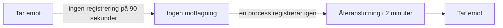

# När OneUptime inte tar emot data

Medan OneUptime startar om, uppgraderas eller betar av en eftersläpning kan inget av det som dina agenter, collectors, sonder och heartbeat-avsändare skickar nå dina monitorer. OneUptime registrerar när det händer och räknar aldrig den tiden mot en server, en värd eller någon annan resurs: tiden övervakades inte, så den är inte driftstopp.

## Så fungerar det

Varje OneUptime-process som tar emot data registrerar var 30:e sekund att den tar emot, så länge den når databaserna där den lagrar data. OneUptime utelämnar tre sorters tid:

- Ingen mottagning: ingen process har registrerat något på mer än 90 sekunder. OneUptime var stoppat, startade om, uppgraderades eller nådde inte en av sina databaser.
- Återanslutning: de första 2 minuterna efter att OneUptime tar emot igen, medan agenter ansluter på nytt och skickar det de har hållit kvar.
- Ikapphämtning: så länge kön med data som väntar på bearbetning ligger mer än en minut efter, tiden sedan de äldsta data som fortfarande väntar i den.



En omstart som tar mindre än 90 sekunder är inget avbrott: collectors skickar igen det de inte kunde leverera.

## Vad som ändras under den tiden

| Var | Vad OneUptime gör |
| --- | --- |
| Server- / VM-monitorer | **Is Online** räknar bara de minuter då OneUptime tog emot: som standard är en server offline efter 3 minuters tystnad som OneUptime kunde ha hört. |
| Monitorer för inkommande förfrågningar och inkommande e-post | **Recieved In Minutes** och **Not Recieved In Minutes** räknar bara de minuter då OneUptime tog emot. När ett sådant kriterium uppfylls anger orsaken hur många av minuterna som utelämnades. |
| Värd-, Kubernetes-, Docker-, metrik-, logg- och trace-monitorer och de andra monitorerna som läser telemetri | En kontroll vars fönster innehåller tid utan mottagning väntar tills den tiden har lämnat fönstret, och aldrig längre än 15 minuter efter att den tog slut. Till dess ändras ingenting: ingen statusändring, och ingen incident eller varning öppnas eller löses. Så länge kön ligger efter läser en kontroll fram till där kön är i stället för fram till nu. |
| Värdar, kluster och resten av inventariet | En resurs blir **Frånkopplad** först när dess tystnadströskel, 15 minuter för de flesta, har passerat medan OneUptime tog emot. |
| Sonder och AI-agenter | Blir **Frånkopplad** efter 3 minuters tystnad medan OneUptime tog emot. |
| **Tillgänglighet**-diagram för värdar, Docker- och Podman-värdar och Kubernetes-kluster | Tiden skuggas som **Inte övervakad**, och linjen bryts där i stället för att falla till nere. Uptime-märket utelämnar den tiden; ett intervall med data räknas fortfarande som uppe. |
| Uptime på statussidor och SLO:er | Båda beräknas från monitorstatusar: utan falsk statusändring inget falskt driftstopp. |

> [!NOTE]
> Att utelämna tid är inte att fylla i den. En resurs visas aldrig som uppe för tid då OneUptime inte kunde höra den: den tiden bedöms helt enkelt inte. Så snart OneUptime tar emot igen bedöms en resurs som verkligen är nere från och med då utifrån vad den skickar, eller inte skickar.

## Självhostade installationer

### Vid start

Medan en OneUptime-process startar svarar den på varje förfrågan utom sina statuskontroller med `503 Service Unavailable` och `Retry-After: 5`, och en webbläsare får en sida som laddar om sig själv. OpenTelemetry-collectors och -SDK:er skickar en sådan förfrågan igen i stället för att kasta data. `/status/ready` misslyckas tills processen är redo, så Kubernetes skickar ingen trafik till den innan dess.

### Worker-repliker

En process registrerar bara att OneUptime tar emot när inkommande trafik kan nå den. Om du kör repliker som bara bearbetar köer, utan ingress framför, ställer du in `RECEIVES_INGRESS_TRAFFIC` på `false` för dem. Annars fortsätter de att registrera medan alla repliker som tar emot trafik är nere, och det avbrottet räknas åter mot dina resurser. Helm-diagrammet ställer redan in det på sina worker-poddar, och en enda OneUptime-container behöver ingenting.

```yaml title="Worker-container"
env:
  - name: RECEIVES_INGRESS_TRAFFIC
    value: "false"
```

### Vad som registreras

OneUptime börjar föra den här registreringen när du uppgraderar till en version som har den; tid före det bedöms som alltid. Så länge ingen process registrerar att den tar emot behandlas tiden sedan den senaste registreringen som ett avbrott i högst en timme; därefter räknas tystnad igen, så att en registrering som inte längre skrivs inte länge kan dölja ett avbrott hos dina resurser. Registreringar sparas i 400 dagar, och när OneUptime inte kan läsa dem bedömer det tystnad som om det hade tagit emot hela tiden.

## Nästa steg

:::cards
- [Värdövervakning](/docs/monitor/host-monitor): Larma på en värds mätvärden.
- [Server- / VM-övervakning](/docs/monitor/server-monitor): Få veta när en servers agent slutar rapportera.
- [Övervakning av inkommande förfrågningar](/docs/monitor/incoming-request-monitor): Gör ett heartbeat till ett dödmansgrepp.
- [Uppgradering](/docs/installation/upgrading): Uppgradera en självhostad installation.
:::
