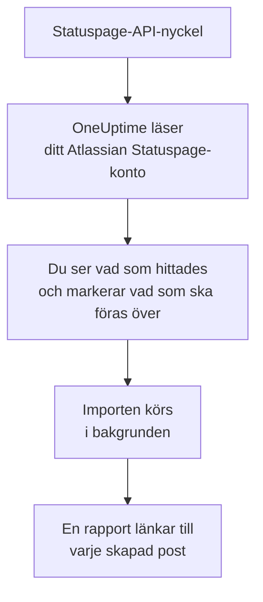

# Byt från Atlassian Statuspage

**Importera från ett annat verktyg** för över dina Atlassian Statuspage-sidor till OneUptime på några minuter. Med en Statuspage-API-nyckel läser OneUptime dina sidor, deras komponenter och grupper och deras e-postprenumeranter, visar vad det hittade och skapar det du markerar. Ingenting ändras i Statuspage.

:::cards
- [Importera ditt konto](#importera-ditt-atlassian-statuspage-konto): Skapa en nyckel, läs ditt konto och markera vad som ska föras över.
- [Vad som förs över](#vad-som-förs-över): Vad varje Statuspage-sida, -komponent och -prenumerant blir i OneUptime.
- [Slutför bytet](#slutför-bytet): Vad du gör när importen är klar.
:::

## Så fungerar det

- **Nyckeln används en gång.** Den sparas krypterad medan OneUptime läser ditt konto och tas bort så fort läsningen är klar, oavsett om den lyckades. Den visas aldrig igen och skrivs aldrig till en logg.
- **OneUptime läser bara.** Det anropar bara Atlassian Statuspages eget API: `api.statuspage.io`. Det skickar en förfrågan per sekund, det mesta Statuspage tillåter en nyckel. När Atlassian Statuspage ber det att sakta ner väntar det och försöker igen.
- **Ingenting skapas förrän du startar importen.** Förhandsgranskningen visar för varje objekt om det är nytt, redan finns i OneUptime (och används som det är), har förts över av en tidigare import, eller varför det inte kan föras över.
- **Att köra den igen skapar aldrig något två gånger.** OneUptime minns vad varje import förde över, efter Atlassian Statuspage-id:t. Kör den igen när du har lagt till sidor eller komponenter i Atlassian Statuspage, så skapas bara de nya.

## Innan du börjar

- **Ett OneUptime-projekt och rätten att skapa det du för över.** Projektägare och projektadministratörer kan föra över allt. Andra roller kan också köra en import och föra över de typer av poster de får skapa. Resten visas som inte överfört, med orsaken.
- **En Statuspage-API-nyckel.** Bara en kontoägare kan skapa en. Importen skriver aldrig till Statuspage, och den läser varje sida nyckeln kan se.
- **Plats för dina sidor, i OneUptime Cloud.** Ditt abonnemang har plats för ett visst antal statussidor och prenumeranter. Det som inte får plats visas som inte överfört. Komponenterna blir manuella monitorer, som är gratis.

## Importera ditt Atlassian Statuspage-konto

:::steps
### Skapa en API-nyckel i Statuspage
Välj din avatar längst ned till vänster i Statuspage och sedan **API info**. Välj **Create key**, kalla den `OneUptime import` och kopiera den.

### Öppna importsidan
Gå till **Projektinställningar** > **Importera från ett annat verktyg** i OneUptime och välj **Atlassian Statuspage**.

### Anslut Atlassian Statuspage
Klistra in nyckeln i **Atlassian Statuspage-API-nyckel** och välj **Läs mitt Atlassian Statuspage-konto**. Ett stort konto tar några minuter, och du kan lämna sidan medan det läses.

### Markera vad som ska föras över
Förhandsgranskningen visar vad som hittades, med ett avsnitt per typ. Allt som skulle skapas är markerat från början, utom prenumeranter. Under varje objekt berättar OneUptime vad som inte förs över precis som det var. När en markerad statussida visar en monitor som du inte har markerat säger det det, och **Markera dem också** markerar den. För att föra över prenumeranter markerar du dem och bekräftar under dem att de har gått med på att få dina uppdateringar och att du får flytta dem. Ingen får e-post.

### Starta importen
Välj **Starta import**. Importen körs i bakgrunden: du kan lämna sidan, och rapporten väntar på dig där.
:::

Rapporten räknar vad som skapades och inte fördes över, och visar varje objekt med en länk till posten det blev, misslyckade först. Tidigare importer finns under **Tidigare importer** på samma sida.

## Vad som förs över

| I Atlassian Statuspage | I OneUptime | Hur |
| --- | --- | --- |
| Components | Manuella monitorer | Varje komponent blir en manuell monitor som statussidan visar. Ingenting kontrollerar den: du sätter dess status i OneUptime, som du gjorde i Statuspage. En komponentgrupp blir en grupp på sidan. |
| Pages | Statussidor | Varje sida förs över med namn och beskrivning, sina komponenter i deras grupper och drifttid och historik för de komponenter den lyfter fram. En sida som bara vissa personer får se förs över som privat. |
| Email subscribers | Statussidans prenumeranter | Bekräftade e-postprenumeranter förs över när du bekräftar att du får flytta dem, och följer samma komponenter. Ingen får e-post, och varje uppdatering de får från OneUptime har en länk för att avsluta prenumerationen. |

Komponenter förs över som i drift. Förhandsgranskningen nämner varje komponent som inte är i drift i Statuspage just nu, så att du kan sätta dess status efter importen.

## Vad som inte förs över

- **Incidenter, schemalagt underhåll och deras historik.** En incident i OneUptime är en levande post som larmar personer, så tidigare incidenter stannar i Statuspage.
- **Prenumeranter via sms, webhook, Slack eller Microsoft Teams.** Förhandsgranskningen räknar dem. Bara e-postprenumeranter förs över.
- **Incidentmallar och systemmått.** Lägg till det du fortfarande behöver i OneUptime.
- **En statussidas egen domän och varumärke.** Lägg till domänen under **Anpassade domäner** och logotypen under **Varumärke** i OneUptime.

## Gränser

En import skapar högst 2 000 poster: högst 1 000 monitorer och 50 statussidor. Prenumeranter räknas inte in i det: en import för över högst 5 000 prenumeranter. Allt över en gräns visas som inte överfört. Kör importen igen för att föra över resten.

I OneUptime Cloud visas statussidor och prenumeranter som ditt abonnemang inte har plats för som inte överförda, med det som krävs.

En förhandsgranskning sparas i en dag. Bara den som läste kontot kan markera objekt och starta importen. Projektägare och projektadministratörer ser förloppet och rapporten för varje import.

## Slutför bytet

:::steps
### Kontrollera dina statussidor
Öppna varje sida under **Statussidor** och jämför den med den i Statuspage. Varje komponent är en manuell monitor: ändra dess status i OneUptime när något ändras.

### Peka statussidans adress mot OneUptime
Öppna sidan under **Statussidor**, lägg till din domän under **Anpassade domäner** och ändra sedan dess DNS-post. Då når dina besökare och prenumeranter den nya sidan.

### Stäng av din sida i Atlassian Statuspage
När din domän pekar mot OneUptime stänger du sidan i Statuspage, så att dess prenumeranter inte får besked två gånger.
:::

## Felsökning

:::details Atlassian Statuspage godtog inte API-nyckeln
Kontrollera att du kopierade hela nyckeln, och att en kontoägare skapade den under **API info**. En nyckel hör till en Statuspage-organisation och läser bara dess sidor. Välj sedan **Försök igen**.
:::

:::details Prenumeranterna kan inte föras över
Markera rutan under dem som bekräftar att de har gått med på dina uppdateringar och att du får flytta dem: **Starta import** väntar på den. Prenumeranter som aldrig bekräftade sin prenumeration i Statuspage stannar där.
:::

:::details Vissa objekt kan inte markeras
Vid varje objekt står varför: ett namn som projektet redan har, något som en tidigare import har fört över, eller en post som du inte får skapa eller som ditt abonnemang inte omfattar.
:::

## Nästa steg

:::cards
- [Statussidor – Översikt](/docs/status-pages/index): Vad en statussida visar och vem som kan se den.
- [Prenumeranter och meddelanden](/docs/status-pages/subscribers): Hur prenumeranter får veta om incidenter.
- [Manuell övervakning](/docs/monitor/manual-monitor): En monitor vars status du själv sätter.
:::
