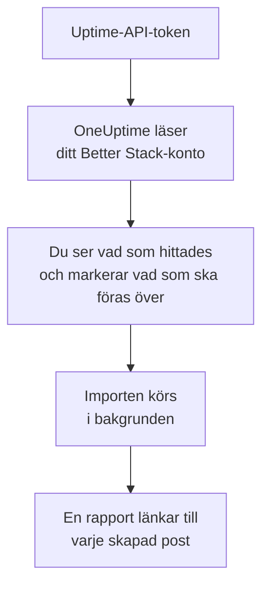

# Byt från Better Stack

**Importera från ett annat verktyg** för över dina Better Stack Uptime-monitorer, heartbeats och statussidor till OneUptime på några minuter. Med en Uptime-API-token från Better Stack läser OneUptime dina monitorer, heartbeats, statussidor och deras e-postprenumeranter, visar vad det hittade och skapar det du markerar. Ingenting ändras i Better Stack.

:::cards
- [Importera ditt konto](#importera-ditt-better-stack-konto): Skapa en token, läs ditt konto och markera vad som ska föras över.
- [Vad som förs över](#vad-som-förs-över): Vad varje Better Stack-monitor, -heartbeat och -statussida blir i OneUptime.
- [Slutför bytet](#slutför-bytet): Vad du gör när importen är klar.
:::

## Så fungerar det

- **Nyckeln används en gång.** Den sparas krypterad medan OneUptime läser ditt konto och tas bort så fort läsningen är klar, oavsett om den lyckades. Den visas aldrig igen och skrivs aldrig till en logg.
- **OneUptime läser bara.** Det anropar bara Better Stacks eget API: `incidents.betterstack.com`. När Better Stack ber det att sakta ner väntar det och försöker igen.
- **Ingenting skapas förrän du startar importen.** Förhandsgranskningen visar för varje objekt om det är nytt, redan finns i OneUptime (och används som det är), har förts över av en tidigare import, eller varför det inte kan föras över.
- **Att köra den igen skapar aldrig något två gånger.** OneUptime minns vad varje import förde över, efter Better Stack-id:t. Kör den igen när du har lagt till monitorer eller heartbeats i Better Stack, så skapas bara de nya.

## Innan du börjar

- **Ett OneUptime-projekt och rätten att skapa det du för över.** Projektägare och projektadministratörer kan föra över allt. Andra roller kan också köra en import och föra över de typer av poster de får skapa. Resten visas som inte överfört, med orsaken.
- **En Uptime-API-token från Better Stack.** Använd en teambaserad Uptime-token: den läser det teamets monitorer, heartbeats och statussidor. Importen skriver aldrig till Better Stack.
- **En betalningsmetod, i OneUptime Cloud.** Monitorer som kör kontroller faktureras efter användning, även med abonnemanget Free, så lägg till en under **Projektinställningar** > **Fakturering** innan du importerar. Utan en visas de monitorerna som inte överförda.

## Importera ditt Better Stack-konto

:::steps
### Skapa en API-token i Better Stack
Gå till **API tokens** > **Team-based tokens** i Better Stack och välj ditt team. Skapa en token med namnet `OneUptime import` under **Uptime API tokens** och kopiera den.

### Öppna importsidan
Gå till **Projektinställningar** > **Importera från ett annat verktyg** i OneUptime och välj **Better Stack**.

### Anslut Better Stack
Klistra in token i **Better Stack-API-nyckel** och välj **Läs mitt Better Stack-konto**. Ett stort konto tar några minuter, och du kan lämna sidan medan det läses.

### Markera vad som ska föras över
Förhandsgranskningen visar vad som hittades, med ett avsnitt per typ. Allt som skulle skapas är markerat från början, utom pausade monitorer, som förs över pausade om du markerar dem, och prenumeranter. Under varje objekt berättar OneUptime vad som inte förs över precis som det var. När en markerad statussida visar en monitor som du inte har markerat säger det det, och **Markera dem också** markerar den. För att föra över prenumeranter markerar du dem och bekräftar under dem att de har gått med på att få dina uppdateringar och att du får flytta dem. Ingen får e-post.

### Starta importen
Välj **Starta import**. Importen körs i bakgrunden: du kan lämna sidan, och rapporten väntar på dig där.
:::

Rapporten räknar vad som skapades och inte fördes över, och visar varje objekt med en länk till posten det blev, misslyckade först. Tidigare importer finns under **Tidigare importer** på samma sida.

## Vad som förs över

| I Better Stack | I OneUptime | Hur |
| --- | --- | --- |
| Monitors and heartbeats | Monitorer | Varje monitor blir en monitor av samma typ, med samma adress, intervall och tidsgräns. Varje heartbeat blir en monitor för inkommande förfrågningar. |
| Status pages | Statussidor | Varje sida förs över med sina avsnitt som grupper och de monitorer och heartbeats den visar. Ett objekt som du följer för hand blir en manuell monitor. En sida med lösenord eller en lista med tillåtna IP-adresser förs över som privat. |
| Email subscribers | Statussidans prenumeranter | Bekräftade e-postprenumeranter förs över när du bekräftar att du får flytta dem, och följer samma resurser. Ingen får e-post, och varje uppdatering de får från OneUptime har en länk för att avsluta prenumerationen. |

- **Status-, expected status code-, keyword- och keyword absence-monitorer** blir webbplatsmonitorer, eller API-monitorer när de skickar en annan metod, headers eller en JSON-body. En statusmonitor är uppe vid alla 2xx-svar, och en expected status code-monitor vid de koder den anger.
- **Ping- och TCP-monitorer** blir ping- och portmonitorer. **SMTP-, POP- och IMAP-monitorer** blir portmonitorer på sin port: OneUptime kontrollerar att porten svarar, inte e-postsamtalet.
- **DNS-monitorer** blir DNS-monitorer för namnet de frågar efter, hos samma server.
- **Heartbeats** blir monitorer för inkommande förfrågningar, som går ner när ingen förfrågan har kommit under perioden och respittiden. Var och en får en ny adress i OneUptime.
- **SSL-utgångsvarningar.** En monitor som varnar innan dess certifikat går ut får också en SSL-certifikatmonitor, uppkallad efter den, som varnar lika många dagar i förväg.

Varje monitor kontrolleras från projektets sonder, precis som en du skapar själv. Ett intervall som OneUptime inte erbjuder blir det närmaste det erbjuder, och en tidsgräns på över en minut blir en minut. Förhandsgranskningen säger till när någon av dem ändras.

## Vad som inte förs över

- **Drifttidshistorik, svarstider och incidenter.** OneUptime börjar kontrollera när importen är klar.
- **Larmkontakter och integrationer.** Välj vem som får besked i OneUptime, så som beskrivs i [Slutför bytet](#slutför-bytet).
- **Lösenord och headers som kan innehålla en hemlighet.** En monitor som loggar in, eller som skickar en `Authorization`-, cookie- eller token-header, förs över utan den: lägg till den med en [monitorhemlighet](/docs/monitor/monitor-secrets).
- **UDP- och Playwright-monitorer.** OneUptime har ingen monitor som gör samma sak, och förhandsgranskningen nämner var och en.
- **Prenumeranter som aldrig bekräftade sin prenumeration.** De stannar i Better Stack.
- **Det en statussida visar utöver monitorer, heartbeats och objekt som följs för hand.** Förhandsgranskningen nämner vart och ett.
- **En statussidas egen domän och varumärke.** Lägg till domänen under **Anpassade domäner** och logotypen under **Varumärke** i OneUptime.

## Gränser

En import skapar högst 2 000 poster: högst 1 000 monitorer och 50 statussidor. Prenumeranter räknas inte in i det: en import för över högst 5 000 prenumeranter. Allt över en gräns visas som inte överfört. Kör importen igen för att föra över resten.

I OneUptime Cloud behöver monitorer som kör kontroller en betalningsmetod, och det ditt abonnemang inte har plats för visas som inte överfört, med det som krävs.

En förhandsgranskning sparas i en dag. Bara den som läste kontot kan markera objekt och starta importen. Projektägare och projektadministratörer ser förloppet och rapporten för varje import.

## Slutför bytet

:::steps
### Kontrollera dina monitorer
Öppna var och en under **Monitorer** och kontrollera de första resultaten. En heartbeat-monitor har en ny adress: peka jobbet som anropar den dit.

### Välj vem som får besked
Lägg till ägare på dina monitorer, eller en jourpolicy under **Jourtjänst** > **Jourpolicyer** på incidenterna de öppnar, så att rätt personer får veta när något går ner.

### Peka statussidans adress mot OneUptime
Öppna sidan under **Statussidor**, lägg till din domän under **Anpassade domäner** och ändra sedan dess DNS-post. Då når dina besökare och prenumeranter den nya sidan.

### Stäng av kontrollerna i Better Stack
När OneUptime kontrollerar samma saker pausar du dem i Better Stack, så att ingen får besked två gånger.
:::

## Felsökning

:::details Better Stack godtog inte API-nyckeln
Kontrollera att du kopierade hela token, och att det är teamets token från **Uptime API tokens**, inte en Telemetry-token. Välj sedan **Försök igen**.
:::

:::details En monitor visas som inte överförd
Där står varför: en typ av monitor som OneUptime inte har, en adress som OneUptime inte kan läsa, eller ett projekt utan plats eller betalningsmetod för den. En monitor som OneUptime redan kör, med samma namn, typ och adress, används som den är.
:::

:::details Vissa objekt kan inte markeras
Vid varje objekt står varför: ett namn som projektet redan har, något som en tidigare import har fört över, eller en post som du inte får skapa eller som ditt abonnemang inte omfattar.
:::

## Nästa steg

:::cards
- [Övervakning av inkommande förfrågningar](/docs/monitor/incoming-request-monitor): Hur en heartbeat fungerar i OneUptime.
- [Statussidor – Översikt](/docs/status-pages/index): Vad en statussida visar och vem som kan se den.
- [Byt från UptimeRobot](/docs/moving-to-oneuptime/uptimerobot): För över dina kontroller från UptimeRobot.
:::
