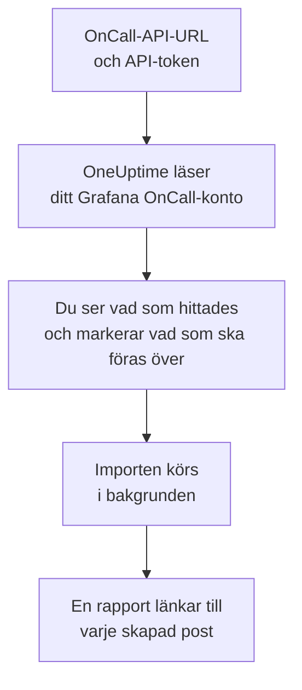

# Byt från Grafana OnCall

Grafana Labs arkiverade öppen källkod-versionen av Grafana OnCall i mars 2026, och i Grafana Cloud lever den vidare som en del av Grafana Cloud IRM. Var din än körs för **Importera från ett annat verktyg** över din jourkonfiguration till OneUptime på några minuter. Med din OnCall-API-URL och en API-token läser OneUptime dina användare, team, scheman och eskaleringskedjor, visar vad det hittade och skapar det du markerar. Ingenting ändras i Grafana OnCall.

:::cards
- [Importera ditt konto](#importera-ditt-grafana-oncall-konto): Skapa en token, läs ditt konto och markera vad som ska föras över.
- [Vad som förs över](#vad-som-förs-över): Vad varje Grafana OnCall-post blir i OneUptime.
- [Slutför bytet](#slutför-bytet): Vad du gör när importen är klar.
:::

## Så fungerar det

- **Token används en gång.** Den sparas krypterad tillsammans med API-URL:en medan OneUptime läser ditt konto och tas bort så fort läsningen är klar, oavsett om den lyckades. Den visas aldrig igen och skrivs aldrig till en logg.
- **OneUptime läser bara, och bara från adressen du anger.** Det anropar bara den OnCall-API-URL du klistrar in, högst en gång per sekund, och håller sig därmed inom Grafana OnCalls gräns på 300 förfrågningar per token på fem minuter. När Grafana OnCall ber det att sakta ner väntar det och försöker igen.
- **Adressen kontrolleras före varje förfrågan.** OneUptime anropar aldrig maskinen det körs på eller en metadatatjänst i molnet, och följer aldrig en omdirigering. I OneUptime Cloud måste adressen dessutom vara offentlig och börja med `https://`. Ett egenvärdat OneUptime kan också läsa ett Grafana OnCall i ditt eget nätverk, om inte dess administratör har stängt av det, som beskrivs i [Private Network Access](/docs/self-hosted/private-network-access).
- **Ingenting skapas förrän du startar importen.** Förhandsgranskningen visar för varje objekt om det är nytt, redan finns i OneUptime (och används som det är), har förts över av en tidigare import, eller varför det inte kan föras över.
- **Att köra den igen skapar aldrig något två gånger.** OneUptime minns vad varje import förde över, efter Grafana OnCall-id:t. Kör den igen när du har lagt till personer eller scheman i Grafana OnCall, så skapas bara de nya.

## Innan du börjar

- **Ett OneUptime-projekt och rätten att skapa det du för över.** Projektägare och projektadministratörer kan föra över allt. Andra roller kan också köra en import och föra över de typer av poster de får skapa. Resten visas som inte överfört, med orsaken.
- **En API-token från Grafana OnCall.** Använd en OnCall-API-token, inte en token från ett Grafana-tjänstkonto. Importen skriver aldrig till Grafana OnCall. Ta bort token när importen är klar.
- **Din OnCall-API-URL.** OnCalls inställningar visar den bredvid API-tokens. I Grafana Cloud ser den ut som `https://oncall-prod-us-central-0.grafana.net/oncall`. På din egen installation är det adressen till din OnCall-motor.

## Importera ditt Grafana OnCall-konto

:::steps
### Skapa en API-token i Grafana OnCall
Öppna **OnCall** > **Settings** i Grafana. I Grafana Cloud öppnar du **IRM** > **Settings** > **Admin & API**. Kopiera OnCall-API-URL:en som visas där. Skapa under **API tokens** en token med namnet `OneUptime import` och kopiera den.

### Öppna importsidan
Gå till **Projektinställningar** > **Importera från ett annat verktyg** i OneUptime och välj **Grafana OnCall**.

### Anslut Grafana OnCall
Klistra in adressen i **API-URL för Grafana OnCall** och token i **API-nyckel för Grafana OnCall**, och välj **Läs mitt Grafana OnCall-konto**. Ett stort konto tar några minuter, och du kan lämna sidan medan det läses.

### Markera vad som ska föras över
Förhandsgranskningen visar vad som hittades, med ett avsnitt per typ. Allt som skulle skapas är markerat från början, utom personer som inte finns i något team, schema eller någon eskaleringskedja. Under varje objekt berättar OneUptime vad som inte förs över precis som det var. När ett markerat objekt använder något du inte har markerat säger det det, och **Markera dem också** markerar det.

### Starta importen
Om personer ska bjudas in väljer du under **Bjud in nya personer till** det team de går med i. Välj sedan **Starta import**. Importen körs i bakgrunden: du kan lämna sidan, och rapporten väntar på dig där.
:::

Rapporten räknar vad som skapades, bjöds in och inte fördes över, och visar varje objekt med en länk till posten det blev, misslyckade först. Tidigare importer finns under **Tidigare importer** på samma sida.

## Vad som förs över

| I Grafana OnCall | I OneUptime | Hur |
| --- | --- | --- |
| Användare | Projektmedlemmar | Matchas på e-postadress. Alla som inte är med i projektet ännu bjuds in till teamet du väljer. |
| Team | Team | Skapas med sina medlemmar. Ett team vars namn projektet redan har används som det är, och dess medlemmar lämnas orörda. |
| Scheman | Jourscheman | Varje rotation blir ett lager med samma personer, samma start, samma överlämning och samma jourtimmar, i schemats tidszon, ägt av schemats team. En rotation på ett högre lager går fortfarande före lagren under det. |
| Eskaleringskedjor | Jourpolicyer | Stegen som aviserar personer, ett team eller den som har jour i ett schema blir eskaleringsregler, och ett vänta-steg blir väntetiden före nästa regel. Ett steg som upprepar kedjan blir policyns upprepningar. |

Rotationer på samma lager som har jour samtidigt, och en rotation som sätter flera personer i jour på en gång, blir var sitt OneUptime-schema, eftersom ett OneUptime-schema har en person i jour åt gången. Varje jourpolicy som larmade schemat larmar alla.

## Vad som inte förs över

- **Larmgrupper och deras historik.** OneUptime börjar med din konfiguration, inte med dina tidigare larm.
- **Integrationer, rutter och utgående webhooks.** Rikta i stället dina monitorer och larmkällor mot OneUptime, som beskrivs i [Slutför bytet](#slutför-bytet).
- **Åsidosättningar, enstaka pass och rotationer som redan har slutat.** Lägg till de åsidosättningar du fortfarande behöver i OneUptime efter importen.
- **Pass från en kalenderlänk.** Ett schema vars pass kommer från en iCal-länk förs över utan lager, så lägg till dem i OneUptime.
- **Varje persons aviseringsregler.** Var och en väljer hur hen larmas i sina egna **Användarinställningar** när hen har accepterat inbjudan.
- **Steg som OneUptime inte har någon exakt motsvarighet till.** Ett steg som aviserar en Slack-användargrupp eller -kanal, anropar en webhook, utlyser en incident eller löser larmet utelämnas. Ett steg som aviserar personer en i taget larmar alla på en gång, ett steg som bara fortsätter vid vissa tider eller vid ett visst antal larm fortsätter alltid, och förhandsgranskningen säger vad som ändras.

## Gränser

En import skapar högst 2 000 poster: högst 500 personer, 200 team, 200 jourscheman och 200 jourpolicyer. Allt över en gräns visas som inte överfört. Kör importen igen för att föra över resten.

I OneUptime Cloud visas poster som ditt abonnemang inte omfattar som inte överförda, med det abonnemang de kräver.

En förhandsgranskning sparas i en dag. Bara den som läste kontot kan markera objekt och starta importen. Projektägare och projektadministratörer ser förloppet och rapporten för varje import.

## Slutför bytet

:::steps
### Kontrollera jourschemana
Öppna varje schema under **Jourtjänst** > **Jourscheman** och kontrollera vem som har jour nu och vem som är näst på tur.

### Se till att alla kan larmas
Inbjudna personer accepterar sin inbjudan och lägger sedan till ett telefonnummer, en e-postadress eller mobilappen att larmas på. **Jourtjänst** > **Beredskap** visar vem som inte kan nås än.

### Skicka dina larm till OneUptime
Rikta dina monitorer och verktygen som skapar larm mot OneUptime, och larma dig själv en gång för att testa.

### Stäng av larm i Grafana OnCall
När OneUptime larmar rätt personer stänger du av aviseringarna i Grafana OnCall, så att ingen larmas två gånger.
:::

## Felsökning

:::details Grafana OnCall godtog inte API-nyckeln
Kontrollera att du kopierade hela token, att det är en OnCall-API-token och inte en token från ett Grafana-tjänstkonto, och att API-URL:en är den som visas bredvid den. Välj sedan **Försök igen**.
:::

:::details OneUptime anropade inte API-URL:en
Klistra in OnCall-API-URL:en exakt som OnCalls inställningar visar den. I OneUptime Cloud måste den börja med `https://` och gå att nå från internet. Ett egenvärdat OneUptime kan också nå en adress i ditt eget nätverk, om inte dess administratör har stängt av det, men aldrig en adress på maskinen som OneUptime körs på.
:::

:::details En typ av post saknas i förhandsgranskningen
Token kunde inte läsa den, och förhandsgranskningen säger det högst upp. En token läser det som personen som skapade den får se, så skapa den som administratör i Grafana OnCall och läs kontot igen.
:::

:::details Vissa objekt kan inte markeras
Vid varje objekt står varför: ett namn som projektet redan har, något som en tidigare import har fört över, eller en post som du inte får skapa eller som ditt abonnemang inte omfattar.
:::

## Nästa steg

:::cards
- [Jourscheman](/docs/on-call/schedules): Lager, begränsningar och överlämningar.
- [Eskaleringsregler](/docs/on-call/escalation-rules): Hur jourpolicyer larmar personer.
- [Byt från PagerDuty](/docs/moving-to-oneuptime/pagerduty): För över ett team från PagerDuty.
:::
