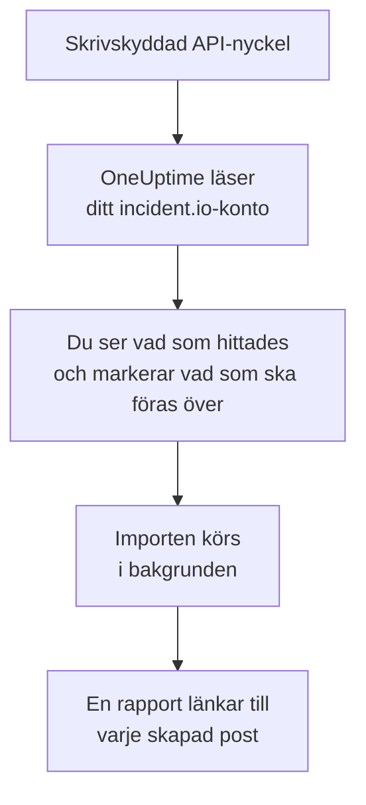

# Byt från incident.io

**Importera från ett annat verktyg** för in din incident.io-konfiguration i OneUptime på några minuter. Med en skrivskyddad incident.io-API-nyckel läser OneUptime dina användare, team, scheman, eskaleringsvägar, tjänster och incidentinställningar, visar vad det hittade och skapar det du markerar. Ingenting ändras i incident.io.

:::cards
- [Importera ditt konto](#importera-ditt-incidentio-konto): Skapa en nyckel, läs ditt konto och markera vad som ska föras över.
- [Vad som förs över](#vad-som-förs-över): Vad varje incident.io-post blir i OneUptime.
- [Slutför bytet](#slutför-bytet): Vad du gör när importen är klar.
:::

## Så fungerar det

- **Nyckeln används en gång.** Den sparas krypterad medan OneUptime läser ditt konto och tas bort så fort läsningen är klar, oavsett om den lyckades. Den visas aldrig igen och skrivs aldrig till en logg.
- **OneUptime läser bara.** Det anropar bara incident.ios eget API, `api.incident.io`. När incident.io ber det att sakta ner väntar det och försöker igen.
- **Ingenting skapas förrän du startar importen.** Förhandsgranskningen visar för varje objekt om det är nytt, redan finns i OneUptime (och används som det är), har förts över av en tidigare import, eller varför det inte kan föras över.
- **Att köra den igen skapar aldrig något två gånger.** OneUptime minns vad varje import förde över, efter incident.io-id:t. Kör den igen när du har lagt till personer eller scheman i incident.io, så skapas bara de nya.

## Innan du börjar

- **Ett OneUptime-projekt och rätten att skapa det du för över.** Projektägare och projektadministratörer kan föra över allt. Andra roller kan också köra en import och föra över de typer av poster de får skapa. Resten visas som inte överfört, med orsaken.
- **En incident.io-API-nyckel som bara kan visa data.** Importen skriver aldrig till incident.io, så nyckeln behöver ingen behörighet att skapa, redigera eller hantera något.

## Importera ditt incident.io-konto

:::steps
### Skapa en API-nyckel i incident.io
Gå till **Settings** > **API keys** i incident.io och välj **Add new**. Kalla den `OneUptime import`, ge den bara behörigheter att visa data, inga att skapa, redigera eller hantera, och kopiera nyckeln.

### Öppna importsidan
Gå till **Projektinställningar** > **Importera från ett annat verktyg** i OneUptime och välj **incident.io**.

### Anslut incident.io
Klistra in nyckeln i **incident.io-API-nyckel** och välj **Läs mitt incident.io-konto**. Ett stort konto tar några minuter, och du kan lämna sidan medan det läses.

### Markera vad som ska föras över
Förhandsgranskningen visar vad som hittades, med ett avsnitt per typ. Allt som skulle skapas är markerat från början, utom personer som inte finns i något team, schema eller någon eskaleringsväg. Under varje objekt berättar OneUptime vad som inte förs över precis som det var. När ett markerat objekt använder något du inte har markerat säger det det, och **Markera dem också** markerar det.

### Starta importen
Om personer ska bjudas in väljer du under **Bjud in nya personer till** det team de går med i. Välj sedan **Starta import**. Importen körs i bakgrunden: du kan lämna sidan, och rapporten väntar på dig där.
:::

Rapporten räknar vad som skapades, bjöds in och inte fördes över, och visar varje objekt med en länk till posten det blev, misslyckade först. Tidigare importer finns under **Tidigare importer** på samma sida.

## Vad som förs över

| I incident.io | I OneUptime | Hur |
| --- | --- | --- |
| Användare | Projektmedlemmar | Matchas på e-postadress. Alla som inte är med i projektet ännu bjuds in till teamet du väljer. Inaktiverade användare förs inte över. |
| Team | Team | Skapas med sina medlemmar. Ett team vars namn projektet redan har används som det är, och dess medlemmar lämnas orörda. |
| Scheman | Jourscheman | Varje rotation blir ett lager med samma personer, samma start, samma passlängd och samma arbetstider, i schemats tidszon. Den version av rotationen som gäller nu är den som förs över. |
| Eskaleringsvägar | Jourpolicyer | Varje nivå blir en eskaleringsregel som larmar samma scheman, användare och team efter samma väntetid. En upprepning blir policyns upprepningar, och från en förgrening förs den första vägen över. |
| Katalogtjänster | Tjänster | Posterna i dina katalogtyper i tjänstekategorin, skapade i tjänstekatalogen. Arkiverade poster utelämnas. |
| Allvarlighetsgrader | Incidentallvarlighetsgrader | Skapas i incident.ios ordning, den allvarligaste först. En allvarlighetsgrad vars namn projektet redan har används som den är. |
| Statusar | Incidenttillstånd | En triagestatus motsvarar tillståndet som OneUptime startar incidenter i, och en stängd status tillståndet där incidenter är lösta. Aktiva och pausade statusar skapas mellan Bekräftad och Löst. |
| Incidentroller | Incidentroller | Den ledande rollen motsvarar OneUptimes incidentansvarig, och de andra rollerna skapas. OneUptime registrerar vem som deklarerade varje incident, så rapportörsrollen behövs inte. |
| Anpassade fält | Anpassade incidentfält | Fält med ett val blir rullgardinslistor, fält med flera val rullgardinslistor med flerval, text- och länkfält text och numeriska fält tal, med sina alternativ. |

En rotation med flera personer i jour samtidigt blir ett OneUptime-schema per person i jour, eftersom ett OneUptime-schema har en person i jour åt gången. Varje jourpolicy som larmade schemat larmar alla.

## Vad som inte förs över

- **Incidenter, larm och deras historik.** OneUptime börjar med din konfiguration, inte med dina tidigare incidenter.
- **Workflows, statussidor, alert routes och integrationer.** Rikta i stället dina monitorer och larmkällor mot OneUptime, som beskrivs i [Slutför bytet](#slutför-bytet).
- **Anpassade fält vars alternativ kommer från katalogen,** och statusar som OneUptime inte har något tillstånd för: declined, merged, canceled och learning.
- **Åsidosättningar i scheman och ändringar av en rotation som är planerade till senare.** Förhandsgranskningen nämner varje planerad ändring, så att du kan göra den i OneUptime när det är dags.
- **Eskaleringssteg som OneUptime inte har någon exakt motsvarighet till.** Ett steg som skriver i en Slack- eller Microsoft Teams-kanal utelämnas, eftersom arbetsytans aviseringsregler gör det i OneUptime, och detsamma gäller ett steg som lämnar över till en annan eskaleringsväg. Ett steg som larmar den som har jour härnäst förs över som det närmaste OneUptime har, och förhandsgranskningen säger vad som ändras.

## Gränser

En import skapar högst 2 000 poster: högst 500 personer, 200 team, 200 jourscheman, 200 jourpolicyer, 500 tjänster, 100 anpassade incidentfält och 25 var av incidentallvarlighetsgrader, incidenttillstånd och incidentroller. Allt över en gräns visas som inte överfört. Kör importen igen för att föra över resten.

I OneUptime Cloud visas poster som ditt abonnemang inte omfattar som inte överförda, med det abonnemang de kräver.

En förhandsgranskning sparas i en dag. Bara den som läste kontot kan markera objekt och starta importen. Projektägare och projektadministratörer ser förloppet och rapporten för varje import.

## Slutför bytet

:::steps
### Kontrollera jourschemana
Öppna varje schema under **Jourtjänst** > **Jourscheman** och kontrollera vem som har jour nu och vem som är näst på tur.

### Se till att alla kan larmas
Inbjudna personer accepterar sin inbjudan och lägger sedan till ett telefonnummer, en e-postadress eller mobilappen att larmas på. **Jourtjänst** > **Beredskap** visar vem som inte kan nås än.

### Skicka dina larm till OneUptime
Rikta dina monitorer och verktygen som skapar larm mot OneUptime, och larma dig själv en gång för att testa.

### Stäng av larm i incident.io
När OneUptime larmar rätt personer stänger du av aviseringarna i incident.io, så att ingen larmas två gånger.
:::

## Felsökning

:::details incident.io godtog inte API-nyckeln
Kontrollera att du kopierade hela nyckeln och att den inte har tagits bort under **Settings** > **API keys**. Välj sedan **Försök igen**.
:::

:::details En typ av post saknas i förhandsgranskningen
Nyckeln kunde inte läsa den, och förhandsgranskningen säger det högst upp. Ge nyckeln behörighet att visa den typen av data och läs kontot igen.
:::

:::details Vissa objekt kan inte markeras
Vid varje objekt står varför: en inaktiverad användare, ett namn som projektet redan har, något som en tidigare import har fört över, eller en post som du inte får skapa eller som ditt abonnemang inte omfattar.
:::

## Nästa steg

:::cards
- [Jourscheman](/docs/on-call/schedules): Lager, begränsningar och överlämningar.
- [Incidenttillstånd och allvarlighetsgrader](/docs/incidents/states-and-severities): De tillstånd och allvarlighetsgrader som incidenter går igenom.
- [Byt från Opsgenie](/docs/moving-to-oneuptime/opsgenie): För över ett team från Opsgenie.
:::
