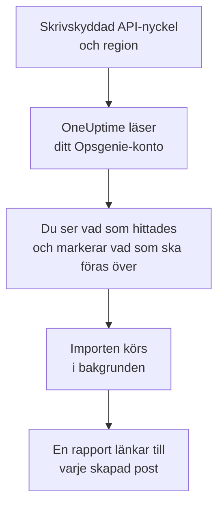

# Byt från Opsgenie

Atlassian lägger ned Opsgenie: Opsgenie har inte sålts sedan juni 2025, och supporten upphör i april 2027. OneUptime är ett nytt hem för ditt jourteam, och **Importera från ett annat verktyg** för över det på några minuter. Med en skrivskyddad Opsgenie-API-nyckel läser OneUptime dina användare, team, scheman, eskaleringar och tjänster, visar vad det hittade och skapar det du markerar. Ingenting ändras i Opsgenie.

:::cards
- [Importera ditt konto](#importera-ditt-opsgenie-konto): Skapa en nyckel, läs ditt konto och markera vad som ska föras över.
- [Vad som förs över](#vad-som-förs-över): Vad varje Opsgenie-post blir i OneUptime.
- [Slutför bytet](#slutför-bytet): Vad du gör när importen är klar.
:::

## Så fungerar det

- **Nyckeln används en gång.** Den sparas krypterad medan OneUptime läser ditt konto och tas bort så fort läsningen är klar, oavsett om den lyckades. Den visas aldrig igen och skrivs aldrig till en logg.
- **OneUptime läser bara.** Det anropar bara Opsgenies eget API: `api.opsgenie.com`, eller `api.eu.opsgenie.com` för ett konto i Europa. När Opsgenie ber det att sakta ner väntar det och försöker igen.
- **Ingenting skapas förrän du startar importen.** Förhandsgranskningen visar för varje objekt om det är nytt, redan finns i OneUptime (och används som det är), har förts över av en tidigare import, eller varför det inte kan föras över.
- **Att köra den igen skapar aldrig något två gånger.** OneUptime minns vad varje import förde över, efter Opsgenie-id:t. Kör den igen när du har lagt till personer eller scheman i Opsgenie, så skapas bara de nya.

## Innan du börjar

- **Ett OneUptime-projekt och rätten att skapa det du för över.** Projektägare och projektadministratörer kan föra över allt. Andra roller kan också köra en import och föra över de typer av poster de får skapa. Resten visas som inte överfört, med orsaken.
- **En Opsgenie-API-nyckel med behörigheterna Read och Configuration access.** Configuration access är det som låter en nyckel läsa användare, team, scheman och eskaleringar. Importen skriver aldrig till Opsgenie.
- **Din Opsgenie-region.** Om du loggar in på `app.eu.opsgenie.com` finns ditt konto i Europa. Annars finns det i USA.

## Importera ditt Opsgenie-konto

:::steps
### Skapa en API-nyckel i Opsgenie
Gå till **Settings** > **API key management** i Opsgenie och välj **Add new API key**. Kalla den `OneUptime import`, ge den bara **Read** och **Configuration access**, och kopiera nyckeln.

### Öppna importsidan
Gå till **Projektinställningar** > **Importera från ett annat verktyg** i OneUptime och välj **Opsgenie**.

### Anslut Opsgenie
Under **Var finns ditt Opsgenie-konto?** väljer du **USA** eller **Europa**. Klistra in nyckeln i **Opsgenie-API-nyckel** och välj **Läs mitt Opsgenie-konto**. Ett stort konto tar några minuter, och du kan lämna sidan medan det läses.

### Markera vad som ska föras över
Förhandsgranskningen visar vad som hittades, med ett avsnitt per typ. Allt som skulle skapas är markerat från början, utom scheman som är avstängda i Opsgenie och personer som inte finns i något team, schema eller någon eskalering. Under varje objekt berättar OneUptime vad som inte förs över precis som det var. När ett markerat objekt använder något du inte har markerat säger det det, och **Markera dem också** markerar det.

### Starta importen
Om personer ska bjudas in väljer du under **Bjud in nya personer till** det team de går med i. Välj sedan **Starta import**. Importen körs i bakgrunden: du kan lämna sidan, och rapporten väntar på dig där.
:::

Rapporten räknar vad som skapades, bjöds in och inte fördes över, och visar varje objekt med en länk till posten det blev, misslyckade först. Tidigare importer finns under **Tidigare importer** på samma sida.

## Vad som förs över

| I Opsgenie | I OneUptime | Hur |
| --- | --- | --- |
| Användare | Projektmedlemmar | Matchas på e-postadress. Alla som inte är med i projektet ännu bjuds in till teamet du väljer. Blockerade användare förs inte över. |
| Team | Team | Skapas med sina medlemmar. Ett team vars namn projektet redan har används som det är, och dess medlemmar lämnas orörda. |
| Scheman | Jourscheman | Varje rotation blir ett lager med samma personer, samma start, samma passlängd och samma tidsbegränsning, i schemats tidszon, ägt av schemats team. |
| Eskaleringar | Jourpolicyer | Varje regel blir en eskaleringsregel som larmar samma schema, användare eller team. Regler med samma fördröjning larmar tillsammans, och väntetiden före nästa eskaleringsregel är skillnaden mellan fördröjningarna. Eskaleringens upprepningar blir policyns upprepningar. |
| Tjänster | Tjänster | Skapas i tjänstekatalogen, ägda av sitt team. |

Ett schema vars rotationer sätter två personer i jour samtidigt blir ett OneUptime-schema per rotation, eftersom ett OneUptime-schema har en person i jour åt gången. Varje jourpolicy som larmade schemat larmar alla.

## Vad som inte förs över

- **Larm, incidenter och deras historik.** OneUptime börjar med din konfiguration, inte med dina tidigare larm.
- **Integrationer, heartbeats, larmpolicyer och routningsregler.** Rikta i stället dina monitorer och larmkällor mot OneUptime, som beskrivs i [Slutför bytet](#slutför-bytet).
- **Åsidosättningar i scheman och rotationer som redan har slutat.** Lägg till de åsidosättningar du fortfarande behöver i OneUptime efter importen.
- **Varje persons aviseringsregler.** Var och en väljer hur hen larmas i sina egna **Användarinställningar** när hen har accepterat inbjudan.
- **Steg som OneUptime inte har någon exakt motsvarighet till.** En regel som larmar den som har jour härnäst, eller ett teams administratörer, förs över som det närmaste OneUptime har, och förhandsgranskningen säger vad som ändras.

## Gränser

En import skapar högst 2 000 poster: högst 500 personer, 200 team, 200 jourscheman, 200 jourpolicyer och 500 tjänster. Allt över en gräns visas som inte överfört. Kör importen igen för att föra över resten.

I OneUptime Cloud visas poster som ditt abonnemang inte omfattar som inte överförda, med det abonnemang de kräver.

En förhandsgranskning sparas i en dag. Bara den som läste kontot kan markera objekt och starta importen. Projektägare och projektadministratörer ser förloppet och rapporten för varje import.

## Slutför bytet

:::steps
### Kontrollera jourschemana
Öppna varje schema under **Jourtjänst** > **Jourscheman** och kontrollera vem som har jour nu och vem som är näst på tur.

### Se till att alla kan larmas
Inbjudna personer accepterar sin inbjudan och lägger sedan till ett telefonnummer, en e-postadress eller mobilappen att larmas på. **Jourtjänst** > **Beredskap** visar vem som inte kan nås än.

### Skicka dina larm till OneUptime
Rikta dina monitorer och verktygen som skapar larm mot OneUptime, och larma dig själv en gång för att testa.

### Stäng av larm i Opsgenie
När OneUptime larmar rätt personer stänger du av aviseringarna i Opsgenie, så att ingen larmas två gånger.
:::

## Felsökning

:::details Opsgenie godtog inte API-nyckeln
Kontrollera att du kopierade hela nyckeln, att det är en nyckel från **API key management** och inte en integrations nyckel, att den har **Read** och **Configuration access**, och att du valde den region ditt konto finns i. Välj sedan **Försök igen**.
:::

:::details En typ av post saknas i förhandsgranskningen
Nyckeln kunde inte läsa den, och förhandsgranskningen säger det högst upp. Ge nyckeln **Configuration access** och läs kontot igen.
:::

:::details Vissa objekt kan inte markeras
Vid varje objekt står varför: en blockerad användare, ett namn som projektet redan har, något som en tidigare import har fört över, eller en post som du inte får skapa eller som ditt abonnemang inte omfattar.
:::

## Nästa steg

:::cards
- [Jourscheman](/docs/on-call/schedules): Lager, begränsningar och överlämningar.
- [Eskaleringsregler](/docs/on-call/escalation-rules): Hur jourpolicyer larmar personer.
- [Byt från incident.io](/docs/moving-to-oneuptime/incident-io): För över ett team från incident.io.
:::
