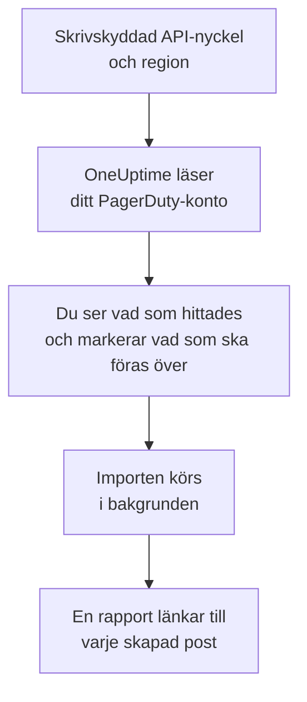

# Byt från PagerDuty

**Importera från ett annat verktyg** för över din PagerDuty-konfiguration till OneUptime på några minuter. Med en skrivskyddad PagerDuty-API-nyckel läser OneUptime dina användare, team, scheman, eskaleringspolicyer och tjänster, visar vad det hittade och skapar det du markerar. Ingenting ändras i PagerDuty.

:::cards
- [Importera ditt konto](#importera-ditt-pagerduty-konto): Skapa en nyckel, läs ditt konto och markera vad som ska föras över.
- [Vad som förs över](#vad-som-förs-över): Vad varje PagerDuty-post blir i OneUptime.
- [Slutför bytet](#slutför-bytet): Vad du gör när importen är klar.
:::

## Så fungerar det

- **Nyckeln används en gång.** Den sparas krypterad medan OneUptime läser ditt konto och tas bort så fort läsningen är klar, oavsett om den lyckades. Den visas aldrig igen och skrivs aldrig till en logg.
- **OneUptime läser bara.** Det anropar bara PagerDutys eget REST-API: `api.pagerduty.com`, eller `api.eu.pagerduty.com` för ett konto i Europa. När PagerDuty ber det att sakta ner väntar det och försöker igen.
- **Ingenting skapas förrän du startar importen.** Förhandsgranskningen visar för varje objekt om det är nytt, redan finns i OneUptime (och används som det är), har förts över av en tidigare import, eller varför det inte kan föras över.
- **Att köra den igen skapar aldrig något två gånger.** OneUptime minns vad varje import förde över, efter PagerDuty-id:t. Kör den igen när du har lagt till personer eller scheman i PagerDuty, så skapas bara de nya.

## Innan du börjar

- **Ett OneUptime-projekt och rätten att skapa det du för över.** Projektägare och projektadministratörer kan föra över allt. Andra roller kan också köra en import och föra över de typer av poster de får skapa. Resten visas som inte överfört, med orsaken.
- **En skrivskyddad REST-API-nyckel från PagerDuty.** Administratörer och kontoägare i PagerDuty kan skapa en. Importen skriver aldrig till PagerDuty, så nyckeln behöver bara läsåtkomst.
- **Din PagerDuty-region.** Om du loggar in på en adress som slutar på `eu.pagerduty.com` finns ditt konto i Europa. Annars finns det i USA.

## Importera ditt PagerDuty-konto

:::steps
### Skapa en API-nyckel i PagerDuty
Gå till **Integrations** > **Developer Tools** > **API Access Keys** i PagerDuty och välj **Create New API Key**. Beskriv den som `OneUptime import`, markera **Read-only API Key**, välj **Create Key** och kopiera nyckeln.

### Öppna importsidan
Gå till **Projektinställningar** > **Importera från ett annat verktyg** i OneUptime och välj **PagerDuty**.

### Anslut PagerDuty
Under **Var finns ditt PagerDuty-konto?** väljer du **USA** eller **Europa**. Klistra in nyckeln i **API-nyckel för PagerDuty** och välj **Läs mitt PagerDuty-konto**. Ett stort konto tar några minuter, och du kan lämna sidan medan det läses.

### Markera vad som ska föras över
Förhandsgranskningen visar vad som hittades, med ett avsnitt per typ. Allt som skulle skapas är markerat från början, utom tjänster som är avstängda i PagerDuty och personer som inte finns i något team, schema eller någon eskaleringspolicy. Under varje objekt berättar OneUptime vad som inte förs över precis som det var. När ett markerat objekt använder något du inte har markerat säger det det, och **Markera dem också** markerar det.

### Starta importen
Om personer ska bjudas in väljer du under **Bjud in nya personer till** det team de går med i. Välj sedan **Starta import**. Importen körs i bakgrunden: du kan lämna sidan, och rapporten väntar på dig där.
:::

Rapporten räknar vad som skapades, bjöds in och inte fördes över, och visar varje objekt med en länk till posten det blev, misslyckade först. Tidigare importer finns under **Tidigare importer** på samma sida.

## Vad som förs över

| I PagerDuty | I OneUptime | Hur |
| --- | --- | --- |
| Användare | Projektmedlemmar | Matchas på e-postadress. Alla som inte är med i projektet ännu bjuds in till teamet du väljer. |
| Team | Team | Skapas med sina medlemmar. Ett team vars namn projektet redan har används som det är, och dess medlemmar lämnas orörda. |
| Scheman | Jourscheman | Varje lager blir ett lager med samma personer, samma start, samma passlängd och samma begränsningar, i schemats tidszon, ägt av schemats team. Lagren behåller sin ordning, så ett högre lager går fortfarande före lagren under det. |
| Eskaleringspolicyer | Jourpolicyer | Varje eskaleringsregel blir en eskaleringsregel som larmar samma scheman och användare och eskalerar efter samma fördröjning. Policyns upprepningar blir jourpolicyns upprepningar. |
| Tjänster | Tjänster | Skapas i tjänstekatalogen, ägda av sitt team. En tjänst som är avstängd i PagerDuty är inte markerad från början. |

Ett PagerDuty-schema förblir ett OneUptime-schema: dess lager går före varandra på samma sätt som i PagerDuty. Ett lager vars pass inte är ett helt antal timmar förs över med passen avrundade till timmen, och förhandsgranskningen säger det.

## Vad som inte förs över

- **Incidenter, larm och deras historik.** OneUptime börjar med din konfiguration, inte med dina tidigare incidenter.
- **Integrationer, Event Orchestrations, Incident Workflows och statussidor.** Rikta i stället dina monitorer och larmkällor mot OneUptime, som beskrivs i [Slutför bytet](#slutför-bytet).
- **Åsidosättningar i scheman och lager som redan har slutat.** Lägg till de åsidosättningar du fortfarande behöver i OneUptime efter importen.
- **Passbaserade scheman.** Importen läser PagerDutys scheman med lager, inte de nyare passbaserade schemana (shift-based schedules). Om ditt konto har sådana säger förhandsgranskningen det högst upp, och en eskaleringsregel som larmar ett av dem förs över utan det. Skapa dem i OneUptime.
- **Varje persons aviseringsregler.** Var och en väljer hur hen larmas i sina egna **Användarinställningar** när hen har accepterat inbjudan.
- **Regler som OneUptime inte har någon exakt motsvarighet till.** En eskaleringsregel som fördelar sina personer i tur och ordning (round robin) larmar alla på en gång i OneUptime, och förhandsgranskningen säger vad som ändras.

## Gränser

En import skapar högst 2 000 poster: högst 500 personer, 200 team, 200 jourscheman, 200 jourpolicyer och 500 tjänster. Allt över en gräns visas som inte överfört. Kör importen igen för att föra över resten.

I OneUptime Cloud visas poster som ditt abonnemang inte omfattar som inte överförda, med det abonnemang de kräver.

En förhandsgranskning sparas i en dag. Bara den som läste kontot kan markera objekt och starta importen. Projektägare och projektadministratörer ser förloppet och rapporten för varje import.

## Slutför bytet

:::steps
### Kontrollera jourschemana
Öppna varje schema under **Jourtjänst** > **Jourscheman** och kontrollera vem som har jour nu och vem som är näst på tur.

### Se till att alla kan larmas
Inbjudna personer accepterar sin inbjudan och lägger sedan till ett telefonnummer, en e-postadress eller mobilappen att larmas på. **Jourtjänst** > **Beredskap** visar vem som inte kan nås än.

### Skicka dina larm till OneUptime
Rikta dina monitorer och verktygen som skapar larm mot OneUptime, och larma dig själv en gång för att testa.

### Stäng av larm i PagerDuty
När OneUptime larmar rätt personer stänger du av aviseringarna i PagerDuty, så att ingen larmas två gånger.
:::

## Felsökning

:::details PagerDuty godtog inte API-nyckeln
Kontrollera att du kopierade hela nyckeln, att det är en REST-API-nyckel från **API Access Keys** och inte en integrationsnyckel, och att du valde den region ditt konto finns i. Välj sedan **Försök igen**.
:::

:::details En typ av post saknas i förhandsgranskningen
Nyckeln kunde inte läsa den, och förhandsgranskningen säger det högst upp. Vissa typer finns bara i PagerDuty-abonnemang som omfattar dem, till exempel team. Läs kontot igen med en nyckel som kan läsa dem.
:::

:::details Vissa objekt kan inte markeras
Vid varje objekt står varför: ett namn som projektet redan har, något som en tidigare import har fört över, eller en post som du inte får skapa eller som ditt abonnemang inte omfattar.
:::

## Nästa steg

:::cards
- [Jourscheman](/docs/on-call/schedules): Lager, begränsningar och överlämningar.
- [Eskaleringsregler](/docs/on-call/escalation-rules): Hur jourpolicyer larmar personer.
- [Byt från Opsgenie](/docs/moving-to-oneuptime/opsgenie): För över ett team från Opsgenie.
:::
