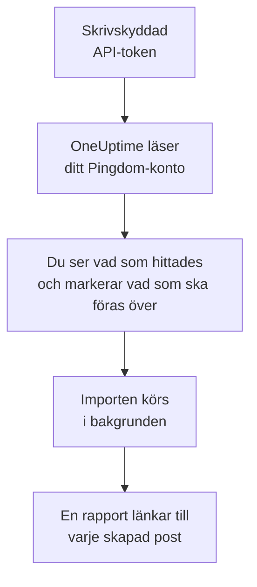

# Byt från Pingdom

**Importera från ett annat verktyg** för över dina drifttidskontroller i Pingdom till OneUptime på några minuter. Med en skrivskyddad Pingdom-API-token läser OneUptime dina kontroller, visar vad det hittade och skapar det du markerar. Ingenting ändras i Pingdom.

:::cards
- [Importera ditt konto](#importera-ditt-pingdom-konto): Skapa en token, läs ditt konto och markera vad som ska föras över.
- [Vad som förs över](#vad-som-förs-över): Vilken OneUptime-monitor varje Pingdom-kontroll blir.
- [Slutför bytet](#slutför-bytet): Vad du gör när importen är klar.
:::

## Så fungerar det

- **Nyckeln används en gång.** Den sparas krypterad medan OneUptime läser ditt konto och tas bort så fort läsningen är klar, oavsett om den lyckades. Den visas aldrig igen och skrivs aldrig till en logg.
- **OneUptime läser bara.** Det anropar bara Pingdoms eget API: `api.pingdom.com`. Pingdom drar varje förfrågan från tokens kvot, så OneUptime läser bara en kontrolls inställningar när den har några, en förfrågan i taget. När Pingdom ber det att sakta ner väntar det och försöker igen.
- **Ingenting skapas förrän du startar importen.** Förhandsgranskningen visar för varje objekt om det är nytt, redan finns i OneUptime (och används som det är), har förts över av en tidigare import, eller varför det inte kan föras över.
- **Att köra den igen skapar aldrig något två gånger.** OneUptime minns vad varje import förde över, efter Pingdom-id:t. Kör den igen när du har lagt till kontroller i Pingdom, så skapas bara de nya.

## Innan du börjar

- **Ett OneUptime-projekt och rätten att skapa det du för över.** Projektägare och projektadministratörer kan föra över allt. Andra roller kan också köra en import och föra över de typer av poster de får skapa. Resten visas som inte överfört, med orsaken.
- **En Pingdom-API-token med Read access.** Importen skriver aldrig till Pingdom.
- **En betalningsmetod, i OneUptime Cloud.** Monitorer som kör kontroller faktureras efter användning, även med abonnemanget Free, så lägg till en under **Projektinställningar** > **Fakturering** innan du importerar. Utan en visas de monitorerna som inte överförda.

## Importera ditt Pingdom-konto

:::steps
### Skapa en API-token i Pingdom
Öppna **Settings** > **Pingdom API** i My Pingdom och välj **Add API token**. Kalla den `OneUptime import`, välj **Read access** och kopiera token.

### Öppna importsidan
Gå till **Projektinställningar** > **Importera från ett annat verktyg** i OneUptime och välj **Pingdom**.

### Anslut Pingdom
Klistra in token i **Pingdom-API-nyckel** och välj **Läs mitt Pingdom-konto**. Ett stort konto tar några minuter, och du kan lämna sidan medan det läses.

### Markera vad som ska föras över
Förhandsgranskningen visar vad som hittades, med ett avsnitt per typ. Allt som skulle skapas är markerat från början, utom kontroller som är pausade i Pingdom. De förs över pausade om du markerar dem. Under varje objekt berättar OneUptime vad som inte förs över precis som det var.

### Starta importen
Välj **Starta import**. Importen körs i bakgrunden: du kan lämna sidan, och rapporten väntar på dig där.
:::

Rapporten räknar vad som skapades och inte fördes över, och visar varje objekt med en länk till posten det blev, misslyckade först. Tidigare importer finns under **Tidigare importer** på samma sida.

## Vad som förs över

| I Pingdom | I OneUptime | Hur |
| --- | --- | --- |
| Uptime checks | Monitorer | Varje kontroll blir en monitor av samma typ, med samma adress, intervall och den text en sida ska, eller inte får, innehålla. |

- **HTTP-kontroller** blir webbplatsmonitorer, eller API-monitorer när de skickar data eller headers.
- **Ping- och TCP-kontroller** blir ping- och portmonitorer. **SMTP-, POP3- och IMAP-kontroller** blir portmonitorer på sin port: OneUptime kontrollerar att porten svarar, inte e-postsamtalet.
- **DNS-kontroller** blir DNS-monitorer som frågar samma namnserver.
- **Certifikatkontroller.** En HTTP-kontroll som räknar ett certifikat som snart går ut som nere får också en SSL-certifikatmonitor, uppkallad efter den, som varnar lika många dagar i förväg.

Varje monitor kontrolleras från projektets sonder, precis som en du skapar själv. Ett intervall som OneUptime inte erbjuder blir det närmaste det erbjuder, och en tidsgräns på över en minut blir en minut. Förhandsgranskningen säger till när någon av dem ändras.

## Vad som inte förs över

- **Drifttidshistorik, svarstider och incidenter.** OneUptime börjar kontrollera när importen är klar.
- **Larmkontakter och integrationer.** Välj vem som får besked i OneUptime, så som beskrivs i [Slutför bytet](#slutför-bytet).
- **Lösenord och headers som kan innehålla en hemlighet.** En monitor som loggar in, eller som skickar en `Authorization`-, cookie- eller token-header, förs över utan den: lägg till den med en [monitorhemlighet](/docs/monitor/monitor-secrets).
- **UDP-, custom HTTP- och transaktionskontroller.** OneUptime har ingen monitor som gör samma sak, och förhandsgranskningen nämner var och en. En [syntetisk monitor](/docs/monitor/synthetic-monitor) kan gå igenom en sida så som en transaktionskontroll gör.
- **Adressen en DNS-kontroll förväntar sig.** Lägg till den som kriterium i OneUptime.
- **Underhållsfönster.** Förhandsgranskningen räknar dem: planera dem som schemalagt underhåll i OneUptime.

## Gränser

En import skapar högst 2 000 poster och högst 1 000 monitorer. Allt över en gräns visas som inte överfört. Kör importen igen för att föra över resten.

I OneUptime Cloud behöver monitorer som kör kontroller en betalningsmetod, och det ditt abonnemang inte har plats för visas som inte överfört, med det som krävs.

En förhandsgranskning sparas i en dag. Bara den som läste kontot kan markera objekt och starta importen. Projektägare och projektadministratörer ser förloppet och rapporten för varje import.

## Slutför bytet

:::steps
### Kontrollera dina monitorer
Öppna var och en under **Monitorer** och kontrollera de första resultaten. En heartbeat-monitor har en ny adress: peka jobbet som anropar den dit.

### Välj vem som får besked
Lägg till ägare på dina monitorer, eller en jourpolicy under **Jourtjänst** > **Jourpolicyer** på incidenterna de öppnar, så att rätt personer får veta när något går ner.

### Stäng av kontrollerna i Pingdom
När OneUptime kontrollerar samma saker pausar du dem i Pingdom, så att ingen får besked två gånger.
:::

## Felsökning

:::details Pingdom godtog inte API-nyckeln
Kontrollera att du kopierade hela token, och att det är en API 3.1-token från **Pingdom API** med **Read access**. Välj sedan **Försök igen**.
:::

:::details En monitor visas som inte överförd
Där står varför: en typ av monitor som OneUptime inte har, en adress som OneUptime inte kan läsa, eller ett projekt utan plats eller betalningsmetod för den. En monitor som OneUptime redan kör, med samma namn, typ och adress, används som den är.
:::

:::details Vissa objekt kan inte markeras
Vid varje objekt står varför: ett namn som projektet redan har, något som en tidigare import har fört över, eller en post som du inte får skapa eller som ditt abonnemang inte omfattar.
:::

## Nästa steg

:::cards
- [Webbplatsövervakning](/docs/monitor/website-monitor): Vad en webbplatsmonitor kontrollerar, och hur.
- [Portövervakning](/docs/monitor/port-monitor): Vad en portmonitor kontrollerar, och hur.
- [Byt från StatusCake](/docs/moving-to-oneuptime/statuscake): För över dina kontroller från StatusCake.
:::
