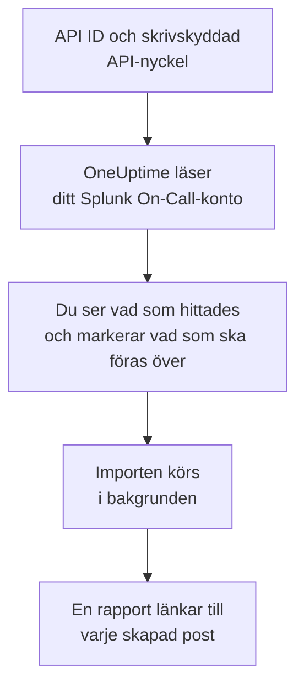

# Byt från Splunk On-Call

**Importera från ett annat verktyg** för över din Splunk On-Call-konfiguration (tidigare VictorOps) till OneUptime på några minuter. Med ditt API ID och en skrivskyddad API-nyckel läser OneUptime dina användare, team, rotationer och eskaleringspolicyer, visar vad det hittade och skapar det du markerar. Ingenting ändras i Splunk On-Call.

:::cards
- [Importera ditt konto](#importera-ditt-splunk-on-call-konto): Skapa en nyckel, läs ditt konto och markera vad som ska föras över.
- [Vad som förs över](#vad-som-förs-över): Vad varje Splunk On-Call-post blir i OneUptime.
- [Slutför bytet](#slutför-bytet): Vad du gör när importen är klar.
:::

## Så fungerar det

- **Nyckeln används en gång.** Den sparas krypterad tillsammans med API ID:t medan OneUptime läser ditt konto och tas bort så fort läsningen är klar, oavsett om den lyckades. Den visas aldrig igen och skrivs aldrig till en logg.
- **OneUptime läser bara.** Det anropar bara Splunk On-Calls eget API, `api.victorops.com`. Splunk On-Call svarar på varje typ av förfrågan högst två gånger per sekund, så OneUptime håller den takten, och när Splunk On-Call ber det att sakta ner väntar det och försöker igen.
- **Ingenting skapas förrän du startar importen.** Förhandsgranskningen visar för varje objekt om det är nytt, redan finns i OneUptime (och används som det är), har förts över av en tidigare import, eller varför det inte kan föras över.
- **Att köra den igen skapar aldrig något två gånger.** OneUptime minns vad varje import förde över, efter Splunk On-Call-id:t. Kör den igen när du har lagt till personer eller rotationer i Splunk On-Call, så skapas bara de nya.

## Innan du börjar

- **Ett OneUptime-projekt och rätten att skapa det du för över.** Projektägare och projektadministratörer kan föra över allt. Andra roller kan också köra en import och föra över de typer av poster de får skapa. Resten visas som inte överfört, med orsaken.
- **Ditt API ID för Splunk On-Call och en skrivskyddad API-nyckel.** Båda finns under **Integrations** > **API** i Splunk On-Call. Importen skriver aldrig till Splunk On-Call, så en skrivskyddad nyckel räcker.

## Importera ditt Splunk On-Call-konto

:::steps
### Skapa en API-nyckel i Splunk On-Call
Gå till **Integrations** > **API** i Splunk On-Call. Ditt API ID visas ovanför dina API-nycklar. Skapa en ny API-nyckel med namnet `OneUptime import`, markera **Read-only** och kopiera API ID:t och nyckeln.

### Öppna importsidan
Gå till **Projektinställningar** > **Importera från ett annat verktyg** i OneUptime och välj **Splunk On-Call**.

### Anslut Splunk On-Call
Klistra in API ID:t i **API ID för Splunk On-Call** och nyckeln i **API-nyckel för Splunk On-Call**, och välj **Läs mitt Splunk On-Call-konto**. Ett stort konto tar några minuter, och du kan lämna sidan medan det läses.

### Markera vad som ska föras över
Förhandsgranskningen visar vad som hittades, med ett avsnitt per typ. Allt som skulle skapas är markerat från början, utom personer som inte finns i något team, någon rotation eller eskaleringspolicy. Under varje objekt berättar OneUptime vad som inte förs över precis som det var. När ett markerat objekt använder något du inte har markerat säger det det, och **Markera dem också** markerar det.

### Starta importen
Om personer ska bjudas in väljer du under **Bjud in nya personer till** det team de går med i. Välj sedan **Starta import**. Importen körs i bakgrunden: du kan lämna sidan, och rapporten väntar på dig där.
:::

Rapporten räknar vad som skapades, bjöds in och inte fördes över, och visar varje objekt med en länk till posten det blev, misslyckade först. Tidigare importer finns under **Tidigare importer** på samma sida.

## Vad som förs över

| I Splunk On-Call | I OneUptime | Hur |
| --- | --- | --- |
| Användare | Projektmedlemmar | Matchas på e-postadress. Alla som inte är med i projektet ännu bjuds in till teamet du väljer. |
| Team | Team | Skapas med sina medlemmar. Ett team vars namn projektet redan har används som det är, och dess medlemmar lämnas orörda. |
| Rotationer | Jourscheman | Varje rotation blir ett schema ägt av sitt team, och varje pass i den ett lager med samma personer, samma start, samma överlämning och samma jourdagar och jourtimmar. Den som har jour i Splunk On-Call nu har jour i OneUptime också. |
| Eskaleringspolicyer | Jourpolicyer | Ägda av policyns team. Varje steg blir en eskaleringsregel som larmar samma rotationer och användare. Ett stegs tidsgräns blir väntetiden före steget, och steg utan tidsgräns mellan sig larmar tillsammans. |

Pass i en rotation som har jour samtidigt blir var sitt OneUptime-schema, eftersom ett OneUptime-schema har en person i jour åt gången. Varje jourpolicy som larmade rotationen larmar alla. Schemat behåller tidszonen från rotationens första pass, och ett pass i en annan tidszon får sina timmar omräknade till den.

## Vad som inte förs över

- **Incidenter, larm och deras historik.** OneUptime börjar med din konfiguration, inte med dina tidigare incidenter.
- **Integrationer, routing keys och alert rules.** Rikta i stället dina monitorer och larmkällor mot OneUptime, som beskrivs i [Slutför bytet](#slutför-bytet).
- **Schemalagda åsidosättningar.** Lägg till de åsidosättningar du fortfarande behöver i OneUptime efter importen.
- **Varje persons larmpolicy.** Var och en väljer hur hen larmas i sina egna **Användarinställningar** när hen har accepterat inbjudan.
- **Steg som OneUptime inte har någon exakt motsvarighet till.** Ett steg som anropar en webhook eller skickar vidare till en annan eskaleringspolicy utelämnas, liksom ett steg som mejlar en adress som ingen av de överförda personerna har. Ett steg som larmar den som har jour härnäst, eller hade jour innan, larmar den som har jour nu, och förhandsgranskningen säger vad som ändras.

## Gränser

En import skapar högst 2 000 poster: högst 500 personer, 200 team, 200 jourscheman och 200 jourpolicyer. Allt över en gräns visas som inte överfört. Kör importen igen för att föra över resten.

I OneUptime Cloud visas poster som ditt abonnemang inte omfattar som inte överförda, med det abonnemang de kräver.

En förhandsgranskning sparas i en dag. Bara den som läste kontot kan markera objekt och starta importen. Projektägare och projektadministratörer ser förloppet och rapporten för varje import.

## Slutför bytet

:::steps
### Kontrollera jourschemana
Öppna varje schema under **Jourtjänst** > **Jourscheman** och kontrollera vem som har jour nu och vem som är näst på tur.

### Se till att alla kan larmas
Inbjudna personer accepterar sin inbjudan och lägger sedan till ett telefonnummer, en e-postadress eller mobilappen att larmas på. **Jourtjänst** > **Beredskap** visar vem som inte kan nås än.

### Skicka dina larm till OneUptime
Rikta dina monitorer och verktygen som skapar larm mot OneUptime, och larma dig själv en gång för att testa.

### Stäng av larm i Splunk On-Call
När OneUptime larmar rätt personer stänger du av aviseringarna i Splunk On-Call, så att ingen larmas två gånger.
:::

## Felsökning

:::details Splunk On-Call godtog inte API ID:t och API-nyckeln
Kontrollera att du kopierade API ID:t och hela nyckeln från **Integrations** > **API**, och att nyckeln inte har tagits bort där. Välj sedan **Försök igen**.
:::

:::details En typ av post saknas i förhandsgranskningen
Nyckeln kunde inte läsa den, och förhandsgranskningen säger det högst upp. Kontrollera nyckeln under **Integrations** > **API** och läs kontot igen.
:::

:::details Vissa objekt kan inte markeras
Vid varje objekt står varför: ett namn som projektet redan har, något som en tidigare import har fört över, eller en post som du inte får skapa eller som ditt abonnemang inte omfattar.
:::

## Nästa steg

:::cards
- [Jourscheman](/docs/on-call/schedules): Lager, begränsningar och överlämningar.
- [Eskaleringsregler](/docs/on-call/escalation-rules): Hur jourpolicyer larmar personer.
- [Byt från PagerDuty](/docs/moving-to-oneuptime/pagerduty): För över ett team från PagerDuty.
:::
