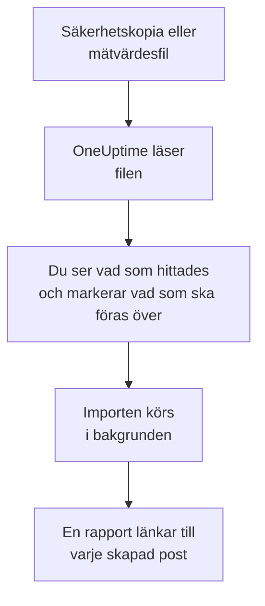

# Byt från Uptime Kuma

Uptime Kuma körs på dina egna maskiner, så **Importera från ett annat verktyg** läser det från en fil i stället för med en nyckel: säkerhetskopian som Uptime Kuma 1 exporterar, eller mätvärdessidan som alla versioner erbjuder. OneUptime läser dina monitorer från den, visar vad det hittade och skapar det du markerar. Ingenting ändras i Uptime Kuma.

:::cards
- [Importera dina monitorer](#importera-dina-uptime-kuma-monitorer): Spara filen, läs den och markera vad som ska föras över.
- [Vad som förs över](#vad-som-förs-över): Vad varje Uptime Kuma-monitor blir i OneUptime.
- [Slutför bytet](#slutför-bytet): Vad du gör när importen är klar.
:::

## Så fungerar det

- **Filen läses en gång.** OneUptime läser den medan den laddas upp, för att hitta dina monitorer, och sparar den aldrig. Lösenord, tokens och push-nycklar i den kopieras aldrig.
- **OneUptime ansluter aldrig till Uptime Kuma.** Allt kommer från filen. En fil som varken är en säkerhetskopia eller en mätvärdessida från Uptime Kuma avvisas med orsaken.
- **Ingenting skapas förrän du startar importen.** Förhandsgranskningen visar för varje objekt om det är nytt, redan finns i OneUptime (och används som det är), har förts över av en tidigare import, eller varför det inte kan föras över.
- **Att köra den igen skapar aldrig något två gånger.** OneUptime minns vad varje import förde över, efter Uptime Kuma-id:t. Läs en nyare fil när du har lagt till monitorer, så skapas bara de nya.

## Innan du börjar

- **Ett OneUptime-projekt och rätten att skapa det du för över.** Projektägare och projektadministratörer kan föra över allt. Andra roller kan också köra en import och föra över de typer av poster de får skapa. Resten visas som inte överfört, med orsaken.
- **En fil från Uptime Kuma.** I Uptime Kuma 1 innehåller JSON-säkerhetskopian varje monitor med dess inställningar. Uptime Kuma 2 har ingen säkerhetskopia, så spara dess mätvärdessida i stället: den anger varje monitors namn, typ och adress, men inte hur ofta den kontrolleras eller vad den letar efter.
- **En betalningsmetod, i OneUptime Cloud.** Monitorer som kör kontroller faktureras efter användning, även med abonnemanget Free, så lägg till en under **Projektinställningar** > **Fakturering** innan du importerar. Utan en visas de monitorerna som inte överförda.

## Importera dina Uptime Kuma-monitorer

:::steps
### Spara filen i Uptime Kuma
Gå till **Settings** > **Backup** i Uptime Kuma 1 och välj **Export**. Lägg till en nyckel under **Settings** > **API Keys** i Uptime Kuma 2, öppna `/metrics` på din Uptime Kuma, logga in utan användarnamn med nyckeln som lösenord och spara sidan som en textfil.

### Öppna importsidan
Gå till **Projektinställningar** > **Importera från ett annat verktyg** i OneUptime och välj **Uptime Kuma**.

### Läs filen
Välj **Välj fil** under **Säkerhetskopia eller mätvärdesfil från Uptime Kuma**, välj filen du sparade och välj **Läs filen**. OneUptime läser den direkt och visar vad det hittade.

### Markera vad som ska föras över
Förhandsgranskningen visar vad som hittades, med ett avsnitt per typ. Allt som skulle skapas är markerat från början, utom monitorer som är pausade i Uptime Kuma. De förs över pausade om du markerar dem. Under varje objekt berättar OneUptime vad som inte förs över precis som det var.

### Starta importen
Välj **Starta import**. Importen körs i bakgrunden: du kan lämna sidan, och rapporten väntar på dig där.
:::

Rapporten räknar vad som skapades och inte fördes över, och visar varje objekt med en länk till posten det blev, misslyckade först. Tidigare importer finns under **Tidigare importer** på samma sida.

## Vad som förs över

| I Uptime Kuma | I OneUptime | Hur |
| --- | --- | --- |
| Monitors | Monitorer | Från en säkerhetskopia blir varje monitor en monitor av samma typ, med samma adress, intervall, tidsgräns och statuskoder som räknas som uppe. Från mätvärdessidan förs var och en över med en kontroll var femte minut: kontrollera var och en efter importen. |

- **HTTP(S)- och nyckelordsmonitorer** blir webbplatsmonitorer, eller API-monitorer när de skickar en annan metod, headers eller en JSON-body, med nyckelordet där det ska vara.
- **JSON-frågemonitorer** blir API-monitorer, utan frågan: lägg till den som kriterium i OneUptime.
- **Ping-, port- och DNS-monitorer** blir ping-, port- och DNS-monitorer.
- **Push-monitorer** blir monitorer för inkommande förfrågningar, som går ner när ingen förfrågan har kommit under intervallet och dess omförsök. Var och en får en ny adress i OneUptime.
- **Manuella monitorer** förblir manuella monitorer. **Grupper** är mappar, så deras monitorer förs över var för sig.
- **Certifikatutgång.** En monitor som varnar innan dess certifikat går ut får också en SSL-certifikatmonitor, uppkallad efter den.

Varje monitor kontrolleras från projektets sonder, precis som en du skapar själv. Ett intervall som OneUptime inte erbjuder blir det närmaste det erbjuder, och en tidsgräns på över en minut blir en minut. Förhandsgranskningen säger till när någon av dem ändras.

## Vad som inte förs över

- **Drifttidshistorik, svarstider och incidenter.** OneUptime börjar kontrollera när importen är klar.
- **Aviseringar.** Välj vem som får besked i OneUptime, så som beskrivs i [Slutför bytet](#slutför-bytet).
- **Lösenord och headers som kan innehålla en hemlighet.** En monitor som loggar in, eller som skickar en `Authorization`-, cookie- eller token-header, förs över utan den: lägg till den med en [monitorhemlighet](/docs/monitor/monitor-secrets).
- **Omvända monitorer**, som räknas som uppe när deras kontroll misslyckas. OneUptime har ingen monitor som gör det.
- **Docker-, databas-, spelserver-, MQTT- och andra monitorer som OneUptime inte har någon motsvarighet till.** Förhandsgranskningen nämner var och en.
- **Statussidor och underhåll.** Skapa de statussidor du behöver i OneUptime och visa de importerade monitorerna på dem.

## Gränser

En import skapar högst 2 000 poster och högst 1 000 monitorer. En fil får vara högst 10 MB. Allt över en gräns visas som inte överfört. Kör importen igen för att föra över resten.

I OneUptime Cloud behöver monitorer som kör kontroller en betalningsmetod, och det ditt abonnemang inte har plats för visas som inte överfört, med det som krävs.

En förhandsgranskning sparas i en dag. Bara den som läste filen kan markera objekt och starta importen. Projektägare och projektadministratörer ser förloppet och rapporten för varje import.

## Slutför bytet

:::steps
### Kontrollera dina monitorer
Öppna var och en under **Monitorer** och kontrollera de första resultaten. En heartbeat-monitor har en ny adress: peka jobbet som anropar den dit.

### Välj vem som får besked
Lägg till ägare på dina monitorer, eller en jourpolicy under **Jourtjänst** > **Jourpolicyer** på incidenterna de öppnar, så att rätt personer får veta när något går ner.

### Stäng av kontrollerna i Uptime Kuma
När OneUptime kontrollerar samma saker pausar du dem i Uptime Kuma, så att ingen får besked två gånger.
:::

## Felsökning

:::details Filen avvisades
OneUptime säger varför: en fil över 10 MB, en som inte är giltig JSON, eller en som varken är en säkerhetskopia eller mätvärdessidan från Uptime Kuma. Exportera säkerhetskopian igen, eller spara `/metrics` igen som ren text, och välj den igen.
:::

:::details En monitor visas som inte överförd
Där står varför: en typ av monitor som OneUptime inte har, en adress som OneUptime inte kan läsa, eller ett projekt utan plats eller betalningsmetod för den. En monitor som OneUptime redan kör, med samma namn, typ och adress, används som den är.
:::

:::details Vissa objekt kan inte markeras
Vid varje objekt står varför: ett namn som projektet redan har, något som en tidigare import har fört över, eller en post som du inte får skapa eller som ditt abonnemang inte omfattar.
:::

## Nästa steg

:::cards
- [Webbplatsövervakning](/docs/monitor/website-monitor): Vad en webbplatsmonitor kontrollerar, och hur.
- [Övervakning av inkommande förfrågningar](/docs/monitor/incoming-request-monitor): Hur en heartbeat fungerar i OneUptime.
- [Byt från UptimeRobot](/docs/moving-to-oneuptime/uptimerobot): För över dina kontroller från UptimeRobot.
:::
