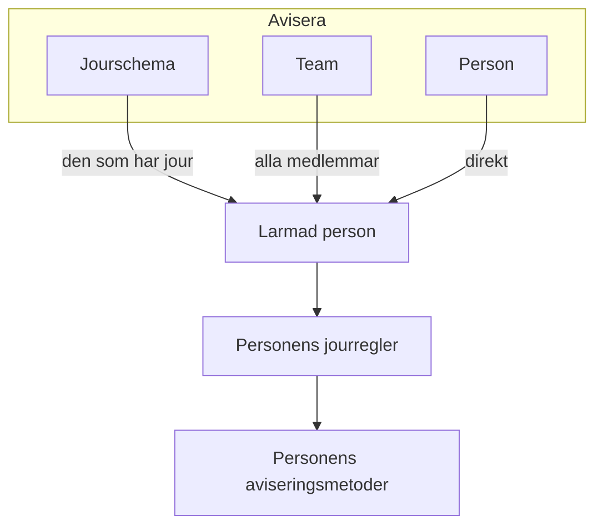

# Eskaleringsregler

En jourpolicy larmar personer i nivåer. Varje eskaleringsregel är ett nivå: vem som larmas och hur länge det väntas på att någon bekräftar innan nästa nivå larmas. En policys regler visas i ordning på dess sida **Eskaleringsregler**.

```mermaid title="En jourpolicy larmar nivå för nivå tills någon bekräftar"
flowchart TB
    trigger["Incident eller larm"] --> level1["Level 1 larmar"]
    level1 --> ack1{"Bekräftat<br/>i tid?"}
    ack1 -->|"Ja"| stop["Larmandet slutar"]
    ack1 -->|"Nej"| level2["Level 2 larmar"]
    level2 --> ack2{"Bekräftat<br/>i tid?"}
    ack2 -->|"Ja"| stop
    ack2 -->|"Nej, sista nivån"| repeat{"Upprepa policyn?"}
    repeat -->|"Ja"| level1
    repeat -->|"Nej"| done["Policyn slutar"]
```

:::cards
- [Vem som larmas först](#vem-som-larmas-först): Skapa en policy med dess första nivå.
- [Lägg till en eskaleringsregel](#lägg-till-en-eskaleringsregel): Lägg till nästa nivå, steg för steg.
- [Så larmar nivåerna personer](#så-larmar-nivåerna-personer): Tider, upprepningar och hur varje person nås.
- [API och Terraform](#skapa-regler-med-apiet-eller-terraform): Skapa policyer och regler som kod.
:::

## Vem som larmas först

När du skapar en jourpolicy på sidan **Jourpolicyer** frågar formuläret efter dess **Namn** och **Vem larmas först?**. Frågan använder samma väljare som **Avisera**: jourscheman, team och personer, så många du behöver. De du väljer blir policyns första eskaleringsregel, **Level 1**, som väntar **30 minuter** på en bekräftelse innan nästa nivå larmas.

:::steps
1. Gå till **Jourtjänst** > **Jourpolicyer** och klicka på **Skapa Jourpolicy**.
2. Ange ett **Namn**.
3. Klicka på **Lägg till mottagare** under **Vem larmas först?** och välj de jourscheman, team och personer som ska larmas först.
4. Klicka på **Skapa Jourpolicy**. Den nya policyn öppnas sedan på sin sida **Eskaleringsregler**, där du kan lägga till fler nivåer.
:::

**Vem larmas först?** är valfritt. Lämnar du det tomt börjar policyn utan eskaleringsregler: den larmar ingen förrän du lägger till en, och dess översikt säger det. Beskrivningen och etiketterna finns under **Fler fält**. Frågan ställs bara till dem som får lägga till eskaleringsregler.

## Lägg till en eskaleringsregel

:::steps
### Öppna policyns eskaleringsregler

Öppna jourpolicyn, välj **Eskaleringsregler** i dess sidomeny och klicka på **Lägg till eskaleringsregel**. Dialogen är en kort sida.

### Välj vem som ska aviseras

Klicka på **Lägg till mottagare** under **Avisera**, sök och välj så många jourscheman, team och personer som den här nivån ska larma. Lägg till minst en.

| Mottagare | Vem som larmas när nivån körs |
| --- | --- |
| Ett **jourschema** | Den som har jour i det när nivån körs, inte en fast person. |
| Ett **team** | Alla medlemmar i teamet. |
| En **person** | Den personen, direkt. |

### Ange hur länge det ska väntas

**Eskalera efter (i minuter)** är hur länge det väntas på en bekräftelse innan nästa nivå larmas. Den börjar på **30 minuter**; ändra den till det som passar nivån.

### Ge regeln ett namn, om du vill

Allt annat finns under **Fler fält**, hopfällt tills du öppnar det:

- **Namn**: valfritt. En regel som du inte namnger får sitt nivås namn: den första regeln i en policy är **Level 1**, den andra **Level 2** och så vidare. Namnfältet visar det namn regeln får.
- **Beskrivning**: valfria anteckningar, till exempel vem den här nivån larmar och varför.

Hopfälld nämner rubriken för **Fler fält** de två och visar dem som regeln har: en beskrivning eller ett eget namn.

### Skapa regeln

Klicka på **Create Rule**. Regeln läggs till under de andra, som policyns nästa nivå.
:::

## Så larmar nivåerna personer

När en incident eller ett larm når policyn larmar **Level 1** sina mottagare direkt. Om ingen bekräftar inom väntetiden larmas **Level 2**, och så vidare nedåt i listan. När den sista nivåns väntetid har gått utan bekräftelse börjar policyn om från **Level 1** om dess **Upprepningspolicy** (under reglerna) säger att den ska upprepas, så många gånger som den tillåter, och annars slutar den. Att bekräfta eller lösa incidenten eller larmet stoppar larmandet på vilken nivå som helst.

En incident, ett larm eller en episod som skapas redan bekräftad eller löst — registrerad i efterhand — kör ingen av sina policyer: ingen larmas, och dess feed säger det och nämner dem vid namn. Se [Deklarerad redan bekräftad eller löst](/docs/incidents/declaring-incidents#deklarerad-redan-bekräftad-eller-löst).

För att upprepa en policy klickar du på **Redigera** på kortet **Upprepningspolicy**, slår på **Repeat if no one acknowledges** och anger **Number of times to repeat**.

### Eskaleringsöversikten

Översikten högst upp på sidan **Eskaleringsregler** visar hela stegen: när varje nivå larmas, vem den larmar och vad som händer efter den sista. En nivå vars mottagare inte alla kan larmas säger det på sitt kort; klicka på etiketten för att se vem och varför.

### Så nås varje person

Varje person som en nivå larmar nås på det sätt som personens egna jourregler säger: **Användarinställningar** > **Jourregler**, med en flik för incidenter, incidentepisoder, larm och larmepisoder, och ett kort per allvarlighetsgrad som visar vilken aviseringsmetod som prövas och efter hur lång tid. En projektadministratör kan se och ändra en medlems regler under **Användare** > medlemmen > **Jourregler**.



En användaråsidosättning som gäller för en person skickar personens larm till den som täcker upp för personen i stället.

Varje meddelande är ett som leverantören tar emot, så ett larm går alltid ut. Så här mycket bär varje kanal:

| Kanal | Det längsta meddelandet den bär |
| --- | --- |
| SMS | 1 600 tecken |
| Telefonsamtal | Det som ryms i Twilios samtalsskript på 4 000 tecken |
| Pushavisering | 4 KB, varav titel, text och data tar upp till 3 KB |
| WhatsApp | 1 024 tecken |
| Telegram | 4 096 tecken |

Ett längre meddelande, med en lång titel eller en lång beskrivning som en mall har lagt in, kortas och slutar med en notering om att hela texten finns i OneUptime: "… (truncated — see OneUptime for the full text)". Texten i ett WhatsApp-meddelande är en fast mall, så där kortas i stället de längsta värdena, vart och ett med "…" på slutet. Länkarna i ett meddelande kortas aldrig.

### När ett larm inte skickas

Ett larm som inte skickas säger varför i personens **Jourloggar** (Användarinställningar): raden visar **Fel**, och statusmeddelandet anger orsaken. Det blir inte längre stående på **Sending**. Meddelandet säger något av detta:

- projektets saldo kunde inte betala för det, och vem som kan fylla på saldot;
- kanalen är avstängd i projektet, och vem som kan slå på den.

Projektets ägare får ett e-postmeddelande om det en gång, tills saldot har fyllts på eller kanalen är på igen.

På OneUptime Cloud betalas varje SMS, samtal, WhatsApp- och Telegram-meddelande från projektets saldo på **Projektinställningar > Aviseringar > Aviseringsinställningar**: den exakta kostnaden dras från saldot när leverantören tar emot meddelandet, oavsett hur många meddelanden som går ut samtidigt.

- Med **Automatisk påfyllning** påslaget där lägger meddelandet som hittar saldot under tröskeln först till det belopp som automatisk påfyllning är inställd på och debiterar projektets kort; meddelanden som hittar saldot lågt i samma ögonblick debiterar kortet en gång.
- Om debiteringen misslyckas (det finns ingen betalningsmetod eller kortet nekades) försöker automatisk påfyllning med kortet igen en timme senare, och **Aviseringsinställningar** säger det högst upp tills dess. Att fylla på saldot för hand, eller att spara automatisk påfyllning igen, försöker direkt.
- Larmen fortsätter att gå ut på det saldo som finns kvar medan automatisk påfyllning inte kan debitera kortet.

> [!IMPORTANT]
> SMS, telefonsamtal, WhatsApp och Telegram är avstängda i ett nytt projekt: på OneUptime Cloud betalas varje meddelande från projektets saldo, och en egen installation behöver först ett Twilio-konto eller en Telegram-bot. Så länge en kanal är avstängd kan ingen i projektet lägga till en metod på den. Bara en projektägare, en **Billing Admin** eller någon med behörigheten **Manage Billing** kan slå på en, i kortet **Aviseringskanaler** på **Projektinställningar > Aviseringar > Aviseringsinställningar** — en projektadministratör kan inte. Alla andra får veta exakt vem som kan, överallt där en kanal är avstängd: ovanför sin egen lista med metoder på den, i sin checklista för att komma igång och i meddelandet de får när något behöver den.

## Redigera, ändra ordning på och ta bort regler

Varje regels kort har **Edit rule** och en **⋯**-meny med de andra åtgärderna:

- **Edit rule** öppnar samma dialog på en sida, ifylld med regeln som den är: dess mottagare, dess väntetid och dess namn och beskrivning under **Fler fält**. Lägg till eller ta bort mottagare och klicka på **Spara ändringar**. Rensar du namnet får regeln sitt nivås namn igen.
- **Move up** och **Move down** i en regels **⋯**-meny ändrar dess nivå. En regel som har sitt nivås namn behåller ett namn som stämmer med dess plats: när **Level 3** flyttas upp förbi **Level 2** byter de två namn. Ett namn du själv har valt, till exempel **Chefer**, förblir detsamma var regeln än hamnar.
- **Delete rule** frågar först och säger vem nivån larmar. Tar du bort en nivå flyttas nivåerna under den upp, och regler som har sitt nivås namn byter namn så att de stämmer.

## Skapa regler med API:et eller Terraform

Eskaleringsregler är resursen `/api/on-call-duty-policy-escalation-rule`; de personer, team och jourscheman som en regel larmar är resurserna `/api/on-call-duty-policy-escalation-rule-user`, `-team` och `-schedule`.

- En regel som skapas utan `name` får sitt nivås namn, som i instrumentpanelen: **Level 3** för en regel som blir den tredje nivån i sin policy. Terraforms resurs för eskaleringsregler kräver fortfarande ett namn.
- `escalateAfterInMinutes` har inget standardvärde utanför instrumentpanelen. En regel som skapas utan det väntar inte: nästa nivå larmas så snart den här har körts. Ange det uttryckligen — 30 är det som instrumentpanelen föreslår.
- En regel som skapas med `onCallSchedules`, `teams` eller `users` (listor med id:n) i sina `miscDataProps` får de mottagarna; det är så instrumentpanelens väljare **Avisera** skickar dem. En regel som skapas utan dem larmar ingen förrän du lägger till mottagare via resurserna ovan.
- Regler som har sitt nivås namn byter namn när du flyttar eller tar bort regler i instrumentpanelen. Att ändra `order` via API:et eller Terraform ändrar bara ordningen.
- Att skapa en jourpolicy på `/api/on-call-duty-policy` med `onCallSchedules`, `teams` eller `users` (listor med id:n) i dess `miscDataProps` ger den dess första eskaleringsregel, som instrumentpanelen gör: **Level 1**, som larmar dem, med en `escalateAfterInMinutes` på 30. Varje id måste höra till projektet och anroparen måste få skapa eskaleringsregler, annars skapas inte policyn. En policy som skapas utan dem har inga regler, som tidigare; Terraforms resurs för policyer skickar dem inte.

```bash
curl -X POST https://oneuptime.com/api/on-call-duty-policy \
  -H "apikey: $ONEUPTIME_API_KEY" \
  -H "Content-Type: application/json" \
  -d '{
    "data": {
      "projectId": "<project-id>",
      "name": "Production on-call"
    },
    "miscDataProps": {
      "onCallSchedules": ["<schedule-id>"],
      "users": ["<user-id>"]
    }
  }'
```

## Nästa steg

:::cards
- [Jourscheman](/docs/on-call/schedules): Bygg de rotationer som en nivå larmar.
- [Tidslinje för jourscheman](/docs/on-call/schedule-timeline): Se vem som har jour i alla scheman och hitta täckningsluckor.
- [Policy för inkommande samtal](/docs/on-call/incoming-call-policy): Låt uppringare nå jourhavande tekniker via telefon.
:::
