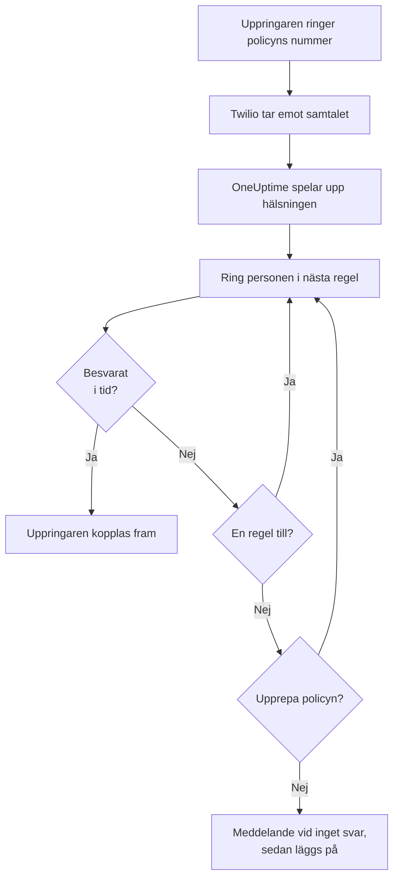
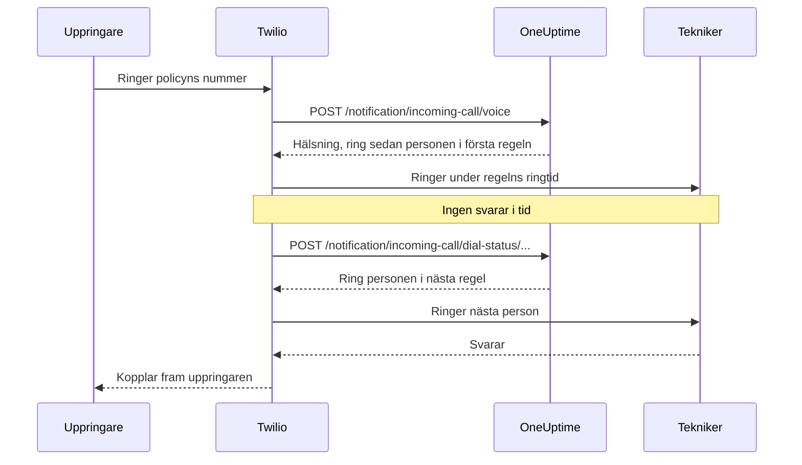

# Policy för inkommande samtal

En policy för inkommande samtal ger ditt team ett telefonnummer som når den som har jour. När någon ringer det ringer OneUptime upp personerna i policyns eskaleringsregler, en efter en, tills någon svarar, och kopplar fram den som ringer. Numren och samtalen går via ditt eget Twilio-konto.

:::cards
- [Ställ in en policy](#ställ-in-en-policy): Från ditt Twilio-konto till ett testsamtal, i sju steg.
- [Så routas ett samtal](#så-routas-ett-samtal): Vem som ringes upp, hur länge och vad uppringaren hör.
- [Missade samtal](#missade-samtal): Vem som får veta, och hur du agerar på dem i ett arbetsflöde.
- [Felsökning](#felsökning): Samtal som aldrig kommer fram, eller aldrig når en tekniker.
:::

## Innan du börjar

| Du behöver | Varför |
| --- | --- |
| Ett Twilio-konto, med dess Account SID och Auth Token | Policyns nummer och samtal går via det, och Twilio fakturerar dem till det. |
| Planen **Growth**, på OneUptime Cloud | Ett projekt behöver den för en egen Twilio-konfiguration. |
| En OneUptime-server som Twilio kan nå, om du kör den själv | Twilio skickar varje samtal till `https://<your host>/notification/incoming-call/voice`. |
| **SMS** påslaget i projektet | Varje teknikers nummer verifieras med en kod som skickas via SMS. |
| Ett verifierat nummer för varje tekniker | En regel ringer bara personer som har lagt till och verifierat ett nummer för inkommande samtal i projektet. |

## Ställ in en policy

:::steps
### Lägg till ditt Twilio-konto

Gå till **Projektinställningar** > **Aviseringar** > **Aviseringsinställningar**. Klicka på **Create Twilio Config** i kortet **Twilio-konfiguration** och fyll i formuläret:

- **Namn** och **Beskrivning**: vad kontot används till, till exempel "Supportlinje".
- **Twilio Account SID**: från Twilio Console. Det börjar med `AC`.
- **Twilio Auth Token**: från Twilio Console.
- **Twilio primärt telefonnummer**: ett nummer på det kontot, för de SMS och samtal som det skickar.
- **Twilio sekundära telefonnummer**: valfritt. Nummer som skickar i stället för det primära till mottagare i sitt eget land.
- **Ange som projektstandard**: på för projektets första Twilio-konfiguration, så att SMS och samtal till projektets medlemmar också går via det här kontot. Stäng av det om kontot bara är för inkommande samtal.

### Skapa policyn

Gå till **Jourtjänst** > **Inkommande samtalspolicyer** och klicka på **Skapa Inkommande samtalspolicy**. Ge den ett **Namn**, till exempel "Supportlinje", och om du vill en **Beskrivning** och **Etiketter**. Öppna den sedan från listan.

### Välj Twilio-kontot

Policyns **Översikt** visar ett kort **Inställning** med tre numrerade steg. Klicka på **Välj** i det första, välj kontot under **Twilio-konfiguration** och klicka på **Spara**.

### Lägg till ett telefonnummer

Klicka på **Add Phone Number** i det andra steget. Välj **Use Existing Phone Number** för att ta med ett nummer som ditt Twilio-konto redan har, eller **Reserve New Phone Number** för att få ett nytt. OneUptime pekar numret mot sig självt, så det finns inget att ställa in i Twilio. Se [Telefonnummer](#telefonnummer).

### Lägg till eskaleringsregler

Klicka på **Hantera regler** i det tredje steget. Lägg till en regel för varje jourschema eller person som ska ringas upp, i den ordning de ska ringas. Se [Eskaleringsregler](#eskaleringsregler).

### Verifiera varje teknikers nummer

Alla som en regel kan ringa upp lägger till och verifierar sitt eget nummer för inkommande samtal. Se [Teknikernas telefonnummer](#teknikernas-telefonnummer).

### Ring numret

När alla tre stegen är klara blir kortet **Phone Numbers & Twilio Configuration**. Ring numret från valfri telefon och öppna sedan policyns **Samtalsloggar** för att se vem som ringdes upp.
:::

## Så routas ett samtal

1. Twilio skickar samtalet till OneUptime, som läser upp policyns **Hälsningsmeddelande**.
2. OneUptime ringer upp den person som den första eskaleringsregeln nämner: den personen, eller den som har jour i regelns jourschema i det ögonblicket, användaråsidosättningar inräknade. Personens telefon visar policyns nummer som uppringare.
3. Om personen svarar inom regelns **Ringtid** kopplas uppringaren fram, och samtalsloggen registrerar vem som svarade.
4. Om inte hör uppringaren "Connecting you to the next available engineer.", och personen i nästa regel ringes upp.
5. Efter den sista regeln börjar policyn om från den första regeln om **Upprepa policy om ingen svarar** är påslaget, så många gånger som **Antal upprepningar av policy** säger. Annars hör uppringaren **Meddelande vid inget svar**, och samtalet avslutas.

En regel hoppas över, utan att någon ringes upp, när ingen kan ringas för den just nu: dess schema har ingen med jour, personen har inget verifierat nummer för inkommande samtal i det här projektet, eller personen är inte längre medlem i projektet. När ingen regel har någon att ringa hör uppringaren **Meddelande om att ingen är tillgänglig**. En inaktiverad policy besvarar varje samtal med "Sorry, this service is currently disabled." och lägger på.

OneUptime kontrollerar Twilios signatur på varje förfrågan med Twilio-konfigurationens Auth Token och avvisar en förfrågan som den inte kan verifiera.

> [!TIP]
> Spara policyns nummer som en kontakt i din telefon, till exempel "Supportlinje", så att du känner igen ett vidarekopplat samtal när det ringer.

## Eskaleringsregler

Eskaleringsregler bestämmer vem som ringes upp när någon ringer policyns nummer, uppifrån och ned i listan. Öppna policyn, välj **Eskaleringsregler** i dess sidomeny och klicka på **Lägg till eskaleringsregel**. En regel är ett kort steg:

- **Vem som ska ringas**: ett jourschema eller en person. Ett schema ringer upp den som har jour i det när samtalet kommer in. Personer är medlemmarna i ditt projekt.
- **Ringtid (i sekunder)**: hur länge personens telefon ringer innan samtalet går vidare till nästa regel. Den börjar på 20 sekunder, och Twilio godtar 5 till 600.
- **Namn** och **Beskrivning** är valfria, under **Fler fält**. En regel utan namn visas i listan efter sin plats: **Level 1**, **Level 2**.

Reglerna anropas uppifrån och ned i listan, och en ny regel läggs till sist. För att ändra ordningen drar du en regel i handtaget uppe till vänster. Med tangentbordet fokuserar du handtaget, trycker på blanksteg, flyttar det med piltangenterna och trycker på blanksteg igen.

> [!WARNING]
> **Tänk på röstbrevlådan**: håll **Ringtid** kortare än den tid det tar för personens telefon att skicka ett obesvarat samtal till röstbrevlådan. Om röstbrevlådan svarar först kopplas uppringaren till den, och samtalet går inte vidare till nästa regel. Twilio lägger till några egna sekunder till varje signal. Därför börjar en ny regel på 20 sekunder. Regler som lades till när standardvärdet var 30 sekunder behåller sina 30: om deras samtal hamnar i röstbrevlådan sänker du **Ringtid** på de reglerna.

Till exempel tre regler som provar två rotationer och sedan en chef:

| Nivå | Vem som ska ringas | Ringtid |
| --- | --- | --- |
| Level 1 | Primärt jourschema | 20 sekunder |
| Level 2 | Sekundärt jourschema | 20 sekunder |
| Level 3 | Teknisk chef (en person) | 20 sekunder |

## Telefonnummer

En policy kan ha flera nummer, och alla ringer samma regler. Varje nummer hör till en policy. Lägg till dem med **Add Phone Number** på policyns **Översikt**:

:::tabs
@tab Använd ett nummer du har
1. Klicka på **Add Phone Number** och sedan på **Use Existing Phone Number**. OneUptime visar numren på policyns Twilio-konto.
2. Klicka på **Välj** bredvid numret och sedan på **Tilldela nummer**.

Ett nummer som redan skickar sina samtal någon annanstans säger "Currently has a webhook configured". Att tilldela det skickar dess samtal till OneUptime i stället.
@tab Reservera ett nytt nummer
1. Klicka på **Add Phone Number**, sedan på **Reserve New Phone Number** och **Sök efter nummer**.
2. Välj ett **Land**. Fyll om du vill i **Riktnummer (valfritt)**, till exempel 415, eller **Innehåller (valfritt)** med siffror som numret ska innehålla. Klicka på **Sök**: upp till 10 lokala nummer visas.
3. Klicka på **Reservera** bredvid ett nummer och bekräfta med **Reservera**. Twilio debiterar numret på ditt Twilio-konto.
:::

OneUptime ställer in numrets röst-webhook på `https://<your host>/notification/incoming-call/voice`, byggd från `HOST` och `HTTP_PROTOCOL` i en egen installation. För att flytta en policy till ett annat Twilio-konto frigör du först dess nummer: kontot kan bara ändras medan policyn inte har några.

För att frigöra ett nummer klickar du på **Frigör** bredvid det och bekräftar med **Frigör nummer**.

> [!CAUTION]
> Att frigöra ett nummer ger tillbaka det till Twilio, även ett nummer som du tog med via **Use Existing Phone Number**, och du kanske inte får det igen. Att ta bort en policy, eller den Twilio-konfiguration som den använder, frigör också dess nummer.

## Teknikernas telefonnummer

En regel ringer en person på det nummer som personen har verifierat för inkommande samtal i det här projektet, och hoppar över alla som inte har något. Varje person lägger till sitt eget:

:::steps
1. Öppna **Användarinställningar** > **Inkommande samtalspolicy** > **Inkommande telefonnummer**. **Inkommande samtalspolicy** är ett avsnitt i sidomenyn som börjar hopfällt.
2. Klicka på **Lägg till Telefonnummer för inkommande samtalsroutning** i kortet **Telefonnummer för inkommande samtalsroutning** och ange numret med landsnummer, till exempel `+15551234567`.
3. Ange den 6-siffriga kod som OneUptime skickar till numret via SMS under **Verifieringskod** och klicka på **Verifiera**. **Send a new code** skickar en ny.
:::

Varje person kan ha ett verifierat nummer per projekt. För att byta det tar du först bort det gamla numret. De här numren är skilda från telefonnumren under **Aviseringsmetoder**, som jourlarm använder.

Nummer för inkommande samtal verifieras via SMS, så **SMS** måste först vara påslaget för projektet. En projektägare, en **Billing Admin** eller någon med **Manage Billing** slår på det i kortet **Aviseringskanaler** på **Projektinställningar > Aviseringar > Aviseringsinställningar**.

## Röstmeddelanden och policyinställningar

Öppna policyn och välj **Inställningar** under **Avancerad** i dess sidomeny. **Edit Messages** på kortet **Röstmeddelanden** ändrar vad uppringare hör; **Edit Policy Settings** på kortet **Policyinställningar** ändrar resten.

| Inställning | Vad den gör | För en ny policy |
| --- | --- | --- |
| **Hälsningsmeddelande** | Läses upp när samtalet besvaras, innan den första personen ringes upp. | "Please wait while we connect you to the on-call engineer." |
| **Meddelande vid inget svar** | Läses upp när alla regler har provats och ingen svarade. | "No one is available. Please try again later." |
| **Meddelande om att ingen är tillgänglig** | Läses upp när ingen regel har någon att ringa. | "We are sorry, but no on-call engineer is currently available. Please try again later or contact support." |
| **Aktiverad** | En inaktiverad policy avvisar alla samtal. | På |
| **Upprepa policy om ingen svarar** | Börjar om från den första regeln efter den sista. | Av |
| **Antal upprepningar av policy** | Hur många gånger det börjar om. | 1 |

Twilio läser upp meddelandena med en text-till-tal-röst, så skriv dem som du vill att de ska låta.

## Samtalsloggar

Varje samtal visas på policyns sida **Samtalsloggar**, under **Loggar** i dess sidomeny: **Uppringare**, **Number Called**, dess **Status**, vem som besvarade det (**Besvarad av**), **Varaktighet** och när det startade (**Startade den**). Klicka på **View Timeline** vid ett samtal för att se dess **Samtalstidslinje**: varje person som ringdes upp, på vilket nummer och hur varje försök slutade.

| Status | Vad som hände |
| --- | --- |
| **Initiated**, **Ringing**, **Escalated** | Samtalet pågår fortfarande: det kom in, en telefon ringer, eller det gick vidare till en senare regel. |
| **Slutförd** | Någon svarade, och uppringaren kopplades fram. |
| **Inget svar** | Alla eskaleringsregler provades och ingen svarade. Uppringaren hörde ditt **Meddelande vid inget svar**. |
| **Caller Hung Up** | Uppringaren lade på medan en teknikers telefon ringde. |
| **Misslyckades** | Ingen kunde ringas upp: ingen eskaleringsregel hade en användare med jour och ett verifierat nummer för inkommande samtal (uppringaren hörde ditt **Meddelande om att ingen är tillgänglig**), eller så är policyn inaktiverad. |

## Missade samtal

Ett samtal är missat när det slutar utan att nå någon: dess status är **Inget svar**, **Caller Hung Up** eller **Misslyckades**.

### Vem som aviseras

När ett samtal missas aviserar OneUptime policyns ägare: användarna och medlemmarna i de team som har lagts till på policyns sida **Ägare**. Om policyn inte har några ägare aviseras projektets ägare i stället.

Aviseringen säger vem som ringde, vilket nummer personen slog, varför ingen svarade, och vem som ringdes upp och hur varje försök slutade. Den länkar till samtalet i samtalsloggen.

Ägare får e-post som standard. Varje person kan välja andra kanaler (SMS, samtal, push och mer) eller stänga av det i **Användarinställningar** > **Aviseringsinställningar**, under **Jour** > **Inkommande samtalspolicyer** > **Missat samtal**.

### Agera på missade samtal i ett arbetsflöde

Loggar för inkommande samtal finns som utlösare i arbetsflöden:

- **On Create Incoming Call Log** körs när ett samtal kommer in.
- **On Update Incoming Call Log** körs allteftersom samtalet fortskrider. Den uppdatering som anger **Ended At** är samtalets slut.

För att bara agera på missade samtal, till exempel för att publicera dem i Slack eller Microsoft Teams eller öppna ett ärende:

:::steps
1. Lägg till utlösaren **On Update Incoming Call Log**. Ställ in **Listen on** på **Ended At** och välj de fält du vill använda, till exempel **Status**, **Caller Phone Number** och **Routing Phone Number**.
2. Lägg till ett steg **If / Else**. Kontrollera utlösarens **Status**, med jämförelsen **is not equal to** och `Completed`.
3. Anslut dina steg till porten **Yes**.
:::

Ett arbetsflöde kan läsa samtalsloggar med **Find One** och **Find Many**, men det kan inte skapa eller ändra dem.

## Vem som kan lägga till och frigöra telefonnummer

En policys telefonnummer följer samma roller som själva policyn:

- **Slå upp nummer** - söka i Twilio efter ett nummer att reservera, eller visa de nummer som ditt Twilio-konto redan har - kräver behörighet att läsa policyer för inkommande samtal och att läsa konfigurationer för samtal och SMS, eftersom det läser ditt Twilio-konto via en sådan. **Project Owner**, **Project Admin**, **Project Member**, **Viewer**, **Settings Admin**, **Settings Member** och **Settings Viewer** har båda. I en anpassad roll är det **Read Incoming Call Policy** och **Read Call and SMS**.
- **Reservera ett nummer, använda ett befintligt och frigöra ett** kräver behörighet att redigera policyer för inkommande samtal: **Project Owner**, **Project Admin**, **Project Member**, **Settings Admin** och **Settings Member**, eller **Edit Incoming Call Policy** i en anpassad roll. De ändrar numren för en policy som du får redigera: med en roll som är begränsad till vissa etiketter, de policyer som har de etiketterna.

Ett teams spärr utan etiketter på en av de här behörigheterna tar bort den. För alla andra finns **Add Phone Number** och **Frigör** kvar på sidan, låsta, och deras knappbeskrivning säger vad som krävs. API:et avvisar deras förfrågan med en mening som säger vad som krävs: "Looking up phone numbers needs permission to read incoming call policies and call and SMS settings." eller "Adding or releasing a phone number needs permission to edit incoming call policies." Att reservera ett nummer debiteras ditt eget Twilio-konto, inte ditt OneUptime-saldo, så det kräver ingen faktureringsbehörighet.

## Skapa policyer med API:et eller Terraform

| Resurs | API-väg |
| --- | --- |
| Policyer för inkommande samtal | `/api/incoming-call-policy` |
| Deras eskaleringsregler | `/api/incoming-call-policy-escalation-rule` |
| Deras telefonnummer, endast läsning | `/api/incoming-call-policy-phone-number` |
| Samtalsloggar, endast läsning | `/api/incoming-call-log` |

En regel som skapas via API:et utan `escalateAfterSeconds` ringer i 20 sekunder, och det gör även en regel som Terraform skapar utan `escalate_after_seconds`.

### Inställningar för en eskaleringsregel

| Inställning | API-fält | Vad det innehåller |
| --- | --- | --- |
| Vem som ska ringas | `onCallDutyPolicyScheduleId` eller `userId` | Ett av dem, aldrig båda: det schema vars jourhavande ringes upp, eller personen. |
| Ringtid (i sekunder) | `escalateAfterSeconds` | Hur länge telefonen ringer innan samtalet går vidare (standard: 20; från 5 till 600). |
| Namn och Beskrivning | `name`, `description` | Valfria. En regel utan namn visas som Level 1, Level 2 och så vidare, efter sin plats i listan. |
| Ordning | `order` | Var regeln står i listan: reglerna anropas uppifrån och ned. En ny regel utan ordning hamnar sist. |

## Felsökning

:::details Samtal når inte fram till OneUptime
- Öppna numret i Twilio Console: **A call comes in** måste vara webhooken `https://<your host>/notification/incoming-call/voice`, med HTTP POST. OneUptime ställer in den när numret läggs till, från `HOST` och `HTTP_PROTOCOL`. Om de har ändrats sedan dess rättar du webhooken i Twilio.
- En egen installation av OneUptime måste kunna nås från internet via https. Numrets samtalslogg i Twilio Console, och Twilios **Debugger**, visar vad OneUptime svarade.
- Ett svar `403` betyder att förfrågans signatur inte stämde. Kontrollera att Twilio-konfigurationen har kontots aktuella **Twilio Auth Token**, och att en proxy framför OneUptime skickar vidare den värd och det schema som Twilio anropade (`X-Forwarded-Host` och `X-Forwarded-Proto`).
:::

:::details Samtalet besvaras, men ingen ringes upp
Samtalsloggen säger **Misslyckades**. Kontrollera att policyn är **Aktiverad**, att varje regels jourschema har någon med jour just nu, och att de personer som reglerna ringer har ett verifierat nummer under **Användarinställningar** > **Inkommande samtalspolicy** > **Inkommande telefonnummer**, i det här projektet. Regler ringer bara medlemmar i projektet.
:::

:::details Samtal hamnar i röstbrevlådan
Om samtal hamnar i en teknikers röstbrevlåda ställer du in regelns **Ringtid** under den tid det tar för personens telefon att gå till röstbrevlådan. En röstbrevlåda som svarar räknas som ett svar, och samtalet stannar där.
:::

:::details Ett nytt nummer kan inte reserveras
Twilio kräver i många länder ett godkänt regulatory bundle innan det säljer lokala nummer, och vissa nummer kräver ett positivt Twilio-saldo. Ordna det i Twilio Console, eller skaffa numret där och lägg till det med **Use Existing Phone Number**.
:::

:::details Policyns Twilio-konto kan inte ändras
Kontot kan bara ändras medan policyn inte har några telefonnummer: sidan säger "Remove all phone numbers to change". Att frigöra numren ger tillbaka dem till Twilio, så planera flytten först.
:::

:::details Koden för en teknikers nummer kommer inte fram
SMS måste vara påslaget för projektet. På OneUptime Cloud betalar ett projekt utan en egen standard-Twilio-konfiguration för SMS från sitt saldo, som måste vara över 1 USD. Koder kan ta en minut att komma fram; klicka på **Send a new code** för att skicka en ny, och **Projektinställningar** > **Aviseringar** > **Aviseringsloggar** visar vad som hände med den.
:::

## Nästa steg

:::cards
- [Eskaleringsregler](/docs/on-call/escalation-rules): Hur en jourpolicy larmar personer, nivå för nivå.
- [Jourscheman](/docs/on-call/schedules): Bygg de rotationer som dina regler ringer.
- [Arbetsflöden](/docs/workflows/index): Agera på missade samtal: publicera dem i en kanal eller öppna ett ärende.
- [Twilio-integration för SMS och röst](/docs/self-hosted/twilio-integration): Ställ in Twilio för en egen installation.
:::
