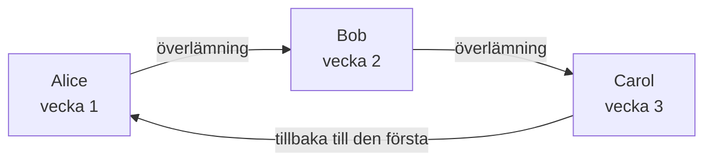
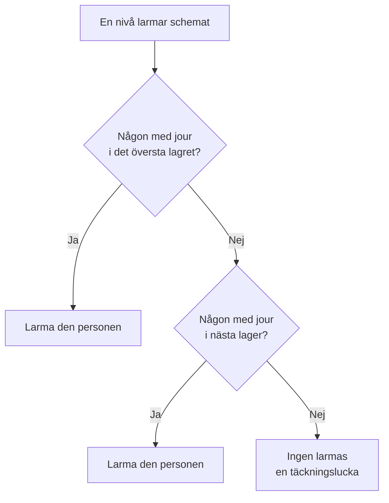

# Jourscheman

Ett jourschema bestämmer vem som har jour vid varje tidpunkt. Personer turas om i det: var och en har jour en tid, sedan tar nästa över. Lägg till ett schema i en jourpolicys eskaleringsregler, så larmar policyn den som har jour i det när den nivån körs.

> [!NOTE]
> På OneUptime Cloud ingår jourscheman i planen **Growth** och högre. Ett schema som ett projekt fortfarande har fortsätter att larma personerna i det, via de eskaleringsregler som nämner det, efter att en provperiod för Growth har tagit slut eller planen har sänkts. Under **Growth** visar därför sidan **Jourscheman** anteckningen om planen med de scheman som fortfarande är inställda under den, där du kan ta bort dem. Att skapa eller ändra ett schema kräver **Growth**.

:::cards
- [Vilka som turas om](#vilka-som-turas-om): Skapa ett schema med dess första rotation.
- [Lager](#lager): Stapla rotationer, begränsa jourtiderna och lägg till reservtäckning.
- [API och Terraform](#skapa-scheman-med-apiet-eller-terraform): Skapa scheman och deras rotationer som kod.
:::

## Vilka som turas om

När du skapar ett schema på sidan **Jourscheman** frågar formuläret efter dess **Namn** och **Vilka turas om?**. De personer du väljer blir schemats första lager, **Layer 1**, med jour dygnet runt.

:::steps
1. Gå till **Jourtjänst** > **Jourscheman** och klicka på **Skapa jourschema**.
2. Ange ett **Namn**.
3. Klicka på **Lägg till användare** under **Vilka turas om?** och välj personerna i den ordning de turas om.
4. Öppna eventuellt **Fler fält** för att ändra hur länge varje pass varar, tidszonen, beskrivningen eller etiketterna.
5. Klicka på **Skapa jourschema**. Det nya schemat öppnas sedan på sin sida **Lager**, där du kan ändra rotationen eller lägga till fler lager.
:::

Personerna turas om en i taget, och den första har jour så snart schemat har skapats:



**Vilka turas om?** är valfritt. Lämnar du det tomt börjar schemat utan lager: det sätter ingen på jour förrän du lägger till ett lager på dess sida **Lager**. Frågan ställs bara till dem som får lägga till lager.

Allt annat finns under **Fler fält**, hopfällt tills du öppnar det:

| Fält | Vad det gör |
| --- | --- |
| **Varje pass varar** | **1 dag**, **1 vecka**, **2 veckor** eller **1 månad**, och **1 vecka** om du inte ändrar det. Det frågas efter så snart någon turas om. Varje person har jour så länge, sedan tar nästa över, vid den tid på dygnet då schemat skapades. |
| **Tidszon** | Den tidszon som överlämningstider och jourtider hålls i. Den börjar på din. |
| **Beskrivning** | Anteckningar om schemat. |
| **Etiketter** | Etiketter för att hitta och gruppera schemat. |

Så länge någon turas om och inget under **Fler fält** har ändrats säger den hopfällda rubriken vad som kommer att hända: varje person har jour i en vecka, sedan tar nästa över.

## Lager

Ett schemas rotation består av lager, på dess sida **Lager**. Lagren läses uppifrån och ned: det översta lagret där någon har jour är det som larmar, så lägg huvudrotationen överst och reservtäckningen under den.



**Lägg till lager** lägger till ett lager som börjar som det första: jour från och med nu, varje person en vecka, dygnet runt. Expandera ett lager för att lägga till personer i det och för att ändra när det börjar, hur ofta det lämnar över, när det lämnar över första gången och de tider det har jour:

| Fält | Vad det anger |
| --- | --- |
| **Layer name** | Vad lagret täcker, till exempel "Primär vardagar". |
| **Rotation starts at** | Det datum och den tid då lagrets rotation börjar. |
| **Rotate every** | Hur ofta jouren går över till nästa person i lagret. |
| **First hand-off time** | Den första överlämningen till nästa person, vid eller efter starten. Senare överlämningar följer varje rotationsintervall. |
| **Restrictions** | De tider lagret har jour: **Inga begränsningar**, **Specifika tider på dygnet** eller **Specifika tider i veckan**, i schemats tidszon. Utanför dem tar lägre lager över. |

För att ändra vilket lager som kommer först använder du **Move layer up (higher priority)** eller **Move layer down (lower priority)** i ett lagers meny.

Varje person behåller en färg överallt, så att du kan följa personen med en blick: i varje lager, i det slutliga schemat och dess åsidosättningar och på **Tidslinje för jourscheman**.

## Skapa scheman med API:et eller Terraform

Jourscheman är resursen `/api/on-call-duty-policy-schedule`; deras lager och personerna i dem är resurserna `/api/on-call-duty-schedule-layer` och `/api/on-call-duty-schedule-layer-user`.

- Att skapa ett schema med `firstLayerUsers` (en lista med användar-id:n, i den ordning de turas om) i dess `miscDataProps` ger det dess första lager, som instrumentpanelen gör: **Layer 1**, med jour från och med nu, dygnet runt. `firstLayerRotation` anger hur länge varje pass varar, som en rotation som `{"_type": "Recurring", "value": {"intervalType": "Week", "intervalCount": 1}}`; utan den en vecka. Varje användare måste vara medlem i projektet och anroparen måste få skapa lager, annars skapas inte schemat.
- Ett schema som skapas utan dem har inga lager, som tidigare; Terraforms resurs för scheman skickar dem inte.
- Ett lager som skapas utan `rotation` lämnar över dagligen, som det alltid har gjort.

```bash
curl -X POST https://oneuptime.com/api/on-call-duty-policy-schedule \
  -H "apikey: $ONEUPTIME_API_KEY" \
  -H "Content-Type: application/json" \
  -d '{
    "data": {
      "projectId": "<project-id>",
      "name": "Primary on-call",
      "timezone": "Europe/Berlin"
    },
    "miscDataProps": {
      "firstLayerUsers": ["<user-id-1>", "<user-id-2>", "<user-id-3>"],
      "firstLayerRotation": {"_type": "Recurring", "value": {"intervalType": "Week", "intervalCount": 1}}
    }
  }'
```

## Nästa steg

:::cards
- [Eskaleringsregler](/docs/on-call/escalation-rules): Låt en nivå i en jourpolicy larma det här schemat.
- [Tidslinje för jourscheman](/docs/on-call/schedule-timeline): Se alla scheman sida vid sida, med täckningsluckorna.
- [Kalenderflöden](/docs/on-call/calendar-feeds): Lägg in pass i Google Kalender, Outlook eller Apple Kalender.
:::
