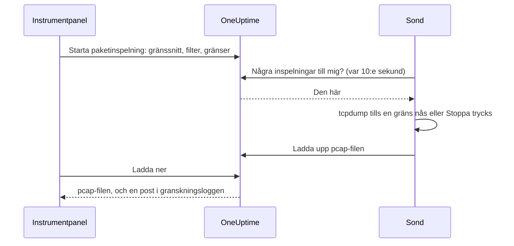

# Paketinspelning

Spela in trafiken som en av dina sonder ser, direkt från instrumentpanelen, och öppna filen i Wireshark. Sonden står redan i nätverket du felsöker: ingen VPN att öppna och ingen hoppvärd att logga in på.

Inspelningar är avstängda på varje sond tills den som driver sonden slår på dem, och de körs bara på projektets egna sonder.

:::cards
- [Så fungerar det](#så-fungerar-det): Från Starta paketinspelning till en fil i Wireshark.
- [Slå på paketinspelning](#slå-på-paketinspelning): Vad den som driver sonden ställer in, för Docker, Docker Compose och Kubernetes.
- [Starta en inspelning](#starta-en-inspelning): Välj ett gränssnitt, avgränsa till det du behöver och ladda ner filen.
- [Referens](#referens): Gränser, filter, behörigheter, granskningsloggen och hur länge filer sparas.
- [Felsökning](#felsökning): Vad meddelandet från en misslyckad inspelning betyder.
:::

## Så fungerar det



1. **Start.** Någon som får starta inspelningar väljer sondens gränssnitt, ett filter och gränserna, och klickar på **Starta inspelning**. OneUptime kontrollerar filtret och gränserna mot det sonden tillåter innan inspelningen sparas.
2. **Hämtning.** Sonden frågar OneUptime efter arbete var tionde sekund, på samma sätt som den frågar efter monitorer. Den tar inspelningen och startar `tcpdump`.
3. **Inspelning.** Inspelningen stoppar vid den första av sina gränser: varaktigheten, paketgränsen eller filstorleken. **Stoppa** avslutar den tidigt och behåller det som redan har spelats in.
4. **Uppladdning.** Sonden laddar upp pcap-filen. OneUptime sparar den som en privat fil i projektet.
5. **Nedladdning.** Inspelningen visar **Slutförd** med en **Ladda ner**-knapp. Filen öppnas i Wireshark, tcpdump eller vilket annat verktyg som helst som läser pcap-filer.

## Innan du börjar

- **En av projektets egna sonder.** Globala sonder bär andra projekts trafik, så de spelar aldrig in. Se [Anpassade probes](/docs/probe/custom-probe) för att installera en egen sond.
- **En sond från den här versionen eller senare.** Äldre sonder rapporterar inte vad de kan spela in på.
- **Rätt behörigheter.** Att starta och stoppa en inspelning kräver **Start Packet Capture**, och att ladda ner en fil kräver **Download Packet Capture**. Projektägare och -administratörer har båda. Se [Behörigheter](#behörigheter).
- **En speglad port, för trafik som inte når sonden.** En sond ser bara trafiken på sin egen värds gränssnitt. För att spela in trafik mellan andra enheter speglar du deras switchport (SPAN) till ett ledigt gränssnitt på sondens värd.

## Slå på paketinspelning

Den som driver sonden slår på inspelningar där sonden körs: instrumentpanelen kan inte, med avsikt. Sonden behöver tre saker:

| Inställning | Varför |
| --- | --- |
| `PROBE_PACKET_CAPTURE_ENABLED=true` | Slår på inspelningar. Alla andra värden, eller inget, låter dem vara avstängda. |
| Värdnätverk | Låter sonden se värdens egna gränssnitt, och en speglad port. Utan det ser sonden bara sin containers nätverk. |
| Capabilityn `NET_RAW` | Låter tcpdump spela in. Docker ger den som standard. Kubernetes Pod Security-standard ”restricted” tar bort den, så lägg till den. |

:::tabs
@tab Docker
```bash
docker run --name oneuptime-probe --network host \
  --cap-add NET_RAW \
  -e PROBE_KEY=<probe-key> \
  -e PROBE_ID=<probe-id> \
  -e ONEUPTIME_URL=https://oneuptime.com \
  -e PROBE_PACKET_CAPTURE_ENABLED=true \
  -d oneuptime/probe:release
```
@tab Docker Compose
```yaml
services:
  oneuptime-probe:
    image: oneuptime/probe:release
    container_name: oneuptime-probe
    network_mode: host
    cap_add:
      - NET_RAW
    environment:
      - PROBE_KEY=<probe-key>
      - PROBE_ID=<probe-id>
      - ONEUPTIME_URL=https://oneuptime.com
      - PROBE_PACKET_CAPTURE_ENABLED=true
    restart: always
```
@tab Kubernetes
```yaml
apiVersion: apps/v1
kind: Deployment
metadata:
  name: oneuptime-probe
spec:
  selector:
    matchLabels:
      app: oneuptime-probe
  template:
    metadata:
      labels:
        app: oneuptime-probe
    spec:
      hostNetwork: true
      dnsPolicy: ClusterFirstWithHostNet
      containers:
        - name: oneuptime-probe
          image: oneuptime/probe:release
          securityContext:
            capabilities:
              add: ["NET_RAW"]
          env:
            - name: PROBE_KEY
              value: "<probe-key>"
            - name: PROBE_ID
              value: "<probe-id>"
            - name: ONEUPTIME_URL
              value: "https://oneuptime.com"
            - name: PROBE_PACKET_CAPTURE_ENABLED
              value: "true"
```
:::

När sonden startar skriver den i sin logg `Packet capture is on: captures of up to 30 minutes and 25 MB can be started on this probe from the dashboard.` Inom en minut erbjuder sondens sida i instrumentpanelen **Starta paketinspelning**.

För att sätta ett lägre tak på den här sonden än det som alla sonder håller sig till lägger du till någon av dessa:

| Variabel | Standard | Vad den gör |
| --- | --- | --- |
| `PROBE_PACKET_CAPTURE_MAX_DURATION_IN_SECONDS` | `1800` | Den längsta inspelning som sonden kör, från 5 till 1800 sekunder. |
| `PROBE_PACKET_CAPTURE_MAX_FILE_SIZE_IN_MB` | `25` | Den största inspelningsfil som sonden skapar, från 1 till 25 MB. |

> [!NOTE]
> Sonderna som följer med en egen OneUptime-installation, via Docker Compose eller Helm-diagrammet, är globala sonder, så de spelar aldrig in. Kör en anpassad sond i nätverket du vill spela in i.

## Starta en inspelning

:::steps
### Öppna sonden eller enheten

Öppna **Monitorer → Inställningar → Sonder** och klicka på din sond: kortet **Paketinspelningar** visar dess inspelningar. Eller öppna en nätverksenhet och gå till sidan **Traffic**: inspelningar där körs på enhetens egen sond och startar filtrerade på enhetens adress.

### Klicka på Starta paketinspelning

Formuläret säger vad en inspelning innehåller innan du startar en: lösenord, token och personuppgifter som skickas över ledningen hamnar i filen.

### Välj gränssnittet

**Alla gränssnitt (any)** spelar in på alla sondens gränssnitt. Välj gränssnittet som en switch speglar trafik till när du spelar in speglad trafik.

### Välj vilka paket

Fyll i **Värd eller nätverk**, **Port** och **Protokoll** för att avgränsa inspelningen, eller lämna dem tomma för att behålla alla paket. Formuläret visar filtret de bildar, till exempel `host 10.0.0.5 and tcp port 443`. Klicka på **Skriv ett BPF-filter i stället** för att skriva ditt eget.

### Kontrollera gränserna

**Fler fält** innehåller **Varaktighet**, **Paketgräns** och **Gräns för filstorlek (MB)**. Sammanfattningen säger när inspelningen stoppar: `Stoppar efter 1 minut, 100 000 paket eller 10 MB, beroende på vad som kommer först.`

### Klicka på Starta inspelning

Inspelningen visar **Väntar** tills sonden hämtar den, sedan **Körs**, med hur långt den har kommit. Klicka på **Stoppa** för att avsluta den tidigt.
:::

När inspelningen visar **Slutförd** klickar du på **Ladda ner** och öppnar `.pcap`-filen i Wireshark. En inspelning på **Alla gränssnitt (any)** är en Linux cooked capture, som Wireshark läser som vilken annan som helst.

## Referens

### Gränser

| Gräns | Standard | Intervall |
| --- | --- | --- |
| Varaktighet | 1 minut | 5 sekunder till 30 minuter |
| Paketgräns | 100 000 | 1 till 1 000 000 |
| Gräns för filstorlek | 10 MB | 1 till 25 MB |

- En inspelning stoppar vid den första gräns den når. En fil som når sin storleksgräns kapas efter det sista hela paketet, så att den alltid går att öppna.
- En sond kör högst 2 inspelningar åt gången.
- En inspelning som sonden inte hämtar inom 5 minuter misslyckas, och säger det.
- Sonden håller varje inspelning till dessa gränser igen, och till sina egna, lägre gränser.

### Filter

Formulärets fält bildar ett [BPF-filter](https://www.tcpdump.org/manpages/pcap-filter.7.html), inspelningsfilterspråket i tcpdump och Wireshark:

| Värd eller nätverk | Port | Protokoll | Filter |
| --- | --- | --- | --- |
| `10.0.0.5` | | Vilket protokoll som helst | `host 10.0.0.5` |
| `10.0.0.0/24` | `443` | TCP | `net 10.0.0.0/24 and tcp port 443` |
| | `5060` | UDP | `udp port 5060` |
| | `8000-8080` | Vilket protokoll som helst | `portrange 8000-8080` |
| `10.0.0.5` | | ICMP | `host 10.0.0.5 and (icmp or icmp6)` |

Ett filter som du skriver själv är en rad på högst 500 tecken, gjord av bokstäver, siffror, mellanslag och `. : / ( ) [ ] ! & | < > = + - * % ^ _`. OneUptime kontrollerar det innan det sparas, och tcpdump kompilerar det på sonden. Sonden ger det till tcpdump som ett argument, aldrig genom ett skal.

### Behörigheter

| Behörighet | Låter någon | Vem har den som standard |
| --- | --- | --- |
| **Start Packet Capture** | Starta inspelningar, och stoppa dem | Project Owner, Project Admin |
| **Download Packet Capture** | Ladda ner inspelningsfiler | Project Owner, Project Admin |
| **Delete Packet Capture** | Ta bort inspelningar och deras filer | Project Owner, Project Admin |
| **Read Packet Capture** | Se inspelningar: när de kördes, på vilken sond och med vilket filter | Project Owner, Project Admin, Project Member, Viewer |

För att ge ett team **Start Packet Capture** eller **Download Packet Capture** öppnar du det under **Inställningar → Team** och lägger till behörigheten på sidan **Behörigheter**. Se [Behörigheter](/docs/permissions/index).

### Granskningslogg och integritet

- Att starta en inspelning registreras i granskningsloggen som en **Create** av **Packet Capture**, och att ta bort en som en **Delete**. Varje nedladdning registreras som en **Download**, med vem som laddade ner vilken inspelning.
- Filen är en privat fil i projektet. Bara knappen **Ladda ner**, med **Download Packet Capture**, lämnar ut den.
- Inspelningar och deras filer tas bort 7 dagar efter att de startar. Att ta bort en inspelning tar bort dess fil direkt.

## Felsökning

:::details ”Paketinspelning är avstängd på den här sonden”
Sonden körs utan `PROBE_PACKET_CAPTURE_ENABLED=true`. Starta om den med inställningarna i [Slå på paketinspelning](#slå-på-paketinspelning).
:::

:::details "The probe is not allowed to capture packets on eth0"
tcpdump kunde inte öppna gränssnittet. Ge sondens container capabilityn `NET_RAW`: `--cap-add NET_RAW` med Docker, `cap_add` med Docker Compose, `securityContext.capabilities.add` med Kubernetes.
:::

:::details "The interface does not exist on the probe"
Gränssnittet har försvunnit sedan sonden senast rapporterade det, eller så körs sonden utan värdnätverk och ser bara sin containers gränssnitt. Kör den med värdnätverk och välj sedan gränssnittet igen.
:::

:::details "tcpdump could not use the filter"
tcpdump kunde inte kompilera filtret. Meddelandet innehåller tcpdumps egna ord, till exempel `syntax error`. Kontrollera filtret mot [pcap-filter-manualen](https://www.tcpdump.org/manpages/pcap-filter.7.html).
:::

:::details "The probe did not pick up this capture within 5 minutes"
Sonden är frånkopplad, eller så stängdes paketinspelning av på den efter att inspelningen startades. Kontrollera sondens **Anslutningsstatus**, och dess logg.
:::

:::details ”Inga paket matchade filtret.”
Inspelningen kördes, och inget på gränssnittet matchade filtret. Kontrollera att trafiken går över det här gränssnittet: trafik mellan andra enheter når bara sonden genom en speglad port.
:::

:::details "This probe is already running 2 packet captures"
En sond kör 2 inspelningar åt gången. Vänta tills en är klar, eller stoppa en, och starta din igen.
:::

## Nästa steg

:::cards
- [Anpassade probes](/docs/probe/custom-probe): Installera en sond i nätverket du vill spela in i.
- [Nätverksenhets-övervakning](/docs/monitor/network-device-monitor): Övervaka enheterna vars trafik du spelar in.
- [Behörigheter](/docs/permissions/index): Ge ett team behörigheterna för paketinspelning.
:::
