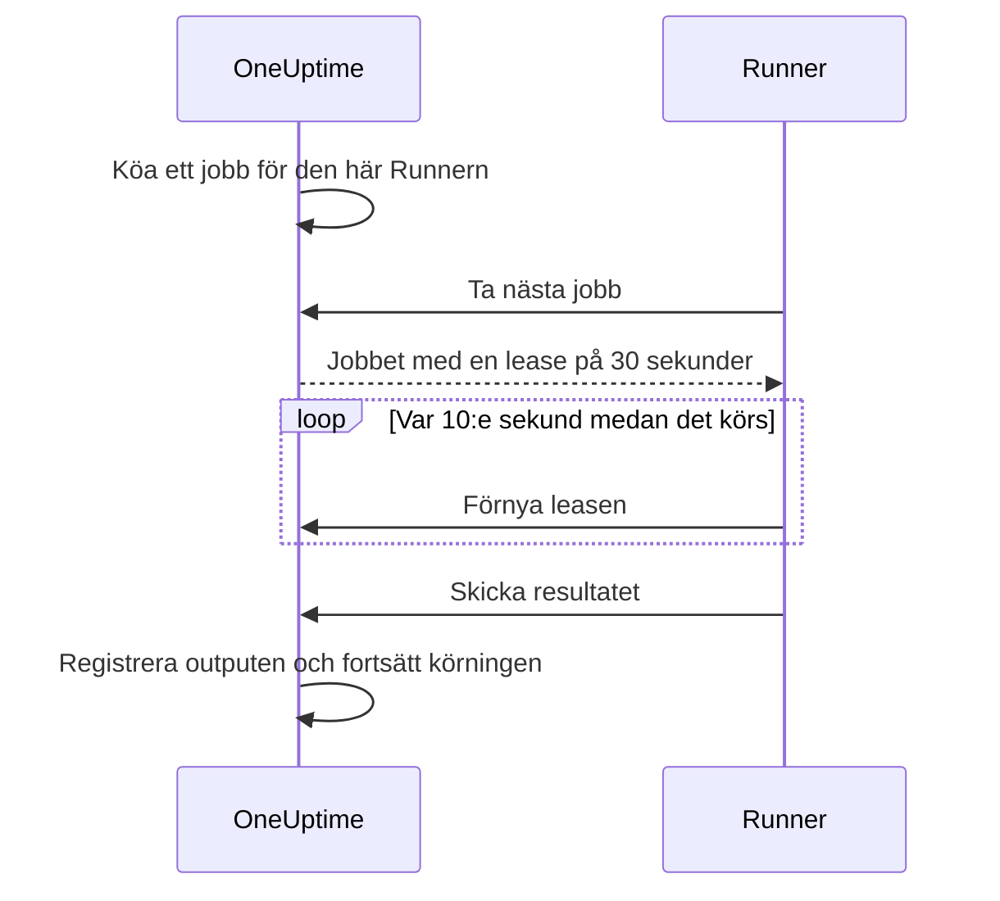

# Runbook-agenter

En **runbook-agent**, som heter **Runner** i instrumentpanelen, är en liten självhostad process som kör JavaScript-, Bash-, SSH- och Kubernetes-stegen i dina runbooks **i din egen infrastruktur**. OneUptime Worker kör aldrig dina skript: den köar dem, och den Runner som stegets författare valde tar varje jobb, kör det och skickar tillbaka resultatet. Den här sidan är till för dem som installerar och driver Runners.

:::cards
- [Installera en Runner](#installera-en-runner): Från instrumentpanelen till en ansluten container i fem steg.
- [Peka ett steg mot en Runner](#peka-ett-steg-mot-en-runner): Bind ett steg till den Runner som ska köra det.
- [Tidsgränser](#tidsgränser): Claim- och körningstidsgränser och hur de samverkar.
- [Miljövariabler](#miljövariabler): Vad containern läser vid start.
:::

## Så fungerar det

```mermaid title="Vad som går över nätverket mellan en Runner och OneUptime"
flowchart TB
    subgraph yours["Din infrastruktur"]
        direction LR
        runner["Runner-container"]
        targets["Värdar, kluster, interna tjänster"]
    end
    subgraph cloud["OneUptime"]
        direction LR
        worker["Workern köar steget"]
        ingest["Runner-API"]
    end
    worker --> ingest
    runner -->|"Utgående HTTPS, Runner-ID och nyckel"| ingest
    ingest -->|"Taget jobb med dess hemligheter eller autentiseringsuppgift"| runner
    runner -->|"Skript, SSH eller Kubernetes-API"| targets
```

1. Du skapar en Runner i OneUptime. OneUptime genererar ett ID och en hemlig nyckel åt den.
2. Du kör Runner-containern på en värd i din infrastruktur med det ID:t, den nyckeln och din OneUptime-URL.
3. Runnern ber OneUptime om arbete var 5:e sekund och rapporterar var 60:e sekund att den lever.
4. När du skriver ett JavaScript-, Bash-, SSH- eller Kubernetes-steg väljer du Runnern i en listruta. Steget binds till den Runnern.
5. När steget körs köar Workern ett jobb med `targetAgentId` satt till den Runnern. Bara den Runnern kan ta det.
6. Runnern kör jobbet lokalt — `bash -c <script>` för Bash, en `isolated-vm`-sandlåda för JavaScript, en SSH-anslutning eller ett anrop till klustrets API-server med stegets autentiseringsuppgift —, registrerar resultatet och skickar tillbaka det. Workern återupptar runbooket med resultatet.

Runnern behöver bara **utgående HTTPS** till din OneUptime-instans. Den tar inte emot några inkommande anslutningar.

En Runner har bara sitt ID och sin nyckel. Allt annat får den med det jobb den tar: ett skript där de [runbook-hemligheter](/docs/runbooks/credentials#hemligheter-för-skript) som är tilldelade den är ifyllda, eller den [autentiseringsuppgift](/docs/runbooks/credentials) som ett SSH- eller Kubernetes-steg pekar på. Därför kan alla som har en Runners nyckel agera som den Runnern: behandla nyckeln som de autentiseringsuppgifter som är tilldelade den.

## Varför skript körs på en Runner

Att köra skript på OneUptime Worker hade två problem:

- **Förtroendegräns.** Alla som kunde skriva ett runbook kunde köra kod på Workern med åtkomst till allt som Workern kunde nå.
- **Räckvidd.** De flesta användbara steg verkar på _din_ infrastruktur ("starta om den här tjänsten", "slå upp en post i vår interna databas"), inte på OneUptimes.

Med Runners körs de stegen på en värd som du styr, och du bestämmer vad den värden får göra. HTTP-begäran- och AI-steg körs fortfarande på Workern, eftersom de inte behöver något från ditt nätverk.

## Innan du börjar

- **En värd med Docker** i din infrastruktur som kan nå din OneUptime-URL över HTTPS och de system som dina steg verkar på.
- **En roll som skapar Runners.** Project Owner, Project Admin, Project Member och Runbook Admin kan skapa en. Bara en Project Owner, Project Admin eller Runbook Admin kan se en Runners nyckel, som installationskommandot innehåller.

## Installera en Runner

### 1. Skapa agentposten

Gå till **Runbooks → Runbook-agenter** och skapa en ny agent. Klicka på **Skapa Runner** och fyll i de två stegen:

| Fält | Steg | Anteckningar |
| --- | --- | --- |
| **Namn** | **Runner** | Ett läsbart namn, vanligtvis var den körs och vad den kan nå, till exempel `prod-eu-west-1`. Det är det här du väljer när du skriver ett steg. |
| **Beskrivning** | **Runner** | Valfritt. En mening om vad den här värden kan nå. |
| **Etiketter** | **Runner** (under **Fler fält**) | Valfritt. |
| **Kör Runbooks** | **Funktioner** | Påslaget som standard. Låter den här Runnern ta runbook-steg. |
| **Kör AI-kodfixar** | **Funktioner** | Avstängt som standard. Låter den öppna pull requests med AI-kodfixar; se [Fix Tasks](/docs/ai/ai-agent). |
| **Kör AI-åtgärdskommandon** | **Funktioner** | Avstängt som standard. Låter automatisk AI-åtgärd köra policykontrollerade kommandon på den. Att slå på det för en Runner som har SSH-autentiseringsuppgifter kräver behörighet att läsa runbook-autentiseringsuppgifter; se [Runners som kör OneUptime AI:s kommandon](/docs/runbooks/credentials#runners-som-kör-oneuptime-ais-kommandon). |

En Runner hämtar en ändring av sina funktioner vid nästa heartbeat; den behöver inte startas om.

### 2. Kopiera installationskommandot

Klicka på **Visa installationsinstruktioner** på Runnerns rad. Dialogen **Konfiguration av Runbook-agent** visar ett `docker run`-kommando som redan innehåller den här Runnerns ID och nyckel. Samma kommando finns på Runnerns egen sida under **Installationsinstruktioner**.

Bara en Project Owner, Project Admin eller Runbook Admin kan läsa nyckeln. Alla andra ser "Du har inte behörighet att visa nyckeln för den här runbook-agenten" i stället för kommandot.

### 3. Kör det på en värd i din infrastruktur

Kör kommandot på en värd i din miljö som kan:

- nå din OneUptime-instans över HTTPS, och
- göra det som dina steg behöver, till exempel nå andra värdar via SSH, anropa ett klusters API-server eller prata med en databas.

```bash
docker run --name oneuptime-runner --restart unless-stopped \
  -e ONEUPTIME_RUNNER_ID=<runner-id> \
  -e ONEUPTIME_RUNNER_KEY=<runner-key> \
  -e ONEUPTIME_URL=https://oneuptime.yourdomain.com \
  -d oneuptime/runner:release
```

### 4. Kontrollera att agenten är ansluten

Gå tillbaka till **Runbooks → Runbook-agenter**. Inom en minut efter att containern har startat bör Runnerns **Status** visa **Ansluten** med en färsk **Senast sedd**. På Runnerns egen sida visar kortet **Status för Runbook-agent** dess **Version av Runbook-agent** och **Värd**. Om den fortsätter att visa **Aldrig ansluten** eller **Frånkopplad**, se [Felsökning](#felsökning).

### 5. Håll agenten uppdaterad

När en agent kör en äldre version än din OneUptime visas en varningssymbol bredvid dess **Version av Runbook-agent** på dess sida. Välj den för att se hur du uppgraderar: hämta den nya imagen, ta bort containern och kör sedan installationskommandot från steg 2 igen. En agent som Kubernetes-agentens chart installerade uppgraderas i stället med chartet.

```bash
docker pull oneuptime/runner:release
docker rm -f oneuptime-runner
```

## Peka ett steg mot en Runner

:::steps
### Lägg till ett steg som körs på en Runner

Lägg till ett JavaScript-, Bash-, SSH- eller Kubernetes-steg i ditt runbooks **Steg**.

### Välj Runnern

Stegets listruta **Runner** visar alla Runners i projektet och om de är anslutna. Om projektet inte har någon än säger steget det och hänvisar dig till **Runbooks › Runners**.

### Spara stegen

Klicka på **Save Steps**. När en körning når steget köar Workern ett jobb till den Runnerns ID, och bara den Runnern kan ta det.
:::

Bash körs med `bash -c`. JavaScript körs i en `isolated-vm`-sandlåda på Runnern utan åtkomst till filsystemet eller processer; det kan anropa publika HTTP-API:er med `axios`, men inte adresser på ett privat nätverk. SSH- och Kubernetes-steg använder den [autentiseringsuppgift](/docs/runbooks/credentials) som steget pekar på, och den måste vara tilldelad samma Runner.

Behöver du mer än en Runner? Skapa dem och peka varje steg mot rätt Runner. För redundans kör du en extra Runner och delar upp stegen mellan dem, eller har ett reserv-runbook vars steg pekar mot den andra Runnern.

## Driftanteckningar

### Tidsgränser

Två tidsgränser gäller för varje steg som körs på en Runner:

| Tidsgräns | Standard | Vad den styr |
| --- | --- | --- |
| **Claim timeout** | 2 minuter | Hur länge Workern väntar på att den valda Runnern tar jobbet. Om Runnern inte tar det i tid misslyckas steget på grund av tidsgräns, och runbooket fortsätter (eller stoppar, beroende på **Fortsätt vid fel**). |
| **Execution timeout** | 30 sekunder | Hur länge Runnern låter steget köra innan den stoppar det. Bash får `SIGKILL`; JavaScripts sandlåda rivs. |

Båda kan ställas in per steg. Öppna **Runbooks › ditt runbook › Steg**, fäll ut steget och ange **Execution timeout** och **Claim timeout** (i sekunder) i dess inställningar. Lämna ett fält tomt för att använda standarden. Var och en accepterar 1 sekund till 1 timme; värden utanför det intervallet begränsas när steget körs.

Workerns sammanlagda väntefönster är `claim timeout + execution timeout + a few seconds`. Välj värden som passar steget.

Två saker att tänka på när du sänker claim timeout:

- Runnern ber om arbete i en pollningscykel (`ONEUPTIME_RUNNER_POLL_INTERVAL_MS`, 5 sekunder som standard). En claim timeout som är kortare än en cykel kan löpa ut innan en helt frisk Runner ens har sett jobbet, och steget misslyckas då med samma meddelande som en Runner som är offline ger.
- En Runner kör ett jobb i taget som standard (`ONEUPTIME_RUNNER_CONCURRENCY`). Medan ett långt steg upptar den väntar andra steg som pekar mot samma Runner ut sina egna claim timeouts. Om du höjer en execution timeout till minuter höjer du claim timeout i motsvarande grad på de steg som delar den Runnern, eller ger dem en annan Runner.

### Lease och heartbeat



När en Runner tar ett jobb får den en kort lease (30 sekunder som standard). Medan steget körs förnyar Runnern leasen var 10:e sekund. Om Runnern dör eller tappar nätverket mitt i ett skript löper leasen ut, och Workern markerar jobbet som `TimedOut` i stället för att vänta för evigt.

Bash-underprocesser avbryts **inte** automatiskt när leasen löper ut (en JavaScript-sandlåda får också köra klart om den någonsin gör det), men Workern slutar vänta på dem, och Runnern kan inte skicka in ett resultat när en annan har tagit över jobbet. Utforma skript så att de säkert kan köras igen om det är viktigt för dig att de körs exakt en gång.

### Om OneUptime Worker startar om mitt i ett steg

En runbook-körning körs på en Worker från början till slut, så en driftsättning eller en krasch kan avbryta den medan ett steg pågår. Vad som händer sedan beror på om körningen tas upp igen:

- **Den återupptas.** Den Worker som tar upp den hittar det jobb som ditt steg redan har skapat och **kopplar på sig det igen**. Den väntar på det jobbet i stället för att skicka en extra kopia av skriptet till din Runner. Om Runnern redan var klar används det registrerade resultatet som det är. Ett steg skickas högst en gång per körning till en Runner.
- **Den återupptas inte.** Om körningen aldrig tas upp igen markerar en städning den som `Failed` när den har passerat claim- och körningsfönstret för sitt aktuella steg, med ett meddelande som nämner steget. En körning blir aldrig hängande i `Running`.

Det enda detta inte kan berätta är hur långt ett skript kom innan Workern försvann. Ett steg som var mitt i körningen rapporteras som misslyckat med en anteckning om att det kanske har körts delvis: kontrollera målsystemet innan du kör runbooket igen.

### Ingen agent online

Om den valda Runnern är offline när steget körs väntar jobbet som `Pending` tills claim timeout har gått, och sedan misslyckas steget med "No runbook agent picked up this step before the wait window expired." Sidan **Runbook-agenter** är där du kontrollerar täckningen innan du kör ett runbook på riktigt.

### Gräns för output

stdout och stderr tillsammans är begränsade till **50 KB** per steg. Längre output klipps av med en markör. Behöver du en fullständig logg skriver du den från skriptet till ditt logglager eller objektlager och visar URL:en med `echo`.

### Avbrytande

Att avbryta en runbook-körning, från körningssidan eller API:et, markerar direkt alla dess jobb i `Pending`, `Claimed` och `Running` som `Cancelled`. En Runner som redan är mitt i ett skript kör klart arbetet, men servern godtar inte resultatet, och inget senare steg i runbooket skickas ut.

### Samtidighet

Varje Runner kör ett jobb i taget som standard. Vill du tillåta fler sätter du `ONEUPTIME_RUNNER_CONCURRENCY` på containern, men tänk på att Runnern delar värden med allt annat som körs där.

## Miljövariabler

Runnern läser dessa vid start:

| Variabel | Krävs | Standard | Anteckningar |
| --- | --- | --- | --- |
| `ONEUPTIME_URL` | ja | — | Bas-URL:en till din OneUptime-instans, till exempel `https://oneuptime.yourdomain.com`. |
| `ONEUPTIME_RUNNER_ID` | ja | — | Runnerns ID från dess installationskommando. |
| `ONEUPTIME_RUNNER_KEY` | ja | — | Runnerns hemliga nyckel från dess installationskommando. |
| `ONEUPTIME_RUNNER_POLL_INTERVAL_MS` | nej | `5000` | Hur ofta Runnern ber om nya jobb. Ett värde under `1000` faller tillbaka till standarden. |
| `ONEUPTIME_RUNNER_HEARTBEAT_INTERVAL_MS` | nej | `60000` | Hur ofta Runnern rapporterar att den lever. Ett värde under `5000` faller tillbaka till standarden. |
| `ONEUPTIME_RUNNER_JOB_HEARTBEAT_INTERVAL_MS` | nej | `10000` | Hur ofta Runnern förnyar leasen för ett jobb som körs. Ett värde under `1000` faller tillbaka till standarden. |
| `ONEUPTIME_RUNNER_CONCURRENCY` | nej | `1` | Högsta antal samtidiga jobb på den här Runnern. |
| `ONEUPTIME_RUNNER_ENABLE_RUNBOOKS` | nej | — | Sätt till `false` för att få den här Runnern att sluta ta runbook-steg, oavsett vad instrumentpanelen säger. Den kan bara stänga av funktionen. |
| `ONEUPTIME_RUNNER_ENABLE_CODE_FIXES` | nej | — | Sätt till `false` för att få den här Runnern att sluta ta AI-kodfixar, oavsett vad instrumentpanelen säger. |
| `ONEUPTIME_RUNNER_ENABLE_AI_COMMANDS` | nej | — | Sätt till `false` för att få den här Runnern att sluta köra AI-åtgärdskommandon, oavsett vad instrumentpanelen säger. |

## Byta en agentnyckel

Om en nyckel läcker återställer du den. Den gamla nyckeln slutar fungera direkt.

:::steps
### Återställ nyckeln

Öppna Runnern från **Runbooks → Runbook-agenter**, klicka på **Återställ Runbook-agentnyckel** och bekräfta. Runnern slutar ansluta tills den har den nya nyckeln.

### Kör containern med den nya nyckeln

Kopiera det nya kommandot från Runnerns **Installationsinstruktioner**, ta bort den gamla containern och kör det nya kommandot på samma värd:

```bash
docker rm -f oneuptime-runner
```

### Kontrollera att den ansluter igen

Under **Runbooks → Runbook-agenter** går Runnerns **Status** tillbaka till **Ansluten** inom en minut.
:::

## Behörigheter

Hantering av agenter ligger i den befintliga behörighetsgruppen Runbooks:

- `CreateRunner`, `EditRunner`, `DeleteRunner`, `ReadRunner` — hantera agentposter.
- `RunbookAdmin`, `RunbookMember`, `RunbookViewer` (roller) — `RunbookAdmin` bygger runbooks, deras regler och de Runners de körs på, och kör dem. `RunbookMember` öppnar runbooks och deras körningar och kör dem — startar en körning, slutför eller hoppar över dess steg och avbryter den — men skapar, ändrar och tar inte bort något runbook eller någon Runner. `RunbookViewer` läser runbooks och deras körningar och kör ingenting. `RunbookAdmin` samlar alla detaljerade behörigheter ovan.

Att utlösa ett runbook (och därmed skicka dess steg till Runners) kräver en roll som kör runbooks — `ProjectOwner`, `ProjectAdmin`, `ProjectMember`, `RunbookAdmin` eller `RunbookMember` — eller `CreateRunbookExecution`; att slutföra, hoppa över eller avbryta en körning godtar också `EditRunbookExecution`. En roll kör bara de runbooks som dess omfång når.

En Runners nyckel kan bara läsas av Project Owners, Project Admins och Runbook Admins.

## API för agenter

För den nyfikne: Runnern använder dessa slutpunkter, monterade under `/runner-ingest`. Sökvägen från före sammanslagningen, `/runbook-agent-ingest`, betjänas fortfarande för agenter som ännu inte har driftsatts om, så att en serveruppgradering inte förstör dem. De autentiseras med Runnerns ID och nyckel i JSON-bodyn (`agentId` och `agentKey`) eller i headrarna `x-agent-id` och `x-agent-key`.

| Slutpunkt | Syfte |
| --- | --- |
| `POST /heartbeat` | Livstecken. Uppdaterar Runnerns senast sedd-tid, version och värdinformation och returnerar de funktioner som projektet har gett den. |
| `POST /claim-next-job` | Ta atomiskt det äldsta jobbet i `Pending` som riktas mot den här Runnerns ID. Returnerar `{ job: null }` när det inte finns något att göra. |
| `POST /job/:jobId/heartbeat` | Förnya jobbets lease. Returnerar 404 när leasen har löpt ut eller jobbet är avslutat. |
| `POST /job/:jobId/result` | Skicka in det slutliga resultatet. Ignoreras om leasen redan har gått vidare. |
| `POST /disconnect` | Logga ut vid en ordnad avstängning. |

Du ska inte behöva anropa dem manuellt: den medföljande Runnern gör det. De dokumenteras här så att du kan bygga en egen agent om du har en begränsning som vår inte passar.

## Felsökning

:::details Runnern fortsätter att visa Aldrig ansluten eller Frånkopplad
- Kontrollera containerns loggar med `docker logs oneuptime-runner` efter autentiserings- eller nätverksfel.
- Kontrollera att värden kan nå din OneUptime-URL, till exempel med `curl`.
- Kontrollera att ID och nyckel är kopierade utan blanksteg och att `ONEUPTIME_URL` är den adress du öppnar OneUptime på.

**Aldrig ansluten** betyder att Runnern aldrig har rapporterat in. **Frånkopplad** betyder att den har gjort det, men inte de senaste 5 minuterna.
:::

:::details Steg misslyckas med "No runbook agent picked up this step before the wait window expired."
Stegets Runner tog inte jobbet inom sin claim timeout. Kontrollera att Runnern är **Ansluten**, att **Kör Runbooks** är påslaget för den och att den inte är upptagen av ett långt steg: den kör ett jobb i taget om du inte höjer `ONEUPTIME_RUNNER_CONCURRENCY`. En claim timeout som är kortare än pollningsintervallet misslyckas på samma sätt.
:::

:::details Steg misslyckas med "The runbook agent stopped responding while this step was running."
Runnern tog jobbet och slutade sedan förnya sin lease: den kraschade, startade om eller tappade nätverket. Kontrollera att den är online och kontrollera sedan målsystemet innan du kör runbooket igen.
:::

:::details Runnern loggar "No capability is enabled"
Alla funktioner är avstängda för den här Runnern. Slå på **Kör Runbooks** på Runnerns sida i OneUptime. Den hämtar ändringen vid nästa heartbeat.
:::

## Nästa steg

:::cards
- [Skriva ett runbook](/docs/runbooks/authoring): Skriv de steg som körs på din Runner.
- [Runbook-autentiseringsuppgifter](/docs/runbooks/credentials): Ge SSH- och Kubernetes-steg hanterad åtkomst.
- [Runbook-konfiguration & säkerhet](/docs/runbooks/configuration): Gränser, behörigheter och härdning.
:::
