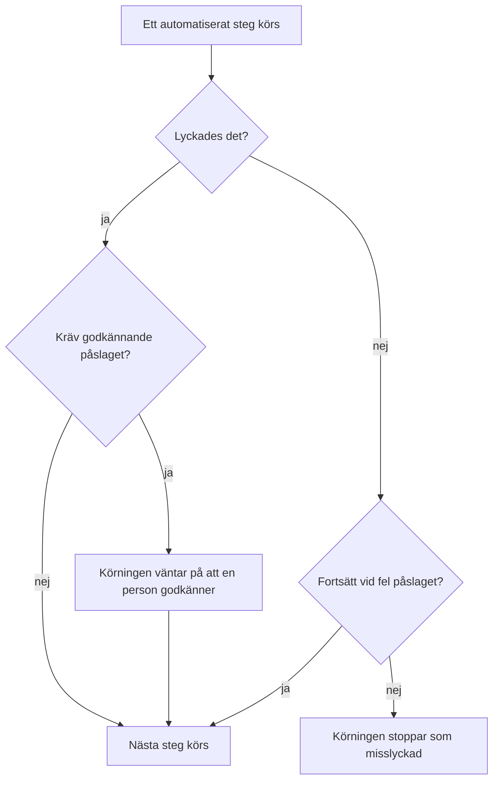

# Skriva ett runbook

Du skriver ett runbook som en ordnad lista med steg på dess sida **Steg**. Den här sidan visar hur du skapar ett runbook, hur du konfigurerar var och en av de sju stegtyperna och hur fel och godkännanden ändrar en körnings förlopp.

:::cards
- [Skapa ett runbook](#skapa-ett-runbook): Från ett tomt runbook till sparade steg.
- [Stegtyper](#stegtyper): Manual, JavaScript, HTTP request, Bash, SSH, Kubernetes och AI.
- [Felhantering och godkännanden](#felhantering-och-godkännanden): Vad som händer när ett steg misslyckas eller lyckas.
- [Ett genomgånget exempel](#ett-genomgånget-exempel): En databas-failover i fem steg.
:::

## Innan du börjar

- **En roll som skriver runbooks.** Project Owner, Project Admin och Runbook Admin skapar runbooks och sparar deras steg. Med detaljerade behörigheter behöver du **Create Runbook** och **Edit Runbook**. Se [Behörigheter](/docs/runbooks/configuration#behörigheter).
- **En Runner, för JavaScript-, Bash-, SSH- och Kubernetes-steg.** De här stegen körs på en [Runner](/docs/runbooks/agents) i din egen infrastruktur, aldrig på OneUptime Worker. Installera en först.
- **En autentiseringsuppgift, för SSH- och Kubernetes-steg, och behörighet att läsa den.** Se [Runbook-autentiseringsuppgifter](/docs/runbooks/credentials). Ett steg kan bara peka på en autentiseringsuppgift om du får läsa runbook-autentiseringsuppgifter: Project Owner, Project Admin eller **Read Runbook Credential**. Runbook Admin omfattar inte det.
- **En LLM-leverantör, för AI-steg.** Se [LLM-leverantörer](/docs/ai/llm-provider).

## Skapa ett runbook

:::steps
### Öppna Runbooks

Öppna **Produkter → Runbooks**. Runbooks finns i gruppen **Instrumentpaneler och automatisering**.

### Skapa runbooket

Klicka på **Skapa Runbook**, ange ett **Namn** och eventuellt en **Beskrivning** av vad runbooket är till för. Under **Fler fält** finns brytaren **Aktiverad**, som är påslagen som standard, och **Etiketter**. Det nya runbooket visas i listan: öppna det.

### Lägg till steg

Gå till **Steg**. Under **Start your runbook** väljer du typen för det första steget; under det sista steget erbjuder **Add another step** samma sju typer. Varje steg öppnas med sin **Titel**, sin **Beskrivning** (Markdown, visas för den som hanterar incidenten) och inställningarna för sin typ. När runbooket har ett steg lägger **Lägg till steg** högst upp på kortet till ett Manual-steg.

### Ordna stegen

Steg körs **i ordning**. Du ändrar ordningen genom att dra ett steg i handtaget till vänster i dess rubrik; med tangentbordet sätter du fokus på handtaget, trycker på blanksteg, flyttar steget med piltangenterna och trycker på blanksteg igen.

### Spara stegen

Klicka på **Save Steps**. Tills du gör det visar redigeraren **Osparade ändringar**. När de är sparade ser du **Sparad**, och runbooket är redo att [köras](/docs/runbooks/running).
:::

## Hur ett steg är uppbyggt

Varje steg har de här fälten:

| Fält | Syfte |
| --- | --- |
| **Titel** | En kort etikett som visas i steglistan och vid varje körning. |
| **Beskrivning** | Valfri kontext för den som hanterar incidenten, i Markdown. På ett Manual-steg är det den instruktion personen läser. |
| **Fortsätt vid fel** | Bara automatiserade steg. När den är påslagen stoppar ett steg som misslyckas inte körningen: nästa steg körs ändå. |
| **Kräv godkännande** | Bara automatiserade steg. När den är påslagen pausar runbooket efter det här steget och väntar på att en person godkänner innan nästa steg körs. Brytaren heter **Kräv godkännande innan nästa steg körs**. |
| Typspecifika inställningar | Skriptet, URL:en, Runnern, autentiseringsuppgiften eller prompten. Se [Stegtyper](#stegtyper). |

## Stegtyper

| Typ | Körs på | Kräver |
| --- | --- | --- |
| [Manual](#manual) | En person | Ingenting |
| [JavaScript](#javascript) | En Runner | En Runner |
| [HTTP request](#http-request) | OneUptime Worker | Ingenting |
| [Bash](#bash) | En Runner | En Runner |
| [SSH](#ssh) | En Runner | En Runner och en SSH-autentiseringsuppgift |
| [Kubernetes](#kubernetes) | En Runner | En Runner och en Kubernetes-autentiseringsuppgift |
| [AI](#ai) | OneUptime Worker | En LLM-leverantör |

### Manual

En checklistepunkt för en person. Körningen pausar när den når ett Manual-steg och stannar i `WaitingForManualStep` (**Väntar på dig**) tills någon klickar på **Mark complete** eller **Hoppa över**. En körning som väntar på en person löper aldrig ut.

Använd det för det som bara en människa kan kontrollera eller göra: "Bekräfta i lastbalanserarens instrumentpanel att trafiken har flyttats till den sekundära regionen."

### JavaScript

Ett stycke JavaScript som körs i en `isolated-vm`-sandlåda på en [runbook-agent](/docs/runbooks/agents) i din egen infrastruktur, inte på OneUptime Worker.

| Fält | Vad det gör | Standard |
| --- | --- | --- |
| **Runner** | Den Runner som kör steget. Bara den Runnern får ta jobbet. | — |
| **Script** | Den JavaScript-kod som ska köras. Returnera ett värde med `return` för att registrera det; varje rad från `console.log` registreras också. Ett kastat fel får steget att misslyckas. | — |
| **Execution timeout** | Hur länge Runnern låter koden köra innan den river sandlådan. | 30 sekunder |
| **Claim timeout** | Hur länge Workern väntar på att Runnern tar jobbet. | 2 minuter |

```javascript
const start = Date.now();
// ... your logic ...
console.log("replica lag checked");
return { durationMs: Date.now() - start };
```

Sandlådan har 128 MB minne och ingen åtkomst till filsystemet eller processer. Den kan göra HTTP-begäranden med `axios`, men bara till publika adresser: en begäran till ett privat nätverk, till Runnerns egen värd eller till en metadataslutpunkt i molnet avvisas. Använd ett [Bash](#bash)-steg med `curl` för att nå en tjänst i ditt nätverk.

### HTTP request

Ett utgående HTTP-anrop som görs av OneUptime Worker. Ingen Runner behövs.

| Fält | Vad det gör | Standard |
| --- | --- | --- |
| **Method** | `GET`, `POST`, `PUT`, `PATCH`, `DELETE` eller `HEAD`. | `GET` |
| **URL** | Slutpunkten som ska anropas. | Tom |
| **Headers (JSON)** | Ett JSON-objekt, till exempel `{ "Authorization": "Bearer ..." }`. Headers som inte är giltig JSON får steget att misslyckas. | Inga |
| **Body** | Skickas som JSON när den kan tolkas som JSON, annars som text. | Ingen |
| **Request timeout** | Hur länge det väntas på slutpunktens svar innan steget misslyckas. | 30 sekunder |

Steget lyckas vid ett `2xx`- eller `3xx`-svar och misslyckas vid allt annat, med `HTTP <status>` som fel. Omdirigeringar följs inte. Svarets status, headers och body registreras, upp till 50 KB.

> [!NOTE]
> Workern anropar aldrig loopback- eller link-local-adresser, till exempel en metadataslutpunkt i molnet. På OneUptime Cloud anropar den bara publika adresser. En självhostad OneUptime når även privata nätverk, om inte `DATA_SOURCE_BLOCK_PRIVATE_ADDRESSES` är `true`. Använd ett [Bash](#bash)-steg med `curl` för att anropa en tjänst i ditt nätverk från OneUptime Cloud.

Användbart för: att öppna en PagerDuty-incident, posta till en Slack-webhook, anropa din molnleverantörs API eller ditt eget publika API.

### Bash

Ett bash-skript som körs med `bash -c <script>` på en [runbook-agent](/docs/runbooks/agents) i din egen infrastruktur. Bash körs aldrig på OneUptime Worker.

| Fält | Vad det gör | Standard |
| --- | --- | --- |
| **Runner** | Den Runner som kör steget. Bara den Runnern får ta jobbet. | — |
| **Bash-skript** | Skriptet. Output (stdout och stderr) registreras upp till 50 KB, och en slutkod som inte är noll får steget att misslyckas. | — |
| **Execution timeout** | Hur länge Runnern låter skriptet köra innan den dödar det med `SIGKILL`. Höj den för steg som av goda skäl tar minuter. | 30 sekunder |
| **Claim timeout** | Hur länge Workern väntar på att Runnern tar jobbet. | 2 minuter |

Skriptet körs i Runnerns container med de verktyg som dess image levereras med, som `curl`, `wget` och `ssh`-klienten, och med nätverksåtkomsten från den värd det körs på. Till exempel för att kontrollera en tjänst som bara ditt nätverk kan nå:

```bash
set -euo pipefail
HTTP_CODE=$(curl -s -o /tmp/resp.txt -w "%{http_code}" "http://payments.internal:8080/health")
echo "HTTP $HTTP_CODE"
cat /tmp/resp.txt
if [[ "$HTTP_CODE" != "200" ]]; then
  echo "Health check failed"
  exit 1
fi
```

Om den valda Runnern är offline när körningen når det här steget väntar steget upp till **claim timeout** (2 minuter som standard) och misslyckas sedan på grund av tidsgräns. Lägg till en agent under **Runbooks → Runbook-agenter** innan du räknar med ett Bash-steg.

> [!TIP]
> Håll lösenord och tokens utanför skriptet. Spara dem som runbook-hemligheter och skriv `{{runbookSecrets.NAME}}` i ett Bash- eller JavaScript-skript: Runnern tar emot skriptet med värdet ifyllt. Se [Hemligheter för skript](/docs/runbooks/credentials#hemligheter-för-skript).

### SSH

Kör ett kommando på en värd som Runnern kan nå via SSH. Till skillnad från `ssh host cmd` i ett Bash-steg är åtkomsten en hanterad [autentiseringsuppgift](/docs/runbooks/credentials) i stället för en privat nyckel på Runnerns disk: krypterad i vila, tilldelad vissa Runners och aldrig läsbar igen via API:et.

| Fält | Vad det gör |
| --- | --- |
| **Runner** | Den Runner som öppnar anslutningen. Den måste kunna nå värden över nätverket. |
| **Credential** | En SSH-autentiseringsuppgift med värd, port, användare och nyckel eller lösenord. Den måste vara tilldelad den Runner du valde, annars misslyckas steget i stället för att köras med fel åtkomst. |
| **Command** | Körs på fjärrvärden som autentiseringsuppgiftens användare. Output registreras upp till 50 KB, och en slutkod som inte är noll får steget att misslyckas. |
| **Execution timeout** | Täcker anslutning, autentisering och körning av kommandot tillsammans, så att ett kommando som hänger sig inte kan hålla steget öppet. Standard 30 sekunder. |
| **Claim timeout** | Hur länge Workern väntar på att Runnern tar jobbet. Standard 2 minuter. |

### Kubernetes

Starta om eller skala en arbetsbelastning i ett kluster. Åtgärderna är avsiktligt en sluten uppsättning: ett steg som kunde ändra godtyckliga objekt vore ett administratörsskal för klustret, och den här stegtypen finns för att göra de vanliga åtgärderna säkra nog för automatisk åtgärd.

| Fält | Vad det gör |
| --- | --- |
| **Runner** | Den Runner som anropar klustrets API-server. Den måste kunna nå den. |
| **Credential** | En Kubernetes-autentiseringsuppgift: API-serverns URL, en serviceaccount-token och klustrets CA. Bind den serviceaccounten till en roll som bara tillåter det dina runbooks behöver. |
| **Åtgärd** | **Restart workload** ändrar podmallen så att kontrollern återskapar poddarna, som `kubectl rollout restart` gör. **Scale workload** anger antalet repliker. |
| **Workload kind** | **Distribution**, **StatefulSet** eller **DaemonSet**. |
| **Namnrymd** och **Workload name** | Den arbetsbelastning som åtgärden gäller. |
| **Repliker** | Bara vid skalning. Noll är tillåtet: att tömma en arbetsbelastning är en legitim åtgärd. Ett DaemonSet kör en pod per nod och kan inte skalas; starta om det i stället. |
| **Execution timeout** | Hur länge Runnern väntar på att API-servern godtar ändringen. Standard 30 sekunder. |
| **Claim timeout** | Hur länge Workern väntar på att Runnern tar jobbet. Standard 2 minuter. |

Om API-servern avvisar ändringen visas dess eget meddelande på steget, så ett behörighetsfel talar om vilken rollbindning du behöver utöka.

### AI

Be AI att analysera, sammanfatta eller besluta något mitt i körningen. Svaret blir stegets output på körningen. AI-steg körs på OneUptime Worker; ingen Runner behövs.

| Fält | Vad det gör |
| --- | --- |
| **Prompt** | Vad AI:n ska göra. Till exempel: "Gå igenom outputen från de föregående stegen och säg om det är säkert att fortsätta med åtgärden." |
| **LLM provider** | Valfritt. **Project default** använder projektets standardleverantör. Lås en leverantör när steget behöver en viss modell, till exempel en självhostad modell för data som inte får lämna ditt nätverk. Se [LLM-leverantörer](/docs/ai/llm-provider). |
| **Include previous step context** | När den är påslagen ser AI:n allt om de steg som kördes före det här: titel, typ, status, output och felmeddelanden. Den får upp till 4 000 tecken av varje stegs output. |
| **Include trigger context** | När den är påslagen ser AI:n vad som startade körningen: den kopplade incidenten, larmet eller den schemalagda underhållshändelsen (beskrivning, allvarlighetsgrad, aktuellt tillstånd, berörda monitorer, grundorsak, tillståndstidslinje och publika anteckningar), eller vem som körde runbooket manuellt. |

Kombinera ett AI-steg med **Kräv godkännande** för att hålla en människa i loopen: AI:n analyserar, en person läser svaret och godkänner, och först därefter körs nästa (åtgärdande) steg.

**Vad AI:n aldrig ser.** Svaret från ett AI-steg sparas som stegoutput på körningen, och körningar kan läsas av alla med läsbehörighet för runbooks, en bredare publik än incidentens. Därför utelämnar utlösarkontexten **privata interna anteckningar** och **kanalmeddelanden från Slack och Microsoft Teams**. Outputen från tidigare steg genomsöks efter hemligheter (tokens, nycklar, autentiseringsuppgifter), som maskeras innan den skickas till modellen. Inbäddade bilder och långa kodade data, till exempel en skärmbild som klistrats in i en incidents beskrivning, utelämnas också, med en kort notering i stället.

AI-steg mäts och faktureras som alla andra AI-funktioner. Steget misslyckas med ett meddelande som säger varför när det saknar prompt, när AI-funktioner är avstängda för projektet, när ingen LLM-leverantör är tillgänglig eller när den låsta leverantören inte längre är tillgänglig för projektet. Slå på **Fortsätt vid fel** om resten av runbooket ändå ska köras.

## Felhantering och godkännanden



Som standard stoppar ett steg som misslyckas körningen och markerar den som `Failed`, med stegets fel som orsak. Med **Fortsätt vid fel** påslaget registreras felet och nästa steg körs, vilket passar runbooks av typen "prova de här tre sakerna och meddela sedan". **Kräv godkännande** gäller efter att ett steg har lyckats: körningen väntar på det steget tills någon klickar på **Approve & continue** eller **Hoppa över**.

## Spara och redigera

Ändringar av stegen träder i kraft när du klickar på **Save Steps**. Varje körning arbetar utifrån den ögonblicksbild som togs när den startade, så pågående körningar behåller de steg de startade med, och redigering skriver aldrig om historiken för tidigare körningar.

## Ett genomgånget exempel

Ett runbook för "DB primary unreachable":

| # | Typ | Vad det gör |
| --- | --- | --- |
| 1 | JavaScript | Hämta den aktuella primära värden från din konfigurationstjänst och logga den. |
| 2 | Manual | "Bekräfta att replikeringsfördröjningen på den sekundära är under 5 sekunder." |
| 3 | HTTP request | `POST` till din failover-orkestrerares API. |
| 4 | Manual | "Kontrollera att skrivningar nu går till den nya primära." |
| 5 | HTTP request | `POST` ett klartecken till en Slack-webhook. |

Den som hanterar incidenten ser steg 1 köras, bockar av steg 2, ser steg 3 köras, bockar av steg 4, och körningen avslutas med steg 5. Varje stegs output registreras för postmortem.

## Nästa steg

:::cards
- [Köra ett runbook](/docs/runbooks/running): Starta en körning och slutför, godkänn eller hoppa över dess steg.
- [Runbook-regler](/docs/runbooks/rules): Starta det här runbooket automatiskt vid matchande incidenter.
- [Runbook-agenter](/docs/runbooks/agents): Installera den Runner som dina skriptsteg behöver.
- [Runbook-autentiseringsuppgifter](/docs/runbooks/credentials): Ge SSH- och Kubernetes-steg hanterad åtkomst.
:::
