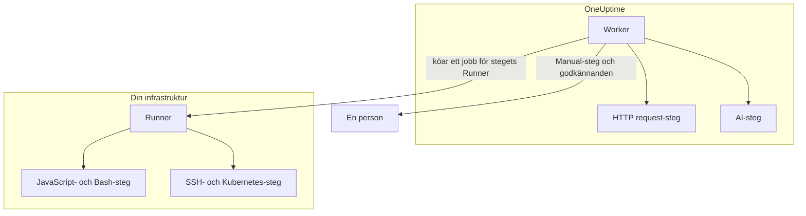

# Runbook-konfiguration & säkerhet

Det här är referensen för driftansvariga och säkerhetsgranskare: var varje sorts steg körs, vilka gränser och tidsgränser ett steg hålls till, vem som får göra vad och hur runbooks är härdade.

:::cards
- [Var varje stegtyp körs](#var-varje-stegtyp-körs): Workern, en Runner eller en person.
- [Gränser för output och tidsgränser](#gränser-för-output-och-tidsgränser): Varje gräns som ett steg hålls till.
- [Behörigheter](#behörigheter): Detaljerade behörigheter, de tre runbook-rollerna och vilka runbooks en roll når.
- [Härdningsanteckningar](#härdningsanteckningar): Sandlåda, nätverksåtkomst och autentisering av Runners.
:::

## Var varje stegtyp körs

| Stegtyp | Körs på | Hur |
| --- | --- | --- |
| Manual | En person | Körningen väntar tills någon slutför eller hoppar över steget. |
| JavaScript | En Runner | I en `isolated-vm`-sandlåda. |
| HTTP request | OneUptime Worker | Ett utgående HTTP-anrop. |
| Bash | En Runner | `bash -c <script>`. |
| SSH | En Runner | En SSH-anslutning med en [autentiseringsuppgift](/docs/runbooks/credentials). |
| Kubernetes | En Runner | Ett anrop till klustrets API-server med en autentiseringsuppgift. |
| AI | OneUptime Worker | Ett anrop till projektets LLM-leverantör. |

## Så skickas Runner-steg ut

JavaScript-, Bash-, SSH- och Kubernetes-steg **körs aldrig på OneUptime Worker**. De skickas som jobb till en viss [runbook-agent](/docs/runbooks/agents): en liten process som du installerar på en värd i din egen infrastruktur.

Utskicksmodellen:

1. Den som skriver runbook-steget väljer en Runner i listrutan.
2. När steget körs infogar Workern en rad i `RunnerJob` med `targetAgentId` satt till den Runnerns ID och statusen `Pending`.
3. Just den Runnern (och bara den) tar jobbet atomiskt, kör det lokalt — Bash via `bash -c <script>`, JavaScript i en `isolated-vm`-sandlåda, SSH och Kubernetes med stegets autentiseringsuppgift — och skickar tillbaka resultatet.
4. Workern fortsätter runbooket med resultatet.

Det finns inte längre någon miljöflagga `RUNBOOK_BASH_ENABLED`. Om de här stegen fungerar i en installation beror helt på om projektet har en ansluten Runner med **Kör Runbooks** påslaget.

## Gränser för output och tidsgränser

| Gräns | Värde | Gäller för |
| --- | --- | --- |
| Output per steg | **50 KB**. Längre output klipps av med en markör. | Varje automatiserat steg |
| Körningstidsgräns | **30 sekunder** som standard | JavaScript-, Bash-, SSH- och Kubernetes-steg |
| Tidsgräns för begäran | **30 sekunder** som standard | HTTP request-steg |
| Tidsgräns för övertagande | **2 minuter** som standard: hur länge Workern väntar på att den valda Runnern tar jobbet innan det misslyckas | JavaScript-, Bash-, SSH- och Kubernetes-steg |
| Intervall för tidsgränser | **1 sekund till 1 timme** | Varje tidsgräns |
| Väntan på en person | Ingen gräns | Manual-steg och godkännanden |

Ange tidsgränserna per steg på runbookets sida **Steg**; lämna ett fält tomt för att behålla standarden. Ett värde utanför intervallet begränsas när steget körs, så att en felskriven konfiguration varken kan stänga av tidsgränsen eller hålla en Worker-plats upptagen i all oändlighet.

## Behörigheter

Runbook-behörigheter finns i behörighetsgruppen `Runbook`:

- `CreateRunbook`, `EditRunbook`, `DeleteRunbook`, `ReadRunbook` — hantera runbook-mallar.
- `CreateRunbookExecution`, `EditRunbookExecution`, `DeleteRunbookExecution`, `ReadRunbookExecution` — starta, bocka av, ta bort och läsa körningar.
- `CreateRunbookRule`, `EditRunbookRule`, `DeleteRunbookRule`, `ReadRunbookRule` — hantera regler för automatisk start.
- `CreateRunner`, `EditRunner`, `DeleteRunner`, `ReadRunner` — hantera Runners som kör steg i din egen infrastruktur. (De hette `*RunbookAgent` före namnbytet till Runner; befintliga tilldelningar har migrerats, så inget behöver tilldelas på nytt.)
- `RunbookAdmin`, `RunbookMember`, `RunbookViewer` (roller) — `RunbookAdmin` bygger runbooks, deras regler och de Runners de körs på, och kör dem. `RunbookMember` öppnar runbooks och deras körningar och kör dem — startar en körning, slutför eller hoppar över dess steg och avbryter den — men skapar, ändrar och tar inte bort något runbook eller någon Runner. `RunbookViewer` läser runbooks och deras körningar och kör ingenting. `RunbookAdmin` samlar alla detaljerade behörigheter ovan.

En roll kör de runbooks som dess omfång når. En tilldelning av `RunbookMember`, `RunbookAdmin` eller `ProjectMember` som är begränsad till vissa etiketter startar och för vidare körningar av de runbooks som har de etiketterna, en som är begränsad till **Owned** körningar av de runbooks som dess team äger, och ett teams blockering av en etikett tar de runbooks ifrån det. `CreateRunbookExecution` och `EditRunbookExecution` gäller körningar, som inte har några etiketter, så de når alla runbooks i projektet. Att godkänna ett åtgärdsförslag som startar ett runbook kontrolleras på samma sätt.

Autentiseringsuppgifter och hemligheter ligger utanför `RunbookAdmin`. Att hantera dem kräver `ProjectOwner` eller `ProjectAdmin` eller behörigheterna `CreateRunbookCredential`, `EditRunbookCredential`, `DeleteRunbookCredential`, `ReadRunbookCredential` och `CreateRunbookSecret`, `EditRunbookSecret`, `DeleteRunbookSecret`, `ReadRunbookSecret`. Se [Runbook-autentiseringsuppgifter](/docs/runbooks/credentials).

Ägarreglerna och etikettreglerna under **Runbooks → Inställningar** ligger också utanför `RunbookAdmin`. Att hantera dem kräver `ProjectOwner` eller `ProjectAdmin` eller behörigheterna `CreateRunbookOwnerRule` och `CreateRunbookLabelRule` och deras motsvarigheter för redigering, borttagning och läsning.

Hur roller och detaljerade behörigheter samverkar beskrivs under [Användare, team och behörigheter](/docs/permissions/index).

## Kö och worker

Runbook-körningar körs i BullMQ-kön `Runbook`. Varje Worker-process kör upp till 25 körningar samtidigt; antalet är fast i koden och anges inte med en miljövariabel.

När ett manuellt steg bockas av via API:et köas körningen igen för att fortsätta från nästa steg. Den väntar som `Scheduled` tills en Worker tar den igen, och en köad körning misslyckas aldrig för att den väntar.

## Härdningsanteckningar

- **JavaScript, Bash, SSH och Kubernetes** körs på en Runner-värd som du styr, inte på OneUptime Worker. JavaScript körs i ett eget `isolated-vm`-isolat med 128 MB minne och utan åtkomst till Runnerns filsystem eller processer; det kan göra HTTP-begäranden med `axios`, men begäranden till privata nätverk, loopback- och link-local-adresser avvisas. Bash körs via `bash -c`, med en tidsgräns som upprätthålls på Runnern.
- **HTTP-steg** använder en tillåtande statusvalidering, så att ett 4xx- eller 5xx-svar registreras som ett misslyckat steg i stället för att kastas som ett undantag, och den registrerade outputen visar vad motparten faktiskt returnerade. Omdirigeringar följs inte. Workern anropar aldrig loopback- eller link-local-adresser, till exempel en metadataslutpunkt i molnet; på OneUptime Cloud avvisar den även privata nätverksadresser, och en självhostad OneUptime avvisar dem med `DATA_SOURCE_BLOCK_PRIVATE_ADDRESSES=true`.
- **AI-steg** ser aldrig privata incidentanteckningar eller meddelanden från Slack och Microsoft Teams, och tidigare stegs output genomsöks efter hemligheter, som maskeras innan den når modellen. Inbäddade bilder och långa kodade data utelämnas från prompten. Se [AI](/docs/runbooks/authoring#ai).
- **Autentisering av Runners** sker med ID och hemlig nyckel, som anges som miljövariabler på Runner-containern. På servern kommer Runnerns gällande identitet från den databasrad som hör till det uppvisade ID:t och nyckeln: en klient kan inte utge sig för att vara en annan Runner, inte ens med en komprometterad nyckel.
- **Autentiseringsuppgifter och hemligheter** är krypterade i vila, returneras aldrig av API:et och lämnas bara ut till de Runners de är tilldelade, när dessa tar ett steg.

## Databastabeller

| Tabell | Vad den innehåller |
| --- | --- |
| `Runbook` | Mallen: namn, slug, beskrivning, `isEnabled`, etiketter och stegen som JSON. |
| `RunbookExecution` | En rad per körning, med de valfria främmande nycklarna `incidentId`, `alertId` och `scheduledMaintenanceId` och en JSON-array `stepExecutions` som fryser stegen och varje stegs tillstånd. |
| `RunbookRule` | Regler för automatisk start, med en diskriminator `triggerEntityType` (Incident, Alert, ScheduledMaintenance), en många-till-många-relation till de runbooks som ska startas, och det de matchar på: en JSON-kolumn `criteria` (villkoren) plus många-till-många-länkar till monitorer, incidentallvarlighetsgrader, larmallvarlighetsgrader, etiketter och monitoretiketter samt mönster för titel, beskrivning, monitornamn och monitorbeskrivning. |
| `Runner` | En rad per installerad Runner: namn, hemlig nyckel, `lastAlive`, `connectionStatus`, värdinformation och funktioner. |
| `RunnerJob` | En rad per steg som skickats till en Runner: `targetAgentId` (den Runner som stegets författare valde), stegtyp, skript eller nyttolast, status (`Pending` → `Claimed` → `Running` → `Succeeded`, `Failed`, `TimedOut` eller `Cancelled`), tidsfrist för övertagande, lease, output och slutkod. |
| `RunbookCredential` | SSH- och Kubernetes-autentiseringsuppgifter med krypterade hemliga fält och de Runners de är tilldelade. |
| `RunbookSecret` | Runbook-hemligheter, krypterade, och de Runners som får ta emot dem. |

## Drifttips

- **Se till att den Runner du väljer på ett steg är frisk.** Behöver du redundans kör du en Runner till och delar upp dina steg mellan dem, eller har ett reserv-runbook som pekar mot den andra Runnern.
- **Spara URL:er, inte blobbar.** Om ett steg genererar mer än några KB output skriver du den till objektlagring eller din loggstack och returnerar URL:en.
- **Idempotens spelar roll.** Ett HTTP request- eller AI-steg körs igen om Workern startar om mitt i steget och körningen återupptas. Ett steg på en Runner skickas högst en gång per körning, men ett skript kan ha körts delvis före ett fel, och du kanske kör runbooket igen. Utforma steg så att de tål att upprepas.

## Nästa steg

:::cards
- [Runbook-agenter](/docs/runbooks/agents): Installera, driv och felsök Runners.
- [Runbook-autentiseringsuppgifter](/docs/runbooks/credentials): Hanterad SSH- och Kubernetes-åtkomst och hemligheter för skript.
- [Användare, team och behörigheter](/docs/permissions/index): Hur roller, etiketter och team avgör vem som kör vad.
:::
