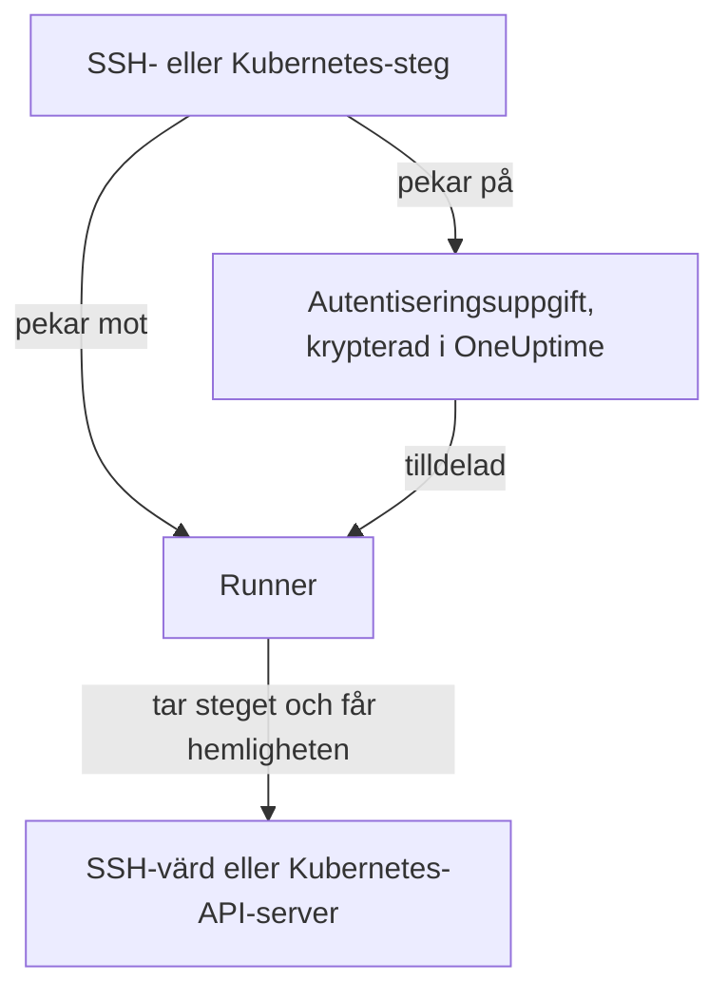

# Runbook-autentiseringsuppgifter

En autentiseringsuppgift är hur ett runbook når något som **inte** är Runnerns egen värd: en server via SSH eller ett Kubernetes-kluster. Utan den betyder "starta om tjänsten" att du skriver ett skalskript och manuellt lägger en nyckel eller en kubeconfig på Runnerns värd, där den ligger på disken utanför OneUptimes kontroll. En autentiseringsuppgift är samma åtkomst som ett hanterat objekt: krypterad i vila, tilldelad vissa Runners och refererad med namn från ett steg.

Hantera dem under **Runbooks → Runbook-agenter → Autentiseringsuppgifter**.

:::cards
- [Skapa en autentiseringsuppgift](#skapa-en-autentiseringsuppgift): Dess åtkomst och de Runners som får använda den.
- [Minsta behörighet på andra sidan](#minsta-behörighet-på-andra-sidan): Begränsa vad nyckeln eller token kan göra.
- [Hemligheter för skript](#hemligheter-för-skript): Ge ett Bash- eller JavaScript-skript ett lösenord eller en token.
:::

## Så används en autentiseringsuppgift



Ett SSH- eller Kubernetes-steg pekar på en autentiseringsuppgift och en Runner. När den Runnern tar steget kontrollerar OneUptime att autentiseringsuppgiften är tilldelad den, dekrypterar hemligheten och lämnar ut den bara i svaret på det övertagandet. Hemligheten sparas aldrig på jobbet och kan aldrig läsas via API:et.

## Innan du börjar

- **En roll som hanterar autentiseringsuppgifter.** Project Owner och Project Admin, eller alla med behörigheten **Create Runbook Credential**. Rollen Runbook Admin omfattar den inte. Att tilldela en SSH-autentiseringsuppgift till en Runner som kör OneUptime AI:s kommandon kräver också **Read Runbook Credential**; se [Runners som kör OneUptime AI:s kommandon](#runners-som-kör-oneuptime-ais-kommandon).
- **En plan som omfattar dem.** På OneUptime Cloud kräver runbook-autentiseringsuppgifter planen **Growth** eller högre.
- **En [Runner](/docs/runbooks/agents)** som kan nå värden eller klustrets API-server över nätverket.

## Skapa en autentiseringsuppgift

:::steps
### Öppna Autentiseringsuppgifter

Öppna **Runbooks → Runbook-agenter → Autentiseringsuppgifter** och klicka på **Skapa Runbook Credential**.

### Namnge den och välj dess typ

I steget **Credential** anger du ett **Namn**, till exempel `prod-cluster`, en valfri **Beskrivning** och **Typ**: **SSH** eller **Kubernetes**. Typen kan inte ändras senare; skapa en ny autentiseringsuppgift i stället.

### Ange åtkomsten

:::tabs
@tab SSH
Under **SSH-värd** anger du **Värdnamn**, **Port** (22 om fältet är tomt) och **Användarnamn**. Under **SSH-autentisering** klistrar du in en **Private Key (PEM)** med dess **Private Key Passphrase** om den har en, eller anger ett **Lösenord** för en värd utan nyckelåtkomst. En nyckel är det bästa valet när du kan välja.
@tab Kubernetes
Under **Kubernetes** anger du **API Server URL**, till exempel `https://10.0.0.1:6443`, **Service Account Token** och **CA Certificate (PEM)** så att Runnern kan verifiera API-servern. Lämna bara CA:n tom om API-servern presenterar ett certifikat som Runnern redan litar på.
:::

### Tilldela den till Runners

I steget **Runbook-agenter** väljer du de Runners som får använda autentiseringsuppgiften och klickar sedan på **Skapa Runbook Credential**. En autentiseringsuppgift som inte är tilldelad någon Runner kan inte användas av något steg.

### Använd den i ett steg

I ett [SSH- eller Kubernetes-steg](/docs/runbooks/authoring#stegtyper) väljer du en av de Runnerna och sedan autentiseringsuppgiften under **Credential**. Ett steg erbjuder bara autentiseringsuppgifter av sin egen typ, och att spara ett steg som pekar på en autentiseringsuppgift kräver behörighet att läsa runbook-autentiseringsuppgifter.
:::

## Vad som sparas

| Typ | Fält |
| --- | --- |
| SSH | Värdnamn, port (22 som standard), användarnamn och antingen en privat PEM-nyckel (med valfri lösenfras) eller ett lösenord. |
| Kubernetes | API-serverns URL, en serviceaccount-token och klustrets CA-certifikat. |

## Hemliga värden kan bara skrivas

Privata nycklar, lösenfraser, lösenord och serviceaccount-tokens är krypterade i vila, och API:et **returnerar dem aldrig**: varken till instrumentpanelen, till ett arbetsflöde eller till en export. Tabellen kan visa dig vad en autentiseringsuppgift *är* utan att någonsin visa vad den innehåller.

Det finns därför ingen "visa" för ett hemligt värde, bara "ersätt": att ange ett värde igen är sättet att byta det. Om du har tappat bort originalet utfärdar du en ny nyckel på målsystemet och uppdaterar autentiseringsuppgiften.

## Tilldela en autentiseringsuppgift till Runners

En autentiseringsuppgift kan bara användas av de Runners som du tilldelar den, och ett steg måste peka mot en av dem. Om ett steg pekar på en autentiseringsuppgift som inte är tilldelad dess Runner **misslyckas steget i stället för att köras**: en Runner som tyst inte gör någonting ser exakt ut som en som fungerade.

Tilldelningen är åtkomstgränsen, så håll den snäv: en Runner som bara någonsin startar om ett kluster behöver inte SSH-nyckeln till dina databasvärdar.

### Runners som kör OneUptime AI:s kommandon

På en Runner med **Kör AI-åtgärdskommandon** påslaget väljer OneUptime AI bland de SSH-autentiseringsuppgifter som är tilldelade Runnern för de kommandon den kör där. Därför når en SSH-autentiseringsuppgift bara en sådan Runner genom en person som får läsa runbook-autentiseringsuppgifter (**Read Runbook Credential**, eller en Project Owner eller Project Admin), oavsett vad som sparas först:

- **Tilldela autentiseringsuppgiften.** Att skapa en SSH-autentiseringsuppgift med en sådan Runner, eller lägga till en sådan Runner i en, kräver den behörigheten. Utan den avvisas sparandet och Runnern nämns: tilldela autentiseringsuppgiften till Runners som inte kör AI-åtgärdskommandon, eller be någon med behörigheten att tilldela den.
- **Slå på brytaren.** Att slå på **Kör AI-åtgärdskommandon** för en Runner som har SSH-autentiseringsuppgifter kräver samma behörighet.

Att ta bort Runners från en autentiseringsuppgift, spara en autentiseringsuppgift med de Runners den redan har och Kubernetes-autentiseringsuppgifter kräver inget mer: OneUptime AI:s kubectl-kommandon körs med den autentiseringsuppgift som är bunden till deras kluster. Tilldelningar av autentiseringsuppgifter och påslag av brytaren som görs av någon utan den behörigheten sparas en i taget i ett projekt, så att de två inte kan klara sina kontroller tillsammans; ett sparande som kommer medan ett annat sparas väntar på det, och tar det för lång tid avvisas det med *Try again in a moment*. Spara igen.

Ett arbetsflödes steg agerar som Project Admin men lånar inte en Project Admins läsning av runbook-autentiseringsuppgifter: ett steg har den bara om den person som senast sparade arbetsflödets steg har den. Se [Vad arbetsflödessteg får göra](/docs/workflows/configuration#vad-arbetsflödessteg-får-göra).

## Minsta behörighet på andra sidan

OneUptime kan inte begränsa vad din autentiseringsuppgift får göra på målsystemet: det är målsystemets uppgift, och det är värt att göra:

- **SSH** — föredra en nyckel framför ett lösenord, ge användaren bara de kommandon den behöver (ett tvingat kommando eller ett begränsat skal där det är praktiskt) och återanvänd inte en administratörs personliga nyckel.
- **Kubernetes** — bind serviceaccounten till en Role som tillåter `patch` på exakt de arbetsbelastningar som dina runbooks rör, i exakt de namnrymder där de körs. **Restart workload** ändrar själva arbetsbelastningen och **Scale workload** ändrar dess underresurs `scale`: mer behövs inte.

Till exempel en serviceaccount som kan starta om och skala en Deployment och ingenting annat:

```yaml title="oneuptime-runbooks-rbac.yaml"
apiVersion: v1
kind: ServiceAccount
metadata:
  name: oneuptime-runbooks
  namespace: checkout
---
apiVersion: rbac.authorization.k8s.io/v1
kind: Role
metadata:
  name: oneuptime-runbooks
  namespace: checkout
rules:
  # Restart workload: patches the Deployment's pod template.
  - apiGroups: ["apps"]
    resources: ["deployments"]
    resourceNames: ["checkout-api"]
    verbs: ["patch"]
  # Scale workload: patches the Deployment's scale subresource.
  - apiGroups: ["apps"]
    resources: ["deployments/scale"]
    resourceNames: ["checkout-api"]
    verbs: ["patch"]
---
apiVersion: rbac.authorization.k8s.io/v1
kind: RoleBinding
metadata:
  name: oneuptime-runbooks
  namespace: checkout
subjects:
  - kind: ServiceAccount
    name: oneuptime-runbooks
    namespace: checkout
roleRef:
  apiGroup: rbac.authorization.k8s.io
  kind: Role
  name: oneuptime-runbooks
```

För ett StatefulSet eller DaemonSet använder du `statefulsets` eller `daemonsets` i stället. Ett DaemonSet kan inte skalas, så det behöver ingen `scale`-regel.

## Hemligheter för skript

Bash- och JavaScript-steg har inget fält **Credential**. För att ge ett skript ett lösenord, en token eller en API-nyckel utan att skriva in den i runbooket sparar du den som en **runbook-hemlighet**. Hemligheter hanteras under **Runbooks → Inställningar → Hemligheter** av Project Owners och Project Admins eller med behörigheten **Create Runbook Secret**.

:::steps
### Skapa hemligheten

Klicka på **Skapa Runbook Secret**. I steget **Hemlighet** anger du ett **Namn** (bokstäver, siffror, bindestreck och understreck), en valfri **Beskrivning** och **Värde för hemlighet**. I steget **Åtkomst** väljer du Runners under **Runbook-agenter som har åtkomst till denna hemlighet**.

### Använd den i ett skript

Skriv `{{runbookSecrets.NAME}}` där värdet ska stå:

```bash
curl -s -X POST \
  -H "Authorization: Bearer {{runbookSecrets.CDN_API_TOKEN}}" \
  "https://api.cdn.example.com/v1/purge"
```

När en Runner som hemligheten är tilldelad tar steget får den skriptet med värdet ifyllt.
:::

Precis som en autentiseringsuppgifts hemliga fält är en hemlighets värde krypterat i vila och returneras aldrig av API:et: **Uppdatera hemligt värde** ersätter det. På OneUptime Cloud kräver runbook-hemligheter också planen **Growth** eller högre.

| | Autentiseringsuppgift | Runbook-hemlighet |
| --- | --- | --- |
| Används av | SSH- och Kubernetes-steg | Bash- och JavaScript-skript |
| Innehåller | En värd och dess nyckel, eller ett klusters URL och token | Vilket enskilt värde som helst |
| Hanteras under | **Runbooks → Runbook-agenter → Autentiseringsuppgifter** | **Runbooks → Inställningar → Hemligheter** |
| Når Runnern | I svaret på övertagandet av ett steg som pekar på den | Ifylld i skriptet för det steg den tar |
| Kan läsas igen via API:et | Bara dess icke-hemliga fält | Aldrig dess värde |

## Vem kan se dem

Att skapa, redigera och ta bort autentiseringsuppgifter kräver behörigheterna för runbook-autentiseringsuppgifter (eller Project Owner/Admin). Att läsa en autentiseringsuppgift visar bara dess icke-hemliga fält.

Observera att en Runners **agentnyckel** motsvarar de autentiseringsuppgifter som är tilldelade den Runnern: allt som har nyckeln kan ta arbete som den Runnern och få autentiseringsuppgifter. Därför kan agentnycklar bara läsas av Project Owners, Project Admins och Runbook Admins: behandla dem som du skulle behandla själva autentiseringsuppgifterna.

## Nästa steg

:::cards
- [Skriva ett runbook](/docs/runbooks/authoring): Skriv de SSH- och Kubernetes-steg som använder en autentiseringsuppgift.
- [Runbook-agenter](/docs/runbooks/agents): Installera den Runner som en autentiseringsuppgift tilldelas.
- [Runbook-konfiguration & säkerhet](/docs/runbooks/configuration): Behörigheter och härdning för hela runbook-stacken.
:::
