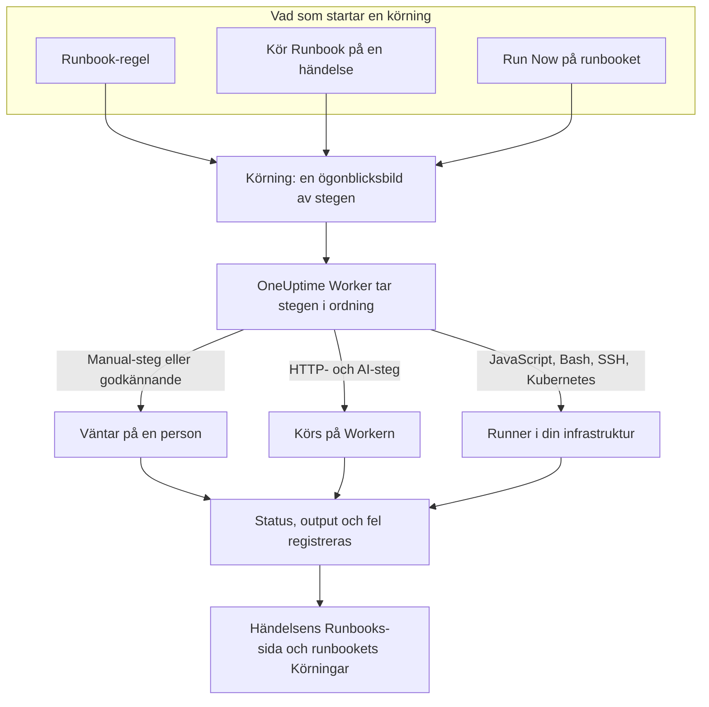

# Runbooks – Översikt

Ett runbook är en återanvändbar responsprocedur: en ordnad lista med manuella och automatiserade steg som du kör på en incident, ett larm eller en schemalagd underhållshändelse. Det gör tråden "vad gör vi nu?" till en checklista som alla i jouren kan följa klockan 3 på natten, med skript, API-anrop och godkännanden redan skrivna. Runbooks är till för jourhavande ingenjörer som hanterar incidenter och för plattformsteam som automatiserar den hanteringen.

:::cards
- [Skriva ett runbook](/docs/runbooks/authoring): Skapa ett runbook och skriv dess steg.
- [Runbook-regler](/docs/runbooks/rules): Starta runbooks vid nya incidenter, larm och underhållshändelser.
- [Köra ett runbook](/docs/runbooks/running): Starta en körning, slutför och godkänn dess steg, avbryt den.
- [Runbook-agenter](/docs/runbooks/agents): Installera den Runner som kör dina skript i din egen infrastruktur.
:::

## Så körs ett runbook



Varje gång ett runbook körs skapas en **körning**. När den startar kopieras runbookets steg över till den, och OneUptime går igenom dem i ordning. Ett Manual-steg, eller ett steg som kräver godkännande, pausar körningen tills någon agerar.

HTTP- och AI-steg körs på OneUptime Worker. JavaScript-, Bash-, SSH- och Kubernetes-steg körs på en [Runner](/docs/runbooks/agents) som du installerar i din egen infrastruktur, så att dina skript aldrig körs på OneUptimes servrar. Varje stegs status, output och felmeddelande registreras på körningen, som stannar kvar på den incident, det larm eller den händelse den kördes för.

## Centrala begrepp

| Begrepp | Betydelse |
| --- | --- |
| **Runbook** | Mallen. En namngiven, återanvändbar procedur med en ordnad lista med steg och en brytare **Kör det här runbooket**. |
| **Steg** | En punkt i ett runbook. Den har en typ (Manual, JavaScript, HTTP request, Bash, SSH, Kubernetes eller AI), en titel, en beskrivning och typspecifika inställningar. |
| **Runbook-regel** | En regel som automatiskt kopplar ett eller flera runbooks till incidenter, larm eller schemalagda underhållshändelser som uppfyller dess villkor: deras monitorer, allvarlighetsgrad, etiketter, monitoretiketter, titel eller beskrivning. |
| **Körning** | En körning av ett runbook. Skapas när en regel utlöses, när någon klickar på **Kör Runbook** på en händelse eller när någon klickar på **Run Now** på själva runbooket. Den innehåller en ögonblicksbild av stegen och varje stegs status och output. |
| **Ögonblicksbild** | Den frysta kopian av runbookets steg som ligger på varje körning. Du kan redigera runbooket senare utan att skriva om historiken för tidigare körningar. |
| **Runner** | En liten agent som du kör på en värd i din egen infrastruktur. Den kör de JavaScript-, Bash-, SSH- och Kubernetes-steg som pekar på den. Kallas även en runbook-agent. |
| **Autentiseringsuppgift** | Hanterad SSH- eller Kubernetes-åtkomst som SSH- och Kubernetes-steg använder. Krypterad i vila och lämnas bara ut till de Runners du tilldelar den. |
| **Hemlighet** | Ett enskilt värde, till exempel en API-token, som ett Bash- eller JavaScript-skript använder som `{{runbookSecrets.NAME}}`. Krypterad i vila och lämnas bara ut till de Runners du tilldelar den. |

## Stegtyper

Välj den typ som passar varje steg. [Skriva ett runbook](/docs/runbooks/authoring) beskriver inställningarna för varje typ.

| Stegtyp | Körs på | Använd den när … | Exempel |
| --- | --- | --- | --- |
| **Manual** | En person | En människa måste kontrollera något, göra en bedömning eller agera där OneUptime inte kan. | "Bekräfta att trafiken har flyttats till den sekundära regionen." |
| **JavaScript** | En Runner | Du behöver en liten, avgränsad beräkning i en sandlåda. | Beräkna replikeringsfördröjningen och avgör om du ska fortsätta. |
| **HTTP request** | OneUptime Worker | Du anropar ett befintligt API: en molnleverantör, PagerDuty, en Slack-webhook, din egen tjänst. | `POST` till din failover-orkestrerare. |
| **Bash** | En Runner | Du behöver skalkommandon på din egen infrastruktur. | Kör `kubectl rollout restart` eller ett återställningsskript. |
| **SSH** | En Runner | Du behöver ett kommando på en fjärrvärd med en hanterad SSH-autentiseringsuppgift. | Starta om en tjänst på en webbserver. |
| **Kubernetes** | En Runner | Du behöver starta om eller skala en Deployment, ett StatefulSet eller ett DaemonSet. | Starta om `checkout-api` i `production`. |
| **AI** | OneUptime Worker | Du vill ha en analys, en sammanfattning eller en bedömning mitt i körningen från projektets LLM-leverantör. | "Gå igenom diagnostiken ovan. Är det säkert att göra failover?" |

Ett runbook kan blanda alla. Styrkan med runbooks är att väva samman mänskliga kontroller med automatisering och AI-analys.

## Vad som startar en körning

| Hur | Var | Körningen kopplas till |
| --- | --- | --- |
| En runbook-regel | **Incidenter**, **Varningar** eller **Schemalagt underhåll** → **Regler** → **Runbook-regler** | Den nya incidenten, larmet eller händelsen |
| **Kör Runbook** | Sidan **Runbooks** för en incident, ett larm eller en schemalagd underhållshändelse | Den händelsen |
| **Run Now** | Runbookets sida **Översikt** | Ingenting: en ad hoc-körning |
| En regel för automatisk åtgärd | Se [AI SRE](/docs/ai/ai-sre) | Incidenten eller larmet |

Ett runbook vars brytare **Kör det här runbooket** är avstängd på sidan **Inställningar** startas inte av något av dessa. Körningar som redan har startat fortsätter.

## Var runbooks finns i instrumentpanelen

Runbooks finns under **Produkter**, i gruppen **Instrumentpaneler och automatisering**.

| Sida | Vad du gör där |
| --- | --- |
| **Produkter → Runbooks** | Bläddra bland, skapa och öppna runbooks. |
| Ett runbooks **Steg** | Skriv och ordna om dess steg och välj sedan **Save Steps**. |
| Ett runbooks **Översikt** | Se den senaste körningen och resultaten, och klicka på **Run Now**. |
| Ett runbooks **Körningar** | Alla körningar av det här runbooket, filtrerade efter status eller startdatum. |
| Ett runbooks **Ägare** | Lägg till de personer och team som ansvarar för det. |
| Ett runbooks **Inställningar** | Stäng av **Kör det här runbooket** utan att ta bort runbooket. |
| **Runbooks → Körningar** | Alla körningar av alla runbooks i projektet. |
| **Runbooks → Runbook-agenter** och **Runbooks → Runbook-agenter → Autentiseringsuppgifter** | Installera [Runners](/docs/runbooks/agents) och hantera [autentiseringsuppgifter](/docs/runbooks/credentials). |
| **Runbooks → Inställningar** | Hantera [hemligheter](/docs/runbooks/credentials#hemligheter-för-skript) för skript, samt de **Ägarregler** och **Etikettregler** som lägger till ägare och etiketter på nya runbooks. |
| **Incidenter / Varningar / Schemalagt underhåll → Regler → Runbook-regler** | Skapa de regler som startar runbooks automatiskt. |
| En incident, ett larm eller en underhållshändelse → **Runbooks** | Se de körningar som är kopplade till den och klicka på **Kör Runbook** för att starta en. |

## Ett genomgånget exempel

Anta att varje incident med "db-primary" i titeln ska starta ett runbook för databas-failover med fem steg.

:::steps
### Skapa runbooket

Under **Runbooks** klickar du på **Skapa Runbook** och kallar det "DB primary failover". Öppna det, gå till **Steg**, lägg till de här stegen och klicka sedan på **Save Steps**:

| # | Typ | Titel |
| --- | --- | --- |
| 1 | JavaScript | Registrera replikeringsfördröjningen före failover |
| 2 | Manual | Bekräfta i DBA-instrumentpanelen att repliken är frisk |
| 3 | HTTP request | `POST` till failover-orkestreraren |
| 4 | Manual | Kontrollera att skrivningar går till den nya primära |
| 5 | HTTP request | Skicka klartecknet till `#db-incidents` i Slack |

### Lägg till en regel

Under **Incidenter → Regler → Runbook-regler** skapar du en regel med ett villkor och det runbook som ska startas:

```text
Conditions:  Incident Title starts with db-primary
Runbooks:    [DB primary failover]
```

### Låt det köra

En monitor öppnar incidenten `INC-4821 · db-primary connection timeout`. Regeln matchar och en körning startar:

- Steg 1 (JavaScript) körs på den Runner du valde för det. Returvärdet, till exempel `{ lagMs: 412 }`, registreras.
- Steg 2 (Manual) pausar körningen, som visar **Väntar på dig**. Den jourhavande kontrollerar instrumentpanelen och klickar på **Mark complete**.
- Steg 3 (HTTP request) körs och svaret på `POST` registreras.
- Steg 4 (Manual) pausar körningen igen tills någon slutför det.
- Steg 5 (HTTP request) körs och körningen är **Slutförd**.

### Granska den

Körningen stannar kvar på incidentens sida **Runbooks**. När du skriver postmortem är varje stegs output, fel och tidsåtgång ett klick bort.
:::

## Vanliga användningsområden

- **Databas-failover**: registrera tillståndet med JavaScript, be den jourhavande DBA:n bekräfta replikens hälsa (Manual), anropa orkestreraren (HTTP request), bekräfta DNS (Manual), skicka klartecknet (HTTP request).
- **Tömning av cache**: en HTTP-begäran och sedan ett Manual-steg "bekräfta att cachens träffgrad återhämtar sig".
- **Incident som påverkar kunder**: Manual "publicera en uppdatering på statussidan", en HTTP-begäran för att meddela supportteamet, JavaScript för att hämta listan över berörda konton.
- **Förkontroll före schemalagt underhåll**: ta en ögonblicksbild av mätvärden, bekräfta ändringsfönstret med intressenterna (Manual), slå på underhållsläge i lastbalanseraren (HTTP request).
- **Diagnostisera och åtgärda sedan**: ett Bash-steg samlar in diagnostik, ett AI-steg med **Kräv godkännande** läser den och rekommenderar en åtgärd, och ett Kubernetes-steg startar om arbetsbelastningen först när en person har godkänt.
- **Hygien som alltid körs**: en regel utan villkor som registrerar systemets tillstånd vid varje incident för postmortem.

## Så passar runbooks in i resten av OneUptime

- **Monitorer** öppnar incidenter och larm, och **runbook-regler** gör dem till runbook-körningar: upptäck, utlös, hantera, registrera.
- **[Jourpolicyer](/docs/on-call/schedules)** avgör vem som larmas. Runbooks avgör vad den personen gör när hen är vaken.
- **[Workspace-anslutningar](/docs/workspace-connections/slack)** som Slack och Microsoft Teams är naturliga mål för HTTP-begäransteg som skickar uppdateringar.
- **[Statussidor](/docs/status-pages/index)** uppdateras ofta som ett Manual-steg i ett kundinriktat runbook.

## Nästa steg

:::cards
- [Skriva ett runbook](/docs/runbooks/authoring): Skapa ditt första runbook och dess steg.
- [Runbook-agenter](/docs/runbooks/agents): Installera en Runner innan du skriver ett JavaScript-, Bash-, SSH- eller Kubernetes-steg.
- [Runbook-regler](/docs/runbooks/rules): Starta runbooks automatiskt när incidenter skapas.
- [Runbook-konfiguration & säkerhet](/docs/runbooks/configuration): Gränser, tidsgränser, behörigheter och härdning.
:::
