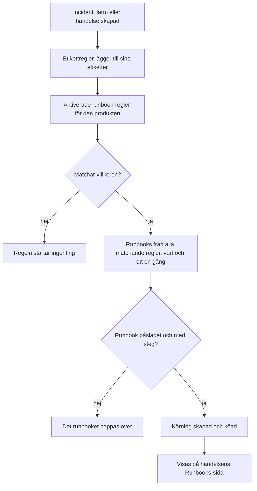

# Runbook-regler

Runbook-regler startar runbooks automatiskt när en **incident**, ett **larm** eller en **schemalagd underhållshändelse** skapas, så att ingen behöver komma ihåg att köra dem mitt i ett avbrott. Varje produkt har sin egen regelsida i sin meny **Regler**:

- Incidenter → Regler → **Runbook-regler**
- Varningar → Regler → **Runbook-regler**
- Schemalagt underhåll → Regler → **Runbook-regler**

Alla tre sidorna redigerar samma sorts regel, filtrerad till den produktens regler.

:::cards
- [Skapa en runbook-regel](#skapa-en-runbook-regel): Fyra steg: ett namn, villkor och de runbooks som ska startas.
- [Villkor](#villkor): Varje kriterium och operator som en regel kan använda.
- [Matchningslogik](#matchningslogik): Flera regler, monitorvillkor och etikettregler.
- [Exempel](#exempel): Tre regler att kopiera.
:::

## Så startar en regel ett runbook



När en regel utlöses händer följande för varje runbook som den pekar på:

1. Runbooket läses in.
2. Dess steg kopieras som en **ögonblicksbild** till en ny runbook-körning.
3. Körningen läggs i runbook-workerns kö.
4. Körningen kopplas till källentiteten: den visas på sidan **Runbooks** för incidenten, larmet eller den schemalagda underhållshändelsen och i runbookets lista **Körningar**.

Du ser alla körningar, startade av en regel eller inte, under **Runbooks → Körningar**, filtrerade efter status, runbook eller startdatum.

## Innan du börjar

- **Ett runbook som kan köras.** Det behöver minst ett steg och **Kör det här runbooket** påslaget på sin sida **Inställningar**. Se [Skriva ett runbook](/docs/runbooks/authoring).
- **Behörighet att hantera regler.** Project Owner, Project Admin och Runbook Admin skapar runbook-regler, liksom alla med behörigheten **Create Runbook Rule**.

## Skapa en runbook-regel

:::steps
### Öppna Runbook-regler

I **Incidenter**, **Varningar** eller **Schemalagt underhåll** öppnar du **Regler → Runbook-regler** och klickar på **Skapa Runbook Rule**.

### Namnge regeln

Under **Grundläggande information** anger du ett **Namn**, till exempel "Starta DB-failover vid databasincidenter", och eventuellt en **Beskrivning**.

### Lägg till villkor

Under **Matchningskriterier** klickar du på **Lägg till villkor**, väljer ett kriterium och en operator och skriver in eller väljer värdet. Lägg till fler villkor om du behöver och välj **Matcha alla** eller **Matcha något**. Lägg inte till några för att starta runbooks vid varje ny händelse av det här slaget.

### Välj runbooks

Under **Runbooks** väljer du ett eller flera **Runbooks att starta** och klickar på **Skapa Runbook Rule**. Regeln är aktiv så snart den har skapats och visas i listan med statusen **Aktiverad**.
:::

## Hur en regel är uppbyggd

| Fält | Syfte |
| --- | --- |
| **Namn** | En kort, läsbar etikett för regeln. |
| **Beskrivning** | Valfri kontext för kolleger. |
| **Aktiverad** | Påslagen för en ny regel. Stäng av den i regelns redigeringsformulär för att pausa den utan att ta bort den. |
| **Villkor** | Vad regeln matchar, i steget **Matchningskriterier**. Lämna tomt för att matcha varje händelse av dess typ. |
| **Runbooks att starta** | Ett eller flera runbooks som startas när regeln utlöses. |

## Villkor

Varje villkor jämför en sak hos incidenten, larmet eller den schemalagda underhållshändelsen med ett värde som du anger. En runbook-regel erbjuder samma kriterier som produktens andra regler: en runbook-regel för incidenter matchar på samma saker som en sekretess- eller jourregel för incidenter.

| Kriterium | Vad det kontrollerar |
| --- | --- |
| **Monitorer** | De monitorer som incidenten eller den schemalagda underhållshändelsen påverkar, eller den monitor som utlöste larmet. |
| **Incident Allvarligheter** / **Larm Allvarligheter** | Incidentens eller larmets allvarlighetsgrad. Schemalagda underhållshändelser har ingen allvarlighetsgrad, så deras regler erbjuder det inte. |
| **Incidentetiketter** / **Larmetiketter** / **Händelseetiketter** | Etiketterna på själva incidenten, larmet eller händelsen, inklusive dem som etikettregler lade till när den skapades. |
| **Övervakningsetiketter** | Etiketterna på dess monitorer. Ge dina monitorer etiketten `production` eller `staging` för att köra ett runbook i bara en miljö. |
| **Incidenttitel** / **Larmtitel** / **Händelsetitel** | Dess titel. |
| **Incidentbeskrivning** / **Larmbeskrivning** | Dess beskrivning (för händelser heter kriteriet **Händelsebeskrivning**). |
| **Övervakningsnamn** / **Övervakningsbeskrivning** | Namnet eller beskrivningen på dess monitorer. |

Välj en operator för varje villkor:

- Ett listkriterium — **Monitorer**, allvarlighetsgraderna och etiketterna — använder **Har någon av**, **Har alla** eller **Har ingen av** de valda värdena.
- Ett textkriterium använder **Innehåller** (som ett nytt villkor börjar med), **Innehåller inte**, **Lika med**, **Inte lika med**, **Börjar med**, **Slutar med** eller **Matchar mönster** / **Matchar inte mönster** för ett reguljärt uttryck som inte skiljer på versaler och gemener eller ett `*`-jokertecken. Textjämförelser skiljer inte på versaler och gemener.

Med två eller fler villkor väljer du **Matcha alla** (varje villkor måste vara sant) eller **Matcha något** (minst ett måste vara det).

## Matchningslogik

- En regel utan villkor gäller varje händelse av sin typ (en global "kör alltid"-regel).
- Flera regler kan matcha samma händelse. Varje matchning utlöses, och unionen av deras runbooks körs: varje runbook får sin egen körning, och ett runbook som två matchande regler pekar på körs en gång.
- Monitorvillkor kontrolleras en monitor i taget. Med **Matcha alla** kräver "**Övervakningsnamn** innehåller `api`" och "**Övervakningsetiketter** har någon av _Production_" en monitor som uppfyller båda, inte en monitor för vartdera.
- Runbook-regler körs efter etikettregler, så en etikett som en etikettregel sätter på en ny incident, ett nytt larm eller en ny händelse kan starta ett runbook.
- En incident eller ett larm som skapas redan löst startar inget runbook: det var över innan det registrerades. Se [Deklarerad redan bekräftad eller löst](/docs/incidents/declaring-incidents#deklarerad-redan-bekräftad-eller-löst).
- Ett villkor på en annan produkts allvarlighetsgrad — till exempel **Larm Allvarligheter** i en incidentregel — kan aldrig bli sant, så API:et vägrar spara det.
- Regler utvärderas en gång, när händelsen skapas. Att redigera en incidents titel, allvarlighetsgrad eller etiketter senare utlöser inte reglerna igen.

## Exempel

### DB-failover vid databasincidenter

```text
Name:        Start DB failover for DB incidents
Trigger:     Incident
Conditions:  Incident Title matches pattern (?:^|\b)(db|database|postgres|mysql|mongo)
Runbooks:    [DB failover playbook, Notify DBA team]
```

Det här skapar två runbook-körningar varje gång en incident skapas med "db", "database", "postgres" och så vidare i titeln.

### Bara vid kritiska produktionsincidenter

```text
Name:        Flush the CDN cache for critical production incidents
Trigger:     Incident
Conditions:  Match all
             Monitor Labels has any of Production
             Incident Severities has any of Critical
Runbooks:    [Flush CDN cache]
```

Körs vid en kritisk incident på en monitor med etiketten _Production_, och vid ingenting i staging.

### Hygienregel som alltid körs

```text
Name:        Always-run pre-flight check
Trigger:     Incident
Conditions:  (none)
Runbooks:    [Capture pre-incident state]
```

Utlöses vid varje incident: användbart för att registrera ögonblicksbilder av systemets tillstånd, mätvärden och liknande för postmortem.

## Avstängda runbooks

Om en regel pekar på ett runbook som är avstängt (**Kör det här runbooket** avstängt på runbookets sida **Inställningar**, `isEnabled = false`) matchar regeln fortfarande, men runbook-körningen hoppas över. Slå på brytaren igen för att återuppta. Ett runbook utan steg hoppas över på samma sätt.

## Testa en regel

Innan du litar på en regel i produktion skapar du en testincident (eller ett testlarm) som uppfyller regelns villkor och kontrollerar att de förväntade runbooks visas på dess sida **Runbooks**.

> [!NOTE]
> Runbook-regler verkar bara på nya händelser. Till skillnad från etikett- och ägarregler kan de inte [köras på befintliga poster](/docs/configuration/run-rules-now): det skulle starta runbooks för incidenter som redan är över.

## Felsökning

:::details En regel matchade men inget runbook kördes
Kontrollera i den här ordningen:

- Regeln är **Aktiverad**.
- Varje runbook har **Kör det här runbooket** påslaget på sin sida **Inställningar** och minst ett sparat steg.
- Incidenten eller larmet skapades inte redan löst.
- Runbookets körning väntar inte bara: öppna den från händelsens sida **Runbooks**. Ett Manual-steg eller ett godkännande visar **Väntar på dig**.
:::

:::details En regel matchar aldrig
Regler ser händelsen som den skapades, med de etiketter som etikettregler lade till i det ögonblicket. En etikett, allvarlighetsgrad eller titel som ändras efteråt ses inte. Med flera villkor kontrollerar du **Matcha alla** mot **Matcha något** och kommer ihåg att monitorvillkor alla måste gälla en och samma monitor.
:::

:::details API:et avvisar en regel med "can only be used by"
Ett allvarlighetskriterium hör till en produkt. **Larm Allvarligheter** i en incidentregel, eller **Incident Allvarligheter** i en larmregel, skulle aldrig kunna matcha, så regeln avvisas med ett meddelande som "Alert Severities can only be used by alert runbook rules." Ta bort det villkoret. Instrumentpanelen erbjuder bara varje produkts egna kriterier.
:::

## Nästa steg

:::cards
- [Köra ett runbook](/docs/runbooks/running): Vad de som hanterar incidenten ser när en regel startar en körning.
- [Skriva ett runbook](/docs/runbooks/authoring): Skriv de runbooks som dina regler startar.
- [Deklarera en incident](/docs/incidents/declaring-incidents): Hur incidenter skapas och när regler ser dem.
:::
