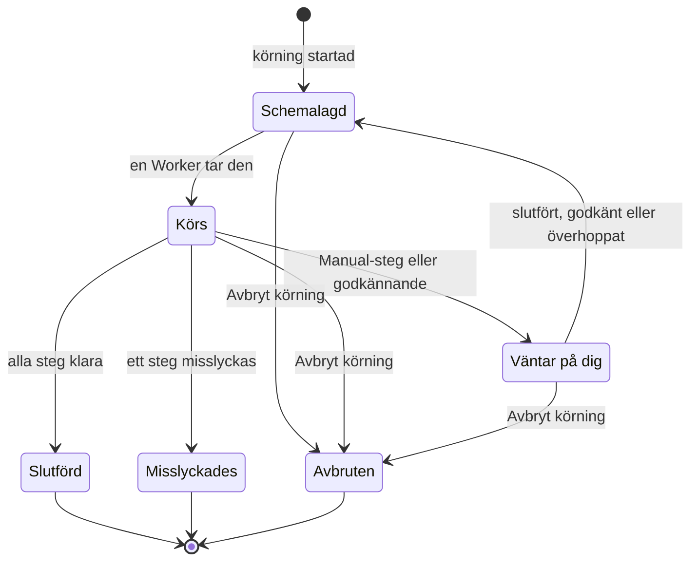

# Köra ett runbook

Varje gång ett runbook körs blir det en **körning**: en ögonblicksbild av runbookets steg som gås igenom i ordning, med varje stegs status och output registrerade. Den här sidan är till för dem som hanterar incidenter, startar körningar och för dem framåt: hur en körning startar, vad körningssidan visar och hur du slutför, godkänner, hoppar över och avbryter steg.

:::cards
- [Starta en körning](#starta-en-körning): Från en incident, ett larm eller en händelse, eller från själva runbooket.
- [Körningsvyn](#körningsvyn): Vad varje steg visar medan en körning pågår.
- [Slutför, godkänn och hoppa över steg](#slutför-godkänn-och-hoppa-över-steg): Vilket steg som tar emot ett beslut, och när.
- [Felsökning](#felsökning): Körningar som inte startar eller inte blir klara.
:::

## Så rör sig en körning

En ny körning är **Schemalagd** tills en Worker tar den och markerar den som **Körs**. Den pausar som **Väntar på dig** vid ett Manual-steg, eller efter ett steg som kräver godkännande, och går tillbaka till kön så snart någon agerar. En körning som väntar på en person löper aldrig ut. Den avslutas som **Slutförd**, **Misslyckades** eller **Avbruten**.

## Starta en körning

En runbook-körning skapas på tre sätt:

1. **Automatiskt via en regel**: en [runbook-regel](/docs/runbooks/rules) startar den när en matchande incident, ett matchande larm eller en matchande schemalagd underhållshändelse skapas. En regel för automatisk åtgärd kan också starta en; se [AI SRE](/docs/ai/ai-sre).
2. **Manuellt från en händelse**: klicka på **Kör Runbook** på en incident, ett larm eller en schemalagd underhållshändelse. Körningen kopplas till den händelsen.
3. **Manuellt från runbookets sida**: klicka på **Run Now** på ett runbooks sida **Översikt**. Körningen kopplas inte till någon incident, något larm eller någon schemalagd underhållshändelse.

Så startar du en manuellt:

:::tabs
@tab Från en händelse
1. Öppna incidenten, larmet eller den schemalagda underhållshändelsen och gå till dess sida **Runbooks**.
2. Klicka på **Kör Runbook**. Dialogen **Kör en Runbook** listar projektets påslagna runbooks.
3. Klicka på **Run** bredvid runbooket. Körningen visas i händelsens lista: klicka på **Visa** för att öppna den.
@tab Från runbooket
1. Öppna runbooket från **Runbooks**.
2. Klicka på **Run Now** på dess **Översikt**.
3. Körningssidan öppnas.
:::

För att starta en körning krävs Project Owner, Project Admin, Project Member, Runbook Admin eller Runbook Member, eller behörigheten **Create Runbook Execution**. Runbook Viewer och Viewer ser **Run Now** låst, med skälet. Se [Behörigheter](/docs/runbooks/configuration#behörigheter).

## Körningsvyn

Öppna en körning för att se dess checklista. Högst upp på sidan visas körningens **Status**, dess **Progress** (klara steg av alla steg), **Startade** (när den började) och **Utlöst av** (vad som startade den). Varje steg visar:

- **Statusmärke** — Väntar, Körs, Väntar på dig, Klar, Hoppade över, Misslyckades eller Avbruten.
- **Titel och beskrivning** — kopierade från runbooket när körningen startade.
- **Output** (kan fällas ihop) — stdout, returvärden, HTTP-svar eller AI:ns svar.
- **Felmeddelande**, om steget misslyckades.
- På det steg körningen väntar på: **Mark complete** (ett Manual-steg) eller **Approve & continue** (ett steg med **Kräv godkännande**) och **Hoppa över**.
- Medan körningen är pausad, **Hoppa över** på senare automatiserade steg som inte kräver godkännande.

Medan körningen pågår uppdateras sidan av sig själv var 30:e sekund. Klicka på **Uppdatera** för att se det senaste tillståndet direkt.

## Slutför, godkänn och hoppa över steg

Bara det steg som körningen väntar på kan slutföras, godkännas eller hoppas över så att körningen fortsätter. Ett Manual-steg eller ett steg med **Kräv godkännande** kan inte bockas av eller hoppas över innan körningen når det: deras uppgift är att stoppa körningen, så de tar emot ett beslut först när körningen är där (för ett godkännande: när steget har körts och du kan se dess output).

Medan körningen är pausad kan du också hoppa över ett senare automatiserat steg som inte kräver godkännande, så att det inte körs när körningen fortsätter. Körningen förblir pausad vid det steg som väntar på dig. Du kan inte hoppa över medan steg körs: vänta tills körningen pausar, eller avbryt den. Varje steg registrerar vem som slutförde eller hoppade över det.

| Steget | Slutför eller godkänn | Hoppa över |
| --- | --- | --- |
| Det som körningen väntar på | Ja | Ja |
| Ett senare automatiserat steg utan **Kräv godkännande** | Nej | Ja, medan körningen är pausad |
| Ett senare Manual-steg, eller ett med **Kräv godkännande** | Nej | Nej |
| Vilket steg som helst medan steg körs | Nej | Nej |

Att slutföra, godkänna, hoppa över och avbryta kräver samma roller som att starta en körning, eller behörigheten **Edit Runbook Execution**.

## Varva manuella och automatiserade steg

Det klassiska förloppet:

| # | Steg | Vad som händer |
| --- | --- | --- |
| 1 | Bash: registrera systemets tillstånd | Körs på sin Runner så snart körningen startar. |
| 2 | Manual: "Informera kunderna med bannern på statussidan." | Körningen pausar tills någon klickar på **Mark complete**. |
| 3 | HTTP request: larma DBA:n via PagerDuty | Körs på Workern. |
| 4 | Manual: "Bekräfta att den sekundära databasen nu är primär." | Körningen pausar igen. |
| 5 | HTTP request: skicka klartecknet till en Slack-webhook | Körs, och körningen är **Slutförd**. |

Steg 2 och 4 pausar körningen tills någon bockar av dem. Steg 1, 3 och 5 körs automatiskt. Hela körningen är en körning, en tidslinje och en enda sanningskälla.

## Avbryta en körning

Klicka på **Avbryt körning** på körningssidan. Statusen blir `Cancelled` och inget senare steg startar. Ett steg som redan körs avbryts inte, men dess resultat registreras inte: steget förblir `Cancelled`. Jobb som fortfarande väntar på en Runner avbryts; en Runner som redan kör ett skript kör klart det, men resultatet godtas inte.

## Gränser för output

Output per steg är begränsad till **50 KB**, så att ett skenande skript inte blåser upp databasen. Längre output klipps av med en markör. Behöver du större artefakter skriver du dem från skriptet till objektlagring eller ett loggsystem och lägger URL:en i outputen.

## Köra ett runbook igen

En körning är en engångspost som inte ändras. Klicka på **Kör igen** på en avslutad körning, eller på **Run Now** på runbooket, för att köra det igen. Båda skapar en ny körning utifrån runbookets nuvarande steg, inte kopplad till någon händelse. Använd **Kör Runbook** på incidentens sida **Runbooks** för att köra det igen på en incident. Den ursprungliga körningen förblir oförändrad för revisionsspåret.

## Hitta tidigare körningar

| Var | Vad den visar |
| --- | --- |
| Ett runbooks **Körningar** | Alla körningar av det runbooket, med filter för status och startdatum och en kolumn **Utlöst av**. |
| **Runbooks → Körningar** | Alla körningar av alla runbooks i projektet. |
| Sidan **Runbooks** för en incident, ett larm eller en händelse | De körningar som är kopplade till den. Händelsens översikt visar dem också så snart det finns några. |

## Felsökning

:::details Run Now är låst
Din roll läser runbooks men kör dem inte: knappen säger "Du har inte behörighet att starta runbook-körningar i det här projektet." Be om Runbook Member eller behörigheten **Create Runbook Execution**.
:::

:::details Att starta en körning misslyckas med "Runbook is disabled" eller "Runbook has no steps to run"
Runbookets brytare **Kör det här runbooket** är avstängd på dess sida **Inställningar**, eller så har det inga sparade steg. Slå på brytaren, eller lägg till steg, och klicka på **Save Steps**.
:::

:::details Ett steg misslyckades för att det saknar en Runner eller en autentiseringsuppgift
Meddelandet lyder till exempel "Bash step is missing a Runner. Pick one under Runbooks → Runners." Steget sparades utan **Runner**, eller ett SSH- eller Kubernetes-steg utan **Credential**. Öppna runbookets **Steg**, välj det som steget saknar, klicka på **Save Steps** och kör runbooket igen.
:::

:::details Ett steg misslyckades för att ingen runbook-agent tog det
Meddelandet lyder "No runbook agent picked up this step before the wait window expired." Stegets Runner tog inte jobbet inom sin claim timeout. Kontrollera under **Runbooks → Runbook-agenter** att Runnern är **Ansluten** och att **Kör Runbooks** är påslaget. Se [Runbook-agenter](/docs/runbooks/agents#felsökning).
:::

:::details Körningen har väntat i timmar
En körning som väntar på en person löper aldrig ut. Öppna den och agera på steget som visar **Väntar på dig**, eller klicka på **Avbryt körning**.
:::

:::details Ett steg säger att det kanske har körts delvis
Den OneUptime Worker som körde steget startade om eller slutade svara, och körningen markerades som misslyckad i stället för att bli hängande. Kontrollera målsystemet innan du kör runbooket igen.
:::

## Nästa steg

:::cards
- [Skriva ett runbook](/docs/runbooks/authoring): Lägg till Manual-steg och godkännanden där en person ska besluta.
- [Runbook-regler](/docs/runbooks/rules): Starta körningar automatiskt vid nya incidenter.
- [Runbook-agenter](/docs/runbooks/agents): Håll de Runners som dina steg behöver online.
:::
