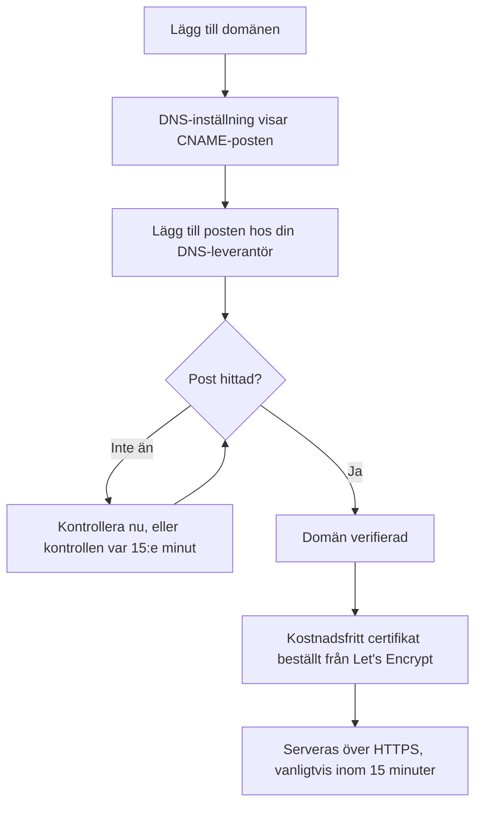

# Statussidans varumärke och domäner

Din statussida är den enda skärmen i OneUptime som dina kunder tittar på, så den bör se ut som din egen och ligga på din egen domän, som `status.yourcompany.com`. Den här sidan går igenom sidan **Varumärke** kort för kort och lägger sedan statussidan på din domän: lägg till domänen, lägg till en DNS-post, så följer det kostnadsfria SSL-certifikatet av sig självt.

:::cards
- [Sidan Varumärke](#sidan-varumärke): Logotyp, titel, favicon, länkar, sidfot, färger och språk.
- [Anpassad HTML, CSS och JavaScript](#anpassad-html-css-och-javascript): Allt som de inbyggda inställningarna inte täcker.
- [Anpassade domäner](#anpassade-domäner): Ditt eget värdnamn, med ett kostnadsfritt certifikat.
- [Kolumnen Status](#läsa-domänens-kolumn-status): Hur långt varje domän har kommit på vägen mot HTTPS.
:::

## Var varje varumärkesinställning finns

Öppna en statussida: sektionen **Varumärke** i dess sidomeny har tre objekt:

| Sida | Vad du anger där |
| ---- | ------------------ |
| **Varumärke** | Logotyp och omslagsbild, sidtitel och sidbeskrivning, favicon, sidhuvudslänkar, beskrivningen av översiktssidan, upphovsrättsraden och sidfotslänkar. Hopfällt under **Fler inställningar**: historikdiagrammets färger, språk och indexering i sökmotorer. |
| **Anpassade domäner** | Din egen domän, dess DNS-post och dess kostnadsfria SSL-certifikat. |
| **HTML, CSS och JavaScript** | Sidhuvud-HTML, sidfots-HTML, anpassad CSS, anpassad JavaScript. |

Tre saker som liknar varumärke finns i stället under **Statussidor → din sida → Avancerad → Avancerade inställningar** (`{id}/settings`), eftersom de avgör vad sidan visar och inte hur den ser ut: den totala upptidsprocenten, vilka monitorstatusar som räknas mot upptiden och raden "Powered by OneUptime". Alla tre är rader på kortet **Vad din statussida visar** där.

Varumärket var tidigare uppdelat på separata skärmar för **Grundläggande varumärke**, **Sidhuvud**, **Sidfot**, **Översiktssida** och **Språk**. Deras gamla adresser (`{id}/header-style`, `{id}/footer-style`, `{id}/overview-page-branding` och `{id}/languages`) öppnar nu sidan **Varumärke**, så gamla bokmärken och länkar fungerar fortfarande.

## Sidan Varumärke

**Statussidor → din sida → Varumärke → Varumärke** (`{id}/branding`). Varje kort sparas för sig. Efter logotypen, titeln och faviconen följer korten din statussida uppifrån och ned: sidhuvudets länkar, texten högst upp i översikten och sedan sidfoten. Det som få ändrar ligger hopfällt under **Fler inställningar** längst ned.

### Logotyp och omslagsbild

Det första kortet, **Logotyp och omslagsbild**, har knappen **Edit Images**, som öppnar två steg:

| Steg | Fält |
| ---- | ------ |
| **Logotyp** | Uppladdningen av logotypen (platshållare `Upload logo`) och **Logo Alt Text** (platshållare `Logo of My Company`). Lämna alt-texten tom så används statussidans titel i stället. |
| **Omslagsbild** | **Omslag**, en uppladdning (platshållare `Upload cover image`) för den breda bannern bakom sidhuvudet, och **Cover Image Alt Text**. Lämna alt-texten tom om omslaget bara är dekoration. |

Logotypen, omslagsbilden och faviconen är filer som har laddats upp i statussidans eget projekt, och det kontrolleras varje gång någon av dem sparas, från instrumentpanelen, API:et, Terraform eller ett arbetsflöde. En fil som har laddats upp i ett annat projekt avvisas med samma ord som en fil som inte längre finns får: "The logo's file could not be found. Upload the logo again.", "The cover image's file could not be found. Upload the cover image again." eller "The favicon's file could not be found. Upload the favicon again." Att ladda upp bilden igen från sidan löser det.

Din statussida visar bara bilder från sitt eget projekt; en bild som den inte kan visa utelämnas, som om sidan inte hade någon. Instrumentpanelen, API:et och Terraform läser sidans bilder på samma sätt: en bild från ett annat projekt kommer tillbaka som ingen bild alls. E-postmeddelandena som sidan skickar (till prenumeranter, och till privata användare om deras inloggning) visar dess logotyp på samma sätt: en logotyp som sidan inte kan visa utelämnas även från dem i stället för att visas som en trasig bild.

### Titel, beskrivning och favicon

- **Titel och beskrivning**: kortet påpekar att detta även används för SEO. **Redigera** öppnar **Sidtitel** (platshållare `Please enter page title here.`) och **Sidbeskrivning**. Sökmotorer och länkförhandsvisningar visar dem, så skriv dem för en kund, inte för ditt team.
- **Favicon**: **Edit Favicon** öppnar uppladdningen **Favicon**: den lilla ikonen i webbläsarfliken.

### Sidhuvudslänkar

Tabellen **Sidhuvudslänkar** innehåller länkarna i statussidans sidhuvud, som din webbplats, din dokumentation eller en supportportal. Varje länk har en **Titel** och en **Länk** (en URL, platshållare `https://link.com`), och du ändrar ordningen genom att dra. Utan länkar säger tabellen **Ingen länk i sidhuvudet för denna statussida**, med **Skapa Statussida Sidhuvud Länk** nedanför.

### Beskrivning av översiktssidan

**Beskrivning av översiktssida** är det första på statussidans översikt, ovanför meddelandena, den övergripande statusen och dina resurser. **Redigera beskrivning** öppnar ett markdown-fält. Använd det för en mening med sammanhang: vad sidan täcker och vart man vänder sig för support. En bild som du lägger i det visas för alla besökare på sidan.

### Sidfot

- **Upphovsrättsinformation**: **Edit Copyright** öppnar ett fält, **Upphovsrättsinformation**, med platshållaren `Acme, Inc.`.
- **Sidfotslänkar**: samma par **Titel** och **Länk** som sidhuvudslänkarna, ordnade genom att dra. Utan länkar står det "Ingen länk i sidfoten för denna statussida."

Sidhuvudslänkar är för navigering; sidfotslänkar är för det finstilta, som juridisk information, integritet och villkor.

### Fler inställningar

Sidans sista sektion ligger hopfälld under **Fler inställningar**, eftersom få någonsin ändrar det som finns där. Hopfälld nämner dess rubrik de fyra sektionerna (**Standardfärg för stapel**, **Regler för stapelfärger**, **Språk** och **Indexering i sökmotorer**) och visar var och en som skiljer sig från det som en ny statussida börjar med: en annan standardfärg för stapeln än den gröna som alla sidor börjar med, någon regel för stapelfärger, ett annat standardspråk än engelska, en kortare lista med språk eller indexering i sökmotorer avstängd. Klicka på den för att öppna den: det är ett enda kort med de fyra sektionerna under varandra, var och en med egen titel och knapp, åtskilda av avdelare.

**Historikdiagrammets färger.** Det här är de enda inbyggda färginställningarna på en statussida.

- **Standardfärg för stapeln i historikdiagrammet**: **Edit Default Bar Color** öppnar väljaren **Standardfärg för stapel**. Alla nya statussidor börjar med grönt. Med regler för stapelfärger är det också färgen för en dag som ingen regel matchar. En dag som sidan saknar data för ritas alltid grå.
- **Rules for Bar Colors of History Chart**: en ordnad tabell med regler som du sorterar genom att dra. Varje regel har **När drifttid % är större än eller lika med** och **Använd sedan denna stapelfärg**; tabellens kolumner heter `When Uptime Percent >=` och `Then, Bar Color is`. En ny regels färg är redan vald, en som de andra reglerna inte använder ännu; välj i stället den som du vill ha. Ordningen spelar roll, så ordna reglerna så som du vill att de ska utvärderas. Utan regler får varje dags stapel färgen på dagens lägsta monitorstatus.

Hur många dagar diagrammet täcker anges inte här. Det är **Upptidshistorik** på kortet **Vad din statussida visar** under **Avancerad → Avancerade inställningar**, från 1 till 90 dagar. Vilka monitorstatusar som räknas som nere är **Räknas som driftstopp**, på samma rad på det kortet.

**Språk.** Sektionen **Språk** anger den språkväljare som besökare får i sidans sidfot. **Redigera språk** öppnar två fält:

| Fält | Vad det gör |
| ----- | ------------ |
| **Standardspråk** | Det språk som förstagångsbesökare ser, valt från en lista som namnger varje språk på språket självt och på engelska (`Deutsch (German)`). Standard är engelska, och besökare kan alltid byta från sidfoten. |
| **Aktiverade språk** | En flervalslista, platshållare `All languages`. Lämna den tom så erbjuds alla språk som stöds; välj några så listar sidfoten bara dem. |

OneUptime levereras med sjutton språk: engelska, tyska, franska, spanska, italienska, portugisiska, nederländska, danska, norska, svenska, ryska, japanska, koreanska, kinesiska (förenklad), kinesiska (traditionell), hindi och persiska.

**Indexering i sökmotorer.** Ett enda reglage, **Tillåt sökmotorer att indexera den här statussidan**, avgör om Google, Bing och andra sökmotorer får lista sidan. Det är på som standard. Det finns ingen knapp **Redigera**: reglaget sparas i samma ögonblick som du slår om det. Stäng av det så serveras sidan med `noindex, nofollow` (en robots-metatagg och huvudet `X-Robots-Tag`); alla med länken kan fortfarande öppna den. Sökmotorer kan behöva några veckor för att ta bort en sida som de redan har indexerat.

> [!TIP]
> Stäng av **Tillåt sökmotorer att indexera den här statussidan** medan en sida bara är intern eller fortfarande håller på att konfigureras, så att en halvfärdig sida inte börjar ranka på ditt varumärkesnamn.

## Upptidsprocent och driftstoppsstatusar

Båda finns på raden **Upptidshistorik** på kortet **Vad din statussida visar** under **Statussidor → din sida → Avancerad → Avancerade inställningar** (`{id}/settings`). Det finns ingen knapp **Redigera**: var och en sparas i samma ögonblick som du ändrar den.

- **Visa total upptidsprocent**: ett reglage, av som standard. Medan det är på väljer **Precision** bredvid hur många decimaler procenten visar: `99%`, `99.9%`, `99.99%` (standard) eller `99.999%`. På OneUptime Cloud kräver det planen **Scale** att aktivera procenten; dess precision kan ändras på alla planer.
- **Räknas som driftstopp**: monitorstatusarna, som färgade märken, vars tid räknas mot upptiden på den här sidan. Här avgör du till exempel om en försämrad status räknas mot upptiden. Minst en status förblir vald.

De var tidigare två egna kort, **Total upptidsprocent** och **Statusar för driftstoppsövervakare**, vart och ett bakom en knapp **Redigera**. Se [Välja vad som visas på sidan](/docs/status-pages/index#välja-vad-som-visas-på-sidan) för resten av kortet.

## Anpassad HTML, CSS och JavaScript

**Statussidor → din sida → Varumärke → HTML, CSS och JavaScript** (`{id}/custom-code`) har fyra kort, som var och ett redigeras för sig och lagras i en kolumn på statussidan:

| Kort | Kolumn | Vad det innehåller |
| ---- | ------ | ------------- |
| **Sidhuvud-HTML** | `headerHTML` | HTML som läggs till i sidans sidhuvud (platshållare `Insert Custom HTML here.`). |
| **Sidfots-HTML** | `footerHTML` | HTML som läggs till i sidans sidfot. |
| **Anpassad CSS** | `customCSS` | Stilar för hela sidan (platshållare `Insert Custom CSS here.`). |
| **Anpassad JavaScript** | `customJavaScript` | Ett skript som sidan kör (platshållare `Insert Custom JavaScript here.`). |

> [!IMPORTANT]
> Anpassad HTML, CSS och JavaScript serveras bara på en verifierad anpassad domän. De är avstängda på standardadressen `/status-page/:id`, eftersom den adressen delar ursprung med platsen där man är inloggad i OneUptime.

På OneUptime Cloud kräver det planen **Growth** att lägga till eller ändra någon av dem. Att tömma någon av dem fungerar på alla planer, så anpassad kod som lades till under en provperiod kan alltid tas bort.

**Det finns ingen temaväljare.** OneUptimes statussidor har ingen inställning för tema eller varumärkesfärg: de enda inbyggda färginställningarna någonstans är **Standardfärg för stapel** och reglerna för historikdiagrammets stapelfärger, under **Fler inställningar** på sidan **Varumärke**. Typsnitt, bakgrundsfärger, accentfärger och justeringar av layouten går alla via **Anpassad CSS**. Om du har letat efter ett fält för en "varumärkesfärg" är detta svaret: det finns inget, och den här rutan är sättet att göra det.

> [!WARNING]
> Anpassad JavaScript körs i dina besökares webbläsare, på en sida som folk öppnar just när de tror att något är trasigt. Håll det litet, lagra det som det läser in själv där du kan, och testa det innan du förlitar dig på det.

## Anpassade domäner

Som standard nås en statussida på förhandsgransknings-URL:en på dess skärm **Översikt**. För att lägga den på ditt eget värdnamn går du till **Statussidor → din sida → Varumärke → Anpassade domäner** (`{id}/domains`).

Kortet **Anpassade domäner** säger vad du ska göra: peka varje domäns CNAME-post mot din installations CNAME-post för statussidor, så utfärdar OneUptime domänens SSL-certifikat och förnyar det åt dig. Utan något konfigurerat säger tabellen **Inga anpassade domäner hittades**, med **Skapa Statussida Domän** nedanför. Tabellen har två kolumner, **Domän** och **Status**, och filter för **Domän**, **CNAME giltig** och **SSL provisionerat**.

Att lägga sidan på din domän tar tre steg, och bara de två första är dina:

1. **Lägg till domänen**: en underdomän och en av dina verifierade domäner.
2. **Lägg till dess CNAME-post** hos din DNS-leverantör. Dialogrutan **DNS-inställning** visar posten så snart du lägger till domänen.
3. **Det kostnadsfria SSL-certifikatet utfärdas automatiskt** så snart posten har hittats. Det finns ingen knapp att trycka på.



### Innan du börjar

- **Den överordnade domänen måste vara verifierad.** Listrutan **Domän** visar bara de domäner som har verifierats under **Projektinställningar → Domäner**, där du med en TXT-post visar att du äger en domän. Länken **Lägg till en domän** bredvid fältet öppnar den sidan i en ny flik.
- **Din installation behöver en CNAME-post för statussidor.** OneUptime Cloud har en. På en egenhostad installation anger du den som ett värdnamn som pekar på din OneUptime-server (en A-post) och ser till att servern svarar på port 80, där Let's Encrypt kontrollerar den. Utan den säger kortet och dialogrutan **DNS-inställning** "Custom Domains not enabled for this OneUptime installation" i stället för att visa en post.

:::tabs
@tab Docker Compose
```ini title="config.env"
STATUS_PAGE_CNAME_RECORD=oneuptime.yourcompany.com
```
@tab Kubernetes
```yaml title="values.yaml"
statusPage:
  cnameRecord: oneuptime.yourcompany.com
```
:::

### Lägg till domänen

:::steps
#### Öppna Skapa Statussida Domän

Klicka på **Skapa Statussida Domän** under **Anpassade domäner**. Dialogrutan består av en sida.

#### Ange underdomänen

I **Underdomän** (platshållare `status (leave blank for root)`) anger du bara etiketten, som `status`, inte hela värdnamnet. Lämna den tom, eller ange `@`, för att använda rotdomänen (apex).

#### Välj domänen

I **Domän** (platshållare `Select domain`) väljer du en av dina verifierade domäner. En domän som du inte har verifierat listas inte, eftersom den skulle avvisas.

#### Behåll det kostnadsfria certifikatet, eller ladda upp ditt eget

**Fler fält** är hopfällt, och dess rubrik säger vilket certifikat domänen kommer att använda: "Vi utfärdar ett gratis SSL-certifikat för den här domänen och förnyar det automatiskt." Öppna det bara för att använda ett eget certifikat: aktivera **Ladda upp anpassat certifikat** och klistra sedan in **Certifikat** och **Privat certifikatnyckel** i PEM-format. Båda är då obligatoriska.

#### Skapa domänen

Klicka på **Skapa Statussida Domän**. Dialogrutan stängs och den nya domänens **DNS-inställning** öppnas, med posten som ska läggas till.
:::

En domäns fullständiga namn ligger fast när du lägger till den, så **Redigera** ändrar bara dess certifikat. För att använda en annan underdomän lägger du till den domänen och tar bort den gamla.

### DNS-inställning och verifiering

Dialogrutan **DNS-inställning** visar posten som ska läggas till hos din DNS-leverantör, ett fält per rad, vart och ett med en kopieringsknapp:

| Fält | Vad du ska ange |
| ----- | ------------- |
| **Typ** | `CNAME` |
| **Namn** | Den fullständiga domän som du lade till, till exempel `status.yourcompany.com` |
| **Värde** | Din installations CNAME-post för statussidor |

> [!NOTE]
> För en rotdomän, utan underdomän, lägger dialogrutan till en anmärkning: många DNS-leverantörer tillåter inte en CNAME-post där. Använd i stället leverantörens ALIAS-, ANAME- eller CNAME-flattening-post med samma värde.

OneUptime kontrollerar varje overifierad domän var 15:e minut och verifierar din så snart dess post är aktiv, oavsett om du kommer tillbaka eller inte. För att kontrollera direkt klickar du på **Kontrollera nu**:

- **Posten har inte hittats än.** Dialogrutan förblir öppen och säger vilken post den letade efter. En ny DNS-post kan ta en stund att dyka upp: klicka på **Kontrollera nu** igen senare, eller överlåt det till kontrollen var 15:e minut.
- **Posten har hittats.** Dialogrutan säger "Din CNAME-post är verifierad." och vad som händer med certifikatet sedan. Det kostnadsfria certifikatet beställs i det ögonblicket.

Tills en domän är verifierad och dess certifikat är på plats har dess rad åtgärden **DNS-inställning**, som öppnar samma dialogruta. På en verifierad domän vars certifikatbeställning fortsätter att misslyckas, eller vars certifikat har gått ut, beställer **Kontrollera nu** där på nytt och visar varför den senaste beställningen misslyckades. Den beställer högst en gång per domän var 15:e minut; däremellan fortsätter OneUptime att försöka på egen hand.

### SSL-certifikat

Varje anpassad domän får ett kostnadsfritt certifikat från Let's Encrypt, som utfärdas och förnyas automatiskt. Det finns ingenting att klicka på:

- **Kontrollera nu** beställer certifikatet i samma ögonblick som posten hittas. Dialogrutan säger sedan att certifikatet vanligtvis är aktivt inom 15 minuter.
- När kontrollen var 15:e minut verifierar en domän beställer den domänens certifikat i samma kontroll.
- Förnyelse sker automatiskt, i god tid innan certifikatet går ut. Om din DNS inte svarar en stund medan ett certifikat förnyas fortsätter certifikatet att serveras och förnyas vid ett senare försök. En misslyckad DNS-kontroll tar aldrig bort ett certifikat som fortfarande är giltigt.

Ett nytt certifikat serveras inom 15 minuter efter att det har utfärdats, eftersom certifikaten så ofta skrivs ut till de servrar som svarar för din domän. Kolumnen Status säger _vanligtvis_ inom 15 minuter: när många domäner väntar samtidigt behandlas de några i taget.

Varje OneUptime-certifikat beställs från ett delat Let's Encrypt-konto, och Let's Encrypt begränsar hur många nya beställningar ett konto får göra på kort tid och hur ofta en beställning för samma domän får misslyckas. OneUptime håller alla sina beställningar (nya domäner, **Kontrollera nu**, nyutfärdanden och förnyelser) inom de gränserna tillsammans, och förnyelser går alltid först, så att en våg av nya domäner aldrig håller upp de förnyelser som håller befintliga domäner online.

Om en beställning misslyckas säger domänens kolumn Status det, med orsaken på raden under, och **Kontrollera nu** i **DNS-inställning** visar det också. OneUptime fortsätter att försöka på egen hand och väntar lite längre efter varje misslyckande i rad, så att en domän vars beställning fortsätter att misslyckas inte förbrukar de beställningar som alla andra domäner behöver. De vanliga orsakerna är en CAA-post på din domän som inte tillåter `letsencrypt.org` och, på en egenhostad installation, en server som Let's Encrypt inte når på port 80; på en egenhostad installation finns detaljerna i workerns loggar. När du har åtgärdat orsaken klickar du på **Kontrollera nu** för att beställa på nytt direkt. Den gör högst en beställning per domän var 15:e minut; ett klick däremellan visar hur den senaste beställningen gick.

Om du har laddat upp ett eget certifikat under **Fler fält** serverar OneUptime det i stället, inom 15 minuter efter att du sparade. Ladda upp dess ersättare innan det går ut, genom att redigera domänen.

### Utfärda ett certifikat på nytt

Automatisk förnyelse täcker det vanliga fallet, men ibland vill du ha ett helt nytt certifikat direkt: en privat nyckel som du helst inte vill behålla, ett certifikat som din egen skanner inte gillar, eller en domän som har ändrats någon annanstans. Så snart ett kostnadsfritt certifikat har beställts för en domän visar dess rad åtgärden **Reissue SSL**.

Dess dialogruta, **Reissue SSL Certificate for this Status Page**, ber Let's Encrypt om ett nytt certifikat för domänen och ersätter det som serveras med det. Din statussida förblir online med det befintliga certifikatet under tiden, och det nya certifikatet serveras inom 15 minuter. Klicka på **Reissue SSL Certificate** för att beställa det.

> [!NOTE]
> En domän kan bara utfärdas på nytt en gång per 24 timmar. Let's Encrypt begränsar hur ofta samma domän kan utfärdas, och varje OneUptime-certifikat beställs från ett delat konto, inklusive de automatiska förnyelser som håller alla andras sidor online. Inom det fönstret säger dialogrutan hur lång tid som återstår i stället för att beställa. Om ett certifikat för domänen beställs i det ögonblicket, eller om installationens Let's Encrypt-beställningar är slut för tillfället, säger dialogrutan det, ingenting beställs och trycket räknas inte som ditt nyutfärdande.

Åtgärden visas inte på en domän som använder ett certifikat som du har laddat upp: det finns inget Let's Encrypt-certifikat att utfärda på nytt, så ladda i stället upp ett nytt genom att redigera domänen. Den visas inte heller innan domänens första certifikat har beställts, vilket sker av sig självt så snart dess CNAME-post är verifierad.

Samma knapp, med samma gräns på 24 timmar, finns på instrumentpanelernas anpassade domäner under **Instrumentpaneler → din instrumentpanel → Varumärke → Anpassade domäner**, som fungerar på samma sätt som statussidornas anpassade domäner: se [Delning & offentliga instrumentpaneler](/docs/dashboards/sharing#anpassade-domäner).

### Läsa domänens kolumn Status

Kolumnen **Status** säger hur långt varje domän har kommit på vägen mot HTTPS, i ett av sju lägen. När en beställning misslyckades står orsaken på raden under.

| Vad kolumnen Status säger | Vad det betyder |
| --------------------------- | ------------- |
| Väntar på DNS: lägg till CNAME-posten. | CNAME-posten har inte hittats än. Öppna **DNS-inställning** för att se posten, lägg till den hos din DNS-leverantör och klicka sedan på **Kontrollera nu** eller vänta på kontrollen var 15:e minut. |
| Utfärdar ett gratis certifikat, vanligtvis inom 15 minuter. | Posten är verifierad, och certifikatet beställs eller skrivs ut. Du behöver inte göra något. |
| Kunde inte utfärda ett gratis certifikat ännu. Vi fortsätter att försöka. | Posten är verifierad, men beställningen av dess certifikat misslyckades, av orsaken på raden under. Åtgärda orsaken, öppna sedan **DNS-inställning** och klicka på **Kontrollera nu** för att beställa på nytt direkt. |
| Certifikatet har gått ut. Vi fortsätter att försöka förnya det. | Domänens certifikat har gått ut eftersom förnyelserna misslyckades. Öppna **DNS-inställning** och klicka på **Kontrollera nu** för att förnya det direkt och se varför. |
| Certifikat utfärdat, förnyas automatiskt. | Klart. Domänen serverar sitt certifikat över HTTPS, och OneUptime förnyar det. |
| Certifikat utfärdat, men förnyelsen misslyckades. Vi fortsätter att försöka. | Domänen serverar fortfarande ett giltigt certifikat, men dess senaste förnyelse misslyckades, av orsaken på raden under. OneUptime försöker igen i god tid innan certifikatet går ut. |
| Använder ditt uppladdade certifikat. | Posten är verifierad, och domänen serveras med det certifikat som du laddade upp. |

:::details En domän blir kvar på "Väntar på DNS" långt efter att jag lade till posten
Kontrollera att postens namn är den fullständiga domänen, som `status.yourcompany.com`, och att dess värde exakt matchar din installations CNAME-post. På en rotdomän använder du en ALIAS-, ANAME- eller flattened CNAME-post. Klicka sedan på **Kontrollera nu** i **DNS-inställning**.
:::

:::details Kolumnen Status säger att den inte kunde utfärda ett gratis certifikat
Leta efter en CAA-post på din domän som utesluter `letsencrypt.org`, och kontrollera på en egenhostad installation att din server svarar på port 80. Åtgärda orsaken och klicka sedan på **Kontrollera nu** i **DNS-inställning** för att beställa på nytt.
:::

### Vem som kan kontrollera och utfärda på nytt

**Kontrollera nu**, beställning av en domäns certifikat och **Reissue SSL** ändrar domänen, så de kräver behörighet att redigera den: **Edit Status Page Domain**, eller en roll som innehåller den (Project Owner, Project Admin, Project Member, Status Page Admin eller Status Page Member).

Den som bara kan läsa domänen, som en Viewer eller en Status Page Viewer, ser fortfarande kolumnen **Status** och posten som ska läggas till i **DNS-inställning**. För dem är **Kontrollera nu** och **Reissue SSL** låsta och säger vilken behörighet som krävs. OneUptime fortsätter i vilket fall som helst att kontrollera varje domän och beställa dess certifikat på egen hand.

Detsamma gäller API-nycklar. En nyckel som bara kan läsa statussidedomäner kan inte anropa `verify-cname`, `order-ssl` eller `reissue-ssl` på `/status-page-domain`. Ge den **Read Status Page Domain** och **Edit Status Page Domain** om den behöver det.

## Powered by OneUptime

Raden "Powered by OneUptime" är inte en varumärkesinställning. Den är det sista reglaget på kortet **Vad din statussida visar** under **Statussidor → din sida → Avancerad → Avancerade inställningar** (`{id}/settings`): **Visa "Powered By OneUptime"-varumärke**, på som standard. Stäng av det för att dölja raden; det sparas direkt. På OneUptime Cloud kräver det planen **Scale** att dölja den.

## Nästa steg

:::cards
- [Statussidor – Översikt](/docs/status-pages/index): Vad sidan visar och vem som kan se den.
- [Statussidans resurser och grupper](/docs/status-pages/resources-and-groups): Välj vad besökarna faktiskt ser på sidan.
- [Prenumeranter och meddelanden](/docs/status-pages/subscribers): E-postmeddelandena som bär din logotyp och länkar till din domän.
- [Offentligt API](/docs/status-pages/public-api): Läs sidan som JSON, även på din egen domän.
:::
