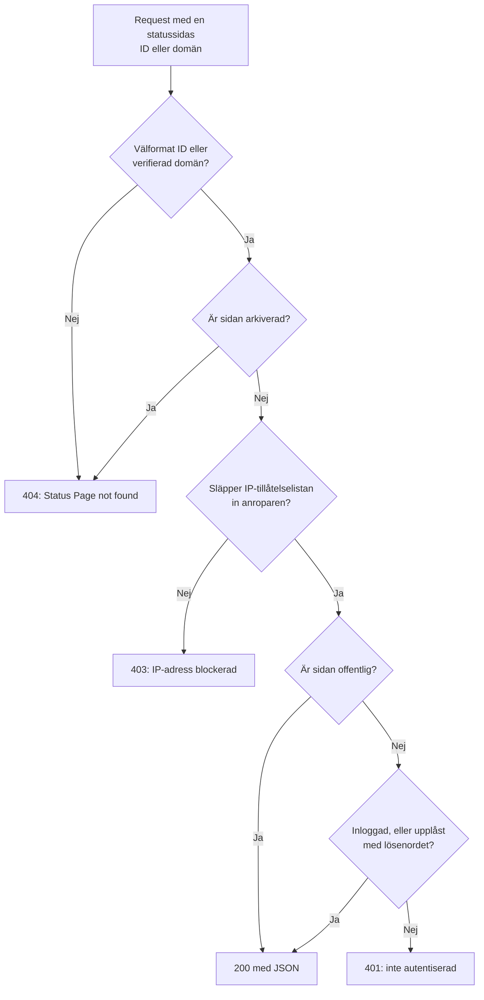

# Offentligt API

Varje statussida svarar på en liten uppsättning JSON-endpoints som bara läser: dess översikt, drifttid, incidenter, episoder, planerade underhållshändelser och meddelanden. Det är de endpoints som statussidan själv läser in, så de returnerar exakt det som en besökare ser, och en offentlig sida behöver ingen API-nyckel. Använd dem för att visa din status i din egen app, en chattbot eller på en väggskärm.

:::cards
- [Endpoints](#endpoints): En endpoint för varje sak som sidan visar.
- [Läs översikten](#läs-översikten): Hela sidan i en request, med curl, Node.js och Python.
- [Drifttid för ett datumintervall](#drifttid-för-ett-datumintervall): Drifttid per resurs och grupp, för upp till 90 dagar.
- [Fel](#fel): Vad varje statuskod betyder.
:::

## Så besvaras en request

Varje request anger statussidan med dess ID eller med en av dess anpassade domäner. OneUptime hittar sidan, tillämpar samma åtkomstregler som en besökare möter och svarar med JSON.



En privat sida svarar bara en webbläsare som har loggat in på den eller låst upp den med dess lösenord: API:et läser samma session som sidan. Använd en offentlig sida för ett skript. Se [Begränsa vem som kan se sidan](/docs/status-pages/index#begränsa-vem-som-kan-se-sidan).

Ett välformat ID som ingen statussida har går samma väg som en privat sida och får svaret `401`. Om en offentlig sida svarar `401`, kontrollera ID:t.

## Innan du börjar

- **Statussidans ID.** Öppna sidan i instrumentpanelen (**Statussidor → Alla statussidor**, sedan sidan). Kortet **Detaljer för statussida** på dess **Översikt** visar **Statussidans ID**.
- **Bas-URL:en.** Alla endpoints nedan ligger under `/status-page-api`:

| Var sidan körs | Bas-URL |
| ------------------- | -------- |
| OneUptime Cloud | `https://oneuptime.com/status-page-api` |
| OneUptime i egen drift | `https://<your-oneuptime-host>/status-page-api` |
| En anpassad domän för sidan | `https://status.example.com/status-page-api` |

Där en sökväg nedan säger `{statusPageIdOrDomain}` kan du skicka sidans ID eller en av dess verifierade anpassade domäner, till exempel `status.example.com`. Drifttidsendpointen tar bara ID:t och svarar på en domän med `401`.

## Endpoints

| Endpoint | Metoder | Returnerar |
| -------- | ------- | ------- |
| `/overview/{statusPageIdOrDomain}` | `GET`, `POST` | Allt som översikten visar: den samlade statusen, resurser och grupper, aktiva incidenter och episoder, planerat underhåll, aktuella meddelanden och datan bakom drifttidsstaplarna. |
| `/uptime/{statusPageId}` | `POST` | Drifttid i procent per resurs och per grupp, för ett datumintervall. |
| `/incidents/{statusPageIdOrDomain}` | `GET`, `POST` | Incidenterna som sidan listar, med deras offentliga anteckningar och tillståndsändringar. |
| `/incidents/{statusPageIdOrDomain}/{incidentId}` | `POST` | En incident. |
| `/episodes/{statusPageIdOrDomain}` | `POST` | Incidentepisoderna som sidan listar. |
| `/episodes/{statusPageIdOrDomain}/{episodeId}` | `POST` | En episod. |
| `/scheduled-maintenance-events/{statusPageIdOrDomain}` | `GET`, `POST` | De planerade underhållshändelserna som sidan listar, med deras offentliga anteckningar och tillståndsändringar. |
| `/scheduled-maintenance-events/{statusPageIdOrDomain}/{scheduledMaintenanceId}` | `POST` | En planerad underhållshändelse. |
| `/announcements/{statusPageIdOrDomain}` | `GET`, `POST` | Meddelandena som sidan listar. |
| `/announcements/{statusPageIdOrDomain}/{announcementId}` | `POST` | Ett meddelande. |

Endpoints följer sidans egna inställningar, i kortet **Vad din statussida visar** (se [Välja vad som visas på sidan](/docs/status-pages/index#välja-vad-som-visas-på-sidan)):

- En lista som är avstängd avvisar sin endpoint, till exempel med `Incidents are not enabled on this status page.`
- Varje lista sträcker sig så långt bakåt som dess inställning **Visa de senaste … dagarna** (14 som standard). Incidentlistan tar dessutom med varje incident som inte är löst än, och listan över planerat underhåll varje händelse som ännu inte har börjat eller pågår.
- Via sitt ID returneras en incident, episod, händelse eller ett meddelande oavsett ålder, så en länk till en äldre fortsätter att fungera. En som sidan inte visar alls, till exempel en incident på en monitor som inte finns på sidan, kommer tillbaka som en tom lista, och en episod som `404`.

**Vilka incidenter en sida returnerar.** Incidentendpointen returnerar incidenterna på sidans monitorer, minus de som är begränsade till andra statussidor, och minus varje incident som inte är begränsad till den här sidan om sidan bara visar incidenter som är begränsade till den (se [En statussida per målgrupp](/docs/status-pages/one-status-page-per-audience)). Vilka sidor en incident är begränsad till ingår aldrig i svaret.

## Läs översikten

Översikten är en enda request för hela sidan. Det är samma data som statussidan ritar, och den är högst 15 sekunder gammal.

:::tabs
@tab curl
```bash
curl https://oneuptime.com/status-page-api/overview/YOUR_STATUS_PAGE_ID
```
@tab Node.js
```javascript title="status.mjs"
// Node.js 18 or later: fetch is built in. Run with `node status.mjs`.
const statusPageId = "YOUR_STATUS_PAGE_ID";

const response = await fetch(
  `https://oneuptime.com/status-page-api/overview/${statusPageId}`,
);
const body = await response.json();

if (!response.ok) {
  throw new Error(`${response.status}: ${body.error}`);
}

console.log(body.overallStatus?.name); // "Operational"
```
@tab Python
```python title="status.py"
# Python 3, standard library only. Run with `python3 status.py`.
import json
import urllib.request

STATUS_PAGE_ID = "YOUR_STATUS_PAGE_ID"
url = f"https://oneuptime.com/status-page-api/overview/{STATUS_PAGE_ID}"

with urllib.request.urlopen(url, timeout=10) as response:
    overview = json.load(response)

print((overview.get("overallStatus") or {}).get("name"))  # Operational
```
:::

Den samlade statusen är den sämsta aktuella statusen bland monitorerna och monitorgrupperna på sidan, den med högst prioritet. En monitorstatus ser ut så här:

```json
{
  "_id": "cc80b385-4190-42a3-ae8b-9b391e90d79f",
  "name": "Operational",
  "color": { "_type": "Color", "value": "#2ab57d" },
  "isOperationalState": true,
  "priority": 1
}
```

### Vad översikten returnerar

| Nyckel | Vad den innehåller |
| --- | ------------- |
| `overallStatus` | Sidans samlade status, en monitorstatus som ovan. En sida utan något på får projektets status med lägst prioritet. |
| `statusPage` | Sidans offentliga inställningar: rubrik, beskrivning, varumärke och vad den visar. |
| `statusPageResources` | Varje resurs: visningsnamn, beskrivning, grupp, monitor eller monitorgrupp och visningsalternativ. |
| `resourceGroups` | Grupperna, med `parentStatusPageGroupId` för nästlade grupper. |
| `monitorStatuses` | Alla monitorstatusar i projektet, från lägst prioritet till högst. |
| `monitorGroupCurrentStatuses`, `monitorsInGroup` | Aktuell status för varje monitorgrupp på sidan, och monitorerna i den. |
| `monitorStatusTimelines`, `uptimeDailyAggregate`, `monitorGroupMergedDowntime`, `statusPageHistoryChartBarColorRules` | Det som drifttidsstaplarna ritas utifrån, och sidans färgregler för staplarna. |
| `activeIncidents`, `incidentPublicNotes`, `incidentStateTimelines`, `incidentStates` | De olösta incidenter som sidan visar, deras offentliga anteckningar och tillståndsändringar, och projektets incidenttillstånd. |
| `timelineIncidents` | Incidenterna i drifttidsstaplarnas tidsfönster, lösta inräknade, för staplarnas verktygstips. |
| `activeEpisodes`, `episodePublicNotes`, `episodeStateTimelines` | Samma sak för incidentepisoder. |
| `scheduledMaintenanceEvents`, `scheduledMaintenanceEventsPublicNotes`, `scheduledMaintenanceStateTimelines`, `scheduledMaintenanceStates` | De planerade underhållshändelser som ännu inte har börjat eller pågår, deras offentliga anteckningar och tillståndsändringar. |
| `activeAnnouncements` | Meddelandena som visas nu: påbörjade och inte avslutade. |

## Drifttid för ett datumintervall

`POST /uptime/{statusPageId}` returnerar drifttiden för varje resurs och grupp på sidan mellan två datum. Båda datumen är valfria:

| Fält | Standard | Anmärkningar |
| ----- | ------- | ----- |
| `startDate` | För 14 dagar sedan | Ett datum och en tid enligt ISO 8601. |
| `endDate` | Nu | Får inte ligga före `startDate`. Intervallet får omfatta högst 90 dagar. |

:::tabs
@tab curl
```bash
curl -X POST https://oneuptime.com/status-page-api/uptime/YOUR_STATUS_PAGE_ID \
  -H "Content-Type: application/json" \
  -d '{"startDate": "2026-09-01T00:00:00Z", "endDate": "2026-09-30T23:59:59Z"}'
```
@tab Node.js
```javascript title="uptime.mjs"
// Node.js 18 or later. Run with `node uptime.mjs`.
const statusPageId = "YOUR_STATUS_PAGE_ID";

const response = await fetch(
  `https://oneuptime.com/status-page-api/uptime/${statusPageId}`,
  {
    method: "POST",
    headers: { "Content-Type": "application/json" },
    body: JSON.stringify({
      startDate: "2026-09-01T00:00:00Z",
      endDate: "2026-09-30T23:59:59Z",
    }),
  },
);
const uptime = await response.json();

for (const group of uptime.groupUptimes) {
  console.log(group.statusPageGroupName, group.uptimePercent);
}
```
@tab Python
```python title="uptime.py"
# Python 3, standard library only. Run with `python3 uptime.py`.
import json
import urllib.request

STATUS_PAGE_ID = "YOUR_STATUS_PAGE_ID"

request = urllib.request.Request(
    f"https://oneuptime.com/status-page-api/uptime/{STATUS_PAGE_ID}",
    data=json.dumps(
        {"startDate": "2026-09-01T00:00:00Z", "endDate": "2026-09-30T23:59:59Z"}
    ).encode(),
    headers={"Content-Type": "application/json"},
    method="POST",
)

with urllib.request.urlopen(request, timeout=10) as response:
    uptime = json.load(response)

for group in uptime["groupUptimes"]:
    print(group["statusPageGroupName"], group["uptimePercent"])
```
:::

Svaret:

```json
{
  "statusPageResourceUptimes": [
    {
      "statusPageResourceId": {
        "_type": "ObjectID",
        "value": "cfffa3c3-fdf3-4cd7-9585-d6d408a14663"
      },
      "uptimePercent": 99.98,
      "statusPageResourceName": "Checkout API",
      "currentStatus": {
        "_id": "cc80b385-4190-42a3-ae8b-9b391e90d79f",
        "name": "Operational",
        "color": { "_type": "Color", "value": "#2ab57d" },
        "isOperationalState": true,
        "priority": 1
      }
    }
  ],
  "groupUptimes": [
    {
      "statusPageGroupId": {
        "_type": "ObjectID",
        "value": "df7632c4-c5c0-453c-88bf-9ee3d68d45f2"
      },
      "parentStatusPageGroupId": null,
      "uptimePercent": 99.98,
      "statusPageResourceUptimes": [
        {
          "statusPageResourceId": {
            "_type": "ObjectID",
            "value": "8175534f-aa77-456c-ad5b-b8e7b85876aa"
          },
          "uptimePercent": 99.98,
          "statusPageResourceName": "Web app",
          "currentStatus": {
            "_id": "cc80b385-4190-42a3-ae8b-9b391e90d79f",
            "name": "Operational",
            "color": { "_type": "Color", "value": "#2ab57d" },
            "isOperationalState": true,
            "priority": 1
          }
        }
      ],
      "statusPageGroupName": "Web",
      "currentStatus": {
        "_id": "cc80b385-4190-42a3-ae8b-9b391e90d79f",
        "name": "Operational",
        "color": { "_type": "Color", "value": "#2ab57d" },
        "isOperationalState": true,
        "priority": 1
      }
    }
  ],
  "startDate": "2026-09-01T00:00:00.000Z",
  "endDate": "2026-09-30T23:59:59.000Z"
}
```

| Nyckel | Vad den innehåller |
| --- | ------------- |
| `statusPageResourceUptimes` | Resurserna som inte ligger i någon grupp, de som besökarna ser högst upp på sidan. |
| `groupUptimes` | En post per grupp. En grupps `uptimePercent` och `currentStatus` täcker varje resurs under den, nästlade grupper inräknade; dess `statusPageResourceUptimes` listar bara resurserna som ligger direkt i den. Bygg upp trädet igen med `parentStatusPageGroupId`. |
| `uptimePercent` | Avrundad till resursens eller gruppens egen precision. `null` när resursen eller gruppen inte visar någon drifttid i procent. |
| `currentStatus` | `null` när resursen eller gruppen inte visar sin aktuella status. |

Tid räknas som driftstopp när dess monitorstatus är en av sidans statusar under **Räknas som driftstopp**.

## Incidenter, episoder, underhåll och meddelanden

Listendpoints svarar på `GET` likaväl som `POST`; endpoints för enskilda poster och episodendpoints svarar på `POST`.

:::tabs
@tab curl
```bash
# The incidents the page lists
curl https://oneuptime.com/status-page-api/incidents/YOUR_STATUS_PAGE_ID

# One scheduled maintenance event
curl -X POST https://oneuptime.com/status-page-api/scheduled-maintenance-events/YOUR_STATUS_PAGE_ID/EVENT_ID
```
@tab Node.js
```javascript title="incidents.mjs"
// Node.js 18 or later. Run with `node incidents.mjs`.
const statusPageId = "YOUR_STATUS_PAGE_ID";

const response = await fetch(
  `https://oneuptime.com/status-page-api/incidents/${statusPageId}`,
);
const { incidents } = await response.json();

for (const incident of incidents) {
  console.log(incident.title, incident.currentIncidentState?.name);
}
```
@tab Python
```python title="incidents.py"
# Python 3, standard library only. Run with `python3 incidents.py`.
import json
import urllib.request

STATUS_PAGE_ID = "YOUR_STATUS_PAGE_ID"
url = f"https://oneuptime.com/status-page-api/incidents/{STATUS_PAGE_ID}"

with urllib.request.urlopen(url, timeout=10) as response:
    incidents = json.load(response)["incidents"]

for incident in incidents:
    print(incident["title"], (incident.get("currentIncidentState") or {}).get("name"))
```
:::

| Endpoint | Nycklar i svaret |
| -------- | -------------------- |
| Incidenter | `incidents`, `incidentPublicNotes`, `incidentStateTimelines`, `incidentStates`, `statusPageResources`, `monitorsInGroup` |
| Episoder | `episodes`, `episodePublicNotes`, `episodeStateTimelines`, `incidentStates`, `statusPageResources`, `monitorsInGroup` |
| Planerade underhållshändelser | `scheduledMaintenanceEvents`, `scheduledMaintenanceEventsPublicNotes`, `scheduledMaintenanceStateTimelines`, `scheduledMaintenanceStates`, `statusPageResources`, `monitorsInGroup` |
| Meddelanden | `announcements`, `statusPageResources`, `monitorsInGroup` |

En request efter en enskild post svarar med samma nycklar, som innehåller den enda posten.

## Fel

Ett fel svarar med en statuskod och JSON-innehåll som säger varför:

```json
{ "error": "You can only get uptime for 90 days. Please select a date range within 90 days." }
```

| Status | När |
| ------ | ---- |
| `400` | Requesten frågar efter något som sidan inte visar, till exempel en avstängd lista, eller drifttidsintervallet är längre än 90 dagar eller slutar innan det börjar. |
| `401` | Sidan är privat, och requesten har varken en inloggad session eller lösenordet till den. Ett välformat ID som ingen statussida har får också svaret `401`. |
| `403` | Sidans IP-tillåtelselista innehåller inte anroparens adress. |
| `404` | ID:t är inte välformat, ingen verifierad anpassad domän matchar, eller sidan är arkiverad. En episod som sidan inte visar får också svaret `404`. |

## Andra sätt att läsa en statussida

- **RSS.** Varje statussida tillhandahåller `/rss`, ett flöde med dess incidenter, meddelanden och planerade underhållshändelser. Se [Den inbäddbara brickan och RSS-flödet](/docs/status-pages/index#den-inbäddbara-brickan-och-rss-flödet).
- **llms.txt.** Bredvid `/rss` tillhandahåller varje statussida `/llms.txt`, som visar AI-agenter vägen till RSS-flödet och översiktens JSON.
- **MCP.** AI-agenter kan läsa sidan via OneUptimes MCP-server på `https://oneuptime.com/mcp`, utan API-nyckel, genom att ange sidans ID eller domän som `statusPageIdOrDomain`. Den är påslagen som standard; stäng av den med **Aktivera MCP-server** under **AI → MCP** i sidans sidomeny. Se [MCP-server](/docs/ai/mcp-server).
- **REST-API:et.** För att skapa eller ändra statussidor, resurser, prenumeranter och meddelanden använder du [OneUptime-API:et](/docs/api-reference/api-reference) med en API-nyckel.

## Nästa steg

:::cards
- [Statussidor – Översikt](/docs/status-pages/index): Vad en statussida visar, och vem som kan se den.
- [Statussidans resurser och grupper](/docs/status-pages/resources-and-groups): Resurserna och grupperna som de här endpoints returnerar.
- [En statussida per målgrupp](/docs/status-pages/one-status-page-per-audience): Varför en sida listar en incident som en annan inte listar.
- [Statussidans varumärke och domäner](/docs/status-pages/branding-and-domains): Tillhandahåll sidan, och de här endpoints, på din egen domän.
:::
