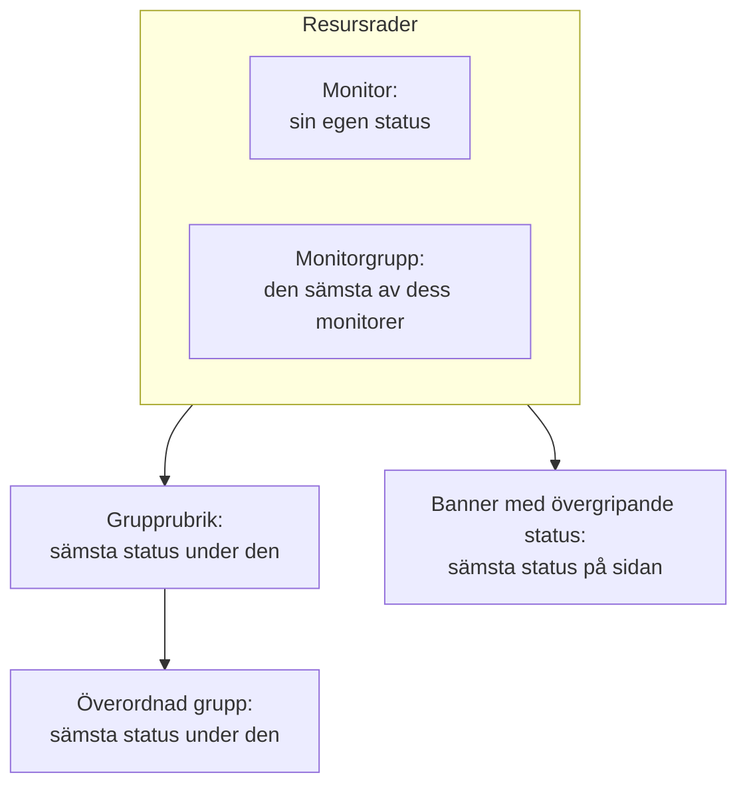

# Statussidans resurser och grupper

En resurs är en rad på din statussida: en monitor eller en monitorgrupp, med ett namn som dina kunder förstår, dess aktuella status och, om du vill, dess upptid och historik. Grupper är sektioner som innehåller resurser, så att en sida med fyrtio monitorer läses som "API", "Webbapp" och "Datapipeline" i stället för som en ändlös lista. Du bygger båda på en och samma skärm: öppna en statussida och välj **Resurser** i dess sidomeny.

:::cards
- [Lägg till en monitor](#lägg-till-en-monitor): Lägg en monitor på sidan, med namnet som besökarna läser.
- [Grupper](#grupper): Dela upp sidan i sektioner och nästla dem.
- [Monitorregler](#lägg-till-monitorer-automatiskt-med-monitorregler): Låt en regel lägga till alla matchande monitorer åt dig.
- [Importera grupper från CSV](#importera-grupper-från-csv): Bygg en djup hierarki på en gång.
:::

Besökare avgör utifrån de här raderna om "det är jag eller de", så ge dem de namn som kunderna använder om din produkt: **Checkout API**, inte `prod-checkout-lb-healthcheck-us-east-1`.

## Hur en status rör sig uppåt på sidan

Varje rad visar den aktuella statusen för sin monitor. Varje nivå ovanför visar den sämsta statusen av allt under den, där den sämsta statusen är den med högst prioritet bland ditt projekts monitorstatusar.

En resurs avgör mer än färgen på sin rad:

- **Arkiverade monitorer visas inte.** En arkiverad monitor kontrolleras inte längre, så dess senaste status är fryst; sidan utelämnar dess rad (och utelämnar den från en monitorgrupps status) i stället för att visa den frysta statusen som om den vore aktuell. Raden behålls, så när monitorn tas ur arkivet kommer den direkt tillbaka.
- **Resurser avgör vilka incidenter sidan visar.** En incident visas här, och sidans prenumeranter får höra om den, när en av incidentens monitorer är en resurs på sidan, direkt eller via en monitorgrupp. Lägg samma monitor på flera sidor så når dess incidenter alla, om inte en incident är begränsad till några av de sidorna. Se [En statussida per målgrupp](/docs/status-pages/one-status-page-per-audience).
- **En monitorgrupps rad står för varje monitor i den, även för prenumeranter.** På en sida som låter prenumeranter välja resurser får den som prenumererar på en monitorgrupp höra om incidenter, planerat underhåll och meddelanden för alla monitorer i gruppen, som om personen hade valt den monitorn. Se [Prenumeranter och meddelanden](/docs/status-pages/subscribers#låta-prenumeranter-välja-resurser-och-händelsetyper).

## Skärmen Resurser

Objektet heter **Resurser** i projekt där monitorgrupper är aktiverade, och **Monitorer** i de övriga; det är samma skärm. Grupper hade tidigare en egen sida, och den gamla adressen `/groups` öppnar nu den här skärmen.

Skärmen är delad i två:

| Del | Vad den innehåller |
| ---- | ------------- |
| **Gruppnavigator** (till vänster) | Alla sidans grupper som ett träd, med rutan **Search groups...** ovanför och en räkning nedanför, som `3 groups · 12 resources`. En lång lista slutar med knappen **Show N more of M**. |
| **Top of page** | Navigatorns första rad: resurser utan grupp, som besökare ser först, ovanför alla grupper. På en sida utan grupper heter den högra panelen i stället **All resources**. |
| **Resurspanel** (till höger) | Den valda gruppens resurser. Dess rubrik innehåller **Edit Group**, huvudknappen **Lägg till monitor** och menyn **More actions**. |
| Kortets rubrik | **New Group** och en meny med tre punkter med **Import groups from CSV** och **Uppdatera**. |

**Tomma lägen berättar vad du ska göra.** En tom grupp visar **No monitors here yet** med **Lägg till monitor**, **Add Multiple** och, bara så länge sidan inte har några grupper alls, **Create a Group**. En sökning utan träffar visar **No resources match your search**.

## Lägg till en monitor

:::steps
### Välj var raden ska stå

Välj i gruppnavigatorn den grupp som resursen hör till, eller **Top of page** för en rad utan grupp.

### Klicka på Lägg till monitor

Dialogrutan **Add a monitor to {group}** öppnas. Den består av en sida.

### Välj monitorn

Välj den i **Övervakning** (platshållare **Välj övervakning**). **Visningsnamn**, texten som besökarna läser, fylls i med monitorns namn och följer med när du väljer en annan monitor, tills du skriver ett eget namn. Det lagras separat från monitorns eget namn, så att byta namn här ändrar ingenting i övervakningen.

### Ange visningsalternativen, om du vill

**Fler fält** är hopfällt. Det innehåller **Beskrivning** (valfri markdown som visas under raden, bra för en mening som förklarar vad tjänsten faktiskt gör; en bild i den visas för alla besökare) och [visningsalternativen](#visningsalternativ-för-en-resurs). Låt det vara stängt så får resursen deras standardvärden.

### Spara resursen

Klicka på **Lägg till monitor**. Raden visas i gruppen och på statussidan.
:::

I en rutnätsgrupp ber dialogrutan också om raden och kolumnen som monitorn ska stå i, ovanför **Fler fält**; se [Listlayout eller rutnätslayout](#listlayout-eller-rutnätslayout).

> [!TIP]
> För att visa flera kontroller som en rad lägger du till en monitorgrupp. Med reglaget **Monitorgrupper** aktiverat (**Projektinställningar** > **Avancerad** > **Funktionsflaggor**, som sparas så snart du slår om det) står det en länk under listrutan: **Add a Monitor Group instead.** Klicka på den så blir **Övervakning** till **Monitor Grupp** (**Välj övervakningsgrupp**); **Add a Monitor instead.** växlar tillbaka.

### Lägg till flera på en gång

**Add Multiple** (även **Add multiple monitors** i menyn **More actions**) öppnar **Add Multiple Monitors**. Den är också en sida: en flervalslista **Monitorer**, sedan samma hopfällda **Fler fält**, vars visningsalternativ gäller för varje monitor som du väljer. Varje resurs får sitt visningsnamn och sin beskrivning från sin monitor, och **Add Monitors** lägger till alla. Det är det snabbaste sättet att fylla en ny sida.

Flervalslistan har fliken **Etiketter**: klicka på en etikett så väljs alla monitorer med den på en gång.

### Det är säkert att lägga till efter etikett två gånger

En statussida visar en monitor en gång. Att lägga till är idempotent, så när du väljer samma etikett igen efter att ha gett några nya monitorer den läggs bara de nya till: monitorerna som redan finns på sidan förblir exakt som de är, med det visningsnamn och de alternativ som du gav dem.

Sammanfattningen efter tillägget av flera säger samma sak: tillagda monitorer listas under **Tillagd**, och de som redan fanns där under **Already Added**. Ingenting rapporteras som ett fel, och ingenting skrivs för dem.

Samma regel gäller överallt där en resurs skapas. Att lägga till en monitor som redan finns på sidan från formuläret för en monitor, eller att låta en befintlig resurs peka på den från redigeringsformuläret, avvisas med *"This monitor is already added to this status page"*, även när den befintliga resursen står i en annan grupp, eftersom en besökare ändå skulle se monitorn två gånger. För att visa en monitor i en annan grupp tar du bort den resurs som den redan har och lägger till den där du vill ha den.

## Visningsalternativ för en resurs

Sektionen **Fler fält** är densamma i formuläret för en monitor och i dialogrutan för flera. Den börjar hopfälld i båda, och även i **Redigera resurs**, där dess hopfällda rubrik visar vad i den som inte står på standardvärdet. Allt här gäller per resurs: två rader i samma grupp kan vara olika inställda.

| Fält | Standard | Vad det gör |
| ----- | ------- | ------------ |
| **Verktygstips** (`displayTooltip`) | Tomt | Visas som verktygstips bredvid resursen på din statussida. Använd det för omfattningen: "Kunder i USA och EU". |
| **Visa aktuell resursstatus** (`showCurrentStatus`) | På | Visar den aktuella statusen, som i drift, försämrad eller offline, bredvid raden. |
| **Visa upptid %** (`showUptimePercent`) | Av | Visar en upptidsprocent bredvid resursen. |
| **Välj precision för drifttid** (`uptimePercentPrecision`) | En decimal | Visas när **Visa upptid %** är aktiverat, och är då obligatoriskt. |
| **Visa statushistorikdiagram** (`showStatusHistoryChart`) | På | Visar resursens dagliga staplar med upptidshistorik. |

**Visningsnamn** (`displayName`) och **Beskrivning** (`displayDescription`) är också bara för visning: de ändrar aldrig själva monitorn.

## Upptidsprocent och historikdiagram

**Visa upptid %** och **Visa statushistorikdiagram** läser båda en enda inställning för hela sidan: hur många dagar de täcker. Det är **Upptidshistorik** på kortet **Vad din statussida visar** under **Statussidor → din sida → Avancerad → Avancerade inställningar**. Den accepterar 1 till 90 dagar och är 90 som standard. Aktivera alltså reglagen per resurs och ange fönstret en gång för hela sidan.

**Precision är en bedömningsfråga.** **Välj precision för drifttid** erbjuder `99% (No Decimal)`, `99.9% (One Decimal)`, `99.99% (Two Decimal)` och `99.999% (Three Decimal)`. Fler decimaler ser exakta ut och bjuder in till diskussioner om den tredje; publicerar du ett SLA på tre nior, matcha det och inte mer.

Grupper har sina egna varianter av de här reglagen (se nedan), så en grupp kan visa en sammanlagd procent medan monitorerna i den håller tyst, eller tvärtom.

Färgerna på historikdiagrammets staplar anges under **Fler inställningar** på sidan **Varumärke**, och vilka monitorstatusar som räknas som "nere" under **Räknas som driftstopp**, på kortet **Vad din statussida visar** under **Avancerade inställningar**; båda beskrivs i [Statussidans varumärke och domäner](/docs/status-pages/branding-and-domains).

## Grupper

De flesta grupper behöver bara ett namn.

:::steps
### Klicka på New Group

**Create New Status Page Group** öppnas: två fält och sedan två hopfällda sektioner.

### Namnge gruppen

Skriv **Gruppnamn**: den sektionsrubrik som besökarna ser.

### Nästla den, om den hör hemma i en annan grupp

Välj en **Parent Group**, eller låt den stå på **No parent group (top level)**. **Add a sub group** i en grupps menyer fyller i det här åt dig.

### Skapa gruppen

Klicka på **Create Status Page Group**. Gruppen visas i navigatorn, redo för monitorer.
:::

De två fälten är **Gruppnamn** (`name`) och **Parent Group** (`parentStatusPageGroupId`). De två hopfällda sektionerna innehåller resten:

- **Layout**: dess hopfällda rubrik säger **List** eller **Grid**. Den innehåller **Visningsläge** och ett rutnäts axlar (se [Listlayout eller rutnätslayout](#listlayout-eller-rutnätslayout)), och den öppnas av sig själv på en rutnätsgrupp.
- **Fler fält**: gruppnivåns varianter av resursalternativen:
  - **Gruppbeskrivning** (`description`): valfri markdown, visas under rubriken. En bild i den visas för alla besökare.
  - **Expandera på statussidan som standard** (`isExpandedByDefault`): på som standard; avgör om sektionen börjar öppen eller hopfälld för besökare.
  - **Visa aktuell gruppstatus** (`showCurrentStatus`): på som standard. Visar en status bredvid grupprubriken.
  - **Visa upptid %** (`showUptimePercent`): av som standard, med **Välj precision för drifttid** när det är aktiverat.

För att ändra en grupp använder du **Edit Group** i panelens rubrik, eller **Edit group** i navigatorns radmeny: **Edit Status Page Group** öppnas, med knappen **Spara ändringar**. Panelens rubrik visar märken för de inställningar som är på (**Grid**, **Collapsed by default**, **Uptime %**), så att du ser hur en grupp är inställd utan att öppna formuläret.

### Hantera en grupp

| Var | Åtgärder |
| ----- | ------- |
| Navigatorns radmeny | **Edit group**, **Move up**, **Move down**, **Visa ID**, **Delete group** |
| Panelens meny **More actions** | **Edit this group**, **Add a sub group**, **Move group up**, **Move group down**, **Show group ID**, **Uppdatera**, **Delete this group** |

En grupp som sparats utan namn visas som **Untitled group**, ett gott tecken på att du tänkte skriva något.

## Nästla grupper

Grupper kan nästlas: ange **Parent Group** på undergruppen, eller använd **Add a sub group inside this group** i navigatorn. Formulärets hjälptext beskriver den form som det är byggt för (ungefär Affärsenheter › Region › Marknad), och varje nivå visar den sammanlagda statusen och upptiden för allt under den.

När en grupp har undergrupper visar resurspanelen en rad med märken **Sub groups** som länkar direkt till varje undergrupp, så att du kan gå igenom hierarkin utan att gå tillbaka till navigatorn.

Nästling lönar sig på stora sidor: en hostingleverantör med regioner inuti produkter, eller en återförsäljare med marknader inuti affärsenheter. På en sida med tolv monitorer är en enda platt nivå vänligare.

## Listlayout eller rutnätslayout

Sektionen **Layout** i gruppformuläret anger gruppens **Visningsläge** (`viewMode`), som ändrar hur gruppen visas på statussidan.

| Om du vill… | Välj |
| --------------- | ---- |
| Visa en enkel lodrät lista över tjänster, en per rad | **List** (standard) |
| Visa samma tjänst i flera regioner eller hyresgäster som en matris | **Grid** |

Välj **Grid** så visas ytterligare fyra fält:

| Fält | Vad du ska ange |
| ----- | ------------- |
| **Etikett för radaxel** | Namnet på raddimensionen, platshållare `Service`. |
| **Värden för radaxel** | Raderna, tillagda en i taget med **Add Row** (platshållare `e.g. Auth`). |
| **Etikett för kolumnaxel** | Kolumndimensionen, platshållare `Region`. |
| **Värden för kolumnaxel** | Kolumnerna, tillagda med **Add Column** (platshållare `e.g. US-East`). |

Varje monitor i en rutnätsgrupp står i en cell, så **Lägg till monitor** och dialogrutan för flera ber om raden och kolumnen tillsammans med monitorn, med dina egna axeletiketter.

> [!IMPORTANT]
> Ställ in axlarna innan du lägger till monitorer. En rutnätsgrupp utan rader eller kolumner visar ett meddelande om att det ännu inte finns någonstans att lägga en monitor, med knappen **Set up the grid** som öppnar gruppens formulär på sektionen **Layout**, och gruppens knapp **Lägg till monitor** är borta tills du har gjort det.

## Ordningen på det som besökarna ser

Ordningen bestämmer du själv, inte alfabetet:

| Vad | Så ändrar du ordningen |
| ---- | ----------------- |
| Resurser i en grupp | Dra en rad. Panelen säger det: **Drag a row to change the order visitors see**. |
| Grupper i förhållande till varandra | **Move up** / **Move down** i navigatorns radmeny, eller **Move group up** / **Move group down** i **More actions**. |
| Resurser utan grupp | De står i **Top of page** och visas alltid ovanför alla grupper, så lägg det som alla kontrollerar först där. |

**Två fall där dragning är avstängd.** En sökning i rutan **Search in {group}...** stänger av omordning (panelen säger `N of M shown · drag to reorder is off while filtering`), så rensa sökningen först. Och rutnätsgrupper ordnas aldrig om genom att dra, eftersom en monitors plats kommer från dess rad och kolumn.

Lägg den tjänst som folk frågar mest om överst. Besökare som kommer till sidan under ett avbrott slutar oftast läsa efter första skärmen.

## Lägg till monitorer automatiskt med monitorregler

En monitorregel lägger till monitorer på sidan åt dig: beskriv monitorerna en gång, så hamnar varje monitor som matchar i den grupp som du valde. Regler finns under **Resurser → Monitor Rules**, bredvid skärmen Resurser.

:::steps
### Öppna Monitor Rules

Öppna statussidan, välj **Monitor Rules** i sektionen **Resurser** i dess sidomeny och klicka på **Skapa Status Page Monitor Rule**.

### Namnge regeln

Ange ett **Namn** under **Grundläggande information**. **Aktiverad** är på som standard.

### Ange vilka monitorer den matchar

Under **Matchningskriterier** fyller du i minst ett av **Övervakningsetiketter** (en monitor med någon av dem matchar), **Övervakningsnamn** och **Övervakningsbeskrivning**. En monitor måste uppfylla varje kriterium som du fyller i. De två mönstren accepterar ett reguljärt uttryck utan skillnad på versaler och gemener (`^api-.*`) eller ett jokertecken `*` (`*checkout*`); `.*` matchar alla monitorer.

### Välj gruppen

Under **Grupp** väljer du **Add Monitors To Group**, eller lämnar det tomt för att lägga till monitorerna utan grupp. Därefter följer samma visningsalternativ som för en resurs; på en regel börjar **Visa upptid %** aktiverat.

### Spara regeln

Regeln körs direkt mot alla monitorer som redan finns, och listan visar under **Adds Monitors To** den grupp som den lägger till monitorer i.
:::

Därefter körs en regel igen för en monitor varje gång en skapas eller när dess etiketter, namn eller beskrivning ändras. En regel tar bara bort de resurser som den själv har lagt till: att stänga av den eller ta bort den tar bort dem från sidan, och en monitor som du har lagt till för hand rörs aldrig. En monitor som redan finns på sidan läggs aldrig till två gånger.

## Importera grupper från CSV

Det är mödosamt att bygga en djup hierarki för hand. **Import groups from CSV** i kortrubrikens meny med tre punkter öppnar dialogrutan **Import Groups from CSV**.

:::steps
### Ladda ned mallen

Klicka på **Download CSV Template** för att hämta `status-page-groups-template.csv`.

### Fyll i den

En rad per grupp. Bara `name` är obligatoriskt; kolumnerna listas nedan.

### Ladda upp och förhandsgranska

Klicka på **Choose CSV File**, välj din fil och sedan **Preview Import** för att kontrollera vad som kommer att skapas innan något skrivs.

### Importera

Kör importen. Tabellen **Import results** listar varje rad som **Skapad**, **Misslyckades** eller **Hoppade över**, med orsaken, så att en felaktig rad aldrig försvinner i tysthet.
:::

| Kolumn | Vad den anger |
| ------ | ------------ |
| `name` | Gruppens namn. Obligatoriskt. |
| `parentName` | Namnet på den grupp som den här är nästlad i. |
| `description` | Gruppens beskrivning. |
| `isExpandedByDefault` | Om sektionen börjar öppen för besökare. |
| `showCurrentStatus` | Om en status visas bredvid grupprubriken. |
| `showUptimePercent` | Om en upptidsprocent visas bredvid gruppen. |
| `uptimePercentPrecision` | Hur många decimaler procenten använder. |
| `viewMode` | `List` eller `Grid`. |
| `rowAxisLabel` | Raddimensionens namn, för en rutnätsgrupp. |
| `rowAxisValues` | Radvärdena, för en rutnätsgrupp. |
| `columnAxisLabel` | Kolumndimensionens namn, för en rutnätsgrupp. |
| `columnAxisValues` | Kolumnvärdena, för en rutnätsgrupp. |

Importen skapar grupper, inte resurser: lägg till monitorer efteråt med **Lägg till monitor**, **Add Multiple** eller en monitorregel.

## Felsökning

:::details "This monitor is already added to this status page"
En sida visar varje monitor en gång, även över grupper. Monitorn har redan en resurs, kanske i en annan grupp eller tillagd av en monitorregel. Sök efter den i navigatorn, ta bort den resursen och lägg till monitorn där du vill ha den.
:::

:::details En monitor som jag lade till visas inte på statussidan
Kontrollera om monitorn är arkiverad: en arkiverad monitors rad utelämnas tills du tar den ur arkivet. Kontrollera också gruppen: en grupp som är inställd på att börja hopfälld (**Expandera på statussidan som standard** av) döljer sina rader tills en besökare öppnar den.
:::

:::details Det finns ingen knapp Lägg till monitor i en rutnätsgrupp
Rutnätet har ännu inga rader eller kolumner. Klicka på **Set up the grid**, lägg till axelvärdena i sektionen **Layout**, så kommer **Lägg till monitor** tillbaka.
:::

:::details Jag kan inte dra rader
Rensa rutan **Search in {group}...**: omordning är avstängd medan panelen är filtrerad. Rutnätsgrupper ordnas aldrig om genom att dra.
:::

## Nästa steg

:::cards
- [Statussidans varumärke och domäner](/docs/status-pages/branding-and-domains): Logotyp, favicon, historikdiagrammets färger och din egen domän.
- [Prenumeranter och meddelanden](/docs/status-pages/subscribers): Vem som får veta när de här resurserna ändras.
- [En statussida per målgrupp](/docs/status-pages/one-status-page-per-audience): Samma monitor på många sidor, och en incident som bara når några av dem.
- [Offentligt API](/docs/status-pages/public-api): Läs resurser, grupper och upptid som JSON.
:::
