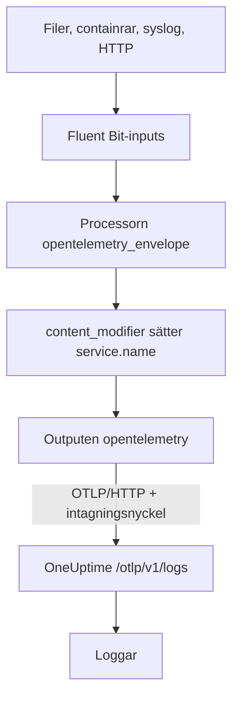

# Fluent Bit

[Fluent Bit](https://docs.fluentbit.io/manual) är en lätt agent som samlar in loggar från filer, systemd, containrar, syslog, HTTP och många andra källor. Dess [OpenTelemetry-output](https://docs.fluentbit.io/manual/pipeline/outputs/opentelemetry) skickar det den samlar in till OneUptimes OpenTelemetry-endpoint (OTLP), där loggarna blir sökbara under **Produkter → Loggar**.

:::cards
- [Konfigurera Fluent Bit](#konfigurera-fluent-bit): Lägg till OpenTelemetry-outputen och namnge din tjänst.
- [Fullständigt exempel](#fullständigt-exempel): En hel konfigurationsfil att utgå från.
- [OneUptime i egen drift](#oneuptime-i-egen-drift): Peka Fluent Bit mot din egen instans.
:::

## Så fungerar det



Fluent Bit packar in varje post i ett OpenTelemetry-kuvert, så att den kan bära resursattribut som `service.name`. OpenTelemetry-outputen skickar sedan posterna till OneUptime med din intagningsnyckel i headern `x-oneuptime-token`. OneUptime sparar dem under den tjänst som `service.name` anger och skapar tjänsten första gången den skickar.

## Innan du börjar

- **Installera Fluent Bit** – se [installationsguiden](https://docs.fluentbit.io/manual/installation/getting-started-with-fluent-bit). Konfigurationen på den här sidan använder Fluent Bits YAML-format och processorn `opentelemetry_envelope`, så använd en aktuell version.
- **Ett OneUptime-projekt.** I OneUptime Cloud debiteras telemetri per intagen GB – se [priser](https://oneuptime.com/pricing) – och ett projekt på Free-planen behöver en betalningsmetod innan det kan skicka telemetri.
- **En intagningsnyckel för telemetri.** Om du inte har någon:

:::steps
### Öppna intagningsnycklarna

Gå till **Produkter → Projektinställningar**, öppna **Telemetri och APM** i sidomenyn och välj **Intagningsnycklar**.


### Skapa en nyckel

Klicka på **Skapa ingestion-nyckel**. Dialogen har redan fyllt i nyckelns namn och valt **Server** – den sortens nyckel som en applikation eller en collector skickar med – så klicka på **Skapa ingestion-nyckel** för att skapa den, eller byt namn på den först.

### Kopiera hemligheten

Den nya nyckeln öppnas på en egen sida. Kopiera dess **Hemlig nyckel**: det är `YOUR_TELEMETRY_INGESTION_TOKEN` i konfigurationen nedan.


:::

## Konfigurera Fluent Bit

Fluent Bit läser sin YAML-konfiguration från en fil som `/etc/fluent-bit/fluent-bit.yaml`.

:::steps
### Lägg till OpenTelemetry-outputen

Lägg till en `opentelemetry`-output som skickar till OneUptime. Behåll `stdout`-outputen medan du testar om du vill se posterna lokalt:

```yaml title="fluent-bit.yaml"
pipeline:
  outputs:
    - name: stdout
      match: "*"
    - name: opentelemetry
      match: "*"
      host: "oneuptime.com"
      port: 443
      metrics_uri: "/otlp/v1/metrics"
      logs_uri: "/otlp/v1/logs"
      traces_uri: "/otlp/v1/traces"
      tls: On
      header:
        - x-oneuptime-token YOUR_TELEMETRY_INGESTION_TOKEN
```

### Packa in loggarna i ett OpenTelemetry-kuvert och namnge tjänsten

Lägg till processorn `opentelemetry_envelope` på varje input, följd av en `content_modifier` som sätter `service.name`. Ersätt `YOUR_SERVICE_NAME` med namnet som loggarna ska visas under i OneUptime:

```yaml title="fluent-bit.yaml"
pipeline:
  inputs:
    - name: tail # or any other input
      path: /var/log/my-app/*.log

      processors:
        logs:
          - name: opentelemetry_envelope

          - name: content_modifier
            context: otel_resource_attributes
            action: upsert
            key: service.name
            value: YOUR_SERVICE_NAME
```

### Starta om Fluent Bit

Starta om Fluent Bit-tjänsten, eller starta den med `fluent-bit -c /etc/fluent-bit/fluent-bit.yaml`. Efter några sekunder visas loggarna under **Produkter → Loggar**, och tjänsten finns under **Produkter → Tjänster**.
:::

## Fullständigt exempel

Den här konfigurationen tar emot loggar över HTTP på port `8888` och vidarebefordrar dem till OneUptime:

```yaml title="fluent-bit.yaml"
service:
  flush: 1
  log_level: info

pipeline:
  inputs:
    - name: http
      listen: 0.0.0.0
      port: 8888

      processors:
        logs:
          - name: opentelemetry_envelope

          - name: content_modifier
            context: otel_resource_attributes
            action: upsert
            key: service.name
            value: YOUR_SERVICE_NAME

  outputs:
    - name: stdout
      match: "*"
    - name: opentelemetry
      match: "*"
      host: "oneuptime.com"
      port: 443
      metrics_uri: "/otlp/v1/metrics"
      logs_uri: "/otlp/v1/logs"
      traces_uri: "/otlp/v1/traces"
      tls: On
      header:
        - x-oneuptime-token YOUR_TELEMETRY_INGESTION_TOKEN
```

Ersätt `http`-inputen med de inputs du behöver – till exempel `tail` för loggfiler eller `systemd` för journalen – och behåll de två processorerna på var och en av dem.

## OneUptime i egen drift

Sätt `host` till värden för din OneUptime-instans. Om den serveras över vanlig HTTP i stället för HTTPS sätter du också `port` till porten den lyssnar på (vanligtvis `80`) och tar bort `tls`:

```yaml title="fluent-bit.yaml"
pipeline:
  outputs:
    - name: stdout
      match: "*"
    - name: opentelemetry
      match: "*"
      host: "your-oneuptime-instance.com"
      port: 80
      metrics_uri: "/otlp/v1/metrics"
      logs_uri: "/otlp/v1/logs"
      traces_uri: "/otlp/v1/traces"
      header:
        - x-oneuptime-token YOUR_TELEMETRY_INGESTION_TOKEN
```

## Felsökning

:::details Fluent Bit loggar `401` från OpenTelemetry-outputen
Intagningsnyckeln saknas, är okänd eller har gått ut. Kontrollera `header`-raden: den är `x-oneuptime-token`, ett mellanslag och sedan nyckelns **Hemlig nyckel**.
:::

:::details Fluent Bit loggar `402` eller `422`
`402`: i OneUptime Cloud har projektet Free-planen och ingen betalningsmetod. Lägg till en under **Projektinställningar → Fakturering och fakturor → Fakturering**. `422`: nyckeln är inaktiverad, eller så är det en webbläsarnyckel. Slå på **Aktiverad** igen i nyckelns inställningar, eller skapa en **Server**-nyckel.
:::

:::details Loggarna kommer under en oväntad tjänst
Tjänsten kommer från `service.name`. Kontrollera att varje input har processorn `opentelemetry_envelope` följd av den `content_modifier` som sätter den.
:::

:::details Inget kommer fram, och Fluent Bit loggar anslutningsfel
Kontrollera att `tls: On` och `port: 443` är satta för en HTTPS-endpoint, och att värden som kör Fluent Bit når din OneUptime-värd på den porten.
:::

Har du frågor eller behöver hjälp med konfigurationen kan du skriva till oss på support@oneuptime.com.

## Nästa steg

:::cards
- [Loggpipelines](/docs/telemetry/log-pipelines): Tolka och berika loggarna som Fluent Bit skickar.
- [Söksyntax](/docs/telemetry/search-syntax): Hitta loggarna i loggutforskaren.
- [OpenTelemetry](/docs/telemetry/open-telemetry): Endpoints, nycklar och gränser för all telemetri.
- [Fluentd](/docs/telemetry/fluentd): Använd Fluentd i stället.
:::
