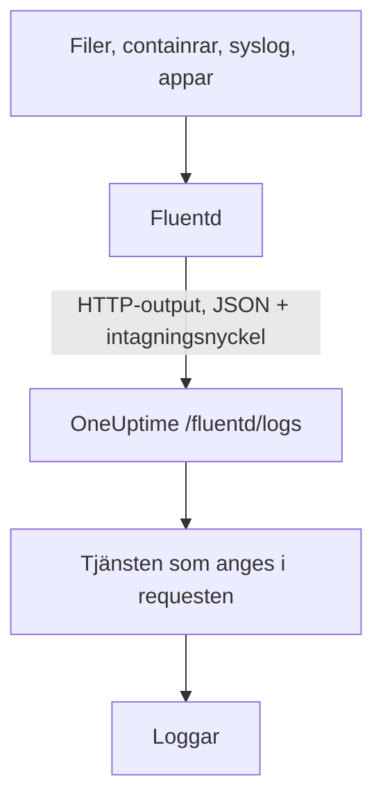

# Fluentd

[Fluentd](https://www.fluentd.org/) samlar in loggar från filer, containrar, syslog, applikationer och [många andra källor](https://www.fluentd.org/datasources). Dess inbyggda [HTTP-output](https://docs.fluentd.org/output/http) skickar dem till OneUptimes Fluentd-endpoint, där de blir sökbara under **Produkter → Loggar**.

:::cards
- [Konfigurera Fluentd](#konfigurera-fluentd): Lägg till en HTTP-output som pekar på OneUptime.
- [Så läses posterna](#så-läses-posterna): Vilka fält som blir meddelandet, allvarlighetsgraden och attribut.
- [OneUptime i egen drift](#oneuptime-i-egen-drift): Peka Fluentd mot din egen instans.
:::

## Så fungerar det



Fluentd skickar poster i omgångar som JSON, med din intagningsnyckel i headern `x-oneuptime-token` och tjänstnamnet i `x-oneuptime-service-name`. OneUptime gör varje post till en logg för den tjänsten och skapar tjänsten första gången den skickar.

## Innan du börjar

- **Installera Fluentd** – se [installationsguiden](https://docs.fluentd.org/installation).
- **Ett OneUptime-projekt.** I OneUptime Cloud debiteras telemetri per intagen GB – se [priser](https://oneuptime.com/pricing) – och ett projekt på Free-planen behöver en betalningsmetod innan det kan skicka telemetri.
- **En intagningsnyckel för telemetri.** Om du inte har någon:

:::steps
### Öppna intagningsnycklarna

Gå till **Produkter → Projektinställningar**, öppna **Telemetri och APM** i sidomenyn och välj **Intagningsnycklar**.


### Skapa en nyckel

Klicka på **Skapa ingestion-nyckel**. Dialogen har redan fyllt i nyckelns namn och valt **Server** – den sortens nyckel som en applikation eller en collector skickar med – så klicka på **Skapa ingestion-nyckel** för att skapa den, eller byt namn på den först.

### Kopiera hemligheten

Den nya nyckeln öppnas på en egen sida. Kopiera dess **Hemlig nyckel**: det är `YOUR_SERVICE_TOKEN` i konfigurationen nedan.


:::

## Konfigurera Fluentd

Fluentds konfigurationsfil är oftast `/etc/fluent/fluentd.conf`, eller `/etc/td-agent/td-agent.conf` för det äldre td-agent-paketet.

:::steps
### Lägg till en HTTP-output

Lägg till ett `<match>`-avsnitt som skickar poster till OneUptime. Ersätt `YOUR_SERVICE_TOKEN` med din intagningsnyckel och `YOUR_SERVICE_NAME` med namnet som loggarna ska visas under – vilket namn du vill:

```text title="fluentd.conf"
# Match all patterns
<match **>
  @type http

  endpoint https://oneuptime.com/fluentd/logs
  open_timeout 2

  headers {"x-oneuptime-token":"YOUR_SERVICE_TOKEN", "x-oneuptime-service-name":"YOUR_SERVICE_NAME"}

  content_type application/json
  json_array true

  <format>
    @type json
  </format>
  <buffer>
    flush_interval 10s
    chunk_limit_size 900k
  </buffer>
</match>
```

`json_array true` skickar varje chunk i bufferten som en enda JSON-array, och `flush_interval 10s` skickar bufferten var 10:e sekund. `chunk_limit_size 900k` håller varje request under 1 MB, det mesta OneUptime tar emot på den här endpointen.

### Starta om Fluentd

Starta om Fluentd-tjänsten så att den läser in den nya outputen.

### Kontrollera att loggarna kommer fram

Några sekunder efter nästa tömning visas loggarna under **Produkter → Loggar**. Tjänsten finns under **Produkter → Tjänster** – om den inte fanns tidigare skapar OneUptime den.
:::

## Fullständigt exempel

Den här konfigurationen tar emot poster över Fluentds forward-protokoll på port `24224` och skickar alla till OneUptime:

```text title="fluentd.conf"
####
## Source descriptions:
##

## built-in TCP input
## @see https://docs.fluentd.org/input/forward
<source>
  @type forward
  port 24224
  bind 0.0.0.0
</source>

<match **>
  @type http

  endpoint https://oneuptime.com/fluentd/logs
  open_timeout 2

  headers {"x-oneuptime-token":"YOUR_SERVICE_TOKEN", "x-oneuptime-service-name":"YOUR_SERVICE_NAME"}

  content_type application/json
  json_array true

  <format>
    @type json
  </format>
  <buffer>
    flush_interval 10s
    chunk_limit_size 900k
  </buffer>
</match>
```

För att skicka olika källor som olika tjänster använder du ett `<match>`-avsnitt per tagg, vart och ett med sitt eget `x-oneuptime-service-name`.

## Så läses posterna

OneUptime läser de här fälten från varje post:

| Loggfält | Läses från postens första befintliga fält av | Anmärkningar |
| --- | --- | --- |
| Innehåll | `message`, `log`, `msg`, `body`, `text` | Loggraden. En post utan något av dem sparas i sin helhet, som JSON. |
| Allvarlighetsgrad | `level`, `severity`, `loglevel`, `log_level`, `priority`, `severityText`, `severity_text` | Namn som `trace`, `debug`, `info`, `notice`, `warn`, `error`, `critical` och `fatal`, med stora eller små bokstäver. Alla andra värden sparas som `Unspecified`. |
| Trace-ID | `trace_id`, `traceId`, `traceid` | Kopplar loggen till dess trace. |
| Span-ID | `span_id`, `spanId`, `spanid` | Kopplar loggen till dess span. |
| Tjänst | headern `x-oneuptime-service-name` | `Fluentd` när headern inte är satt. |
| Tid | — | Tidpunkten då OneUptime tar emot posten. |

Alla andra fält blir ett attribut med namnet `fluentd.` följt av fältets namn, som du kan söka och filtrera på: ett fält `container_name` är `@fluentd.container_name` i loggutforskaren. Ett nästlat objekt plattas ut med punkter, som `fluentd.kubernetes.pod_name`, och en lista sparas som JSON.

Fluentd-loggar går igenom dina [loggpipelines](/docs/telemetry/log-pipelines), drop-filter och maskeringsregler precis som alla andra loggar.

## OneUptime i egen drift

Ersätt `https://oneuptime.com` i `endpoint` med URL:en till din OneUptime-instans: `http(s)://YOUR_ONEUPTIME_HOST/fluentd/logs`.

## Felsökning

:::details Fluentd loggar `401` från HTTP-outputen
Intagningsnyckeln saknas, är okänd eller har gått ut. Kontrollera värdet på `x-oneuptime-token` i `headers`.
:::

:::details Fluentd loggar `402` eller `422`
`402`: i OneUptime Cloud har projektet Free-planen och ingen betalningsmetod. Lägg till en under **Projektinställningar → Fakturering och fakturor → Fakturering**. `422`: nyckeln är inaktiverad, eller så är det en webbläsarnyckel. Slå på **Aktiverad** igen i nyckelns inställningar, eller skapa en **Server**-nyckel.
:::

:::details Fluentd loggar `413`
Requesten är större än 1 MB, det mesta OneUptime tar emot på den här endpointen. Ange `chunk_limit_size 900k` i avsnittet `<buffer>`, som i konfigurationen ovan.
:::

:::details Loggarna kommer under tjänsten `Fluentd`
Headern `x-oneuptime-service-name` saknas. Lägg till den i `headers` i varje `<match>`-avsnitt.
:::

:::details Logginnehållet visar hela posten som JSON
OneUptime tar innehållet från det första befintliga fältet av `message`, `log`, `msg`, `body` eller `text`, och sparar hela posten när den inte har något av dem. Byt namn på fältet med din loggrad till ett av dem, till exempel med Fluentds filter `record_transformer`.
:::

Har du frågor eller behöver hjälp med konfigurationen kan du skriva till oss på support@oneuptime.com.

## Nästa steg

:::cards
- [Loggpipelines](/docs/telemetry/log-pipelines): Tolka och berika loggarna som Fluentd skickar.
- [Söksyntax](/docs/telemetry/search-syntax): Hitta loggarna i loggutforskaren.
- [Fluent Bit](/docs/telemetry/fluentbit): En lättare agent som skickar över OpenTelemetry.
- [Loggövervakning](/docs/monitor/logs-monitor): Larma när matchande loggar dyker upp.
:::
