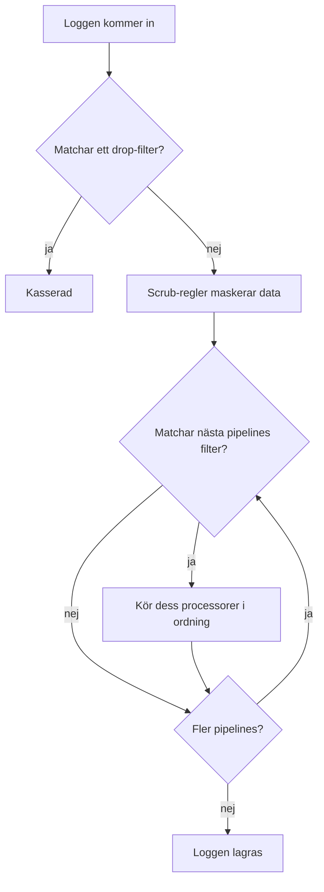

# Loggpipelines

Loggpipelines ändrar loggar medan OneUptime tar in dem, innan de lagras. En pipeline har ett **filter** som avgör vilka loggar den gäller och en ordnad lista med **processorer** som var och en ändrar loggarna: plockar ut fält ur meddelandet, rättar allvarlighetsgraden, byter namn på ett attribut eller märker loggen med en kategori.

Pipelines finns under **Loggar → Inställningar → Pipelines**.

:::cards
- [Så körs en pipeline](#så-körs-en-pipeline): Var pipelines sitter i intaget, och i vilken ordning de körs.
- [Skapa en pipeline](#skapa-en-pipeline): Välj ut några loggar och lägg till processorer för dem.
- [Key=Value Parser](#keyvalue-parser): Gör brandväggs- och logfmt-rader till attribut.
- [Exempel: Sophos XGS-brandvägg](#exempel-sophos-xgs-brandvägg): Tolka brandväggens syslog från början till slut.
:::

## Så körs en pipeline

Pipelines körs på varje logg som OneUptime tar in, oavsett om det är OpenTelemetry-loggar, syslog eller Fluentd, efter drop-filter och scrub-regler och innan loggen lagras:



- **Pipelines körs i ordning**: listans ordning, som du ändrar genom att dra raderna. En pipeline rör bara de loggar som dess filter matchar, och alla pipelines vars filter matchar körs, inte bara den första.
- **Processorer körs också i ordning**, och var och en ser vad den föregående gav, så en parser måste komma före en processor som läser fälten den plockar ut. En senare pipelines filter ser också vad tidigare pipelines har ändrat.
- **Bearbetningen sker vid intag.** En ändring i en pipeline påverkar loggar som kommer in efteråt, inom ungefär en minut; redan lagrade loggar bearbetas inte om.
- **En processor kastar eller tömmer aldrig en logg.** En rad som en parser inte kan läsa går igenom oförändrad. Använd **Loggar → Inställningar → Drop-filter** för att kasta loggar.
- **Bara aktiverade pipelines och processorer körs.** Stäng av en på dess sida för att pausa den utan att förlora dess inställningar.

## Processortyper

| Processor | Vad den gör |
| --- | --- |
| Grok Parser | Plockar ut fält ur en rad med fast form (en nginx-åtkomstrad) med ett namngivet mönster. |
| Key=Value Parser | Delar upp en rad med `key=value`-par (Sophos XGS, Fortinet, logfmt) i attribut, i valfri ordning. |
| Allvarlighetsgrad-ommappare | Mappar en rå nivå som `warn` från ett attribut till loggens standardallvarlighetsgrad. |
| Attributremappare | Byter namn på eller kopierar ett attribut, till exempel `src_ip` till `source_ip`. |
| Kategoriprocessor | Märker en logg med ett kategorinamn när den matchar ett filter, till exempel "Payment Error". |

## Innan du börjar

- Loggar som kommer in i OneUptime, via [OpenTelemetry](/docs/telemetry/open-telemetry), [syslog](/docs/telemetry/syslog), [Fluentd](/docs/telemetry/fluentd) eller en probe.
- Behörighet att ändra pipelines. Projektägare och administratörer har den; alla andra behöver behörigheterna **Create Log Pipeline** och **Create Log Pipeline Processor**.

## Skapa en pipeline

:::steps
### Skapa pipelinen

Gå till **Loggar → Inställningar → Pipelines** och klicka på **Skapa Logg Pipeline**. Ge den ett **Namn**, till exempel *Tolka brandväggsloggar*, och skapa den. Pipelinens sida öppnas.

### Välj vilka loggar den gäller

Klicka på **Redigera** under **Filtervillkor** och lägg till villkor på **Allvarlighetsgrad**, **Loggkropp**, **Tjänste-ID** eller ett eget attribut. Koppla ihop dem med **Alla villkor** eller **Minst ett villkor** och klicka sedan på **Spara ändringar**. En pipeline utan villkor gäller alla loggar.

### Lägg till processorer

Klicka på **Lägg till processor** under **Processorer**, ange ett **Processornamn**, välj en **Processortyp** och fyll i dess inställningar. Grok- och Key=Value-parsrarna har en testare: klistra in en exempelrad för att se vad de skulle plocka ut. Klicka på **Skapa processor**.

### Ordna dem

Dra processorer för att ändra ordningen de körs i, och dra pipelines i listan **Pipelines** på samma sätt. Nya loggar bearbetas inom ungefär en minut.
:::

### Filtervillkor

Varje villkor jämför ett fält med ett värde. Bakom byggaren är filtret en fråga som `severityText = 'Error' AND body LIKE 'timeout'`, som **Preview query** visar.

| Operator | I frågan | Anteckningar |
| --- | --- | --- |
| är lika med | `=` | Exakt och skiftlägeskänsligt. |
| är inte lika med | `!=` | Exakt och skiftlägeskänsligt. |
| innehåller | `LIKE` | Ignorerar skiftläge. `%` i värdet är ett jokertecken. |
| är en av | `IN` | En kommaseparerad lista med exakta värden. |

Allvarlighetsvärdena är `Fatal`, `Error`, `Warning`, `Information`, `Debug`, `Trace` och `Unspecified`, så `severityText = 'Error'` matchar och `'ERROR'` gör det aldrig. Ett eget attribut skrivs `attributes.<key>`, till exempel `attributes.networkDevice.name = 'hq-firewall'`.

## Key=Value Parser

Brandväggar och annan nätverksutrustning loggar varje händelse som en rad med `key=value`-par. Vilka fält en rad har, och i vilken ordning, beror på händelsen, så inget enskilt grok-mönster kan beskriva dem. Key=Value Parser behöver inget: den går igenom raden och gör varje par den hittar till ett loggattribut, oavsett ordning. Som attribut kan du söka och filtrera på dem, använda dem i en [loggövervakning](/docs/monitor/logs-monitor) och få ett larm per tunnel, gränssnitt eller användare med [Gruppera efter](/docs/monitor/logs-monitor#varningar-per-grupp-group-by).

### Konfiguration

| Inställning | Standard | Beskrivning |
| --- | --- | --- |
| Source Field | `body` | Fältet som ska tolkas: `body` för loggmeddelandet, eller ett attribut som `attributes.raw_line`. |
| Target Prefix | inget | Ett namnområde för de utplockade nycklarna. `sophos` lagrar `con_name` som `sophos.con_name`. En avgränsare läggs till om inte prefixet redan slutar med `.`, `_`, `-` eller `:`. |
| Pair Delimiter | valfritt blanksteg | Det som skiljer ett par från nästa. Lämna det tomt för Sophos, Fortinet och logfmt; använd `,`, `;` eller `\|` för andra format. |
| Key-Value Delimiter | `=` | Det som skiljer en nyckel från dess värde, till exempel `:` för `status:up`. |
| Åsidosätt vid konflikt | av | Om en nyckel får ersätta ett attribut som loggen redan har. Av som standard: nycklarna kommer från själva raden, så annars skulle en rad kunna skriva över attribut som sattes vid intaget, som enheten den kom från. |

De två avgränsarna måste vara olika, får inte innehålla varandra och får inte innehålla citattecken eller omvända snedstreck; var och en är högst 8 tecken lång. Processorformuläret kontrollerar detta innan det sparas, och dess testare, **Test With a Sample Line**, visar exakt vilka attribut en exempelrad skulle ge.

### Tolkningsregler

- **Värden inom citattecken** behåller sina mellanslag och avgränsare: `message="IPSec Connection HQ-Branch1 terminated"` är ett värde. Både dubbla och enkla citattecken fungerar, och `\"` inuti ett värde är ett bokstavligt citattecken. Ett citattecken som aldrig stängs (en rad som kapats vid en storleksgräns i syslog) löper till radens slut.
- **Värden utan citattecken** löper till nästa paravgränsare, så `url=https://example.com/?a=b` behåller sitt `=`.
- **Tomma värden** (`key=` och `key=""`) lagras som tomma strängar.
- **Värden är alltid text.** `latency=11` lagras som `"11"`, precis som en grok-fångst utan typ.
- **Nycklar** börjar med en bokstav eller ett understreck och innehåller bokstäver, siffror och `. _ - @`. Text före det första paret, som ett syslog-huvud enligt RFC 3164, och lösa ord utan avgränsare hoppas över. En syslog-prioritet som sitter ihop med den första nyckeln (`<30>device_name="SFW"`) tas bort och nyckeln behålls.
- **En upprepad nyckel behåller sitt första värde**; senare ignoreras.
- **Gränser:** en rad längre än 32 KiB tolkas inte, högst 100 par tas från en rad, nycklar längre än 256 tecken hoppas över och värden längre än 4 096 tecken kortas av.

### Exempel: Sophos XGS-brandvägg

När en Sophos XGS-brandvägg skickar syslog till en [probe](/docs/monitor/network-device-monitor) lagras varje meddelande som en logg för nätverksenheten, med syslog-meddelandet som kropp. Så här tolkar du det:

:::steps
#### Skapa en pipeline för brandväggen

Gå till **Loggar → Inställningar → Pipelines** och skapa en pipeline. Ge den ett filter som matchar brandväggens loggar, till exempel det egna attributet `networkDevice.name` är lika med `hq-firewall` (`attributes.networkDevice.name = 'hq-firewall'`), eller **Loggkropp** innehåller `log_component=` för att fånga alla Sophos-rader.

#### Lägg till parsern

Öppna pipelinen och klicka på **Lägg till processor**. Välj **Key=Value Parser**, behåll **Source Field** som `body` och sätt **Target Prefix** till `sophos` (valfritt, men det håller ihop brandväggens fält).

#### Testa och spara

Klistra in en rad från brandväggen i **Test With a Sample Line** för att kontrollera resultatet och klicka sedan på **Skapa processor**.
:::

En Sophos IPsec-händelse:

```text
device_name="SFW" timestamp="2024-05-02T11:03:12+0200" device_model="XGS2100" device_serial_id="X1234" log_id="010101600001" log_type="Event" log_component="IPSec" log_subtype="System" severity="Information" con_name="HQ-Branch1" src_ip="10.171.4.117" dst_ip="10.171.4.118" status="Terminated" message="IPSec Connection HQ-Branch1 between 10.171.4.117 and 10.171.4.118 for Child HQ-Branch1 terminated."
```

blir de här attributen (bland andra):

| Attribut | Värde |
| --- | --- |
| `sophos.log_component` | `IPSec` |
| `sophos.con_name` | `HQ-Branch1` |
| `sophos.status` | `Terminated` |
| `sophos.src_ip` | `10.171.4.117` |
| `sophos.message` | `IPSec Connection HQ-Branch1 between 10.171.4.117 and 10.171.4.118 for Child HQ-Branch1 terminated.` |

En SD-WAN SLA-rad har andra fält i en annan ordning, och samma processor hanterar den:

```text
log_id=158825619025 log_type="SD-WAN" log_component="SLA" profile_name="Branch-Internet" gw_name="WAN2" latency=11 jitter=2 packet_loss=0 gw_status="up" sla_status="SLA met"
```

ger `sophos.gw_name = WAN2`, `sophos.latency = 11`, `sophos.packet_loss = 0`, `sophos.gw_status = up` och `sophos.sla_status = SLA met`. Äldre SFOS-versioner loggar ett äldre format (`device="SFW" date=2017-01-31 time=18:02:03 timezone="IST" ... connectionname="Tunnel A"`); det tolkas på samma sätt, med tunnelnamnet i `connectionname` i stället för `con_name`.

Hur du gör de SLA-raderna till mått för latens, jitter och paketförlust per gateway ser du i exemplet under [Inspelningsregler för loggar](/docs/telemetry/log-recording-rules).

### Exempel: Fortinet FortiGate

FortiGate-loggar följer samma stil:

```text
date=2024-01-01 time=10:00:00 devname="FG100" logid="0100032001" type="event" subtype="vpn" level="notice" action="tunnel-down" vpntunnel="HQ-to-Branch2" msg="IPsec tunnel down"
```

Med standardinställningarna och prefixet `fortigate` ger det `fortigate.devname = FG100`, `fortigate.subtype = vpn`, `fortigate.action = tunnel-down`, `fortigate.vpntunnel = HQ-to-Branch2` och `fortigate.time = 10:00:00`: kolonen i en tid hör till värdet, de är ingen avgränsare.

### Ett larm per tunnel

Med fälten tolkade kan en [loggövervakning](/docs/monitor/logs-monitor) räkna felen och utlösa ett separat larm för varje tunnel: filtrera på `sophos.log_component` = `IPSec` med en kropp som innehåller `terminated`, och gruppera efter `sophos.con_name`. Se [Larm per grupp](/docs/monitor/logs-monitor#varningar-per-grupp-group-by).

## Grok Parser

Plockar ut strukturerade fält ur en rad med fast form. Ett grok-mönster är ett reguljärt uttryck med namngivna referenser: `%{IPV4:client_ip}` betyder "hitta en IPv4-adress och lagra den som `client_ip`". Mönstret behöver inte täcka hela raden, och en rad som inte matchar lämnas oförändrad.

| Inställning | Standard | Beskrivning |
| --- | --- | --- |
| **Source Field** | `body` | Fältet som ska tolkas, som för Key=Value Parser. |
| **Target Prefix** | inget | Ett namnområde för de utplockade fälten, tillagt på samma sätt. |
| **Grok Pattern** | — | Mönstret. Formuläret listar de tillgängliga namngivna mönstren. |

En fångst lagras som text om du inte ger den en typ: `%{NUMBER:status:int}` lagrar den som ett tal. Typerna är `int`, `long`, `float`, `double`, `boolean` och `string`. Kontrollera ett mönster mot en exempelrad i **Test Your Pattern** innan du sparar det.

| Loggkropp | Mönster | Tillagda attribut |
| --- | --- | --- |
| `10.0.1.5 - GET /health 200` | `%{IPV4:client_ip} - %{WORD:method} %{NOTSPACE:path} %{NUMBER:status:int}` | client_ip, method, path, status |

Använd i stället Key=Value Parser när raden består av `key=value`-par vars ordning varierar.

## Allvarlighetsgrad-ommappare

Läser ett rått värde från ett attribut och mappar det till en standardallvarlighetsgrad. Sätt **Källattribut** till attributet som innehåller nivån (`level` som standard) och lägg sedan till **Mappningar**: var och en parar ihop ett värde som din applikation skickar ut, till exempel `warn`, med en allvarlighetsgrad, till exempel Warning. Matchningen ignorerar skiftläge. Ett värde utan mappning lämnar loggens allvarlighetsgrad som den var.

## Attributremappare

Flyttar värdet från ett attribut (**Källnyckel**) till ett annat (**Målnyckel**), till exempel `src_ip` till `source_ip`.

| Inställning | Standard | Effekt |
| --- | --- | --- |
| **Bevara källa** | av | Av byter namn på attributet: källnyckeln tas bort. På kopierar det och behåller källnyckeln. |
| **Åsidosätt vid konflikt** | på | På ersätter målet när det redan finns. Av lämnar målet orört och hoppar över ommappningen. |

## Kategoriprocessor

Utvärderar en lista med regler i ordning och lagrar namnet på den första regel vars filter matchar i ett målattribut, så att du kan hitta alla "Payment Error"-loggar på en gång. Sätt **Målattribut** (`category` som standard) och lägg sedan till **Kategoriregler**: ett **Category name** och villkoren under **When logs match**. Den första regeln som matchar vinner; en logg som inte matchar någon lämnas oförändrad.

## Nästa steg

:::cards
- [Loggövervakning](/docs/monitor/logs-monitor): Få larm på attributen som dina pipelines plockar ut.
- [Inspelningsregler för loggar](/docs/telemetry/log-recording-rules): Gör tolkade loggfält till mätvärden.
- [Syslog](/docs/telemetry/syslog): Skicka syslog från brandväggar och servrar till OneUptime.
- [Söksyntax](/docs/telemetry/search-syntax): Sök på de nya attributen i loggutforskaren.
:::
