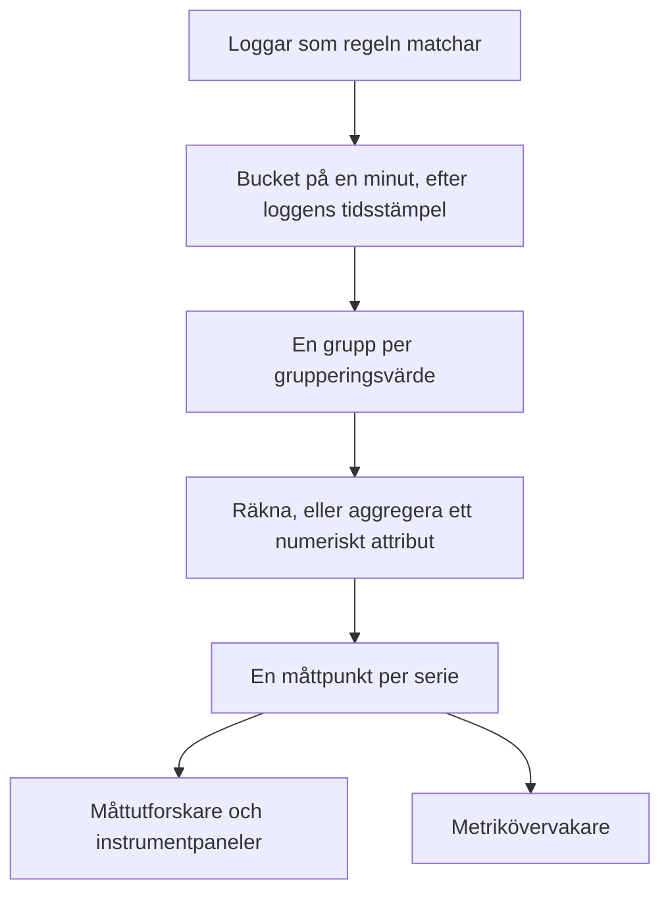
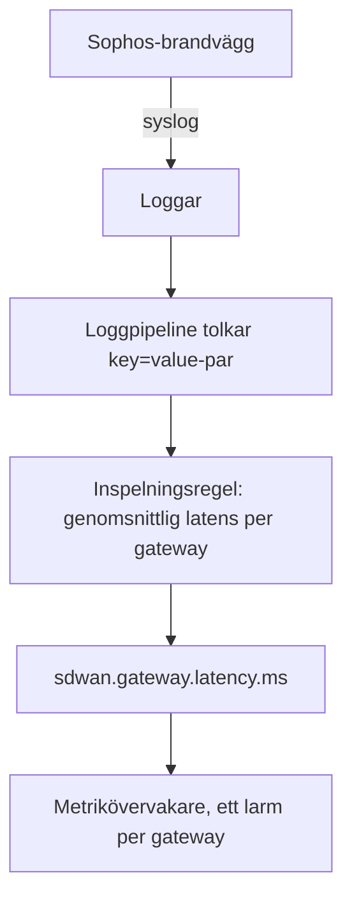

# Inspelningsregler för loggar

En **Log Recording Rule** gör loggar till ett mått. Varje minut tar den de loggar som dess filter matchar och skriver ett tal per minut till måttlagret: hur många loggar som matchade, eller summan, genomsnittet, minimum, maximum eller en percentil av ett numeriskt attribut i loggarna. Dela upp resultatet efter upp till fem loggattribut så får du en serie per värde: en per gateway, per värd, per kund.

:::cards
- [Så fungerar en regel](#så-fungerar-en-regel): Buckets, tidpunkter, ikappkörning och luckor.
- [Skapa en regel](#skapa-en-regel): Fälten i regelredigeraren.
- [Exempel: latens för SD-WAN-gateways](#exempel-latens-för-sd-wan-gateways-från-en-sophos-brandvägg): Från brandväggens syslog till ett larm per gateway.
- [Behörigheter](#behörigheter): Vem som får skapa, ändra och läsa regler.
:::

## Översikt

Resultatet är ett vanligt mått. Visa det i **Måttutforskare** och på instrumentpaneler, och få larm på det med en övervakare av typen **Mätvärden**, även larm per serie med **Gruppera efter**.

Använd en inspelningsregel för loggar när talet du bryr dig om bara finns i dina loggar: en brandväggs SLA-sammanfattningar, ett batchjobb som loggar hur lång tid det tog, svarsstorlekarna i en åtkomstlogg, eller helt enkelt hur många felloggar en tjänst skriver varje minut.

Inspelningsregler för loggar finns under **Loggar → Inställningar → Inspelningsregler**. Motsvarande regler för mätvärden och spans finns under **Mätvärden → Inställningar → Inspelningsregler** och **Spår → Inställningar → Inspelningsregler**.

## Så fungerar en regel



- **En punkt per minut och serie.** Loggar grupperas i buckets på 1 minut efter sin tidsstämpel. Varje bucket ger en punkt för varje unik kombination av grupperingsattributens värden.
- **Beräknas 30 sekunder efter att minuten är slut.** Den korta väntan låter loggar som kommer lite sent ändå hamna i sin minut. En logg som kommer senare än så räknas inte.
- **Inga luckor, ingen dubbelräkning.** Varje regel kommer ihåg den senaste minut den skrev (visas som **Computed Until** i regellistan). Efter en omstart av workern eller annat avbrott kör den ikapp de minuter den missade, upp till 60 minuter bakåt, och skriver aldrig samma minut två gånger.
- **En räkning utan gruppering har aldrig luckor.** En minut utan matchande loggar skrivs som `0`. Alla andra regler skriver ingenting för en minut utan något att aggregera, så diagram och övervakare ser inga data i stället för en påhittad nolla.
- **Skrivs som vilket annat härlett mått som helst.** Punkterna är Gauge-datapunkter med regelns **Namn på utdatamått**, de bär grupperingsattributen och `oneuptime.derived.log_rule_id` (regelns ID), och de följer samma lagring som punkterna från inspelningsreglerna för mätvärden och spår: 15 dagar.

En ändring av en regels definition gäller från nästa minut den skriver; redan skrivna punkter skrivs inte om. Att stänga av en regel stoppar den; påslagen igen kör den ikapp de minuter den missade medan den var avstängd, upp till samma 60 minuter.

## Skapa en regel

:::steps
### Öppna inspelningsreglerna

Gå till **Loggar → Inställningar → Inspelningsregler** och välj **Skapa Log Recording Rule**.

### Ge regeln ett namn

Skriv ett **Namn**. **Namn på utdatamått** under det bildas från namnet medan du skriver; välj **Redigera** bredvid för att skriva ett eget.

### Välj loggarna och vad som ska beräknas

Begränsa regeln under **Which Logs** med telemetritjänster, allvarlighetsgrader, text och attributfilter. Välj en **Aggregering** och, för allt utom en räkning, det **Numeric Attribute** som ska aggregeras.

### Dela upp resultatet och spara

Lägg eventuellt till attribut under **Gruppera efter** och en **Unit**. Kontrollera raden längst ned i redigeraren och spara sedan. Inom några minuter visar regellistan en tid under **Computed Until**.
:::

| Fält | Vad det gör |
| --- | --- |
| Namn | Vad regeln beräknar, t.ex. *SD-WAN gateway latency*. |
| Namn på utdatamått | Måttet som regeln skriver. Bildas från namnet (*SD-WAN gateway latency* skriver `sd_wan_gateway_latency`) om du inte väljer **Redigera** och skriver ett eget. Det måste vara unikt bland projektets inspelningsregler. |
| Which Logs | Valfria filter, alla kombinerade med AND: telemetritjänster, allvarlighetsgrader, text som loggkroppen innehåller och attributfilter (ett attribut lika med ett värde). |
| Aggregering | `Count of logs`, eller en aggregering av ett numeriskt attribut (se nedan). |
| Numeric Attribute | För alla aggregeringar utom räkning: attributet vars värden aggregeras, t.ex. `latency`. |
| Gruppera efter | Valfritt: upp till 5 attributnycklar. En serie per unik kombination av deras värden. |
| Unit | Valfritt: utdatamåttets enhet, t.ex. `ms`. Visas överallt där måttet visas i ett diagram. |
| Beskrivning | Under **Fler fält**: vad regeln är till för. |
| Aktiverad | Under **Fler fält**: på som standard. Bara aktiverade regler beräknas. |

Raden längst ned i redigeraren säger vad regeln kommer att skriva, t.ex. `avg(latency) by gw_name, profile_name`.

En regel kan filtrera på högst 10 attribut och 100 telemetritjänster.

### Aggregeringar

| Aggregering | Varje minuts punkt |
| --- | --- |
| Count of logs | Hur många loggar som matchade filtret. |
| Genomsnitt | Genomsnittet av det numeriska attributets värden. |
| Summa | Attributets värden adderade. |
| Minimum | Det minsta värdet. |
| Maximum | Det största värdet. |
| p50 (median) | Medianvärdet. |
| p75 | 75:e percentilen. |
| p90 | 90:e percentilen. |
| p95 | 95:e percentilen. |
| p99 | 99:e percentilen. |

### Numeriska attribut

Det numeriska attributets värde måste vara ett vanligt tal. Det kan komma som ett tal (`latency=11` tolkat som tal) eller som text (`"11"`, `"11.5"`, `"1e3"`). En logg vars värde saknas eller inte är ett tal (`"11ms"`, `"n/a"`, en tom sträng) **hoppas över**. Den räknas aldrig som `0`, så en felaktig logg kan inte dra ned ett genomsnitt.

### Attributnycklar

Nycklar i attributfilter matchar oavsett skiftläge, precis som filtren i loggutforskaren. Det numeriska attributet och grupperingsnycklarna måste skrivas exakt som dina loggar bär dem, inklusive ett prefix som en loggpipeline lägger till. Nyckelfälten föreslår de nycklar som projektets loggar bär, så välj från listan i stället för att skriva en nyckel för hand.

Nycklar får innehålla bokstäver, siffror och `. _ : / -`.

### Gruppering och taket för serier

Varje grupperingsnyckel multiplicerar antalet serier som en regel skriver, så gruppera efter attribut som identifierar något du vill se eller få larm på separat (en gateway, en värd, en kund), inte efter attribut som är olika i varje logg, som ett begärande-ID eller en klients IP-adress.

En regel skriver högst 1 000 serier per minut. Utöver det behålls serierna med flest matchande loggar och resten av den minuten släpps. En logg som saknar något av grupperingsattributen räknas ändå; dess serie skrivs utan det attributet.

## Exempel: latens för SD-WAN-gateways från en Sophos-brandvägg

En Sophos XGS-brandvägg med SD-WAN-loggning påslagen skickar med några minuters mellanrum en SLA-sammanfattning per SD-WAN-profil och gateway:

```text
log_type="SD-WAN" log_component="SLA" profile_name="Branch-Internet" gw_name="WAN2" latency=11 jitter=2 packet_loss=0 gw_status="up" sla_status="SLA met"
```

Det här exemplet gör sammanfattningarna till ett latensmått per gateway och larmar när en gateways latens förblir hög.



:::steps
### Få in loggarna, med fälten som attribut

1. Skicka brandväggens syslog till OneUptime: se [Syslog](/docs/telemetry/syslog).
2. Lägg under **Loggar → Inställningar → Pipelines** till en pipeline med en processor som delar upp kroppens `key=value`-par i loggattribut, så att varje sammanfattning bär `log_type`, `log_component`, `profile_name`, `gw_name`, `latency`, `jitter` och `packet_loss` som attribut. [Key=Value Parser](/docs/telemetry/log-pipelines#keyvalue-parser) gör det.
3. Öppna utforskaren **Loggar** och kontrollera attributnamnen på en SLA-logg. Om din pipeline lägger till ett prefix använder du namnen med prefix nedan.

### Skapa inspelningsregeln

Skapa en regel under **Loggar → Inställningar → Inspelningsregler**:

- **Namn:** SD-WAN gateway latency
- **Namn på utdatamått:** välj **Redigera** och skriv `sdwan.gateway.latency.ms`
- **Which Logs:** attributfilter `log_type` = `SD-WAN` och `log_component` = `SLA`
- **Aggregering:** Genomsnitt, **Numeric Attribute:** `latency`
- **Gruppera efter:** `gw_name` och `profile_name`
- **Unit:** `ms`

Via API:t, MCP eller Terraform är samma regels **definition**:

```json
{
  "filter": {
    "attributeFilters": [
      { "key": "log_type", "value": "SD-WAN" },
      { "key": "log_component", "value": "SLA" }
    ]
  },
  "aggregationType": "Avg",
  "valueAttribute": "latency",
  "groupByAttributes": ["gw_name", "profile_name"],
  "unit": "ms"
}
```

Upprepa med `jitter` (`sdwan.gateway.jitter.ms`, enhet `ms`) och `packet_loss` (`sdwan.gateway.packet_loss.percent`, enhet `%`) för de två andra SLA-mätningarna. En regel **Count of logs** som filtrerats på `gw_status` = `down` och grupperats efter `gw_name` räknar rapporterna om nedlagda gateways per gateway.

Inom några minuter visar regellistan en tid under **Computed Until**, och `sdwan.gateway.latency.ms` dyker upp i måttutforskaren: välj det, gruppera efter `gw_name`, så har du en latenslinje per gateway.

### Få larm när en gateways latens förblir hög

Skapa en övervakare av typen **Mätvärden** (se [Metrikövervakning](/docs/monitor/metrics-monitor)):

1. **Måttfråga:** `sdwan.gateway.latency.ms`, aggregering **Genomsnitt**, **Gruppera efter** `gw_name` och `profile_name`.
2. **Rullande tidsfönster:** Past 15 Minutes. Brandväggen rapporterar med några minuters mellanrum, så fönstret innehåller flera punkter per gateway.
3. **Aggregeringsstrategi:** **All Values**: varje punkt i fönstret måste överskrida gränsen, så att en enda långsam sammanfattning inte larmar någon. Använd i stället **Genomsnitt** för att larma på ett högt genomsnitt.
4. **Kriterier:** Metric value **Greater Than** `150` öppnar ett larm.
5. Använd eventuellt grupperingsvärdena i larmets titel, t.ex. `SD-WAN latency high on {{gw_name}} ({{profile_name}})`.

Med gruppering inställd är varje gateway en egen serie: blir WAN2 långsam öppnas ett larm bara för WAN2, och det löser sig självt när WAN2 återhämtar sig. Se [Larm per serie](/docs/monitor/metrics-monitor).
:::

## Bra att veta

- **Tidsstämplar kommer från loggarna.** En logg hamnar i minuten för sin egen tidsstämpel. En enhet vars klocka går mer än lite fel lägger sina loggar i fel minut, eller helt utanför fönstret.
- **Ingen bakåtberäkning.** En ny regel börjar med minuten före sin första körning; äldre loggar beräknas inte.
- **Att radera en regel** stoppar den. Punkterna den redan har skrivit ligger kvar tills de går ut.
- **Inspelningsregler ser alla projektets loggar.** Den som kan läsa utdatamåttet ser tal som beräknats från varje logg som regelns filter matchar, så att skapa och redigera inspelningsregler för loggar är förbehållet projektägare, administratörer och behörigheterna **Create / Edit Log Recording Rule**.

## Behörigheter

| Behörighet | Tillåter |
| --- | --- |
| Create Log Recording Rule | Att skapa regler. |
| Edit Log Recording Rule | Att ändra regler och stänga av dem. |
| Delete Log Recording Rule | Att radera regler. |
| Read Log Recording Rule | Att se regler och vad de beräknar. |

Projektägare och administratörer kan göra allt detta. Projektmedlemmar, läsare och telemetrirollerna kan läsa regler.

## Nästa steg

:::cards
- [Metrikövervakning](/docs/monitor/metrics-monitor): Få larm på måtten som dina regler skriver.
- [Loggpipelines](/docs/telemetry/log-pipelines): Plocka ut attributen som en regel aggregerar.
- [Syslog](/docs/telemetry/syslog): Skicka loggar från brandväggar och servrar till OneUptime.
:::
