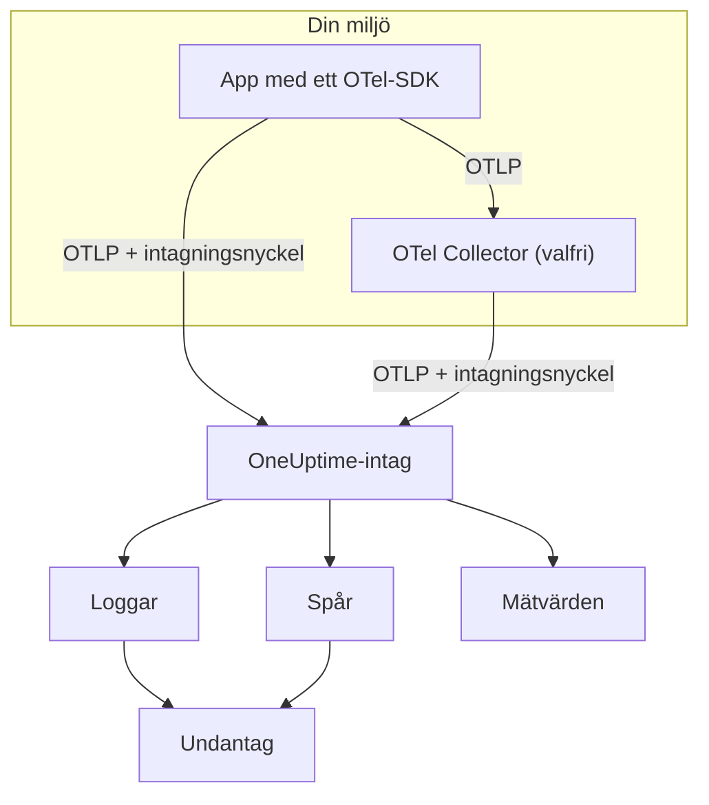

# OpenTelemetry

OneUptime tar emot loggar, mätvärden och traces via OpenTelemetry Protocol (OTLP). Rikta valfritt OpenTelemetry-SDK, eller en OpenTelemetry Collector, mot OneUptime med en intagningsnyckel, så dyker dina data upp under **Loggar**, **Spår**, **Mätvärden** och **Undantag**. Den här sidan får en tjänst att skicka data på några minuter och går sedan igenom de endpoints, gränser och fel som du behöver i produktion.

:::cards
- [Snabbstart](#snabbstart): Skapa en nyckel, sätt fyra miljövariabler och lägg till SDK:t.
- [Använd en Collector](#skicka-via-en-opentelemetry-collector): Lägg till OneUptime som exportör i en collector du redan kör.
- [Endpoints och gränser](#endpoints-och-gränser): URL:er, portar, kodningar, storleksgränser och statuskoder.
- [Felsökning](#felsökning): Vad du ska kontrollera när inga data kommer fram.
:::

## Så fungerar det

Din applikation exporterar OTLP direkt till OneUptime, eller till en OpenTelemetry Collector som skickar det vidare. Varje begäran har din intagningsnyckel i headern `x-oneuptime-token`, och OneUptime använder nyckeln för att hitta ditt projekt.



- **Tjänster skapas åt dig.** Resursattributet `service.name` (satt med `OTEL_SERVICE_NAME`) namnger tjänsten som dina data hör till. OneUptime skapar tjänsten första gången den skickar och listar den under **Produkter → Tjänster**.
- **Fel blir undantag.** Undantagshändelser på spans och undantag som registrerats i loggar grupperas till ärenden under **Undantag** — se [Undantag från loggar](#undantag-från-loggar).

## Innan du börjar

- Ett OneUptime-projekt där du får skapa intagningsnycklar: projektägare och -administratörer får det, och det får alla med behörigheten **Create Telemetry Ingestion Key**.
- En applikation som du kan lägga till ett OpenTelemetry-SDK i, eller en OpenTelemetry Collector.
- Utgående HTTPS (port 443) från din applikation eller collector till `oneuptime.com`, eller till din egen OneUptime-värd.

> [!NOTE]
> I OneUptime Cloud debiteras telemetri per intagen GB. Ett projekt på Free-planen behöver en betalningsmetod innan det kan skicka telemetri — dialogen som skapar nyckeln visar priserna.

## Snabbstart

:::steps
### Skapa en intagningsnyckel

1. Gå till **Produkter → Projektinställningar**.
2. Öppna **Telemetri och APM** i sidomenyn och välj **Intagningsnycklar**.
3. Klicka på **Skapa ingestion-nyckel**. Dialogen fyller i ett namn och väljer nyckeltypen **Server**, som en applikation eller en collector skickar med. Byt namn om du vill och klicka sedan på **Skapa ingestion-nyckel**.


Den nya nyckeln öppnas på en egen sida. Kopiera dess **Hemlig nyckel** — det är den token du skickar som `x-oneuptime-token`.


### Sätt OpenTelemetry-miljövariablerna

Alla OpenTelemetry-SDK:er läser samma standardmiljövariabler, så det här steget är detsamma i alla språk.

| Miljövariabel | Värde | Vad den gör |
| --- | --- | --- |
| `OTEL_EXPORTER_OTLP_ENDPOINT` | `https://oneuptime.com/otlp` | Vart data skickas. SDK:t lägger själv till `/v1/traces`, `/v1/metrics` och `/v1/logs`. |
| `OTEL_EXPORTER_OTLP_HEADERS` | `x-oneuptime-token=YOUR_ONEUPTIME_INGESTION_KEY` | Skickar din intagningsnyckel med varje begäran. |
| `OTEL_EXPORTER_OTLP_PROTOCOL` | `http/protobuf` | OTLP över HTTP. Vissa SDK:er använder gRPC som standard, som använder en annan endpoint. |
| `OTEL_SERVICE_NAME` | `my-service` | Tjänsten som dina data visas under i OneUptime. |

```bash
export OTEL_EXPORTER_OTLP_ENDPOINT="https://oneuptime.com/otlp"
export OTEL_EXPORTER_OTLP_HEADERS="x-oneuptime-token=YOUR_ONEUPTIME_INGESTION_KEY"
export OTEL_EXPORTER_OTLP_PROTOCOL="http/protobuf"
export OTEL_SERVICE_NAME="my-service"
```

Egen drift? Ersätt `https://oneuptime.com` med URL:en till din OneUptime-instans, till exempel `https://oneuptime.example.com/otlp`. För att märka undantag med en miljö sätter du också `OTEL_RESOURCE_ATTRIBUTES` till `deployment.environment=production`.

### Lägg till OpenTelemetry i din app

Välj ditt språk. Varje uppsättning läser miljövariablerna ovan, så varken endpoint eller nyckel står i din kod.

:::tabs
@tab Node.js
Installera SDK:t, de automatiska instrumenteringarna och OTLP/HTTP-exportörerna:

```bash
npm install @opentelemetry/sdk-node @opentelemetry/auto-instrumentations-node \
  @opentelemetry/exporter-trace-otlp-proto @opentelemetry/exporter-metrics-otlp-proto \
  @opentelemetry/exporter-logs-otlp-proto @opentelemetry/sdk-metrics @opentelemetry/sdk-logs
```

Skapa SDK:t i en egen fil:

```javascript title="instrumentation.js"
const { NodeSDK } = require("@opentelemetry/sdk-node");
const { getNodeAutoInstrumentations } = require("@opentelemetry/auto-instrumentations-node");
const { OTLPTraceExporter } = require("@opentelemetry/exporter-trace-otlp-proto");
const { OTLPMetricExporter } = require("@opentelemetry/exporter-metrics-otlp-proto");
const { OTLPLogExporter } = require("@opentelemetry/exporter-logs-otlp-proto");
const { PeriodicExportingMetricReader } = require("@opentelemetry/sdk-metrics");
const { BatchLogRecordProcessor } = require("@opentelemetry/sdk-logs");

// The exporters read OTEL_EXPORTER_OTLP_ENDPOINT and OTEL_EXPORTER_OTLP_HEADERS.
const sdk = new NodeSDK({
  traceExporter: new OTLPTraceExporter(),
  metricReader: new PeriodicExportingMetricReader({
    exporter: new OTLPMetricExporter(),
  }),
  logRecordProcessors: [new BatchLogRecordProcessor(new OTLPLogExporter())],
  instrumentations: [getNodeAutoInstrumentations()],
});

sdk.start();
```

Läs in den före din applikationskod:

```bash
node --require ./instrumentation.js app.js
```
@tab Python
Installera OpenTelemetry-distributionen och exportören, och sedan instrumenteringarna för de bibliotek som din app använder:

```bash
pip install opentelemetry-distro opentelemetry-exporter-otlp
opentelemetry-bootstrap -a install
```

Starta appen genom `opentelemetry-instrument`. Den exporterar traces, mätvärden och loggar; loggningsvariabeln skickar också poster som skrivs med Pythons `logging`-modul:

```bash
OTEL_PYTHON_LOGGING_AUTO_INSTRUMENTATION_ENABLED=true opentelemetry-instrument python app.py
```
@tab Go
Lägg till SDK:t och OTLP/HTTP-exportörerna:

```bash
go get go.opentelemetry.io/otel go.opentelemetry.io/otel/sdk go.opentelemetry.io/otel/sdk/metric \
  go.opentelemetry.io/otel/exporters/otlp/otlptrace/otlptracehttp \
  go.opentelemetry.io/otel/exporters/otlp/otlpmetric/otlpmetrichttp
```

Skapa tracer- och meter-providers när programmet startar:

```go title="main.go"
package main

import (
	"context"
	"log"

	"go.opentelemetry.io/otel"
	"go.opentelemetry.io/otel/exporters/otlp/otlpmetric/otlpmetrichttp"
	"go.opentelemetry.io/otel/exporters/otlp/otlptrace/otlptracehttp"
	sdkmetric "go.opentelemetry.io/otel/sdk/metric"
	sdktrace "go.opentelemetry.io/otel/sdk/trace"
)

func main() {
	ctx := context.Background()

	// Both exporters read OTEL_EXPORTER_OTLP_ENDPOINT and OTEL_EXPORTER_OTLP_HEADERS.
	traceExporter, err := otlptracehttp.New(ctx)
	if err != nil {
		log.Fatal(err)
	}
	tracerProvider := sdktrace.NewTracerProvider(sdktrace.WithBatcher(traceExporter))
	defer tracerProvider.Shutdown(ctx)
	otel.SetTracerProvider(tracerProvider)

	metricExporter, err := otlpmetrichttp.New(ctx)
	if err != nil {
		log.Fatal(err)
	}
	meterProvider := sdkmetric.NewMeterProvider(
		sdkmetric.WithReader(sdkmetric.NewPeriodicReader(metricExporter)),
	)
	defer meterProvider.Shutdown(ctx)
	otel.SetMeterProvider(meterProvider)

	// Your application code.
}
```

Providers hämtar `OTEL_SERVICE_NAME` från miljön. För loggar lägger du till `otlploghttp` med en loggbrygga som `otelslog`; den läser samma variabler.
@tab Java
Ladda ner OpenTelemetrys Java-agent och koppla den till din applikation. Inga kodändringar behövs:

```bash
curl -L -O https://github.com/open-telemetry/opentelemetry-java-instrumentation/releases/latest/download/opentelemetry-javaagent.jar
java -javaagent:opentelemetry-javaagent.jar -jar my-app.jar
```

Agenten instrumenterar vanliga ramverk och bibliotek och exporterar traces, mätvärden och loggar som skrivs via Logback eller Log4j.
@tab .NET
Lägg till OpenTelemetry-paketen för ASP.NET Core:

```bash
dotnet add package OpenTelemetry.Extensions.Hosting
dotnet add package OpenTelemetry.Exporter.OpenTelemetryProtocol
dotnet add package OpenTelemetry.Instrumentation.AspNetCore
dotnet add package OpenTelemetry.Instrumentation.Http
```

Registrera OpenTelemetry vid uppstart. `UseOtlpExporter()` skickar traces, mätvärden och loggar och läser variablerna `OTEL_EXPORTER_OTLP_*`:

```csharp title="Program.cs"
using OpenTelemetry;
using OpenTelemetry.Metrics;
using OpenTelemetry.Trace;

var builder = WebApplication.CreateBuilder(args);

builder.Services.AddOpenTelemetry()
    .WithTracing(tracing => tracing
        .AddAspNetCoreInstrumentation()
        .AddHttpClientInstrumentation())
    .WithMetrics(metrics => metrics
        .AddAspNetCoreInstrumentation()
        .AddHttpClientInstrumentation())
    .WithLogging()
    .UseOtlpExporter();

var app = builder.Build();
app.Run();
```

Använder du Serilog? Se [Serilog](/docs/telemetry/serilog) för att skicka dess loggar till OneUptime.
:::

### Kontrollera att data kommer fram

Fråga OneUptime om den accepterar din nyckel:

```bash
curl -i -H "x-oneuptime-token: YOUR_ONEUPTIME_INGESTION_KEY" \
  https://oneuptime.com/otlp/v1/validate
```

En nyckel som fungerar returnerar `200` med `"valid": true`. Allt annat returnerar `401` med ett meddelande om vad som är fel — okänd, inaktiverad eller utgången.

Kör sedan appen och använd den i en minut. Öppna **Produkter → Tjänster**: Din tjänst finns där under namnet du satte i `OTEL_SERVICE_NAME`, med sina loggar, traces, mätvärden och undantag. **Produkter → Loggar**, **Produkter → Spår** och **Produkter → Mätvärden** visar samma data för alla tjänster.
:::

:::details Skicka en testlogg utan SDK
OTLP/HTTP accepterar också JSON, så du kan skicka en logg med `curl`. `severityNumber` med värdet `9` gör den till en informationslogg:

```bash
curl -i https://oneuptime.com/otlp/v1/logs \
  -H "Content-Type: application/json" \
  -H "x-oneuptime-token: YOUR_ONEUPTIME_INGESTION_KEY" \
  -d '{
    "resourceLogs": [{
      "resource": {
        "attributes": [
          { "key": "service.name", "value": { "stringValue": "my-service" } }
        ]
      },
      "scopeLogs": [{
        "logRecords": [{
          "severityNumber": 9,
          "body": { "stringValue": "Hello from curl" }
        }]
      }]
    }]
  }'
```

En `200` betyder att loggen accepterades. Den visas under **Produkter → Loggar** inom några sekunder, i tjänsten `my-service`.
:::

## Skicka via en OpenTelemetry Collector

Kör en collector när du redan har en, när du vill samla, filtrera eller berika data på ett ställe, eller för att hålla intagningsnyckeln borta från dina applikationer. Dina appar exporterar till collectorn, och bara collectorn pratar med OneUptime.

:::steps
### Lägg till OneUptime som exportör

Lägg till en `otlphttp`-exportör som pekar mot OneUptime och skicka varje pipeline genom den:

```yaml title="otel-collector-config.yaml"
receivers:
  otlp:
    protocols:
      grpc:
        endpoint: 0.0.0.0:4317
      http:
        endpoint: 0.0.0.0:4318

processors:
  batch: {}

exporters:
  otlphttp:
    endpoint: https://oneuptime.com/otlp
    headers:
      x-oneuptime-token: YOUR_ONEUPTIME_INGESTION_KEY

service:
  pipelines:
    traces:
      receivers: [otlp]
      processors: [batch]
      exporters: [otlphttp]
    metrics:
      receivers: [otlp]
      processors: [batch]
      exporters: [otlphttp]
    logs:
      receivers: [otlp]
      processors: [batch]
      exporters: [otlphttp]
```

Behåll exportörens standardinställningar: Den skickar protobuf komprimerat med gzip, och OneUptime accepterar båda. Sätt ingen `Content-Type`-header på exportören — OneUptime väljer avkodare utifrån den headern, så en JSON-innehållstyp framför protobuf-byte förstör intaget.

### Kör collectorn

:::tabs
@tab Docker
```bash
docker run -d --name otel-collector \
  -p 4317:4317 -p 4318:4318 \
  -v "$(pwd)/otel-collector-config.yaml:/etc/otelcol-contrib/config.yaml" \
  otel/opentelemetry-collector-contrib:latest
```
@tab Linux
```bash
otelcol-contrib --config otel-collector-config.yaml
```
:::

Collectorn lyssnar efter OTLP på port `4317` (gRPC) och `4318` (HTTP), de portar som SDK:er skickar till som standard.

### Rikta dina appar mot collectorn

Sätt `OTEL_EXPORTER_OTLP_ENDPOINT` i dina applikationer till collectorn, till exempel `http://localhost:4318`, och ta bort `OTEL_EXPORTER_OTLP_HEADERS` — collectorn lägger till nyckeln. Behåll `OTEL_SERVICE_NAME` i varje applikation.

Data kommer fram i OneUptime precis som i snabbstarten. Om inte, står det i collectorns egen logg varför — se [Felsökning](#felsökning).
:::

Exporterar du redan till en annan leverantör? Lägg till `otlphttp`-exportören bredvid den befintliga och lista båda under `exporters` i varje pipeline för att skicka till båda medan du jämför. För att också samla in värdmätvärden och loggfiler, se guiden [Host OpenTelemetry Collector](/docs/telemetry/host-otel-collector).

## Endpoints och gränser

| Inställning | OTLP/HTTP (rekommenderas) | OTLP/gRPC |
| --- | --- | --- |
| Endpoint | `https://oneuptime.com/otlp` | `https://oneuptime.com:443` |
| Autentisering | Headern `x-oneuptime-token` | Metadata `x-oneuptime-token` |
| Kodning | Protobuf (`application/x-protobuf`) eller JSON (`application/json`) | Protobuf |
| Komprimering | Ingen, `gzip`, `deflate` eller `zstd` | Ingen eller `gzip` |
| Begärans storlek | Upp till 4 MB per begäran på `/otlp` | Upp till 4 MB per meddelande |

Över HTTP har varje signal en egen sökväg under endpointen. SDK:er och collectorn lägger till den åt dig; sätt den själv bara när ett verktyg kräver en fullständig URL.

| Signal | OTLP/HTTP-URL |
| --- | --- |
| Traces | `https://oneuptime.com/otlp/v1/traces` |
| Mätvärden | `https://oneuptime.com/otlp/v1/metrics` |
| Loggar | `https://oneuptime.com/otlp/v1/logs` |
| Profiler | `https://oneuptime.com/otlp/v1/profiles` |

För kontinuerlig profilering skickar de flesta profilerare i stället till den Pyroscope-kompatibla endpointen — se [Kontinuerlig profilering](/docs/telemetry/profiles). En collector som exporterar OTLP-profiler måste sätta exportörens `profiles_endpoint` till `https://oneuptime.com/otlp/v1/profiles`, eftersom den som standard skickar profiler till en utvecklingssökväg som OneUptime inte betjänar.

### OTLP över gRPC

OneUptime erbjuder OTLP/gRPC på samma värd som webbappen, på port 443 över TLS. Sätt `OTEL_EXPORTER_OTLP_PROTOCOL` till `grpc` och `OTEL_EXPORTER_OTLP_ENDPOINT` till `https://oneuptime.com:443`, och skicka samma header `x-oneuptime-token`. I en collector använder du exportören `otlp` med `endpoint: oneuptime.com:443` och samma `headers`.

I en installation i egen drift når gRPC bara OneUptime över HTTPS: En okrypterad HTTP-anslutning (h2c) nekas. Om din instans levereras över vanlig HTTP, använd OTLP/HTTP.

Två av en nyckels inställningar gäller bara OTLP/HTTP: dess **Requests Per Minute Limit** och dess **Pinned Service Name**. Data som skickas över gRPC behåller det `service.name` de skickades med och räknas inte mot gränsen.

### Svar

OneUptime svarar på en export så fort data står i kö, och data visas några sekunder senare.

| Svar | gRPC-status | Betydelse | Vad du gör |
| --- | --- | --- | --- |
| `200` | `OK` | Accepterad. | Ingenting. |
| `401` | `UNAUTHENTICATED` | Nyckeln saknas, är okänd eller har gått ut. | Jämför värdet i `x-oneuptime-token` med nyckelns **Hemlig nyckel**. |
| `402` | `PERMISSION_DENIED` | Bara OneUptime Cloud: Projektet är på Free-planen och har ingen betalningsmetod. | Lägg till en under **Projektinställningar → Fakturering och fakturor → Fakturering**. |
| `413` | — | Begäran är större än storleksgränsen. | Skicka mindre batcher. |
| `415` | — | `Content-Encoding` stöds inte. | Använd `gzip`, `deflate` eller `zstd`, eller ingen komprimering. |
| `422` | `PERMISSION_DENIED` | Nyckeln är inaktiverad, eller så är det en webbläsarnyckel som används utanför sina tillåtna origins. | Aktivera nyckeln igen, eller skicka med en servernyckel. |
| `429` | — | Nyckelns **Requests Per Minute Limit** är nådd. | Först ingenting: Exportörer försöker igen efter tiden i `Retry-After`. Höj gränsen om det fortsätter. |
| `503` | `UNAVAILABLE` | OneUptime startar, eller så är intagskön otillgänglig. | Ingenting: OTLP-exportörer försöker själva igen vid `503`. |

`401`, `402`, `413`, `415` och `422` är permanenta fel för OTLP-exportörer: Exportören kastar batchen och loggar felet i stället för att försöka igen.

### Omstarter och uppgraderingar

Medan OneUptime startar om eller uppgraderas svarar den på exporter med `503` och `Retry-After: 5` tills den är redo, och exportörerna skickar dem igen. En collectors exportör fortsätter som standard att försöka igen i fem minuter (`retry_on_failure`) och håller det den inte kunde skicka i sin `sending_queue`, så låt båda vara påslagna. Tiden då OneUptime inte tog emot data räknas aldrig emot dina servrar, värdar eller andra resurser: se [När OneUptime inte tar emot data](/docs/monitor/when-oneuptime-is-not-receiving#vid-start).

### Intagningsnycklar

Varje nyckels sida, under **Projektinställningar → Telemetri och APM → Intagningsnycklar**, har de här inställningarna:

| Inställning | Vad den gör |
| --- | --- |
| **Nyckeltyp** | **Server** (standard) för applikationer, collectors och agenter. **Browser** för nycklar som levereras i en webbsida: bara skrivning, och accepteras bara från dess **Allowed Origins**. Den kan inte ändras efter att nyckeln har skapats. |
| **Allowed Origins** | De webb-origins som en webbläsarnyckel fungerar från, till exempel `https://app.example.com`. Ignoreras på en servernyckel. |
| **Pinned Service Name** | När den är satt ersätter den `service.name` på allt som skickas med den här nyckeln över OTLP/HTTP. |
| **Aktiverad** | Stäng av den för att genast sluta acceptera data som skickas med nyckeln, utan att radera den. |
| **Upphör** | Efter detta datum nekas nyckeln. Tomt betyder att den aldrig går ut. |
| **Requests Per Minute Limit** | Det högsta antalet OTLP/HTTP-begäranden per minut som accepteras med nyckeln, sammanlagt för alla klienter som använder den. Tomt betyder ingen gräns på en servernyckel och 6 000 på en webbläsarnyckel. |
| **Last Used At** | När data senast accepterades med nyckeln. Använd den för att hitta nycklar som säkert kan roteras eller raderas. |

**Återställ hemlig nyckel** på nyckelns sida ersätter hemligheten. Varje applikation och collector som skickar med den gamla nekas tills du uppdaterar den.

## OneUptime i egen drift

Allt på den här sidan fungerar likadant mot din egen installation. Använd din OneUptime-URL överallt där den här sidan skriver `https://oneuptime.com`:

- `OTEL_EXPORTER_OTLP_ENDPOINT` är `https://YOUR-ONEUPTIME-HOST/otlp`, eller `http://YOUR-ONEUPTIME-HOST/otlp` om du levererar OneUptime över vanlig HTTP.
- Den medföljande ingressen accepterar begäranden på upp till 4 MB på `/otlp`. En proxy som du kör framför OneUptime kan ha en lägre gräns — ingress-nginx sätter `proxy-body-size` till 1 MB som standard —, så höj den också för `/otlp`, annars får exportörer `413`.
- Om `DISABLE_TELEMETRY_INGESTION=true` är satt accepterar OneUptime alla exporter och lagrar ingenting. Kontrollera det först när en instans i egen drift inte visar några data alls.

## Undantag från loggar

OneUptime hittar undantag i dina **logs** och samlar dem i samma vy **Undantag** som fel från traces matar. Varje logg hör redan till en tjänst eller värd, så undantaget tillskrivs den. Undantag från loggar och traces delar gruppering efter fingeravtryck, så ett fel som rapporteras av både en trace och en logg blir ett enda ärende.

En logg kan bli ett undantag på två sätt:

| Identifiering | Loggar det gäller | Så fungerar det |
| --- | --- | --- |
| **Undantagsattribut** (rekommenderas) | Alla loggar | En loggpost med OpenTelemetry-attributet `exception.type`, `exception.message` eller `exception.stacktrace` blir direkt ett undantag. De flesta loggintegrationer sätter dem när du loggar ett undantag: Logback- och Log4j-appenders, Serilog, Pythons loggningsinstrumentering. Det är exakt och fungerar i alla språk. |
| **Stackspårning i brödtexten** | Error- och fatal-loggar utan trace-ID och span-ID | OneUptime söker igenom de första 16 KB av brödtexten efter en stackspårning från JavaScript, Python, Java, Go, Ruby, C#/.NET eller PHP och hämtar typ, meddelande och ramar från den. En logg som skrivs inuti ett span hoppas över, eftersom spannet självt rapporterar undantaget. |

Sökningen i brödtexten passar loggar i ren text som rå stdout, journald eller syslog som en collector läser. En stackspårning över flera rader måste komma fram som en enda loggpost, så slå på sammanslagning av flera rader i collectorn — se guiden [Host OpenTelemetry Collector](/docs/telemetry/host-otel-collector).

Identifieringen är på som standard. I en installation i egen drift stänger du av den genom att sätta `TELEMETRY_LOG_EXCEPTION_EXTRACTION_ENABLED=false` på tjänsten `app` — och även på `worker` om du kör Helm-chartets dedikerade worker.

## Felsökning

:::details Inga data visas, och exportören loggar `401`
Nyckeln saknas, är okänd eller har gått ut. Kontrollera att `OTEL_EXPORTER_OTLP_HEADERS` är `x-oneuptime-token=` följt av nyckelns **Hemlig nyckel**, utan citattecken eller mellanslag i värdet, och att nyckeln hör till projektet du tittar på. Valideringsbegäran i [Kontrollera att data kommer fram](#kontrollera-att-data-kommer-fram) berättar vilket fall det är.
:::

:::details Exportören loggar `422`
Nyckeln är inaktiverad, eller så är det en webbläsarnyckel. Slå på **Aktiverad** igen i nyckelns inställningar, eller skapa en **Server**-nyckel: En webbläsarnyckel accepteras bara från en webbsida på någon av dess tillåtna origins.
:::

:::details Exportören loggar `402`
Projektet är på OneUptime Clouds Free-plan och har ingen betalningsmetod, och telemetri debiteras efter användning. Lägg till en betalningsmetod under **Projektinställningar → Fakturering och fakturor → Fakturering**, så accepteras exporter igen.
:::

:::details Exportören loggar `404`
SDK:t skickar till fel sökväg. `OTEL_EXPORTER_OTLP_ENDPOINT` måste sluta på `/otlp`, utan avslutande snedstreck och utan `/v1/...` — det lägger SDK:t till. Om du sätter en signalspecifik variabel som `OTEL_EXPORTER_OTLP_TRACES_ENDPOINT` förväntar den sig hela URL:en, till exempel `https://oneuptime.com/otlp/v1/traces`.
:::

:::details Ingenting händer, och SDK:t loggar anslutningsfel
SDK:t exporterar troligen över gRPC till en HTTP-endpoint, eller till `localhost`. Sätt `OTEL_EXPORTER_OTLP_PROTOCOL=http/protobuf`, eller använd gRPC-endpointen som beskrivs i [OTLP över gRPC](#otlp-över-grpc). Kontrollera också att processen faktiskt ser miljövariablerna — i en container sätter du dem på containern, inte i ditt skal.
:::

:::details Collectorn loggar `Exporting failed` med `413`
En batch är större än storleksgränsen. Minska batcherna, till exempel med `send_batch_max_size: 1000` på processorn `batch`. Om du kör i egen drift bakom din egen proxy, kontrollera också den proxyns gräns för body-storlek.
:::

:::details Data hamnar under fel tjänst, eller under Unknown Service
Tjänsten kommer från resursattributet `service.name`. Sätt `OTEL_SERVICE_NAME` i varje applikation. Om nyckeln har en **Pinned Service Name** hamnar varje OTLP/HTTP-export med den nyckeln under det namnet i stället.
:::

## Nästa steg

:::cards
- [Söksyntax](/docs/telemetry/search-syntax): Filtrera loggar, traces, mätvärden och undantag i utforskarna.
- [Loggpipelines](/docs/telemetry/log-pipelines): Tolka och berika loggar när de kommer in.
- [Loggmonitor](/docs/monitor/logs-monitor): Få larm när matchande loggar dyker upp.
- [Host OpenTelemetry Collector](/docs/telemetry/host-otel-collector): Samla in värdmätvärden och loggfiler med en collector.
:::
