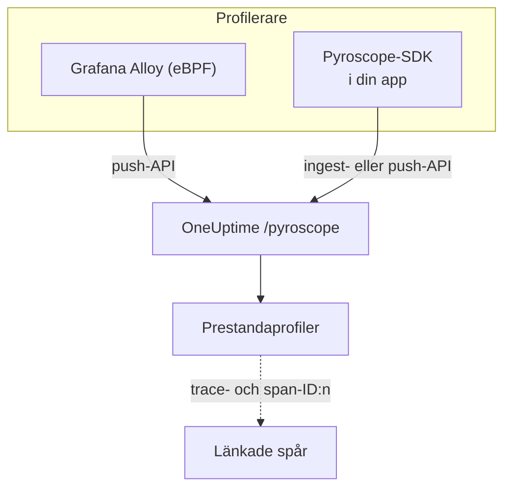

# Kontinuerlig profilering

Kontinuerlig profilering visar vad din applikation lägger CPU-tid och minne på, funktion för funktion. OneUptime erbjuder ett **Pyroscope-kompatibelt intags-API**, så allt som kan skicka till en Pyroscope-server (eBPF-profileraren i Grafana Alloy eller ett Pyroscope-SDK för ditt språk) kan skicka till OneUptime, och du läser resultatet som flamdiagram bredvid dina loggar, mätvärden och spår.

:::cards
- [Skicka profiler](#skicka-profiler): Grafana Alloy med eBPF, eller ett Pyroscope-SDK i din app.
- [Intagsslutpunkt](#intagsslutpunkt): Bas-URL:en och de tre sätten att skicka med nyckeln.
- [Kontrollera att det fungerar](#kontrollera-att-det-fungerar): Kontrollera nyckeln, sidan och uppladdningsstatusen.
- [Utforska profiler](#utforska-profiler-i-oneuptime): Flamdiagram, toppfunktioner, jämförelser och länkar till spår.
:::

## Så fungerar det

En profilerare tar stickprov på dina processer och laddar upp en profil med några sekunders mellanrum till OneUptimes slutpunkt `/pyroscope`, med din intagningsnyckel. OneUptime lagrar varje profil under tjänsten den nämner och ritar den som ett flamdiagram under **Prestandaprofiler**.



## Innan du börjar

Du behöver en intagningsnyckel för telemetri av typen **Server**. Om du inte har någon ännu:

:::steps
### Öppna intagningsnycklarna

Gå till **Produkter → Projektinställningar**, öppna **Telemetri och APM** i sidomenyn och välj **Intagningsnycklar**.


### Skapa en nyckel

Klicka på **Skapa ingestion-nyckel**. Dialogrutan har redan nyckelns namn ifyllt och **Server** valt (den sorts nyckel som en applikation eller en collector skickar med), så klicka på **Skapa ingestion-nyckel** för att skapa den, eller byt namn på den först.

### Kopiera hemligheten

Den nya nyckeln öppnas på en egen sida. Kopiera dess **Hemlig nyckel**: det är intagstoken som exemplen nedan kallar `YOUR_ONEUPTIME_INGESTION_TOKEN`.


:::

## Intagsslutpunkt

| Inställning | Värde |
| --- | --- |
| Bas-URL (Pyroscope-serverns adress) | `https://oneuptime.com/pyroscope` |
| Autentiseringshuvud | `x-oneuptime-token: YOUR_ONEUPTIME_INGESTION_TOKEN` |

Klienter lägger till sin egen sökväg efter bas-URL:en (`/ingest` för de flesta Pyroscope-SDK:er, `/push.v1.PusherService/Push` för Grafana Alloy och .NET-SDK:t från v0.14), så du konfigurerar alltid bara bas-URL:en, utan avslutande snedstreck.

OneUptime läser intagstoken från vilket som helst av dessa; använd det som din klient stöder:

| Metod | När du använder den |
| --- | --- |
| Huvudet `x-oneuptime-token` | Klienter som låter dig lägga till egna huvuden. |
| `Authorization: Bearer <token>` | SDK:er med ett alternativ `authToken` / `auth_token`: det är det de skickar. |
| HTTP Basic-autentisering, med token som **lösenord** (valfritt användarnamn) | Klienter som bara erbjuder användare och lösenord för Basic-autentisering. |

> [!NOTE]
> Driver du OneUptime själv? Ersätt `https://oneuptime.com` med din egen värd, till exempel `https://YOUR-ONEUPTIME-HOST/pyroscope`.

## Profilformat som stöds

| Format | Skickas av | Stöds |
| --- | --- | --- |
| pprof (binär protobuf, eventuellt gzip-komprimerad) | Pyroscope-SDK:er för Go, Node.js och .NET; Grafana Alloy | Ja |
| Folded / collapsed text | Pyroscope-SDK:er för Python, Ruby och Rust (deras standardformat för uppladdning) | Ja |
| JFR (Java Flight Recorder) | Pyroscopes Java-agent | Inte ännu: använd Grafana Alloy för Java-tjänster |

## Skicka profiler

Grafana Alloy profilerar varje process på en värd utan kodändringar och är det rekommenderade sättet att börja. Ett Pyroscope-SDK körs i stället inne i din applikation.

:::tabs
@tab Grafana Alloy
[Grafana Alloy](https://grafana.com/docs/alloy/latest/) samlar med eBPF in CPU-profiler från varje process på en Linux-värd: ingen agent i din applikation och inga kodändringar. Det fungerar för Go, Rust, C/C++, Java, Python, Ruby, PHP, Node.js och .NET.

Skapa Alloy-konfigurationen:

```hcl title="alloy-config.alloy"
discovery.process "all" {
  refresh_interval = "60s"
}

discovery.relabel "alloy_profiles" {
  targets = discovery.process.all.targets

  rule {
    action       = "replace"
    source_labels = ["__meta_process_exe"]
    target_label  = "service_name"
  }
}

pyroscope.ebpf "default" {
  targets    = discovery.relabel.alloy_profiles.output
  forward_to = [pyroscope.write.oneuptime.receiver]

  collect_interval = "15s"
  sample_rate      = 97
}

pyroscope.write "oneuptime" {
  endpoint {
    url = "https://oneuptime.com/pyroscope"
    headers = {
      "x-oneuptime-token" = "YOUR_ONEUPTIME_INGESTION_TOKEN",
    }
  }
}
```

Kör det med Docker. eBPF kräver en privilegierad container med värdens PID-namnområde:

```yaml title="docker-compose.yml"
services:
  alloy:
    image: grafana/alloy:latest
    privileged: true
    pid: host
    volumes:
      - ./alloy-config.alloy:/etc/alloy/config.alloy
      - /proc:/proc:ro
      - /sys:/sys:ro
    command:
      - run
      - /etc/alloy/config.alloy
```

Eller kör det direkt på värden:

```bash
alloy run alloy-config.alloy
```

Relabel-regeln ger varje profils tjänst namnet på processens körbara fil.
@tab Go
Go-SDK:t laddar upp pprof. Peka dess serveradress mot OneUptimes bas-URL och skicka din intagstoken som auth-token:

```go
import "github.com/grafana/pyroscope-go"

pyroscope.Start(pyroscope.Config{
    ApplicationName: "my-service",
    ServerAddress:   "https://oneuptime.com/pyroscope",
    AuthToken:       "YOUR_ONEUPTIME_INGESTION_TOKEN",
    ProfileTypes: []pyroscope.ProfileType{
        pyroscope.ProfileCPU,
        pyroscope.ProfileAllocObjects,
        pyroscope.ProfileAllocSpace,
        pyroscope.ProfileInuseObjects,
        pyroscope.ProfileInuseSpace,
        pyroscope.ProfileGoroutines,
    },
})
```
@tab Node.js
Node.js-SDK:t laddar upp pprof:

```javascript
const Pyroscope = require("@pyroscope/nodejs");

Pyroscope.init({
  serverAddress: "https://oneuptime.com/pyroscope",
  appName: "my-service",
  authToken: "YOUR_ONEUPTIME_INGESTION_TOKEN",
});

Pyroscope.start();
```
@tab Python
Python-SDK:t laddar upp folded text:

```python
import pyroscope

pyroscope.configure(
    application_name="my-service",
    server_address="https://oneuptime.com/pyroscope",
    auth_token="YOUR_ONEUPTIME_INGESTION_TOKEN",
)
```
@tab .NET
Pyroscopes .NET-profilerare är en inbyggd CLR-profilerare: den kräver inga kodändringar och slås på helt via miljövariabler. Ladda ned versionen för din avbildning från [pyroscope-dotnet releases](https://github.com/grafana/pyroscope-dotnet/releases) (`glibc` eller `musl` för Alpine, `x86_64` eller `aarch64`) och läs in den i körmiljön:

```dockerfile title="Dockerfile"
FROM alpine:3.20 AS pyroscope-profiler
ARG PYROSCOPE_DOTNET_VERSION=1.5.1
ADD https://github.com/grafana/pyroscope-dotnet/releases/download/pyroscope-${PYROSCOPE_DOTNET_VERSION}/pyroscope.${PYROSCOPE_DOTNET_VERSION}-glibc-x86_64.tar.gz /tmp/pyroscope.tar.gz
RUN mkdir -p /pyroscope && tar -xzf /tmp/pyroscope.tar.gz -C /pyroscope

FROM mcr.microsoft.com/dotnet/aspnet:10.0
# ... your application ...
COPY --from=pyroscope-profiler /pyroscope /pyroscope
ENV CORECLR_ENABLE_PROFILING=1
ENV CORECLR_PROFILER={BD1A650D-AC5D-4896-B64F-D6FA25D6B26A}
ENV CORECLR_PROFILER_PATH=/pyroscope/Pyroscope.Profiler.Native.so
ENV LD_PRELOAD=/pyroscope/Pyroscope.Linux.ApiWrapper.x64.so
ENV LD_LIBRARY_PATH=/pyroscope
```

Peka den sedan mot OneUptime, till exempel i din Kubernetes- / Helm-miljö:

```bash
PYROSCOPE_APPLICATION_NAME=my-service
PYROSCOPE_PROFILING_ENABLED=1
PYROSCOPE_SERVER_ADDRESS=https://oneuptime.com/pyroscope
PYROSCOPE_BASIC_AUTH_USER=oneuptime
PYROSCOPE_BASIC_AUTH_PASSWORD=YOUR_ONEUPTIME_INGESTION_TOKEN
```

Intagstoken hör hemma i lösenordet för Basic-autentisering. Användarnamnet kan vara vilket icke-tomt värde som helst, men profileraren skickar inga inloggningsuppgifter alls om inte båda är satta. För att i stället skicka token som huvud sätter du `PYROSCOPE_HTTP_HEADERS={"x-oneuptime-token":"YOUR_ONEUPTIME_INGESTION_TOKEN"}`.

Hur token skickas beror på profilerarens version. 1.5 och senare ignorerar `PYROSCOPE_AUTH_TOKEN`, så om du uppgraderar från en äldre version och behåller den inställningen avvisas varje uppladdning med `401`:

| pyroscope-dotnet-version | Laddar upp till | Tokeninställning |
| --- | --- | --- |
| v0.13 och äldre | `/pyroscope/ingest` | `PYROSCOPE_AUTH_TOKEN` |
| v0.14 till 1.4 | `/pyroscope/push.v1.PusherService/Push` | `PYROSCOPE_AUTH_TOKEN` |
| 1.5 och senare | `/pyroscope/push.v1.PusherService/Push` | `PYROSCOPE_BASIC_AUTH_USER=oneuptime` och `PYROSCOPE_BASIC_AUTH_PASSWORD=<token>` (båda måste vara satta), eller `PYROSCOPE_HTTP_HEADERS={"x-oneuptime-token":"<token>"}` |

Versioner före 1.0 är taggade `v<version>-pyroscope` i stället för `pyroscope-<version>` (till exempel `https://github.com/grafana/pyroscope-dotnet/releases/download/v0.13.0-pyroscope/pyroscope.0.13.0-glibc-x86_64.tar.gz`); profilerarens GUID och filnamnen är desamma i alla versioner.

CPU-profilering är på som standard. Profilering av faktisk tid, allokeringar, undantag och låskonflikter är valfri: sätt `PYROSCOPE_PROFILING_WALLTIME_ENABLED`, `PYROSCOPE_PROFILING_ALLOCATION_ENABLED`, `PYROSCOPE_PROFILING_EXCEPTION_ENABLED` eller `PYROSCOPE_PROFILING_LOCK_ENABLED` till `true`. Statiska etiketter hör hemma i `PYROSCOPE_LABELS` (`key:value,key:value`).

Profileraren laddar upp var 15:e sekund och komprimerar **inte** sina uppladdningar, så en hårt belastad tjänst kan skicka flera MB per uppladdning. OneUptimes egen ingress tar emot upp till 16 MB på `/pyroscope`; om en annan proxy står framför OneUptime (till exempel ingress-nginx, vars standard för `proxy-body-size` är 1 MB), höj även dess storleksgräns för `/pyroscope`, annars avvisas stora uppladdningar med `413` innan de når OneUptime.
@tab Java
Pyroscopes Java-agent laddar upp profiler i JFR-format, som OneUptime inte tar in ännu. Profilera i stället Java-tjänster med Grafana Alloy (fliken **Grafana Alloy**): det fångar JVM-CPU-profiler utan agent eller kodändringar.
:::

**Ruby** och **Rust** fungerar som Go, Node.js och Python: installera [Pyroscope-SDK:t för ditt språk](https://grafana.com/docs/pyroscope/latest/configure-client/) och sätt serveradressen till `https://oneuptime.com/pyroscope` med din intagstoken som auth-token (eller, om din SDK-version bara erbjuder Basic-autentisering, som lösenord för Basic-autentisering).

## Profiltyper som stöds

En pprof kan deklarera flera sampeltyper; varje uppladdad profil lagras under en av dem: CPU-tid (`cpu` i nanosekunder) om den har det, annars faktisk tid, annars byte som används och därefter allokerade byte, annars den första typen den deklarerar. Alla typer lagras och kan visas; typerna nedan får egen gruppering, enheter och etiketter i OneUptime:

| Profiltyp | Visas som | Enhet |
| --- | --- | --- |
| `cpu`, `samples` | CPU-tid | nanosekunder |
| `wall` | Faktisk tid | nanosekunder |
| `inuse_space`, `alloc_space`, `heap` | Minne (byte) | byte |
| `inuse_objects`, `alloc_objects` | Minne (antal objekt) | antal |
| `mutex`, `contention`, `block` | Låskonflikt | nanosekunder |
| `goroutine` | Goroutines (Go) | antal |

Allt annat (till exempel en egen sampeltyp) visas under "Annat" med sitt råa namn.

## Kontrollera att det fungerar

:::steps
### Kontrollera din token

Intagsslutpunkterna svarar `401` på en saknad eller ogiltig token, men de flesta profilerare visar inte det någonstans där du ser det (.NET-profileraren loggar till exempel bara HTTP-svar på felsökningsnivå). Fråga valideringsslutpunkten direkt:

```bash
curl -i -H "x-oneuptime-token: YOUR_ONEUPTIME_INGESTION_TOKEN" \
  https://oneuptime.com/otlp/v1/validate
```

En giltig token ger `200` med `{"valid": true, ...}`, och dess `keyType` måste vara `Server`: en webbläsarnyckel är också giltig men kan inte skicka profiler. En okänd, återkallad, inaktiverad eller utgången token ger `401`.

### Öppna profilsidan

Gå till **Produkter → Prestandaprofiler** i OneUptimes instrumentpanel. Med Alloys insamlingsintervall på 15 sekunder (eller SDK:ernas uppladdningsintervall på 10 till 15 sekunder) visas de första profilerna och deras flamdiagram inom en eller två minuter efter att agenten har startat.

### Kontrollera tjänsten

Profiler knyts till den telemetritjänst som SDK:ts `application_name` / `appName` / `PYROSCOPE_APPLICATION_NAME` nämner (eller namnet på processens körbara fil med Alloys relabel-regel ovan).

### Fortfarande inget? Titta på uppladdningsstatusen

För .NET-profileraren sätter du `DD_TRACE_DEBUG=1` på applikationen i en minut: då loggar den en rad `PyroscopePprofSink <status>` för varje uppladdning. `200` betyder att OneUptime tog emot den; `401` är token; `404` betyder oftast att `PYROSCOPE_SERVER_ADDRESS` saknar suffixet `/pyroscope`; `413` betyder att en proxy framför OneUptime avvisade uppladdningen på grund av storleken (se fliken **.NET** under [Skicka profiler](#skicka-profiler)). Om du driver OneUptime själv registrerar ingressens (nginx) åtkomstlogg samma status för varje begäran till `/pyroscope`.
:::

## Utforska profiler i OneUptime

**Produkter → Prestandaprofiler** öppnar en översikt över var tiden går i dina tjänster, och **Alla profiler** listar varje uppladdning. Välj vad du vill analysera: **Allt**, **CPU-tid**, **Minne** eller **Lås**, eller en viss typ som **Faktisk tid** eller **Goroutines**.

En profils sida har tre vyer:

| Vy | Vad den visar |
| --- | --- |
| **Flamdiagram** | Varje stapel är en funktion i anropsstacken, och dess bredd är proportionell mot tiden eller resurserna den förbrukade. Klicka på en funktion för att zooma in och se vilka som anropar den och vilka den anropar. |
| **Top functions** | Profilens funktioner, sorterade efter egen eller total tid. **Only my code** döljer biblioteksramar. |
| **Diff vs. baseline** | Profilen jämförd med en tidigare period (**jämfört med för 1 timme sedan**, **jämfört med igår** eller **jämfört med förra veckan**), med funktionerna under **Most regressed** och **Most improved**. |

**Download pprof** sparar profilen för lokala verktyg som `go tool pprof`.

### Koppling till spår

När en profil bär trace- och span-ID:n (till exempel som sampeletiketter `trace_id` / `span_id`) kan du gå direkt från ett långsamt span i ett spår till motsvarande CPU- eller minnesprofil för att förstå exakt vilken kod som kördes, och **Open linked trace** går åt andra hållet.

Ett spans flik **Profil** innehåller även de sampel som är kopplade till spans som ligger under det, eftersom profilerare ofta tillskriver en begärans CPU-tid ett underordnat span i stället för själva begärans span.

## Datalagring

Profiler sparas lika länge som projektets telemetri: **Projektinställningar → Telemetri och APM → Datalagring** anger **Standardlagring (dagar)**, 15 dagar om du inte ändrar den. Data raderas automatiskt när lagringsperioden är slut. Abonnemang med undantag för lagring kan också spara profiler längre eller kortare än annan telemetri, eller ange lagring per tjänst på tjänstens sida **Inställningar**.

## Nästa steg

:::cards
- [Profilövervakning](/docs/monitor/profiles-monitor): Få larm på profilerna som dina tjänster skickar, efter antal och typ.
- [OpenTelemetry](/docs/telemetry/open-telemetry): Skicka spåren som dina profiler länkas till.
- [Kubernetes-agent](/docs/telemetry/kubernetes-agent): Profilera ett helt kluster med agentens eBPF-profilerare.
:::
