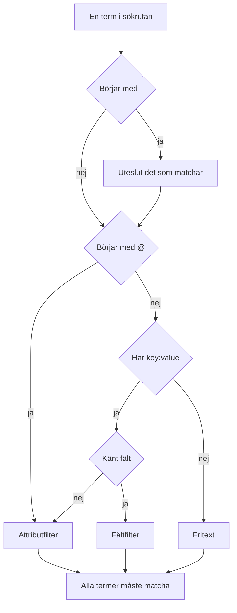

# Söksyntax

Sökrutan ovanför utforskarna för loggar, spår, mätvärden och undantag talar ett enda frågespråk. En fråga är en lista med filter åtskilda av mellanslag, och **alla filter måste matcha**: det finns ingen underförstådd OR mellan filter. Använd den här sidan som referens medan du söker.

:::cards
- [De två sorternas filter](#de-två-sorternas-filter): Inbyggda fält, attribut och fritext.
- [Matcha värden](#matcha-värden): Jokertecken, "innehåller", jämförelser och listor.
- [Uteslutning](#uteslutning): Vänd på vilket filter som helst med ett `-` först.
- [Fält per signal](#fält-per-signal): Vad du kan filtrera på i varje utforskare.
:::

## Så läses en fråga

```text
severity:error @platform.team:a* -@http.method:GET timeout
```

Det läses som: loggar på nivån error vars attribut `platform.team` börjar med `a`, vars attribut `http.method` inte är `GET` och vars meddelande nämner `timeout`.

| Term | Sort | Matchar |
| --- | --- | --- |
| `severity:error` | Fält | Loggens allvarlighetsgrad är Error. |
| `@platform.team:a*` | Attribut | Attributet `platform.team` börjar med `a`. |
| `-@http.method:GET` | Uteslutet attribut | Attributet `http.method` är allt utom `GET`. |
| `timeout` | Fritext | Meddelandet innehåller `timeout`. |

Varje term åtskild av mellanslag läses för sig, och sedan kombineras alla med AND:



## De två sorternas filter

| Form | Filtrerar | Exempel |
| --- | --- | --- |
| `field:value` | Ett inbyggt fält i signalen | `severity:error` |
| `@attribute:value` | Ett OpenTelemetry-attribut på raden | `@http.status_code:500` |
| lösa ord | Meddelandet (loggar), span-namnet (spår), måttnamnet (mätvärden) eller undantagsmeddelandet (undantag) | `connection refused` |

Ett löst `key:value` vars nyckel inte är ett känt fält behandlas som ett attribut, så `k8s.pod:api-0` och `@k8s.pod:api-0` betyder samma sak. Prefixet `@` betyder alltid "sök i attributen", med ett undantag: i utforskaren för undantag filtrerar `@type:`, `@service:`, `@env:` och `@class:` fortfarande de fälten.

Text som bara råkar innehålla ett kolon förblir text: `https://example.com` och `12:30` söks som ord och läses inte som filter.

## Matcha värden

Allt i den här tabellen fungerar på alla attribut och på de flesta inbyggda fält; [Fält per signal](#fält-per-signal) anger de fält som läser ett värde enklare.

| Du skriver | Matchar |
| --- | --- |
| `@k:abc` | exakt `abc` |
| `@k:a*` | allt som börjar med `a`: `abc`, `alpha` |
| `@k:*c` | allt som slutar med `c` |
| `@k:a*c` | börjar med `a` och slutar med `c` |
| `@k:a?c` | `?` är exakt ett tecken: `abc`, `axc`, men inte `ac` |
| `@k:*` | attributet finns och är inte tomt |
| `@k:~abc` | innehåller `abc` var som helst |
| `@k:!abc` | allt utom `abc` |
| `@k:>100` | större än 100. Även `>=`, `<`, `<=` |
| `@k:(a OR b)` | något av de två värdena. `@k:[a, b]` är samma sak |
| `@k:(a* OR b*)` | något av de två mönstren |

Matchning med jokertecken och "innehåller" ignorerar skiftläge; exakt matchning gör det inte, eftersom den jämför med värdet exakt som det lagrades.

### Värden med mellanslag

Sätt värdet inom dubbla citattecken:

```text
name:"SELECT wp_options"
@k8s.container.name:"my container"
```

Citattecken skyddar **mellanslag**, inte jokertecken: `@k:"a b*"` matchar fortfarande allt som börjar med `a b`.

### `*`, `?` och andra tecken bokstavligt

Ett omvänt snedstreck gör nästa tecken bokstavligt:

| Du skriver | Matchar |
| --- | --- |
| `@k:a\*b` | exakt `a*b` |
| `@k:\~abc` | exakt `~abc` |
| `@k:\>5` | exakt `>5` |

Värden som innehåller `%` eller `_` behöver inte escapas: de är alltid bokstavliga.

## Uteslutning

Ett `-` först vänder på vilket filter som helst, även dem ovan:

| Du skriver | Matchar |
| --- | --- |
| `-severity:debug` | allt utom debug |
| `-@platform.team:a*` | allt vars `platform.team` **inte** börjar med `a`, även rader helt utan `platform.team` |
| `-@k:*` | attributet saknas eller är tomt |
| `-@k:(a OR b)` | inget av de två värdena |
| `-@k:>100` | 100 eller mindre |
| `-@k:~abc` | innehåller inte `abc` |

I utforskaren för spår utesluter `-` bara attribut. `-status:error` läses som text att söka efter i span-namn, och hittar ingenting; fråga i stället efter de värden du vill ha, till exempel `status:(ok OR unset)`.

## Fält per signal

Fältnamn skiljer inte på versaler och gemener: `statusMessage:` och `statusmessage:` är samma fält.

### Loggar

| Fält | Alias | Anteckningar |
| --- | --- | --- |
| `severity` | `level` | `fatal`, `error`, `warning` (eller `warn`), `info` (eller `information`), `debug`, `trace`, `unspecified`, i valfritt skiftläge |
| `service` | | Tjänstnamn, utskrivet i sin helhet, i valfritt skiftläge |
| `trace` | | Trace-ID |
| `span` | | Span-ID |
| `message` | `msg`, `log`, `body` | Loggraden. Lösa ord söker också i den |

### Spår

Spårfält tar ett vanligt värde eller en lista som `status:(ok OR unset)`, och `duration` tar även `>` och `<`. Jokertecken, `~`, `!` och ett `-` först fungerar här bara på attribut.

| Fält | Anteckningar |
| --- | --- |
| `service` | Tjänstnamn |
| `name` | Span-namn. Ett enda värde matchar vilken del av det som helst. Lösa ord söker också i det |
| `status` | `ok`, `error`, `unset` (unset = Ingen felstatus angiven, OpenTelemetry-standarden) |
| `kind` | `server`, `client`, `producer`, `consumer`, `internal` |
| `duration` | Millisekunder: `duration:>500`, `duration:<200` eller ett exakt värde |
| `statusMessage` | Statusmeddelandets text. Ett enda värde matchar vilken del av den som helst |
| `hasException` | `true` eller `false` |
| `trace`, `span` | ID:n |

### Mätvärden

| Fält | Anteckningar |
| --- | --- |
| `name` | Måttnamn. Ett vanligt värde matchar vilken del av det som helst, så `name:http.server` hittar `http.server.request.duration`. Lösa ord söker också i det |
| `service` | Tjänstnamn. Ett vanligt värde matchar vilken del av det som helst |

### Undantag

| Fält | Alias | Anteckningar |
| --- | --- | --- |
| `type` | `exceptionType` | Undantagstyp, t.ex. `type:TypeError` |
| `env` | `environment` | Miljö, från resursattributet `deployment.environment` |
| `service` | | Tjänstnamn. Ett vanligt värde matchar vilken del av det som helst |
| `class` | `errorClass` | Vems fel det är: `code-fault`, `user-error`, `expected-denial`, `infrastructure` eller `unknown` |

Lösa ord söker i undantagsmeddelandet.

Utforskaren **Security Events** använder samma språk med egna fält, som `severity`, `tactic` och `user`: se [Security Events](/docs/telemetry/security-events).

## Kombinera filter

Filter kombineras med AND. Du får skriva `AND` mellan dem, och det ändrar ingenting:

```text
severity:error service:api          # both must hold
severity:error AND service:api      # identical
```

Det finns ingen OR och ingen NOT **mellan** filter: `OR` och `NOT` som står där hoppas över, så `NOT severity:debug` betyder samma sak som `severity:debug`. Uteslut med ett `-` först (`-severity:debug`), och använd listformen för att matcha något av två värden för samma nyckel:

```text
@http.method:(GET OR POST)
```

Två filter på samma nyckel kombineras med AND; så skriver man ett intervall eller ett mönster med två ändar:

```text
@http.status_code:>=500 @http.status_code:<=599
@k:a* @k:*z
```

## Chips och sökrutan

Enter på en term `key:value` tillämpar den, oftast som ett chip ovanför resultaten. Ett chip bär värdet exakt som det skrevs, så ett jokertecken förblir ett jokertecken. En term som ett chip inte kan bära, till exempel ett uteslutet `-key:value`, stannar i sökrutan och filtrerar därifrån. Ett klick på ett värde i fasettsidopanelen lägger till samma sorts chip, med värdet escapat: ett lagrat värde som råkar innehålla `*` filtrerar på just det värdet, inte som ett mönster.

Chips ingår i den sparade vyn och i sidans URL, så ett filter överlever en omladdning, ett bokmärke och en delad länk.

## Bra att veta

- Attribut**nycklar** jämförs utan hänsyn till skiftläge vid filter med jokertecken, "innehåller", prefix och suffix, så du behöver inte komma ihåg om den togs in som `requestId` eller `requestid`.
- Ett filter `-@k:...` matchar även rader som aldrig har haft attributet: en rad helt utan `platform.team` börjar förstås inte med `a`.
- Numeriska jämförelser fungerar på attributvärden som lagrats som text; ett värde som inte är ett tal uppfyller aldrig en jämförelse.

## Nästa steg

:::cards
- [Zooma in på ett tidsintervall](/docs/telemetry/charts-and-time-ranges): Begränsa utforskarna till ögonblicket som spelar roll.
- [Loggpipelines](/docs/telemetry/log-pipelines): Gör delar av en loggrad till sökbara attribut.
- [Loggövervakning](/docs/monitor/logs-monitor): Få larm när loggarna du söker efter dyker upp.
- [OpenTelemetry](/docs/telemetry/open-telemetry): Skicka loggar, mätvärden och spår att söka i.
:::
