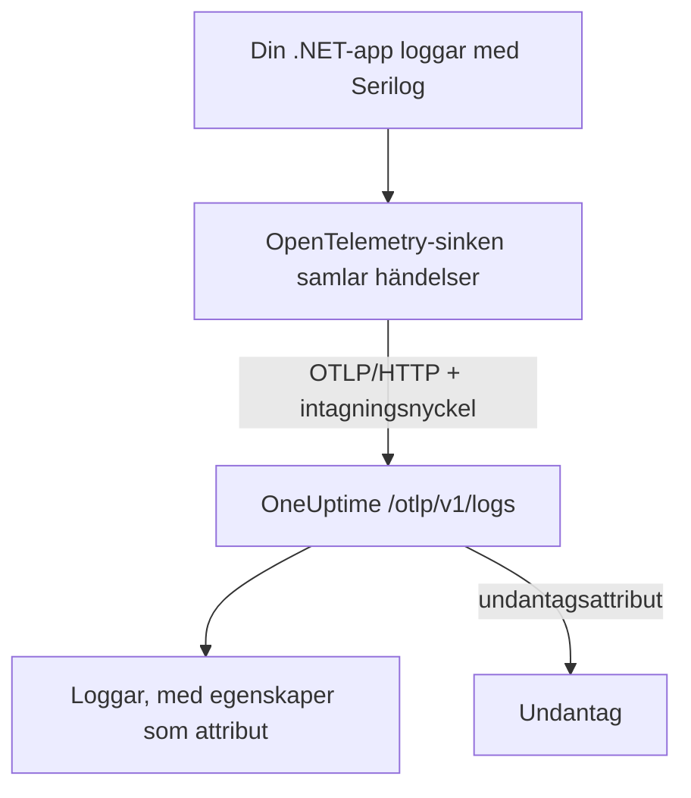

# Serilog (.NET)

[Serilog](https://serilog.net) är det mest använda biblioteket för strukturerad loggning i .NET. Med den officiella sinken [`Serilog.Sinks.OpenTelemetry`](https://github.com/serilog/serilog-sinks-opentelemetry) skickas varje händelse som din applikation loggar via Serilog till OneUptime över OpenTelemetry Protocol (OTLP), och den blir sökbar under **Produkter → Loggar** med sina strukturerade egenskaper, sin allvarlighetsgrad och kopplingen till traces.

Det finns inget OneUptime-specifikt paket att installera: sinken pratar med samma OTLP-endpoint som OneUptime erbjuder för all OpenTelemetry-data. Det fungerar för konsolappar, worker services, ASP.NET Core-appar och allt annat som körs på .NET.

:::cards
- [Sätt upp sinken](#sätt-upp-sinken): Installera två paket och konfigurera dem i kod eller i `appsettings.json`.
- [Undantag](#undantag): Loggade undantag blir ärenden under Undantag.
- [Felsökning](#felsökning): Vad du kontrollerar när inga loggar kommer fram.
:::

## Så fungerar det



Sinken samlar logghändelser och skickar dem i bakgrunden. Varje namngiven egenskap blir ett attribut på loggen, och ett undantag som loggas med Serilog kommer fram med de attribut som OneUptime gör till ett ärende.

## Innan du börjar

- Ett OneUptime-projekt. I OneUptime Cloud debiteras telemetri per intagen GB – se [priser](https://oneuptime.com/pricing) – och ett projekt på Free-planen behöver en betalningsmetod innan det kan skicka telemetri.
- En .NET-applikation som använder, eller kan använda, Serilog.
- En intagningsnyckel för telemetri som dina loggar autentiseras med. Om du inte har någon:

:::steps
### Öppna intagningsnycklarna

Gå till **Produkter → Projektinställningar**, öppna **Telemetri och APM** i sidomenyn och välj **Intagningsnycklar**.


### Skapa en nyckel

Klicka på **Skapa ingestion-nyckel**. Dialogen har redan fyllt i nyckelns namn och valt **Server** – den sortens nyckel som en applikation eller en collector skickar med – så klicka på **Skapa ingestion-nyckel** för att skapa den, eller byt namn på den först.

### Kopiera hemligheten

Den nya nyckeln öppnas på en egen sida. Kopiera dess **Hemlig nyckel**: det är `YOUR_TELEMETRY_INGESTION_TOKEN` i exemplen nedan.


:::

## Det här behöver du från OneUptime

| Inställning | Värde |
| ------------- | ------------------------------------------------------------ |
| OTLP-endpoint | `https://oneuptime.com/otlp` |
| Autentiseringsheader | `x-oneuptime-token: YOUR_TELEMETRY_INGESTION_TOKEN` |
| Tjänstnamn | Namnet som din tjänst ska visas under, t.ex. `my-service` |

> [!NOTE]
> Kör du OneUptime i egen drift? Ersätt `https://oneuptime.com/otlp` med `https://YOUR-ONEUPTIME-HOST/otlp` (eller `http://...` om du inte terminerar TLS). Allt annat är detsamma.

När protokollet är satt till `HttpProtobuf` lägger sinken till sökvägen `/v1/logs` på endpointen, så den slutliga URL som den skickar till är `https://oneuptime.com/otlp/v1/logs`. Du anger bara bas-endpointen `/otlp`.

## Sätt upp sinken

:::steps
### Installera NuGet-paketen

Lägg till Serilog och OpenTelemetry-sinken i ditt projekt:

```bash
dotnet add package Serilog
dotnet add package Serilog.Sinks.OpenTelemetry
```

Om du konfigurerar sinken från `appsettings.json` lägger du också till `Serilog.Settings.Configuration`. För ASP.NET Core-appar lägger du till `Serilog.AspNetCore`, som kopplar Serilog till värden och request-pipelinen:

```bash
dotnet add package Serilog.Settings.Configuration
dotnet add package Serilog.AspNetCore
```

### Konfigurera sinken

Peka sinken mot din OTLP-endpoint i OneUptime, sätt protokollet till `HttpProtobuf`, skicka din intagningstoken som header och märk loggarna med ett `service.name`. Konfigurera den i kod, i `appsettings.json` eller i ASP.NET Core-värden:

:::tabs
@tab I kod
```csharp title="Program.cs"
using Serilog;
using Serilog.Sinks.OpenTelemetry;

Log.Logger = new LoggerConfiguration()
    .MinimumLevel.Information()
    .Enrich.FromLogContext()
    .WriteTo.Console() // optional: keep local logs too
    .WriteTo.OpenTelemetry(options =>
    {
        // Base OTLP endpoint. The sink appends /v1/logs automatically.
        options.Endpoint = "https://oneuptime.com/otlp";
        options.Protocol = OtlpProtocol.HttpProtobuf;

        // Authenticate with your OneUptime telemetry ingestion token.
        options.Headers = new Dictionary<string, string>
        {
            ["x-oneuptime-token"] = "YOUR_TELEMETRY_INGESTION_TOKEN"
        };

        // Identify your service in OneUptime.
        options.ResourceAttributes = new Dictionary<string, object>
        {
            ["service.name"] = "my-service",
            ["deployment.environment"] = "production"
        };
    })
    .CreateLogger();

try
{
    Log.Information("Application starting up");
    // ... your application code ...
}
finally
{
    // Flush any buffered logs before the process exits.
    Log.CloseAndFlush();
}
```
@tab appsettings.json
Lägg sinkens inställningar i `appsettings.json`:

```json title="appsettings.json"
{
  "Serilog": {
    "Using": ["Serilog.Sinks.OpenTelemetry"],
    "MinimumLevel": "Information",
    "WriteTo": [
      {
        "Name": "OpenTelemetry",
        "Args": {
          "endpoint": "https://oneuptime.com/otlp",
          "protocol": "HttpProtobuf",
          "headers": {
            "x-oneuptime-token": "YOUR_TELEMETRY_INGESTION_TOKEN"
          },
          "resourceAttributes": {
            "service.name": "my-service",
            "deployment.environment": "production"
          }
        }
      }
    ]
  }
}
```

Bygg sedan loggern från konfigurationen:

```csharp title="Program.cs"
using Serilog;
using Microsoft.Extensions.Configuration;

IConfiguration configuration = new ConfigurationBuilder()
    .AddJsonFile("appsettings.json")
    .Build();

Log.Logger = new LoggerConfiguration()
    .ReadFrom.Configuration(configuration)
    .CreateLogger();
```
@tab ASP.NET Core
För ASP.NET Core (minimal hosting, .NET 6 och senare) använder du `Serilog.AspNetCore`, så att Serilog ersätter standardloggern och även fångar loggar från ramverket och från requests:

```csharp title="Program.cs"
using Serilog;
using Serilog.Sinks.OpenTelemetry;

var builder = WebApplication.CreateBuilder(args);

builder.Host.UseSerilog((context, services, configuration) =>
{
    configuration
        .ReadFrom.Configuration(context.Configuration)
        .Enrich.FromLogContext()
        .WriteTo.OpenTelemetry(options =>
        {
            options.Endpoint = "https://oneuptime.com/otlp";
            options.Protocol = OtlpProtocol.HttpProtobuf;
            options.Headers = new Dictionary<string, string>
            {
                ["x-oneuptime-token"] = "YOUR_TELEMETRY_INGESTION_TOKEN"
            };
            options.ResourceAttributes = new Dictionary<string, object>
            {
                ["service.name"] = "my-service"
            };
        });
});

var app = builder.Build();

// Logs one summary event per HTTP request.
app.UseSerilogRequestLogging();

app.MapGet("/", () => "Hello World");
app.Run();
```
:::

> [!IMPORTANT]
> Sinken samlar logghändelser och skickar dem asynkront. Anropa alltid `Log.CloseAndFlush()` (eller frigör loggern) innan applikationen avslutas, annars kan den sista omgången loggar gå förlorad. I ASP.NET Core sköter `Serilog.AspNetCore` det åt dig vid en ordnad avstängning.

> [!TIP]
> Håll token utanför versionshanteringen. Läs den från en miljövariabel eller ett hemlighetslager och lägg in den i konfigurationen vid start, i stället för att checka in den i `appsettings.json`.

### Skriv loggar

Använd Serilog som vanligt. Strukturerade egenskaper behålls och blir sökbara attribut i OneUptime:

```csharp
Log.Information("Order {OrderId} placed by {CustomerId} for {Amount:C}",
    orderId, customerId, amount);

Log.Warning("Payment gateway slow: {LatencyMs}ms", latencyMs);
```

Varje namngiven egenskap (`OrderId`, `CustomerId`, `Amount`, `LatencyMs`) skickas som ett attribut på loggen, så att du kan filtrera och söka på dem i utforskaren **Produkter → Loggar**.

### Kontrollera att loggarna kommer fram

Kör din applikation och skriv några logghändelser. Efter några sekunder visas de under **Produkter → Loggar** och på din tjänsts sida under **Produkter → Tjänster** – tjänsten har namnet från det `service.name` du satte (`my-service`). Deras strukturerade egenskaper finns som filter.
:::

## Undantag

När du loggar ett undantag med Serilog lägger sinken till OpenTelemetry-attributen `exception.type`, `exception.message` och `exception.stacktrace` på loggposten:

```csharp
try
{
    ProcessPayment();
}
catch (Exception ex)
{
    Log.Error(ex, "Failed to process payment for order {OrderId}", orderId);
}
```

OneUptime känner igen de här attributen och samlar felet i ett ärende under **Undantag**, efter fingeravtryck och kopplat till rätt tjänst. Ett fel som både en trace och en logg rapporterar slås ihop till ett enda ärende. Se [Undantag från loggar](/docs/telemetry/open-telemetry#undantag-från-loggar) för hur igenkänningen fungerar.

## Koppling till traces

Om din applikation också är instrumenterad med OpenTelemetry .NET SDK för traces får Serilog-händelser som skickas inom ett aktivt span automatiskt aktuellt `TraceId` och `SpanId` (det ingår i sinkens standard-`IncludedData`). Då kan OneUptime koppla en loggrad direkt till den trace där den uppstod, och du kan hoppa från en logg till den omgivande requesten och tillbaka.

Vill du även skicka traces och mätvärden finns .NET-uppsättningen i [snabbstarten för OpenTelemetry](/docs/telemetry/open-telemetry#snabbstart).

## Felsökning

:::details Inga loggar visas
Kontrollera värdet på `x-oneuptime-token` och att det hör till projektet du tittar på. Kontrollera att endpointen är `https://oneuptime.com/otlp` (bara bassökvägen – lägg inte till `/v1/logs` själv). För att se varför sinken misslyckas slår du vid start på Serilogs egen felutskrift med `Serilog.Debugging.SelfLog.Enable(Console.Error)`: den visar statuskoden som OneUptime svarar med.
:::

:::details Loggarna visas först när appen avslutas, eller de sista loggarna saknas
Se till att `Log.CloseAndFlush()` körs vid avstängning. Sinken samlar händelser, så buffrade loggar går förlorade om processen avbryts utan flush.
:::

:::details 401 Unauthorized, och inget tas emot
Nyckeln saknas, är okänd eller har gått ut. Kontrollera att headerns namn är exakt `x-oneuptime-token` och att värdet är nyckelns **Hemlig nyckel**.
:::

:::details 402 eller 422, och inget tas emot
`402`: i OneUptime Cloud har projektet Free-planen och ingen betalningsmetod. Lägg till en under **Projektinställningar → Fakturering och fakturor → Fakturering**. `422`: nyckeln är inaktiverad, eller så är det en webbläsarnyckel. Slå på **Aktiverad** igen i nyckelns inställningar, eller skapa en **Server**-nyckel.
:::

:::details Loggarna kommer under fel tjänstnamn
Sätt `service.name` i `ResourceAttributes` (kod) eller `resourceAttributes` (appsettings.json). Utan det sparas dina loggar under det platshållarnamn som sinken skickar i stället, och inte under din tjänsts namn.
:::

:::details Anslutningsfel mot en instans i egen drift
Se till att protokollet stämmer med din endpoints schema (`https://` eller `http://`) och att din OneUptime-värd går att nå från applikationen.
:::

Har du frågor eller behöver hjälp kan du skriva till oss på support@oneuptime.com.

## Nästa steg

:::cards
- [OpenTelemetry](/docs/telemetry/open-telemetry): Skicka även traces och mätvärden från .NET.
- [Loggpipelines](/docs/telemetry/log-pipelines): Tolka och berika loggar när de kommer in.
- [Loggövervakning](/docs/monitor/logs-monitor): Larma när matchande loggar dyker upp.
- [Söksyntax](/docs/telemetry/search-syntax): Filtrera på dina Serilog-egenskaper.
:::
