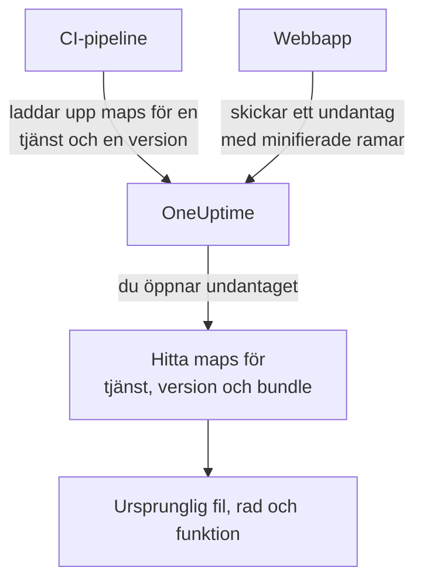

# Source maps

Ladda upp source maps från ditt frontend-bygge till OneUptime, så visar webbläsarundantag under **Undantag** dina ursprungliga filnamn, rader och funktioner i stället för de minifierade. Den här sidan är för frontend-utvecklare som redan skickar webbläsartelemetri till OneUptime.

:::cards
- [Så fungerar matchningen](#så-fungerar-matchningen): Tjänstnamn, version och bundlefil.
- [Ladda upp source maps](#ladda-upp-source-maps): En enda `curl`-begäran från CI.
- [Gränser](#gränser): Storlekar, antal och inställningarna för egen drift.
- [Visa upplösta stackspår](#visa-upplösta-stackspår): Så ser en upplöst ram ut.
:::

## Översikt

Frontend-bundlar i produktion är minifierade, så ett webbläsarundantag som fångas via OpenTelemetry-webb-SDK:t kommer in med stackramar som dessa:

```text
TypeError: Cannot read properties of undefined (reading 'id')
    at e.onSelect (https://app.example.com/assets/main.a8f1b2.js:1:48291)
```

Ladda upp byggets source maps till OneUptime, så löser instrumentpanelen för undantag upp de ramarna till ursprunglig fil, rad och funktionsnamn och, när mappen byggdes med `sourcesContent`, till de omgivande raderna i din ursprungliga källkod.

Maps laddas upp till OneUptime via ett autentiserat API och **hämtas aldrig från din webbplats**, så du kan (och bör) fortsätta bygga med `hidden-source-map` (webpack) eller `sourcemap: 'hidden'` (Vite / Rollup) och aldrig publicera `.map`-filerna bredvid dina bundlar.



## Så fungerar matchningen

En source map lagras under tre nycklar:

| Nyckel | Måste matcha |
|---|---|
| Tjänstnamn | OpenTelemetry-resursattributet `service.name` som din webbapp skickar telemetri med |
| Tjänstversion | Resursattributet `service.version` (din versionsidentifierare) |
| Bundlesökväg | Den minifierade fil som mappen genererades för, t.ex. `main.a8f1b2.js` |

När du öppnar ett undantag slår OneUptime upp de maps som laddats upp för undantagets tjänst och version, matchar varje stackram mot en bundle efter filnamn (sökvägssuffix går bra: `main.a8f1b2.js` matchar `https://app.example.com/assets/main.a8f1b2.js`) och löser upp den minifierade raden och kolumnen via mappen. Upplösningen sker först när undantaget visas, aldrig vid intaget, så en map som laddas upp några minuter *efter* det första felet i en ny version gäller ändå i efterhand.

## Innan du börjar

- En intagningsnyckel för telemetri av typen **Server**, från **Projektinställningar → Telemetri och APM → Intagningsnycklar**. Se [Skapa en intagningsnyckel](/docs/telemetry/open-telemetry#skapa-en-intagningsnyckel).
- En webbapp som redan skickar undantag till OneUptime med OpenTelemetry-webb-SDK:t: se [Webbläsarkonfiguration](/docs/rum/browser-setup).
- Ett bygge som skriver source maps, med `sourcesContent` (standard i de flesta bundlare) om du vill ha kodutdrag runt varje ram.

## Ladda upp source maps

:::steps
### Skicka `service.version` med din telemetri

Din webbapp måste skicka `service.version`, och det måste vara samma sträng som du laddar upp mapparna med:

```javascript
import { resourceFromAttributes } from "@opentelemetry/resources";

const resource = resourceFromAttributes({
  "service.name": "my-web-app",
  "service.version": "1.4.2", // same value you upload maps with
});
```

Vilken stabil versionsidentifierare som helst fungerar (en semantisk version, en git-commit-SHA, ett byggnummer), så länge den uppladdade `serviceVersion` och resursattributet `service.version` är samma sträng.

### Ladda upp mapparna efter varje produktionsbygge

Ladda upp från CI, med din intagningsnyckel i huvudet `x-oneuptime-token`:

```bash
curl --fail -X POST "https://oneuptime.com/source-maps/v1/upload" \
  -H "x-oneuptime-token: YOUR_TELEMETRY_INGESTION_KEY" \
  -F "serviceName=my-web-app" \
  -F "serviceVersion=1.4.2" \
  -F "sourcemap=@dist/assets/main.a8f1b2.js.map" \
  -F "sourcemap=@dist/assets/vendor.9c3d4e.js.map"
```

För installationer i egen drift ersätter du `oneuptime.com` med din OneUptime-värd. `Authorization: Bearer YOUR_KEY` godtas som alternativ till huvudet `x-oneuptime-token`.

### Kontrollera uppladdningen

En lyckad uppladdning returnerar en JSON-kropp som listar de lagrade mapparna, så att CI kan kontrollera den. Mapparna listas också på tjänstens sida **Source Maps** i OneUptime.
:::

Ett typiskt CI-steg laddar upp varje map som bygget skapade:

```bash
VERSION="$(git rev-parse --short HEAD)"

find dist -name "*.js.map" -print0 | while IFS= read -r -d '' map; do
  curl --fail -X POST "https://oneuptime.com/source-maps/v1/upload" \
    -H "x-oneuptime-token: $ONEUPTIME_INGESTION_KEY" \
    -F "serviceName=my-web-app" \
    -F "serviceVersion=$VERSION" \
    -F "sourcemap=@$map"
done
```

### Regler för uppladdning

- Varje uppladdad fils bundlesökväg är filnamnet utan det avslutande `.map`: `main.a8f1b2.js.map` blir `main.a8f1b2.js`. Om namnet på din map-fil inte följer den konventionen laddar du upp en fil per begäran och skickar med ett uttryckligt fält `bundlePath`.
- En ny uppladdning av samma bundle för samma tjänst och version ersätter den tidigare mappen, så nya försök från CI är ofarliga.
- Filerna måste vara JSON enligt [source map v3](https://tc39.es/ecma426/) (det som varje modern bundlare skapar; indexerade maps med `sections` stöds också).
- Om operatören av din installation i egen drift har stängt av telemetriintag (`DISABLE_TELEMETRY_INGESTION`) returnerar uppladdningar ett tomt lyckat svar och ingenting lagras, samma beteende som alla slutpunkter för telemetriintag har i det läget. En riktig uppladdning returnerar alltid en JSON-kropp som listar de lagrade mapparna, så att CI kan skilja på de två.

## Gränser

Varje `.map`-fil får vara upp till 50 MB, men ingressen begränsar också **hela begärans kropp** till 50 MB, så ladda upp stora maps en per begäran. Upp till 50 filer tas emot per begäran, och en version (tjänst + version) kan totalt innehålla högst 1 000 maps; en uppladdning som skulle överskrida det avvisas med ett meddelande som nämner gränsen. Ett bygge som skapar fler maps än en begäran tar emot skickar helt enkelt flera begäranden: uppladdningar för samma version läggs ihop.

Installationer i egen drift kan ändra dessa. Alla fem är vanliga miljövariabler, och Helm-diagrammet exponerar dem under `sourceMaps` i `values.yaml`:

| `values.yaml` | Miljövariabel | Standard |
| --- | --- | --- |
| `sourceMaps.maxMapsPerRelease` | `SOURCE_MAP_MAX_MAPS_PER_RELEASE` | `1000` |
| `sourceMaps.maxFilesPerRequest` | `SOURCE_MAP_MAX_FILES_PER_REQUEST` | `50` |
| `sourceMaps.maxFileSizeBytes` | `SOURCE_MAP_MAX_FILE_SIZE_BYTES` | `52428800` |
| `sourceMaps.maxBytesPerResolve` | `SOURCE_MAP_MAX_BYTES_PER_RESOLVE` | `536870912` |
| `sourceMaps.retentionDays` | `SOURCE_MAP_RETENTION_DAYS` | `90` |

`maxMapsPerRelease` är den du höjer om ditt bygge växer förbi standardvärdet; den begränsar bara lagringens form, eftersom upplösningen begränsas av `maxBytesPerResolve` och inte av hur många maps en version har. `maxFilesPerRequest` och `maxFileSizeBytes` kan bara **sänkas**: multipart-kroppen tolkas innan begäran är autentiserad, så de gemensamma taken ovanför dem är det som gäller för en oautentiserad anropare, och ett större värde snävas in i stället för att tillämpas.

## Visa upplösta stackspår

Öppna vilket undantag som helst under **Undantag** i instrumentpanelen. Ramar som har lösts upp via en source map visar märket **Source mapped** och det ursprungliga funktionsnamnet och filplatsen; en expanderad ram visar det ursprungliga kodutdraget (när mappen innehåller `sourcesContent`) bredvid den minifierade platsen.

Uppladdade maps för en tjänst kan granskas och tas bort under **Produkter → Tjänster → din tjänst → Source Maps**, som listar version, bundle, storlek och uppladdningstid för varje map.

## Lagring

Source maps sparas i 90 dagar efter uppladdning och raderas sedan automatiskt. En map är bara användbar så länge undantag från dess version ligger inom lagringsperioden för din telemetri, så den här perioden räcker gott och väl längre än undantagen den gör läsbara. Ladda upp mapparna för en version igen om du behöver dem igen.

## Säkerhet

- Maps laddas upp via en autentiserad slutpunkt och lagras i ditt OneUptime-projekt: de hämtas aldrig från din webbplats, så dolda source maps förblir dolda.
- Det råa innehållet i en map (som innehåller din ursprungliga källkod när den byggs med `sourcesContent`) kan bara läsas tillbaka av projektägare och administratörer och av alla med behörigheten **Read Telemetry Source Map**. Andra teammedlemmar ser bara de upplösta ramarna och de få kodraderna kring varje kraschplats i undantag som de redan har åtkomst till.
- När en tjänst raderas raderas även dess source maps.

## Felsökning

:::details Ramarna är fortfarande minifierade
Undantagets version har inga matchande maps. Kontrollera att den `service.version` som din app skickar är exakt den `serviceVersion` du laddade upp med, att `serviceName` matchar `service.name` och att en map har laddats upp för den bundlefilen: tjänstens sida **Source Maps** listar version och bundle för varje map.
:::

:::details Uppladdningen avvisas eftersom en map är för stor
En enskild map får vara upp till 50 MB, och hela begäran också. Ladda upp stora maps en per begäran, som CI-loopen ovan gör.
:::

## Nästa steg

:::cards
- [Webbläsarkonfiguration](/docs/rum/browser-setup): Skicka spår och undantag från webbläsaren med OpenTelemetry-webb-SDK:t.
- [Undantagsövervakning](/docs/monitor/exceptions-monitor): Få larm när nya undantag dyker upp.
- [OpenTelemetry](/docs/telemetry/open-telemetry): Slutpunkter, nycklar och gränser för all telemetri.
:::
