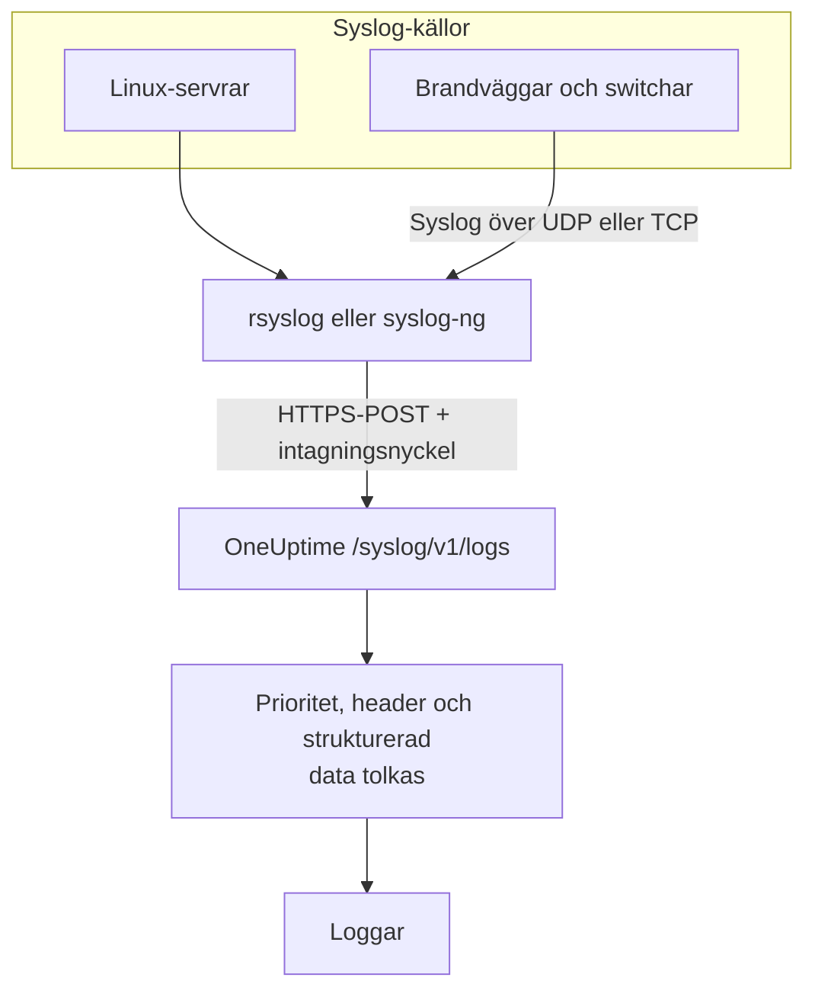

# Syslog

OneUptime tar emot syslog över HTTPS. Skicka RFC 5424- eller RFC 3164-meddelanden till `/syslog/v1/logs` med din intagningsnyckel, så blir vart och ett en sökbar logg, med prioritet, facility, allvarlighetsgrad, värd, applikation och strukturerad data som attribut. Använd det för att vidarebefordra från rsyslog, syslog-ng eller vilket relä som helst som kan göra HTTP-requests.

:::cards
- [Skicka ett testmeddelande](#skicka-ett-testmeddelande): En enda `curl`-request.
- [Vidarebefordra från rsyslog](#vidarebefordra-från-rsyslog): Skicka allt som en server eller ett relä tar emot.
- [Utlästa attribut](#utlästa-attribut): Vad OneUptime plockar ut ur varje meddelande.
- [Felsökning](#felsökning): Avvisade requests och oväntade tjänster.
:::

## Så fungerar det



OneUptime svarar så snart meddelandena har lästs från requesten, och tolkar och sparar dem en stund senare. Meddelandetexten stannar i loggens innehåll; allt annat blir attribut.

> [!TIP]
> Nätverksenheter som du övervakar med en OneUptime-probe kan skicka sin syslog direkt till proben över UDP, utan relä – loggarna visas då på enheten i OneUptime. Se [Guider per nätverksleverantör](/docs/monitor/network-vendor-guides).

## Innan du börjar

- **Ett OneUptime-projekt** – i OneUptime Cloud debiteras telemetri per intagen GB, och ett projekt på Free-planen behöver en betalningsmetod innan det kan skicka telemetri.
- **Intagningsnyckel för telemetri** – skapa en **Server**-nyckel under **Produkter → Projektinställningar → Telemetri och APM → Intagningsnycklar** och kopiera dess **Hemlig nyckel**. Du skickar den i headern `x-oneuptime-token`.
- **Syslog-vidarebefordrare** – vilket verktyg som helst som kan skicka HTTP POST-requests (till exempel `curl`, `rsyslog` via `omhttp` eller `syslog-ng` med sin HTTP-destination).
- **Tjänstnamn (valfritt)** – sätt headern `x-oneuptime-service-name` för att samla inkommande loggar under en viss telemetritjänst. Utan den faller OneUptime tillbaka på syslog-`APP-NAME`, värdnamnet eller `Syslog`.

## Endpoint

```http
POST https://oneuptime.com/syslog/v1/logs
```

| Header | Krävs | Värde |
| --- | --- | --- |
| `x-oneuptime-token` | Ja | Din intagningsnyckel. |
| `Content-Type` | Ja, för JSON-innehåll | `application/json` |
| `x-oneuptime-service-name` | Nej | Tjänsten som loggarna hör till. |
| `Content-Encoding` | Nej | `gzip`, för komprimerat innehåll. |

Ersätt `oneuptime.com` med din egen värd om du kör OneUptime i egen drift.

## Requestens innehåll

Skicka en JSON-nyttolast med en array `messages`. Både RFC 5424 och RFC 3164 (BSD) stöds, och du kan blanda dem i samma request:

```json
{
  "messages": [
    "<34>1 2025-03-02T14:48:05.003Z web-01 nginx 7421 ID47 [env@32473 host=\"web-01\"] 502 on /api/login",
    "<13>Feb  5 17:32:18 db-01 postgres[2419]: connection received from 10.0.0.12"
  ]
}
```

### Innehållsformat som stöds

| Innehåll | Så skickar du det |
| --- | --- |
| Ett JSON-objekt med en array `messages` | `Content-Type: application/json` – rekommenderas. |
| En JSON-array med meddelanden | `Content-Type: application/json`. |
| Ett JSON-objekt med ett enda `message` | `Content-Type: application/json`. Ett värde med flera rader läses som flera meddelanden. |
| Meddelanden avgränsade med radbrytningar | Komprimerade med gzip och skickade med `Content-Encoding: gzip`. |

Ren text som inte är komprimerad med gzip läses inte, och requesten avvisas med `400`. Innehåll som är komprimerat med gzip läses alltid som meddelanden avgränsade med radbrytningar, så komprimera inte JSON-innehåll. Håll varje request under 1 MB: OneUptimes ingress höjer inte nginx standardgräns för requestinnehåll för den här endpointen.

## Skicka ett testmeddelande

```bash
curl \
  -X POST https://oneuptime.com/syslog/v1/logs \
  -H "Content-Type: application/json" \
  -H "x-oneuptime-token: YOUR_TELEMETRY_KEY" \
  -H "x-oneuptime-service-name: production-web" \
  -d '{
    "messages": [
      "<34>1 2025-03-02T14:48:05.003Z web-01 nginx 7421 ID47 [env@32473 host=\"web-01\"] 502 on /api/login"
    ]
  }'
```

En `200` betyder att meddelandet togs emot. Öppna **Produkter → Loggar**: loggen visas i tjänsten `production-web` med innehållet `502 on /api/login`, allvarlighetsgraden `Error` och attributen under [Utlästa attribut](#utlästa-attribut).

## Vidarebefordra från rsyslog

rsyslog skickar till OneUptime med sin HTTP-utdatamodul, `omhttp`.

:::steps
### Se till att `omhttp` finns

Konfigurationen nedan läser in den med `module(load="omhttp")`. Om rsyslog rapporterar att modulen inte kan läsas in installerar du paketet som tillhandahåller `omhttp` för din distribution.

### Lägg till OneUptime-destinationen

Skapa `/etc/rsyslog.d/oneuptime.conf`. Mallen bygger om varje meddelande till en RFC 5424-rad och packar in den i det JSON-innehåll som OneUptime förväntar sig:

```text title="/etc/rsyslog.d/oneuptime.conf"
module(load="omhttp")

template(name="OneUptimeJson" type="string"
         string="{\"messages\":[\"<%PRI%>1 %TIMESTAMP:::date-rfc3339% %HOSTNAME% %APP-NAME% %PROCID% %MSGID% - %msg:::json%\"]}")

action(
  type="omhttp"
  server="oneuptime.com"
  serverport="443"
  usehttps="on"
  restpath="syslog/v1/logs"
  httpheaders=[
    "x-oneuptime-token: YOUR_TELEMETRY_KEY",
    "x-oneuptime-service-name: rsyslog-demo"
  ]
  template="OneUptimeJson"
)
```

`restpath` tar sökvägen utan inledande snedstreck. `omhttp` skickar som standard en JSON-`Content-Type`, och det är precis vad den här mallen ger.

### Kontrollera konfigurationen och starta om rsyslog

```bash
sudo rsyslogd -N1
sudo systemctl restart rsyslog
```

`rsyslogd -N1` validerar konfigurationen utan att starta rsyslog. Efter omstarten visas nya meddelanden under **Produkter → Loggar** i tjänsten `rsyslog-demo`.
:::

Åtgärden vidarebefordrar varje meddelande som rsyslog hanterar – lokala program, systemd-journalen när rsyslog läser den, och allt den tar emot från nätverket.

### Vidarebefordra syslog från nätverksenheter

Brandväggar, switchar och andra enheter skickar ofta syslog bara över UDP eller TCP. Peka dem mot ett rsyslog-relä och låt reläet vidarebefordra över HTTPS. Lägg till en lyssnare i reläets konfiguration, före `action`:

```text title="/etc/rsyslog.d/oneuptime.conf"
module(load="imudp")
input(type="imudp" port="514")
```

Sätt `x-oneuptime-service-name` till ett namn som `perimeter-firewall`, eller ta bort headern så att varje enhets loggar grupperas efter dess värdnamn. Många enheter skriver sitt meddelande som `key=value`-par; en [Key=Value Parser](/docs/telemetry/log-pipelines#keyvalue-parser) gör om dem till attribut.

:::details Skicka i omgångar i stället för en request per meddelande
rsyslog kan samla ihop meddelanden och komprimera dem med gzip, vilket OneUptime läser som meddelanden avgränsade med radbrytningar. Ersätt mallen och åtgärden med:

```text title="/etc/rsyslog.d/oneuptime.conf"
template(name="OneUptimeLine" type="string"
         string="<%PRI%>1 %TIMESTAMP:::date-rfc3339% %HOSTNAME% %APP-NAME% %PROCID% %MSGID% - %msg%")

action(
  type="omhttp"
  server="oneuptime.com"
  serverport="443"
  usehttps="on"
  restpath="syslog/v1/logs"
  httpheaders=["x-oneuptime-token: YOUR_TELEMETRY_KEY"]
  template="OneUptimeLine"
  batch="on"
  batch.format="newline"
  compress="on"
)
```

Behåll `compress="on"`: OneUptime läser meddelanden avgränsade med radbrytningar bara från innehåll som är komprimerat med gzip.
:::

### Andra vidarebefordrare

- **syslog-ng** – använd dess HTTP-destination med samma URL, samma headers och samma JSON-innehåll.
- **Fluent Bit** – ta emot syslog med Fluent Bits `syslog`-input och vidarebefordra den som vilken logg som helst. Se [Fluent Bit](/docs/telemetry/fluentbit).

## Utlästa attribut

OneUptime lägger automatiskt till följande attribut på varje loggpost:

| Attribut | Värde | Från testmeddelandet |
| --- | --- | --- |
| `syslog.priority` | Prioriteten, `<PRI>` | `34` |
| `syslog.facility.code`, `syslog.facility.name` | Facility, utifrån prioriteten | `4`, `security` |
| `syslog.severity.code`, `syslog.severity.name` | Allvarlighetsgraden, utifrån prioriteten | `2`, `critical` |
| `syslog.version` | RFC 5424-versionen | `1` |
| `syslog.hostname` | `HOSTNAME` | `web-01` |
| `syslog.appName` | `APP-NAME`, eller RFC 3164-taggen | `nginx` |
| `syslog.processId` | `PROCID` | `7421` |
| `syslog.messageId` | `MSGID` | `ID47` |
| `syslog.structured.raw` | Den strukturerade RFC 5424-datan, som den skickades | `[env@32473 host="web-01"]` |
| `syslog.structured.*` | Varje parameter i den strukturerade datan, utplattad | `syslog.structured.env_32473.host` = `web-01` |
| `syslog.raw` | Det ursprungliga meddelandet, för spårbarhet | hela raden |

De här attributen blir sökbara i utforskaren **Produkter → Loggar** – till exempel `@syslog.severity.name:error` eller `@syslog.hostname:web-01`. Se [Söksyntax](/docs/telemetry/search-syntax).

Själva meddelandet stannar i loggens innehåll. Brandväggar som Sophos XGS och Fortinet FortiGate skriver det som `key=value`-par (`log_component="IPSec" con_name="HQ-Branch1" status="Terminated"`); lägg till en **Key=Value Parser**-processor i en [loggpipeline](/docs/telemetry/log-pipelines#keyvalue-parser) för att göra även de paren till attribut.

### Allvarlighetsgrad

| Syslog-allvarlighetsgrad | Kod | Allvarlighetsgrad i OneUptime |
| --- | --- | --- |
| Emergency, Alert | `0`, `1` | `Fatal` |
| Critical, Error | `2`, `3` | `Error` |
| Warning | `4` | `Warning` |
| Notice, Informational | `5`, `6` | `Information` |
| Debug | `7` | `Debug` |
| Ingen prioritet i meddelandet | — | `Unspecified` |

Ett meddelande utan tidsstämpel sparas med tidpunkten då OneUptime tog emot det.

### Tjänst

Varje logg sparas under en telemetritjänst, som OneUptime skapar första gången den skickar. Tjänsten är den första som finns av:

1. headern `x-oneuptime-service-name`;
2. meddelandets `APP-NAME` (eller tagg);
3. meddelandets värdnamn;
4. `Syslog`.

## Felsökning

:::details HTTP 401
Nyckeln saknas, är okänd eller har gått ut. Kontrollera att headern `x-oneuptime-token` innehåller **Hemlig nyckel** för en intagningsnyckel i det projekt som ska ta emot loggarna.
:::

:::details HTTP 402 eller 422
`402`: i OneUptime Cloud har projektet Free-planen och ingen betalningsmetod. Lägg till en under **Projektinställningar → Fakturering och fakturor → Fakturering**. `422`: nyckeln är inaktiverad, eller så är det en webbläsarnyckel. Slå på **Aktiverad** igen i nyckelns inställningar, eller skapa en **Server**-nyckel.
:::

:::details HTTP 400, eller inga loggar visas
Kontrollera att requestens innehåll verkligen innehåller syslog-rader, som JSON med `Content-Type: application/json`. Tomt innehåll – och ren text som inte är komprimerad med gzip – avvisas med HTTP 400.
:::

:::details HTTP 413
Requesten är större än vad ingressen tar emot. Skicka färre meddelanden per request.
:::

:::details Loggarna kommer under ett oväntat tjänstnamn
Sätt `x-oneuptime-service-name` för att åsidosätta standardigenkänningen, som använder `APP-NAME` och sedan värdnamnet.
:::

## Nästa steg

:::cards
- [Loggpipelines](/docs/telemetry/log-pipelines): Gör om `key=value`-meddelanden till attribut.
- [Inspelningsregler för loggar](/docs/telemetry/log-recording-rules): Gör om talen i din syslog till mätvärden.
- [Loggövervakning](/docs/monitor/logs-monitor): Larma när matchande syslog-meddelanden kommer in.
:::
