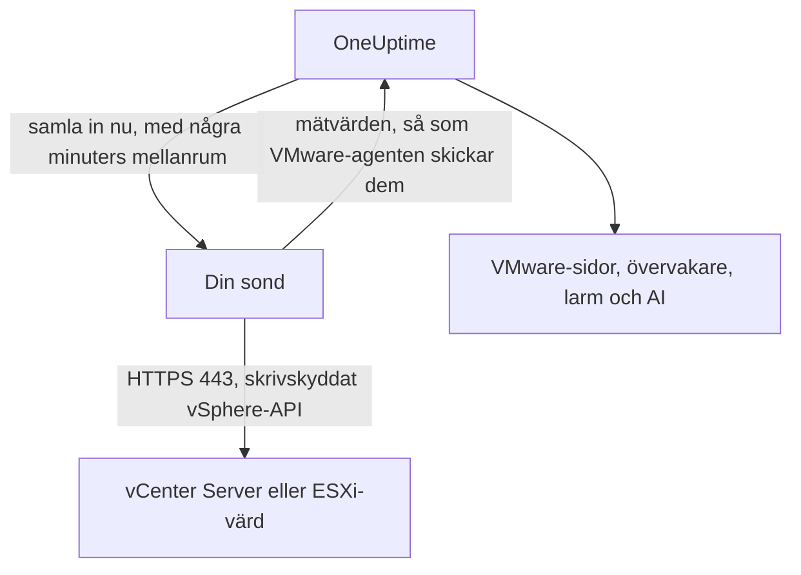

# VMware utan agent

Övervaka en vCenter Server, eller en fristående ESXi-värd, utan att installera något: ange vCenters adress och ett skrivskyddat konto i OneUptime, välj den sond som når den, och sonden samlar in samma data som [VMware-agenten](/docs/telemetry/vmware). Det finns ingen agent att installera, uppgradera eller hålla igång, och ingen egen maskin att förbereda.

:::cards
- [Innan du börjar](#innan-du-börjar): En sond som når vCenter, och ett skrivskyddat konto.
- [Anslut en vCenter](#anslut-en-vcenter): Fyra fält, ett test och ett namn.
- [Felsökning](#felsökning): Vad varje meddelande betyder och vad som åtgärdar det.
:::

## Så fungerar det

Med några minuters mellanrum loggar sonden in på vCenter med kontot du sparade, läser inventariet, prestandaräknarna och vSAN-statistiken och skickar dem till OneUptime. De kommer fram precis som VMware-agentens gör, så varje VMware-sida, varje [VMware-övervakare](/docs/monitor/vmware-monitor), varje larmmall och OneUptime AI läser dem på samma sätt. Sonden behåller sin vCenter-session mellan insamlingarna, så att vCenters händelselogg inte fylls med inloggningar.

## Sond eller agent?

| | En sond (den här sidan) | VMware-agenten |
|---|---|---|
| Vad du kör | En sond du redan kör, eller en ny | Agenten, på en egen maskin |
| Var kontot förvaras | Krypterat i OneUptime, skickas bara till sonden | I agentens `.env`-fil |
| Vad den behöver nå | vCenter på TCP 443, från sonden | vCenter på TCP 443, från agenten |
| Största vCenter | Ungefär 48 MiB mätvärden per insamling | Ingen gräns |
| ESXi-syslog och AI-agenten | Ingår inte | Ingår |

Båda skickar samma data. Du kan byta en vCenter från den ena till den andra när som helst på dess sida **Inställningar**.

## Innan du börjar

- **En sond som når vCenter på TCP 443.** Det är oftast en [anpassad sond](/docs/probe/custom-probe) i vCenters nätverk. På OneUptime Cloud får de delade sonderna aldrig ett vCenter-lösenord, så lägg till en egen sond. På en egen driftsatt instans kan även instansens egna sonder samla in.
- **En vSphere-användare med rollen Read-Only** på det översta vCenter-objektet, med **Propagate to children** markerat. Följ [Skapa den skrivskyddade vSphere-användaren](/docs/telemetry/vmware#create-the-read-only-vsphere-user): kontot är detsamma som agenten använder.

> [!IMPORTANT]
> Utan **Propagate to children** loggar användaren in men ser ingenting, och sonden rapporterar att kontot inte kan läsa vCenters inventarie.

## Anslut en vCenter

:::steps
### Öppna vCenter-listan
Öppna **VMware → Alla vCenter** i OneUptime och klicka på **Anslut vCenter**.

### Ange adressen och kontot
Ange adressen där du öppnar vSphere Client, till exempel `https://vcsa.example.com`, användarnamnet med sin domän, till exempel `oneuptime@vsphere.local`, och lösenordet. Välj den sond som når vCenter.

### Testa anslutningen
Klicka på **Testa anslutningen** i nästa steg. Sonden loggar in, läser det kontot kan se och loggar ut, och resultatet anger hur många datacenter, kluster, värdar, virtuella maskiner och datalager den hittade.

### Lita på vCenters certifikat
vCenter använder som standard ett certifikat från sin egen utfärdare, som sonden inte litar på. Testet visar då certifikatet: jämför dess fingeravtryck med vCenters eget och klicka sedan på **Lita på det här certifikatet**.

### Namnge och anslut
Namnet är som standard vCenters värdnamn. Klicka på **Anslut vCenter** för att spara.
:::

vCenterns **Översikt** visar ett kort **Datainsamling**. Det visar **Kontrollerar** fram till den första insamlingen, som börjar inom en minut, sedan **Samlar in**, och inventariet fylls i.

## Certifikat

Sonden hoppar aldrig över certifikatkontrollen. Varje anslutning genomför ett fullständigt TLS-handslag, och sedan gäller:

- utan något betrott certifikat måste vCenters certifikat komma från en utfärdare som sondens maskin litar på, för adressen du angav;
- med ett betrott certifikat måste vCenter visa upp exakt det certifikatet, identifierat genom sitt SHA-256-fingeravtryck. Inget annat godtas, inte ens ett offentligt betrott certifikat.

För att kontrollera ett fingeravtryck öppnar du vSphere Client under **Administration → Certificates → Certificate Management**, eller kör `openssl s_client -connect vcsa.example.com:443 </dev/null | openssl x509 -noout -fingerprint -sha256` från sondens maskin.

När vCenters certifikat förnyas stoppas insamlingen med **vCenters certifikat har ändrats** och det nya certifikatet visas. Ingenting skickas till vCenter förrän du litar på det, på vCenterns sida **Översikt** eller **Inställningar**.

## Det sparade lösenordet

Lösenordet är krypterat och kan bara skrivas: ingen kan läsa tillbaka det, och API:et returnerar det aldrig. Det skickas bara till den sond som samlar in vCenter-servern, och den håller det i minnet.

Ett sparat lösenord skickas bara någonsin till den adress, genom den sond och till det certifikat som det angavs för. Om du ändrar adressen, sonden eller det betrodda certifikatet krävs lösenordet igen, så ingen som kan redigera vCenter-servern kan skicka det någon annanstans. Att lita på det certifikat som sonden hittade på den sparade adressen behåller det.

## Byt mellan agenten och en sond

Öppna vCenterns sida **Inställningar**. Dess kort **Datainsamling** erbjuder **Samla in med en sond** för en vCenter som agenten skickar, och **Använd VMware-agenten** för en som en sond samlar in. Byte till agenten glömmer det sparade lösenordet.

> [!WARNING]
> Stoppa VMware-agenten så snart sondens första insamling lyckas. Medan båda körs kommer varje mätvärde två gånger.

## Referens

| Inställning | Standard | Anmärkningar |
|---|---|---|
| Insamlingsintervall | 2 minuter | Från 1 till 60 minuter. Samla in från en stor vCenter mer sällan för att skona den. |
| Samtidiga insamlingar | 4 per sond | En insamling som är långsammare än sitt intervall hoppas över, staplas aldrig. |
| Största insamling | Ungefär 48 MiB | Större vCenter kräver VMware-agenten. |
| Anslutningstest | 90 sekunder till start | Ett test som ingen sond plockar upp i tid, eller som pågår längre än 2 minuter, besvaras som misslyckat. |

## Felsökning

:::details vCenters certifikat är inte betrott
vCenter visar upp ett certifikat från sin egen utfärdare. Jämför fingeravtrycket som visas med vCenters certifikat och klicka sedan på **Lita på det här certifikatet**.
:::

:::details vCenter nekade inloggningen
Använd hela användarnamnet med sin domän, till exempel `oneuptime@vsphere.local`, och kontrollera lösenordet och att kontot inte är låst. Ändra dem med **Redigera anslutning** på vCenterns sida **Inställningar**.
:::

:::details Användaren kan inte läsa vCenters inventarie
Ge användaren rollen Read-Only på det översta vCenter-objektet, med **Propagate to children** markerat.
:::

:::details Sonden får inget svar från vCenter
Sondens nätverk når inte vCenter på TCP 443. Tillåt trafiken genom brandväggen, eller välj en sond i vCenters nätverk.
:::

:::details Sonden plockade inte upp detta
Sonden är offline, eller kör en OneUptime-version som är äldre än VMware-insamlingen. Kontrollera att den är ansluten i tabellen **Anpassade probes**, och uppdatera den.
:::

:::details Denna vCenter är för stor för att samlas in av en sond
Dess mätvärden är större än en uppladdning från en sond får vara. Använd [VMware-agenten](/docs/telemetry/vmware) för denna vCenter.
:::

## Nästa steg

:::cards
- [VMware-övervakare](/docs/monitor/vmware-monitor): Larm om värdar, virtuella maskiner, datalager och kluster.
- [Anpassad sond](/docs/probe/custom-probe): Kör en sond i vCenters nätverk.
- [VMware-agent](/docs/telemetry/vmware): Samla in en vCenter med agenten i stället.
:::
