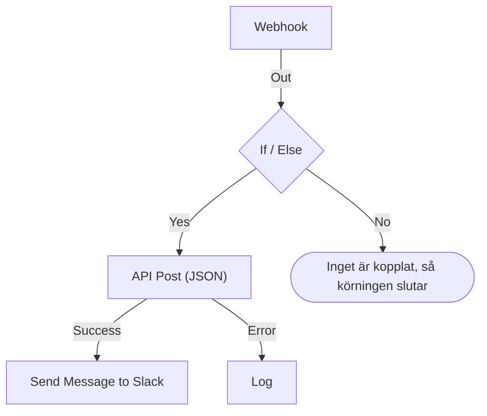

# Skapa ett arbetsflöde

Du bygger ett arbetsflöde i dess **Byggare**: en arbetsyta där du lägger till block, kopplar ihop dem och fyller i deras inställningar. Den här sidan visar hur du skapar ett arbetsflöde, [lägger till block](#lägg-till-block), [kopplar ihop](#koppla-ihop-block) och [konfigurerar](#konfigurera-ett-block) dem, [skickar värden mellan dem](#använd-värden-från-tidigare-block) och [slår på arbetsflödet](#slå-på-det).

För att skapa ett arbetsflöde öppnar du **Arbetsflöden** och klickar på **Skapa arbetsflöde**. Dialogrutan **Skapa ett arbetsflöde** frågar först hur du vill börja och sedan efter ett namn. En mall som behöver egna inställningar, som en Slack-webhook-URL, ber om dem i ett extra steg och sparar dem som arbetsflödesvariabler, så att du kan ändra dem senare utan att redigera arbetsflödet.

Välj hur du vill börja:

- **Börja från grunden**, högst upp i dialogrutan, ger dig en tom arbetsyta. De flesta arbetsflöden börjar här.
- **Eller börja från en mall** visar några **Rekommenderade** mallar. För de andra väljer du en kategori bredvid sökfältet, som **Incidenter**, **Monitorer** eller **Jira**, eller **Alla mallar**, eller så skriver du i **Sök mallar…**. Varje ord du skriver måste stämma.

Klicka på en mall för att se vad den gör: dess utlösare, blocken den består av och inställningarna den kommer att fråga efter. Klicka sedan på **Använd den här mallen**, eller dubbelklicka på mallen. I sökfältet väljer piltangenterna en mall och **Enter** använder den. `/` tar dig tillbaka till sökfältet.

Arbetsflöden skapas avstängda, så inget körs förrän du slår på dem. Ett nytt arbetsflöde öppnas i **Byggare**, arbetsytan där du utformar det.

## Arbetsytan

Ett arbetsflöde från grunden öppnas med ett enda streckat block med texten **Choose what starts this workflow**. Det blocket är utgångspunkten — klicka på det för att välja en utlösare. Ett arbetsflöde som skapats från en mall öppnas med sina block redan på plats.

Varje arbetsflöde har exakt en **utlösare** högst upp. Allt annat är en **komponent** som gör något. För att byta utlösare tar du bort den: den streckade platshållaren kommer tillbaka på dess plats, och ett klick på den låter dig välja en annan. När du tar bort ett block tas dess linjer bort också, så koppla den nya utlösaren till det första blocket igen.

Ändringar sparas automatiskt. En etikett i verktygsfältet håller koll på det: **Sparar…** medan ändringen är på väg, därefter **Sparad**, eller **Kunde inte spara** om det inte lyckades. Arbetsytan har ingen spara-knapp och inget separat publiceringssteg.

## Lägg till block

| För att lägga till     | Klicka på                                                      | Panel som öppnas              |
| ---------------------- | -------------------------------------------------------------- | ----------------------------- |
| Utlösaren              | Det streckade platshållarblocket                               | **Add Trigger**               |
| Vilket annat block som helst | **Lägg till komponent**, i verktygsfältet ovanför arbetsytan | **Lägg till komponent**     |

Båda panelerna öppnas på de block som de flesta arbetsflöden använder, under **Popular**, följt av resten av de inbyggda blocken. Under **OneUptime resources** klickar du på en resurs som **Incident** för att se vad du kan göra med den; **Browse all resources** visar alla. Eller sök: skriv några ord, som `create incident`, så kommer den bästa träffen först. Tryck på `/` för att hoppa till sökfältet, på piltangenterna för att gå igenom resultaten och på **Enter** för att lägga till det markerade blocket. Ett klick på ett block lägger till det.

Ett nytt block hamnar under det nedersta blocket på arbetsytan, och en ny utlösare tar det streckade blockets plats högst upp. Det nya blocket är markerat, och om det hamnar utanför synfältet rullar arbetsytan precis så mycket att det syns. Dess inställningar öppnas inte av sig själva: klicka på blocket när du är redo att konfigurera det. Tills de obligatoriska inställningarna är ifyllda står det **Click to set up** på det.

Dra blocken vart du vill; arbetsytan fäster dem i ett rutnät medan du drar. Blockens positioner sparas, så nästa person ser samma layout som du lämnade.

## Det som finns på ett block

| Fält                                  | Vad det gör                                                                                                                                                                                                                                                                                                   |
| ------------------------------------- | ------------------------------------------------------------------------------------------------------------------------------------------------------------------------------------------------------------------------------------------------------------------------------------------------------------- |
| **Identifier** (under **ID**)         | Det korta ID som visas på blocket, som `log-1`. Det är så andra block hänvisar till det här, så om du byter namn på det slutar alla `{{local.components.…}}`-referenser som pekar på det att fungera. Blockets rubrik är komponentens eget namn och kan inte ändras.                                          |
| **Inställningar**                     | Det blocket behöver för att göra sitt jobb — en URL, en Slack-kanal, en meddelandetext. Valfria fält är märkta **(Valfritt)**; allt annat är obligatoriskt. En av/på-brytare har ingetdera, eftersom den alltid har ett värde. Mindre använda inställningar är hopfällda under **Fler fält**, vars rubrik nämner dem och visar de som är ifyllda. |
| **Input**                             | Punkten på den övre kanten, där linjer från tidigare block kommer in. Utlösare har ingen — inget körs före dem.                                                                                                                                                                                               |
| **Outputs**                           | Punkterna längs den nedre kanten, med etiketter precis ovanför, där linjer går ut till nästa block. Många block har separata utgångar **Success** och **Error**, så att du kan hantera båda fallen.                                                                                                         |

## Koppla ihop block

Dra från en punkt längst ned på ett block ned till punkten högst upp på nästa. Linjen du drar avgör vad som körs därefter.

- Kopplar du från **Success** körs nästa block bara när det föregående lyckades.
- Kopplar du från **Error** körs nästa block bara när det föregående misslyckades.
- Kopplar du inte en utgång slutar den vägen helt enkelt.

Du kan koppla en utgång till flera block. Alla körs — men efter varandra, i en kö, inte parallellt. Räkna inte med ordningen mellan grenarna, och räkna inte med att de överlappar i tid.

Varje block körs högst en gång per körning. En linje som leder till ett block som redan har körts — tillbaka upp på arbetsytan eller från en annan gren efter att den första nådde det — stoppar körningen med ett fel, så att ett arbetsflöde inte kan gå i cirkel.

## Konfigurera ett block

Klicka på ett block för att öppna dess inställningar i en dialogruta, eller gå till det med **Tab** och tryck på **Enter**. Fyll i inställningarna och klicka på **Spara**.

Varje inställning har det inmatningsfält dess värde kräver:

| Inställningen innehåller                         | Du får                                                                         |
| ------------------------------------------------ | ------------------------------------------------------------------------------ |
| Ord: ett meddelande, en prompt, ett värde att logga | Ett fält som växer medan du skriver. **Enter** börjar en ny rad.            |
| Ett kort värde: en URL, ett ID, en ämnesrad      | En enda rad.                                                                   |
| Kod eller HTML                                   | En kodredigerare.                                                              |
| JSON                                             | En JSON-redigerare.                                                            |
| På eller av                                      | En brytare med sitt namn bredvid. Klicka på brytaren eller namnet för att växla den. |

Dialogrutan öppnas vid det du troligen kom för. För en **Webhook**-utlösare är det dess URL, med en knapp **Kopiera URL**, metoderna den accepterar och en exempelförfrågan. För en **Manual**-utlösare är det hur arbetsflödet startas. Alla andra block öppnas vid sina inställningar. Ett block utan inställningar har inget avsnitt **Inställningar** alls.

Under det, uppifrån och ned:

- **ID**, **Inputs** och **Outputs**, sida vid sida — blockets identifierare, varifrån det nås och vad som körs efter det.
- **Returns** — data som det här blocket lämnar vidare till senare steg. Varje värde visar den exakta referens som läser det, med en knapp för att kopiera den.
- **How to use** — vad blocket gör i en mening, stegen för att konfigurera det, ett exempel att kopiera och de misstag folk ofta gör. Exemplet är byggt utifrån ditt arbetsflöde: det använder det här blockets ID och utlösarens värden där det infogar data i ett meddelande. **Learn more** öppnar den längre förklaringen, och länkarna går till den fullständiga guiden. Varje block har en, och knappen **How to use** högst upp i dialogrutan hoppar direkt dit.

Längst ned finns:

- **Ta bort** — tar bort det här blocket. Den frågar först och nämner blocket med typ och identifierare, som **Send Email (send-email-2)**, så att du vet vilket av flera likadana block som försvinner.
- **Run just this step** — kör bara det här enda blocket, utan resten av arbetsflödet. Värden det skulle ha läst från andra steg kommer fram tomma, och allt det skickar, skriver eller tar bort sker på riktigt. Det hoppar över alla villkor före blocket, så bara personer som får redigera arbetsflödet kan använda det.

### Använd värden från tidigare block

De flesta inställningar kan använda ett värde från ett tidigare block eller en variabel — så flödar data från ett block till nästa. Varje sådan inställning har en knapp **{ }** i slutet. Den öppnar en lista över värdena du kan använda: varje tidigare block med sitt namn, med varje värde det returnerar — vad det heter, vad det innehåller och dess typ —, sedan arbetsflödets variabler och dina globala. Sök i listan, välj ett med musen eller med piltangenterna och **Enter**, så infogas värdet där markören står.

I inställningen visas ett värde som en bricka, som **Webhook › Request Body**. Håll muspekaren över den för att se referensen den står för, `{{local.components.webhook-1.returnValues.request-body}}`, vilket är det som sparas. Markören hoppar över en bricka i ett steg, **Backspace** tar bort den helt, och kopierar du den kopieras referensen. Kan du syntaxen skriver du `{{` i stället: samma lista öppnas under inställningen och smalnas av medan du skriver.

- **Bara värden som kommer att finnas erbjuds.** Det är utlösaren och de block som körs före det här. Ett block som körs senare har ingen utdata ännu. Tills ett block är kopplat visas bara utlösarens värden, och listan säger det.
- **En post öppnas på sina fält.** Ett Find One- eller On Create-block returnerar en hel post. Välj den för att se dess fält, med dem som blockets **Select Fields** läser först. Ett JSON-värde eller en uppsättning headers öppnas på ett fält där du skriver en sökväg, som `title` eller `alerts[0].status`.
- **När ett block har körts vet listan vad som finns i dess värden.** Varje värde säger vad det innehöll i den senaste körningen — `"production"` eller `3 fields` —, och ett JSON-värde eller en uppsättning headers öppnas på de fält det hade, vart och ett med sitt innehåll. Från en Webhooks **Request Body** väljer du alltså **incident.title** i stället för att skriva en sökväg. Sökningen hittar också de här fälten: skriv `title`, eller `{{` och början av en sökväg. En posts fält visar också vad de innehöll. Fälten kommer från den senaste körningen, så ett fält som en senare förfrågan utelämnar är tomt i den körningen. Ett värde som ser ut som en hemlighet, som en `Authorization`-header, en token eller ett lösenord, visas utan sitt innehåll.
- **En Webhook som ännu inte har tagit emot en förfrågan säger det** högst upp i sina värden, med **Copy test request**: ett `curl`-kommando som skickar `{"message": "Hello"}` till arbetsflödets webhook-URL. Kör det i en terminal medan listan är öppen, så dyker förfrågans fält upp i den så snart körningen den startar är klar, vanligtvis inom några sekunder. Arbetsflödet måste vara aktiverat, annars avvisas förfrågan. Bara personer som får se webhook-URL:en får knappen. En Incoming Email-utlösare som ännu inte har tagit emot ett e-postmeddelande säger det på samma ställe; skicka ett e-postmeddelande till dess adress, så dyker dess headers och bilagor upp på samma sätt.
- **Kodredigerare har Insert value i sitt verktygsfält.** I JSON lägger den till de citattecken ett värde behöver inne i ett dokument. **Run Custom JavaScript** läser värden via sina **Arguments**, så dess kod har ingen väljare.
- **Tal, lösenord, brytare och datum behåller sin egen kontroll,** med **{ }** bredvid. Ett valt värde ersätter kontrollen, och **abc** går tillbaka till att skriva.

En bricka blir orange när det den läser inte finns: ett block som har bytt namn eller tagits bort, ett värde som blocket inte returnerar, ett block som körs senare eller en variabel som inte finns. Dess verktygstips säger vilket. Se [Variabler](/docs/workflows/variables) för referenssyntaxen.

## Kontroller medan du bygger

Byggare kontrollerar hela grafen varje gång du ändrar den och rapporterar vad den hittar i en etikett i verktygsfältet. Klicka på etiketten för att öppna **Problems with this workflow**, som visar varje problem och tar dig till blocket det gäller. På arbetsytan står det **Click to set up** på ett block vars obligatoriska inställningar fortfarande är tomma, och ett block med ett annat problem har ett märke i hörnet: rött för ett fel, orange för en varning. Håll muspekaren över märket för att läsa vad som är fel.

Den fångar de misstag som annars är osynliga tills en körning går fel:

- ett arbetsflöde utan utlösare;
- två block med samma ID, eller ett ID med en punkt i;
- ett block som inget är kopplat till;
- en obligatorisk inställning som lämnats tom;
- ogiltig JSON;
- mellanslag inne i `{{ }}`;
- referenser till ett steg eller ett returvärde som inte finns.

En sak kan den inte kontrollera: om ett variabelnamn finns. Ett blocks inställningar kan det — en referens till en variabel som inte finns visas där som en orange bricka. Överallt annars syns en variabel som bytt namn först i körningens logg.

## Ditt första arbetsflöde

Det snabbaste sättet att lära känna arbetsytan är ett arbetsflöde med två block som du startar manuellt:

:::steps
1. Klicka på det streckade platshållarblocket och klicka sedan på **Manual** i panelen **Add Trigger**.
2. Klicka på **Lägg till komponent** och klicka sedan på **Logg** under **Popular**. Det nya blocket hamnar under utlösaren. Koppla utlösarens punkt **Execute** ned till Log-blockets ingångspunkt.
3. Klicka på Log-blocket, där det står **Click to set up**, och skriv `Hello from ` i dess **Value**. Klicka på **{ }** och klicka sedan på **JSON** under **Manual**. Inställningen visar **Manual › JSON** och sparar `{{local.components.manual-1.returnValues.value}}`. `manual-1` är utlösarens **Identifier**, som visas på utlösarblocket. Klicka på **Spara**.
4. Slå på **Aktiverad** högst upp i Byggare. Ett inaktiverat arbetsflöde kan inte köras alls, inte ens manuellt; hoppar du över det här ber **Kör arbetsflöde** dig att slå på det först.
5. Tillbaka i **Byggare** klickar du på **Kör arbetsflöde**, skriver `{ "name": "Ada" }` i fältet **JSON**, klickar på **Run Workflow Manually** och bekräftar med **Run**.
6. En panel **Arbetsflödeskörning** öppnas av sig själv och följer körningen. Loggen visar `Value:` följt av `Hello from { "name": "Ada" }`.
:::

Den cykeln — lägg till, koppla, konfigurera, kör, läs loggen — är hur du bygger varje arbetsflöde.

> [!TIP]
> JSON som skrivs i **Kör arbetsflöde** når Manual-utlösaren som den text du skrev. För att läsa ett fält i den, som `name`, lägger du till ett **Text to JSON**-block, sätter utlösarens **JSON** i dess **Text** och läser fältet från det blockets **JSON**: `{{local.components.text-to-json-1.returnValues.json.name}}`.

## Slå på det

Nya arbetsflöden börjar inaktiverade, och det gör även varje arbetsflöde du duplicerar eller importerar. Medan ett arbetsflöde är avstängt säger Byggare det ovanför arbetsytan, med en knapp **Slå på arbetsflödet**.

Brytaren **Aktiverad** sitter högst upp i **Byggare**, bredvid **Lägg till komponent** och **Kör arbetsflöde**. Den finns också på arbetsflödets sida **Översikt**, vars kort **Arbetsflödesdetaljer** visar det aktuella läget som en grön etikett **Aktiverad** eller en röd etikett **Inaktiverad**: klicka på **Redigera arbetsflöde** och öppna **Fler fält**. Bara personer som får redigera arbetsflödet kan slå på eller av det; alla andra ser brytaren nedtonad.

Ett inaktiverat arbetsflöde kan inte köras alls, oavsett hur det startas:

| Startat av                                                 | Medan arbetsflödet är avstängt                                                                                                                                                            |
| ---------------------------------------------------------- | ----------------------------------------------------------------------------------------------------------------------------------------------------------------------------------------- |
| Dess utlösare: ett schema, en OneUptime-händelse eller ett e-postmeddelande | Ignoreras.                                                                                                                                                              |
| **Kör arbetsflöde** eller **Run just this step**           | Byggare frågar i stället **Slå på det här arbetsflödet?**. **Slå på och kör** (eller **Slå på och kör steget**) slår på arbetsflödet och kör sedan det du bad om, med de värden du angav. |
| Ett anrop till dess webhook-URL                            | Avvisas med HTTP 400 och "This workflow is turned off, so it can't run. Turn it on with the Enabled switch at the top of its Builder, then try again."                                         |
| Ett annat arbetsflödes **Execute Workflow**-block          | Det blocket tar sin väg **Error**, och felet nämner arbetsflödet det anropade.                                                                                                            |

Ordningen är alltså: bygg det, testa det med **Kör arbetsflöde**, läs körningens logg och slå av **Aktiverad** igen om du inte är redo för att dess utlösare aktiveras. För att testa ett enda block utan att köra allt använder du **Run just this step** i det blockets inställningar.

För att pausa ett arbetsflöde utan att ta bort det slår du av **Aktiverad**. Inga nya körningar startar. En körning som pågår gör klart, men en som väntar vid ett **Sleep**-block avbryts när den vaknar och registreras som ett fel.

## Städa upp

- Dra block för att flytta dem. Layouten sparas.
- För att ta bort en linje drar du en av dess ändar bort från punkten och släpper den på en tom plats på arbetsytan.
- För att ta bort ett block klickar du på det och använder **Ta bort** längst ned i dess inställningsdialog. Att markera ett block eller en linje och trycka på Backspace tar också bort det.
- Det finns inget sätt att duplicera ett enskilt block. **Duplicera Arbetsflöde** på arbetsflödets sida **Inställningar** kopierar allt. Kopians namn är ifyllt, numrerat förbi projektets arbetsflöden (”Nightly Sync” kopieras som ”Nightly Sync 2”), och kopian öppnas, inaktiverad.
- Placera blocken uppifrån och ned så att de läses i den riktning de körs — ingången är på den övre kanten, utgångarna på den nedre, så flödet går naturligt nedåt.

## Nästa steg

:::cards
- [Utlösare](/docs/workflows/triggers): De fem sätten ett arbetsflöde kan starta på.
- [Komponenter](/docs/workflows/components): Alla block du kan lägga till, med deras inställningar och utgångar.
- [Variabler](/docs/workflows/variables): Flytta data mellan block och håll hemligheter utanför dem.
- [Körningar](/docs/workflows/runs-and-logs): Kontrollera vad varje körning gjorde, steg för steg.
:::
