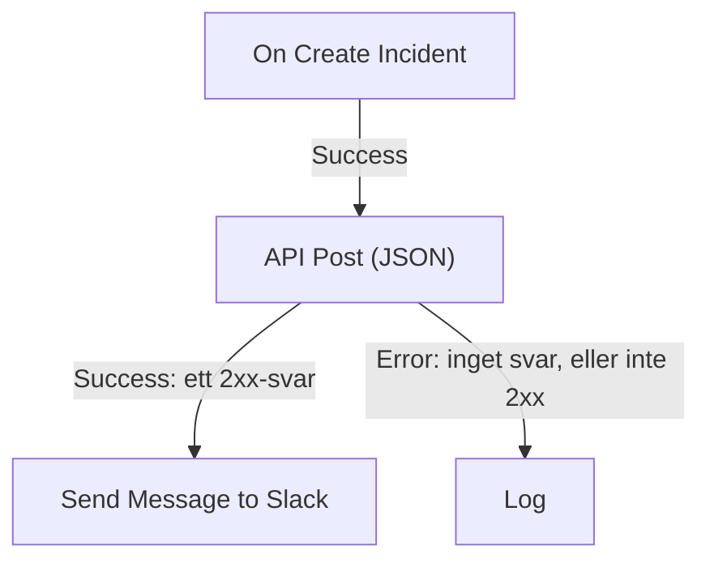

# Arbetsflödeskomponenter

Komponenter är de block du lägger till efter utlösaren. Var och en gör en sak — skickar ett meddelande, anropar ett API, kontrollerar ett villkor, ändrar en OneUptime-post — och tar sedan en av sina utgångar till de block som är kopplade till den. Den här sidan är katalogen: vad varje block behöver, vad det returnerar och när det tar varje utgång.

Du behöver sällan ha den öppen medan du bygger. Varje blocks inställningar slutar med **How to use**: vad blocket gör, stegen för att konfigurera det, ett exempel byggt utifrån ditt eget arbetsflöde och de misstag folk ofta gör. Se [Skapa ett arbetsflöde](/docs/workflows/authoring) för att lägga till och koppla ihop block.

:::cards
- [Skicka ett meddelande](#slack): Slack, Microsoft Teams, Discord, Telegram, IRC och e-post.
- [Anropa ett API](#api): Skicka en förfrågan till valfritt HTTP-API och läs svaret.
- [Lägg till logik](#conditions): Förgrena på ett värde, omforma data, vänta eller logga.
- [Arbeta med OneUptime-poster](#oneuptime-datakomponenter): Hitta, skapa, uppdatera och ta bort monitorer, incidenter och mer.
:::

## Vilken komponent ska jag använda?

| För att …                                                     | Använd                                                            |
| ------------------------------------------------------------- | ----------------------------------------------------------------- |
| Posta i ett chattverktyg                                      | [Slack](#slack), [Microsoft Teams](#microsoft-teams), [Discord](#discord), [Telegram](#telegram) eller [IRC](#irc) |
| Skicka e-post via din egen e-postserver                       | [Email](#email)                                                   |
| Anropa vilket annat API som helst, eller din egen tjänst      | [API](#api)                                                       |
| Sammanfatta, klassificera eller skriva utkast till text       | [Generate Text with AI](#generate-text-with-ai)                   |
| Ta den ena eller andra vägen beroende på ett värde            | [Conditions](#conditions)                                         |
| Omforma data mellan två block                                 | [JSON](#json) eller [Custom Code](#custom-code)                   |
| Vänta före nästa block                                        | [Sleep](#sleep)                                                   |
| Starta ett annat arbetsflöde                                  | [Execute Workflow](#execute-workflow)                             |
| Läsa eller ändra incidenter, monitorer och andra poster       | [OneUptime-datakomponenter](#oneuptime-datakomponenter)           |

Ett dedikerat block slår ett generiskt: Slack-blocket känner till Slacks gränser och ett postblock känner till postens fält, så du får tydligare fel och loggar än från ett **API**-block som gör samma jobb.

## Så fungerar varje block

Ett block körs när blocket före det tar den utgång som är kopplad till det. Det läser sina inställningar, gör sitt jobb och tar sedan en av sina utgångar. Bara de block som är kopplade till den utgången körs därefter.



- **Inställningar** är det du fyller i. Inställningar märkta **(Valfritt)** kan lämnas tomma. Mindre använda inställningar är hopfällda under **Fler fält**.
- **Outputs** är punkterna på den nedre kanten. De flesta block har **Success** och **Error**; [Conditions](#conditions) har **Yes** och **No**.
- **Returns** är de värden ett block lämnar vidare till senare block, som ett API:s **Response Body**. Ett senare block läser ett med `{{local.components.<block ID>.returnValues.<value ID>}}`; knappen **{ }** i en inställning infogar det åt dig. Se [Variabler](/docs/workflows/variables#komponentoutput-data-från-tidigare-block).

Ett block som tar **Error** får inte körningen att misslyckas: körningen följer vägen **Error**, eller slutar där om inget är kopplat till den. En obligatorisk inställning som lämnats tom, eller en inställning som aldrig kan fungera, stoppar däremot körningen med ett fel.

## API

Gör en HTTP-förfrågan till valfri URL. Det finns ett block per metod: **API Get (JSON)**, **API Post (JSON)**, **API Put (JSON)**, **API Patch (JSON)** och **API Delete (JSON)**.

| Inställning         | Vad den gör                                                                                                                          |
| ------------------- | ------------------------------------------------------------------------------------------------------------------------------------ |
| **URL**             | Adressen som ska anropas, `http` eller `https`.                                                                                      |
| **Request Body**    | JSON:en som ska skickas. Vanligtvis är det bara `POST`-, `PUT`- och `PATCH`-förfrågningar som behöver en.                            |
| **Request Headers** | Headers som ska skickas med, som en API-nyckel. Under **Fler fält**. Deras värden döljs i körningens logg.                           |

| Utgång      | När                                                                                            |
| ----------- | ---------------------------------------------------------------------------------------------- |
| **Success** | Servern svarade med en 2xx-status.                                                             |
| **Error**   | Förfrågan misslyckades: servern gick inte att nå, eller den svarade med en annan status.       |

Oavsett vilket returnerar blocket **Response Status**, **Response Headers** och **Response Body**, plus **Error** med orsaken när det misslyckades. Läs ett fält i ett JSON-svar genom att lägga till dess namn i referensen, som i `{{local.components.api-get-1.returnValues.response-body.id}}`.

Omdirigeringar följs inte, så peka blocket mot adressen som svarar. Förfrågningar skickas från OneUptime: en URL som pekar på en privat nätverksadress avvisas om inte en administratör för en självhostad installation tillåter det, och körningen stoppas med orsaken. Se [Utgående nätverksåtkomst](/docs/workflows/configuration#utgående-nätverksåtkomst).

## AI

### Generate Text with AI

Generera ett textsvar utifrån en prompt och valfri JSON-kontext. Blocket använder projektets standard-LLM-leverantör, eller installationens globala leverantör när projektet inte har någon. Leverantörer konfigureras centralt under **Projektinställningar → AI → LLM-leverantörer**; deras nycklar och slutpunkter är aldrig inställningar på blocket.

| Inställning               | Vad den gör                                                                                                                                                       |
| ------------------------- | ----------------------------------------------------------------------------------------------------------------------------------------------------------------- |
| **System Instructions**   | Valfri vägledning om modellens roll, ton och begränsningar.                                                                                                      |
| **Prompt**                | Uppgiften. Den skickas exakt som du skriver den, så Markdown går bra, och den kan innehålla variabler och värden från tidigare block.                              |
| **Context**               | Valfri JSON som du medvetet skickar med. Den läggs till efter en tydlig markering för meddelandets slut och behandlas som opålitliga data.                         |
| **Temperature**           | Under **Fler fält**. Variation från `0` till `1`; standardvärdet är `0.2`, för förutsägbar automatisering. Aktuella Claude-modeller, Opus 4.7 och senare och alla Claude 5-modeller, väljer själva sin sampling: OneUptime utelämnar **Temperature** från deras förfrågningar, så den har ingen effekt på dem. |
| **Maximum Output Tokens** | Under **Fler fält**. Från `1` till `4096`; standardvärdet är `1024`.                                                                                             |

System Instructions, Prompt och den serialiserade Context är tillsammans begränsade till 50 000 tecken. En bild som är inbäddad i dem som base64, som en skärmbild från en syntetisk monitor i en incidents beskrivning, ersätts med en kort anteckning som `[image omitted: PNG, 340 KB]` innan de mäts, eftersom modellen läser text, inte bilder. Körningens logg säger vad som utelämnades. Förfrågan till leverantören varar högst 60 sekunder och görs en gång. Högst tre AI-förfrågningar från arbetsflöden kan köras samtidigt per projekt.

Det returnerar **Response** (den genererade texten), **Provider** och **Model** (det som svarade), **Total Tokens** och **Completion Tokens** (förbrukningen som leverantören rapporterade), **LLM Log ID** (anropets post i AI-loggarna) och **Error**.

Koppla **Success** till de block som använder svaret och **Error** till en reservlösning: fel i validering, åtkomst, leverantör, budget, fakturering och tidsgräns tar alla den vägen. Blocket skickar inga verktyg, så modellen kan inte själv fråga OneUptime, anropa API:er eller ändra data.

> [!WARNING]
> Modellens utdata är opålitlig text. Granska den innan den når kunder, och låt aldrig fri AI-text ensam avgöra en destruktiv åtgärd. Se [AI-komponenter](/docs/workflows/configuration#ai-komponenter) för vad som skickas till leverantören, vad som loggas och vad det kostar.

## Slack

Posta ett meddelande i en Slack-kanal via en inkommande webhook.

| Inställning                    | Vad den gör                                                                                                                                                                                                  |
| ------------------------------ | ------------------------------------------------------------------------------------------------------------------------------------------------------------------------------------------------------------ |
| **Slack Incoming Webhook URL** | Webhooken för kanalen som det ska postas i. Den måste börja med `https://hooks.slack.com/services/`. Slacks guide för att [skapa en](https://api.slack.com/messaging/webhooks) tar några minuter.            |
| **Message Text**               | Texten som ska skickas. Den skickas exakt som du skriver den, så använd Slacks egen formatering: `*bold*`, `_italic_`, `~strikethrough~` och `<https://example.com|a link>`. En text som är längre än ett Slack-avsnitt (3 000 tecken) skickas som flera; bortom tio avsnitt kapas den och slutar med "… (truncated — see OneUptime for the full text)". |

**Success** aktiveras när Slack tog emot meddelandet och **Error** när Slack avvisade det, med Slacks orsak i **Error**. De här blocken postar via webhooken i sina inställningar, inte via ditt projekts Slack-koppling.

## Microsoft Teams

Posta ett meddelande i en Microsoft Teams-kanal. Blocket heter **Send Message to Teams**.

| Inställning                    | Vad den gör                                                                                                                                                                                                                                   |
| ------------------------------ | --------------------------------------------------------------------------------------------------------------------------------------------------------------------------------------------------------------------------------------------- |
| **Teams Incoming Webhook URL** | Webhooken för kanalen som det ska postas till, en `https`-URL på `office.com`, `office365.com`, `logic.azure.com` eller `environment.api.powerplatform.com`. Microsofts guide visar hur du [skapar en med Teams Workflows](https://support.microsoft.com/en-us/teams/apps-service/create-incoming-webhooks-with-workflows-for-microsoft-teams). |
| **Message Text**               | Texten som ska skickas. Ett meddelande som är större än vad en inkommande webhook tar emot (ungefär 12 000 tecken, mätt som det skickas) kapas och slutar med "… (truncated — see OneUptime for the full text)".                               |

## Discord

Posta ett meddelande i en Discord-kanal via en inkommande webhook.

| Inställning                      | Vad den gör                                                                                                                                        |
| -------------------------------- | -------------------------------------------------------------------------------------------------------------------------------------------------- |
| **Discord Incoming Webhook URL** | Kanalens webhook, en `https`-URL på `discord.com` eller `discordapp.com`.                                                                          |
| **Message Text**                 | Texten som ska skickas. Ett meddelande på mer än 2 000 tecken, Discords gräns, kapas och slutar med "… (truncated — see OneUptime for the full text)". |

## Telegram

Skicka ett meddelande till en Telegram-chatt med en bot.

| Inställning            | Vad den gör                                                                                                                                        |
| ---------------------- | -------------------------------------------------------------------------------------------------------------------------------------------------- |
| **Telegram Bot Token** | Token som BotFather gav din bot, som `123456789:ABCdef…`. En token i någon annan form stoppar körningen, utan att token skrivs i loggen.           |
| **Chat ID**            | Chatten som det ska postas i: dess ID, eller en kanals `@username`. Lägg först till boten i gruppen eller kanalen. För att skriva till en person måste personen ha startat en chatt med boten. |
| **Message Text**       | Texten som ska skickas. Ett meddelande på mer än 4 096 tecken, Telegrams gräns, kapas och slutar med "… (truncated — see OneUptime for the full text)". |

När Telegram avvisar meddelandet aktiveras **Error** med Telegrams orsak.

## IRC

Posta ett meddelande i en IRC-kanal på valfritt IRC-nätverk: Libera.Chat, OFTC eller din egen server. IRC har inga webhooks, så blocket ansluter självt till servern, går in i kanalen, skickar meddelandet och lämnar den igen.

| Inställning      | Vad den gör                                                                                                                                                                                                                                        |
| ---------------- | -------------------------------------------------------------------------------------------------------------------------------------------------------------------------------------------------------------------------------------------------- |
| **IRC Server**   | Serverns värdnamn, som `irc.libera.chat`. Bara namnet: ingen `ircs://` och ingen port.                                                                                                                                                             |
| **Channel**      | Kanalen som det ska postas i, som `#ops`. Det måste vara en kanal: ett smeknamn som skrivs här avvisas i stället för att få ett privat meddelande.                                                                                                  |
| **Message Text** | Texten som ska skickas. Varje rad skickas som ett eget IRC-meddelande, och en lång rad delas så att den får plats. Ett meddelande skickas som högst 15 IRC-rader: ett längre kapas, och dess sista rad säger det. IRC har ingen Markdown, så texten skickas som den är skriven; IRC:s egna formateringskoder, som fetstil och färger, fungerar. |

Under **Fler fält**:

| Inställning                              | Vad den gör                                                                                                                                                                                                        |
| ---------------------------------------- | ------------------------------------------------------------------------------------------------------------------------------------------------------------------------------------------------------------------ |
| **Nickname**                             | Vem meddelandet kommer från. Standard är `OneUptime`. Är smeknamnet upptaget provar blocket det med ett understreck eller en siffra tillagd, och sedan med ett sådant tecken i stället för de sista tecknen, för en server som inte tar ett längre smeknamn. |
| **Port**                                 | Serverns port. Standard är `6697`, eller `6667` med **Disable TLS** påslaget.                                                                                                                                      |
| **Disable TLS**                          | Blocket ansluter över TLS och kontrollerar serverns certifikat. Slå på det här bara för en server som inte erbjuder TLS; ett eventuellt lösenord skickas då okrypterat. För att lita på ett certifikat från din egen certifikatutfärdare sätter en självhostad installation i stället `NODE_EXTRA_CA_CERTS`. |
| **Channel Key**                          | Nyckeln till en kanal som har en (läge `+k`).                                                                                                                                                                      |
| **Send Without Joining**                 | Postar utan att gå in i kanalen, så att kanalen inte ser blocket komma och gå. Fungerar bara där kanalen tar emot meddelanden utifrån (inget läge `+n`).                                                           |
| **Server Password**                      | Ett lösenord som servern eller din bouncer ber om vid anslutning.                                                                                                                                                  |
| **SASL Username** och **SASL Password**  | Logga in på ditt konto på nätverk som använder SASL, som Libera.Chat, som kräver det för anslutningar från vissa moln- och VPN-adresser. Fyll i båda eller ingen.                                                    |

**Success** aktiveras när servern har tagit emot varje rad. Blocket kontrollerar det genom att be servern svara på en ping efter den sista raden: en server svarar i ordning, så en eventuell avvisning av meddelandet kommer först. En bouncer som ZNC svarar själv på pingen, så blocket lyssnar en sekund längre efter svaret från nätverket bakom den.

**Error** aktiveras när servern inte går att nå, avvisar anslutningen, smeknamnet, ett lösenord eller kanalen, eller avvisar meddelandet. Den lämnar vidare orsaken, med serverns egna ord där den gav sådana. En saknad **IRC Server**, **Channel** eller **Message Text**, eller en inställning som aldrig skulle kunna fungera, stoppar däremot körningen.

Varje körning av blocket är en egen anslutning, och IRC-nätverk begränsar hur ofta en adress får ansluta: en skur av meddelanden kan avvisas med en orsak som "Reconnecting too fast" och tar **Error** som vilken annan avvisning som helst. För ett arbetsflöde som kan aktiveras många gånger i minuten samlar du det det har att säga i ett meddelande, eller skickar det via din egen server.

Förvara lösenorden i [hemliga globala variabler](/docs/workflows/variables#globala-variabler) och använd variabeln i inställningen; de döljs i körningsloggarna oavsett. Anslutningar till loopback- (`localhost`, `127.0.0.1`), link-local- och molnmetadata-adresser avvisas. I OneUptime Cloud avvisas även en server på en privat nätverksadress, eller ett namn som pekar på en. Självhostade installationer kan nå en IRC-server på sitt eget nätverk, om inte `DATA_SOURCE_BLOCK_PRIVATE_ADDRESSES` är satt till `true`.

## Email

Skicka ett e-postmeddelande via en SMTP-server som du anger på blocket. Blocket heter **Send Email**.

| Inställning                             | Vad den gör                                                                                           |
| --------------------------------------- | ----------------------------------------------------------------------------------------------------- |
| **From Email**                          | Avsändaren, till exempel `Alerts <alerts@company.com>`.                                               |
| **To Email**                            | Mottagarens adress. Separera flera adresser med kommatecken eller semikolon.                          |
| **Subject**                             | Ämnesraden.                                                                                           |
| **Email Body**                          | Meddelandet, skickat som HTML.                                                                        |
| **SMTP HOST** och **SMTP Port**         | E-postservern att ansluta till.                                                                       |
| **SMTP Username** och **SMTP Password** | Valfria. Fyll i båda eller ingen.                                                                     |
| **Use Implicit TLS**                    | Slå på för implicit TLS, vanligtvis på port 465. Låt den vara av för STARTTLS, vanligtvis på port 587. |

**Success** aktiveras när SMTP-servern tog emot meddelandet. **Error** aktiveras när SMTP-värden avvisas, servern inte går att nå eller den avvisar meddelandet, och lämnar vidare felmeddelandet. En saknad **To Email**, **From Email**, **SMTP HOST** eller **SMTP Port** stoppar däremot körningen.

Blocket ansluter direkt till servern i sina inställningar. Det använder inte ditt projekts [SMTP](/docs/emails/smtp)-inställningar eller OneUptimes egen e-postserver, och e-postmeddelandena det skickar visas inte i aviseringsloggarna. För att kontrollera vad det gjorde tittar du på arbetsflödets [Körningar](/docs/workflows/runs-and-logs).

Anslutningar till loopback- (`localhost`, `127.0.0.1`), link-local- och molnmetadata-adresser avvisas. I OneUptime Cloud avvisas även en SMTP-värd på en privat nätverksadress, eller ett namn som pekar på en. Självhostade installationer kan nå en e-postserver på sitt eget nätverk, om inte `DATA_SOURCE_BLOCK_PRIVATE_ADDRESSES` är satt till `true`. En avvisad värd tar utgången **Error**, och inget skickas.

## Custom Code

Kör några rader JavaScript när de andra blocken inte kan göra det du behöver. Blocket heter **Run Custom JavaScript**.

| Inställning         | Vad den gör                                                                                                                          |
| ------------------- | ------------------------------------------------------------------------------------------------------------------------------------ |
| **JavaScript Code** | Din kod. Det den returnerar med `return` blir blockets **Value**. Den kan använda `await`.                                          |
| **Arguments**       | Ett JSON-objekt med värden till koden, som läser dem som `args`. Lägg variabler och värden från tidigare block här; själva koden kan inte läsa dem. |

```json title="Arguments"
{ "title": "{{local.components.incident-on-create-1.returnValues.model.title}}" }
```

```javascript title="JavaScript Code"
const words = args.title.split(" ");

return {
  shortTitle: words.slice(0, 5).join(" "),
  wordCount: words.length,
};
```

Ett senare block läser den korta titeln som `{{local.components.javascript-1.returnValues.returnValue.shortTitle}}`.

Koden körs i en sandlåda med `args`, `console.log` (skrivs till körningens logg), `axios` för HTTP-förfrågningar, `crypto` och `sleep`. Den har inget filsystem och ingen process, och dess förfrågningar följer samma adressregler som API-blocket. Den har 5 sekunder som standard; en självhostad installation ändrar det med `WORKFLOW_SCRIPT_TIMEOUT_IN_MS`.

**Success** aktiveras med det returnerade **Value**, och **Error** när koden kastar ett fel eller får slut på tid, med meddelandet i **Error**. För tyngre skript använder du i stället en [Runbook](/docs/runbooks/index).

## JSON

Konvertera mellan text och JSON, eller kombinera två JSON-objekt.

| Block            | Tar                                      | Returnerar                                                                                                 |
| ---------------- | ---------------------------------------- | ---------------------------------------------------------------------------------------------------------- |
| **JSON to Text** | **JSON**, ett objekt                     | **Text**: objektet som en sträng. Praktiskt när nästa block förväntar sig text.                            |
| **Text to JSON** | **Text**, som kan sträcka sig över flera rader | **JSON**: det tolkade objektet, så att du kan läsa dess fält. Använd det på JSON som kom som text.   |
| **Merge JSON**   | **JSON 1** och **JSON 2**                | **JSON**: ett objekt med nycklarna från båda. Där båda har en nyckel vinner **JSON 2**.                    |

**Text to JSON** tar **Error** när texten inte är JSON. En saknad indata, eller en indata till **Merge JSON** som inte är ett objekt, stoppar körningen.

## Conditions

Förgrena på en jämförelse. I panelen **Lägg till komponent** heter det här blocket **If / Else**, under **Popular**.

Dess inställningar läses som en mening: **Om** *värde att kontrollera* *jämförelse* *värde att jämföra med*, fortsätt på **Yes**, annars på **No**. Under inställningarna läses villkoret upp i ord, så att du kan se att det säger det du menar. På arbetsytan visar blocket också sitt villkor, till exempel *Om environment is equal to “production”*.

| Inställning        | Vad den gör                                                                                                                              |
| ------------------ | ---------------------------------------------------------------------------------------------------------------------------------------- |
| **Value to check** | Vanligtvis ett värde från ett tidigare block. Tryck på **{ }** i fältet för att välja ett, eller skriv `{{`.                             |
| **Comparison**     | Hur det ska jämföras, i ord. Jämförelserna står nedan.                                                                                   |
| **Compare with**   | Det som ska jämföras med, skrivet eller valt på samma sätt. **är tom**, **är inte tom**, **is true** och **is false** använder det inte.   |
| **Compare as**     | Hopfällt under jämförelsen: **Text**, **Tal** eller **True / False**. Välj **Text** för att sortera datum skrivna `2026-10-01`, eller **Tal** för att göra `200` och `200.0` lika. |

Jämförelserna:

- **is equal to** och **is not equal to**;
- för text: **innehåller**, **innehåller inte**, **börjar med** och **slutar med**;
- för tal: **är större än**, **is greater than or equal to**, **är mindre än** och **is less than or equal to**;
- **är tom** och **är inte tom**, som kontrollerar om värdet över huvud taget finns;
- **is true** och **is false**.

Taljämförelserna jämför tal och textjämförelserna jämför text, så du behöver sällan **Compare as**. Så här jämförs värdena:

- Som text spelar versaler roll: `Error` är inte `error`.
- Som tal räknas text som inte är ett tal som `0`. Inställningarna påpekar ett sådant skrivet värde.
- Som sant eller falskt räknas bara `true` som sant.
- **är tom** uppfylls av ingenting alls, tom text, en tom lista eller ett tomt objekt, eller ett värde som det tidigare blocket inte hade, som ett fält som webhooken inte skickade. `0` och `false` är värden, så de är inte tomma.

**Yes** körs när villkoret är uppfyllt och **No** när det inte är det. Block som ställdes in innan inställningarna fick de här namnen körs exakt som tidigare. Ett gammalt val erbjuds inte längre: att jämföra ett värde som **Null** eller **Undefined**, vilket ignorerade vad värdet innehöll. Ett block som fortfarande använder det säger det när du öppnar det; välj **är tom** för att kontrollera om ett värde saknas.

## Sleep

Pausa körningen före nästa block, för att ge ett annat system en stund att komma ikapp eller för att följa upp senare.

**Days**, **Hours**, **Minutes** och **Seconds** läggs ihop. Den längsta väntetiden är 30 dagar: en längre kortas till 30 dagar, och körningens logg säger det.

Medan den väntar läggs körningen åt sidan med statusen **Väntar** och plockas upp igen när tiden har gått, så en lång väntan håller inte upp något. En körning vars arbetsflöde under tiden stängdes av eller arkiverades avbryts när den vaknar.

## Log

Skriv ett värde till körningens logg. Det ändrar inget annat, vilket gör det till det enklaste sättet att se vad ett värde innehöll.

**Value** är det som ska skrivas. Det kan sträcka sig över flera rader och innehålla värden från tidigare block, som `{{local.components.webhook-1.returnValues.request-body}}`. Blocket tar **Out** när det är klart.

## Execute Workflow

Starta ett annat arbetsflöde i samma projekt. Ditt arbetsflöde fortsätter utan att vänta på att det andra blir klart.

| Inställning   | Vad den gör                                                                                                                               |
| ------------- | ----------------------------------------------------------------------------------------------------------------------------------------- |
| **Workflow**  | Arbetsflödet som ska startas. Det måste vara aktiverat och, för att ta emot argument, ha en **Manual**-utlösare.                          |
| **Arguments** | JSON som ska skickas med. Det andra arbetsflödets Manual-utlösare lämnar vidare varje nyckel som ett eget värde: med `{"customerId": "42"}` läser det `{{local.components.manual-1.returnValues.customerId}}`. |

**Out** aktiveras så snart det andra arbetsflödet står i kö. **Error** aktiveras när det inte går: det finns inte, är avstängt eller arkiverat, eller att starta det skulle ge en loop.

Använd det för att dela gemensam logik: bygg ett ”posta i incidentkanalen”-arbetsflöde en gång och starta det från varje arbetsflöde som behöver det. En kedja av arbetsflöden som startar varandra kan inte gå i cirkel tillbaka till sig själv och är högst 10 led djup. Se [Konfiguration och säkerhet](/docs/workflows/configuration#gräns-för-att-anropa-andra-arbetsflöden).

## OneUptime-datakomponenter

För varje typ av post i OneUptime (monitorer, incidenter, larm, statussidor, jourpolicyer och många fler) har panelen **Lägg till komponent** de här komponenterna: under **OneUptime resources** klickar du på posttypen (**Browse all resources** har de som inte visas), eller så söker du efter typens namn. Varje titel genereras utifrån posttypen, så uppsättningen för Monitor lyder:

| Komponent                | Vad den gör                                                                    |
| ------------------------ | ------------------------------------------------------------------------------ |
| **Find One Monitor**     | Läser en post som matchar frågan.                                              |
| **Find Many Monitors**   | Läser en lista med poster som matchar frågan.                                  |
| **Create One Monitor**   | Lägger till en post utifrån ett JSON-objekt.                                   |
| **Create Many Monitors** | Lägger till flera poster utifrån en JSON-array.                                |
| **Update One Monitor**   | Tillämpar data som ska skrivas på en matchande post.                           |
| **Update Many Monitors** | Tillämpar data som ska skrivas på matchande poster, upp till **Limit**.        |
| **Delete One Monitor**   | Tar bort en matchande post.                                                    |
| **Delete Many Monitors** | Tar bort matchande poster, upp till **Limit**.                                 |

Samma uppsättning ger dig tre utlösare — **On Create Monitor**, **On Update Monitor** och **On Delete Monitor**. Se [Utlösare](/docs/workflows/triggers#utlösare-för-oneuptime-händelser).

En typ erbjuder bara de komponenter som dess modell tillåter. En skrivskyddad typ har de två Find-komponenterna och inget annat, så om du inte hittar **Delete One Monitor** i panelen tillåter den typen det inte.

Så läser och ändrar ett arbetsflöde OneUptime-data. Till exempel kan en webhook från ditt CI-verktyg använda **Create One Incident** för att öppna en incident med detaljerna om felet.

De här komponenterna agerar som Project Admin för arbetsflödets projekt: det en Project Admin inte får göra, eller som din plan inte omfattar, avvisas, och körningens logg säger varför. Se [Vad arbetsflödessteg får göra](/docs/workflows/configuration#vad-arbetsflödessteg-får-göra).

### Deklarera en incident från en mall

**Create One Incident** kan deklarera incidenten från en av dina [incidentmallar](/docs/incidents/settings#incidentmallar): välj den under **Incident Template**, stegets första inställning. Mallen fyller i alla fält som **JSON Object** utelämnar — titeln, beskrivningen, allvarlighetsgraden, starttillståndet, monitorerna och andra resurser, jourpolicyerna, etiketterna, statussidorna och de anpassade fälten — och dess ägare blir incidentens ägare. Allt du anger i **JSON Object** går före mallens, även tillståndet, så med en vald mall behöver **JSON Object** bara det som ska skilja sig, och kan lämnas tomt.

Incidenten registrerar mallen den deklarerades från i `createdIncidentTemplateId`. Den kolumnen sätter OneUptime själv: ett steg som skickar den i **JSON Object** avvisas, och dess körningslogg hänvisar dig till **Incident Template**. En mall från ett annat projekt, eller en som har tagits bort, får steget att ta sin utgång **Error**, och på en plan som inte omfattar incidentmallar avvisas steget med den plan som krävs. Se [Hur en mall tillämpas](/docs/incidents/settings#så-tillämpas-en-mall).

## Arbeta med poster

Varje fält på en datakomponent använder postens egna **kolumn**namn — samma namn som API:t, inte etiketterna i instrumentpanelens formulär. ID-kolumnen är `_id`. Stavningen `id` accepteras som alias överallt där du kan skriva ett kolumnnamn, men `_id` är det en post returnerar, så det är det du ska läsa på vägen ut:

```json
{ "_id": "00000000-0000-0000-0000-000000000000" }
```

**Query** avgör vilka poster komponenten arbetar med. Nycklar är kolumner, värden är det som ska matcha:

```json
{ "monitorType": "Website", "isEnabled": true }
```

En fråga är alltid begränsad till projektet som arbetsflödet körs i. Du kan inte nå ett annat projekts poster, och du behöver inte själv lägga till projektet i frågan.

**JSON Object** på Create One, **JSON Array** på Create Many och **Data (JSON Object)** på Update-komponenterna bär fälten som ska skrivas, med samma nycklar:

```json
{ "name": "Checkout API", "monitorType": "Website" }
```

En nyckel som inte är en kolumn ignoreras i stället för att avvisas — körningens logg nämner de som släpptes, så titta där när ett fält inte landar. **Select Fields**, på Find-komponenterna och utlösarna, använder samma kolumnnycklar med värdet `true`: `{"_id": true, "name": true}`.

**Anpassade fält** är en kolumn, `customFields`, som rymmer varje anpassat fälts värde under fältets namn. Update-komponenterna ändrar bara de anpassade fält du nämner, och alla andra behåller sitt värde:

```json
{ "customFields": { "Notification Count": 1 } }
```

sätter **Notification Count** och låter postens övriga anpassade fält vara som de var. Sätt ett anpassat fält till `null` för att tömma det, eller sätt själva `customFields` till `null` för att tömma alla. Två arbetsflöden som uppdaterar olika anpassade fält på samma post i samma ögonblick landar båda. Det gäller bara Update-komponenterna: OneUptime-API:t skriver `customFields` i sin helhet, så en förfrågan till det måste ha med varje anpassat fält du vill behålla.

Du skriver sällan de här nycklarna själv. I komponentens inställningar visar **Add a field** (eller **Add a condition** på en fråga) modellens kolumner efter namn, med den typ av värde var och en tar. Sök efter namn, efter kolumnnyckel eller efter vad fältet gör, och tryck på **Enter** för att lägga till den bästa träffen. När du skapar kommer de fält som posten inte kan skapas utan först, sedan modellens huvudfält (de den fyller i själv om du utelämnar dem) och sedan resten.

Fält som OneUptime fyller i själv erbjuds inte när du skriver en post: postens `_id`, **Skapad den**, **Uppdaterad den**, **Created by User**, slugs, postnummer och aviseringsstatusar. Vem som skapade, arkiverade eller löste en post, och när, är aldrig något ett arbetsflöde sätter: en post som ett arbetsflöde skapar är skapad av ingen, ett värde som ett arbetsflöde skickar för något av de fälten bredvid andra fält ignoreras, och en Update som inte skickar något annat misslyckas med ett meddelande som nämner dem. En uppdatering erbjuder bara fält som kan ändras efter att en post finns. En fråga erbjuder fortfarande ID:t, tidsstämplarna och **Created by User**, eftersom de är användbara att filtrera på. **Deleted At** erbjuds ingenstans: poster tas bort helt, så det är alltid tomt.

**Skip** och **Limit** är två talfält på Find Many, Update Many och Delete Many, under **Fler fält** — `Skip: 0` med `Limit: 100` tar de första hundra träffarna. **Limit** är `10` som standard, och på Update Many och Delete Many begränsar den hur många poster som faktiskt skrivs, inte bara hur många som kommer tillbaka. Så `Items Deleted: 10` betyder att tio poster togs bort, inte att tio matchade. Höj **Limit** när du vill ändra fler än tio.

**Success** och **Error** säger om frågan kördes, inte vad den hittade. En fråga som inte matchar något returnerar `0` och går ändå ut via **Success** — det är inget fel. För att förgrena på om något matchade läser du det returnerade antalet i ett **If / Else**-block.

## Nästa steg

:::cards
- [Variabler](/docs/workflows/variables): Skicka värden mellan block och håll hemligheter utanför dem.
- [Körningar](/docs/workflows/runs-and-logs): Se vad varje block tog emot och returnerade i en körning.
- [Konfiguration och säkerhet](/docs/workflows/configuration): Gränser, behörigheter och vad steg får göra.
:::
