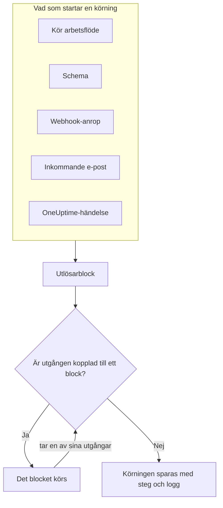
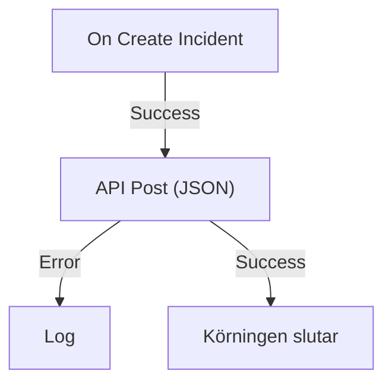

# Översikt över arbetsflöden

Arbetsflöden automatiserar arbete i OneUptime utan kod. Du placerar block på en arbetsyta, kopplar ihop dem, och arbetsflödet körs av sig självt varje gång dess utlösare aktiveras: en incident skapas, ett schema infaller, ett annat verktyg anropar en URL eller ett e-postmeddelande kommer in. Använd dem för att koppla OneUptime till resten av din stack och för att ta hand om den rutinmässiga uppföljningen medan du arbetar med själva problemet.

:::cards
- [Skapa ett arbetsflöde](/docs/workflows/authoring): Skapa ett arbetsflöde och lägg sedan till, koppla ihop och ställ in blocken på arbetsytan.
- [Utlösare](/docs/workflows/triggers): Starta ett arbetsflöde manuellt, enligt ett schema, från en webhook, ett e-postmeddelande eller en OneUptime-händelse.
- [Komponenter](/docs/workflows/components): Alla block du kan lägga till, från API-anrop till OneUptime-poster.
- [Körningar](/docs/workflows/runs-and-logs): Se vad varje körning gjorde, steg för steg.
:::

## Så fungerar ett arbetsflöde

Varje arbetsflöde har tre delar:

1. **En utlösare** — det som startar arbetsflödet: en manuell körning, ett schema, ett webhook-anrop, ett inkommande e-postmeddelande eller en händelse i OneUptime, som en ny incident. Varje arbetsflöde har exakt en.
2. **Komponenter** — det arbetsflödet gör: skickar ett meddelande, anropar ett API, kontrollerar ett villkor, skapar eller uppdaterar en OneUptime-post.
3. **Kopplingar** — linjerna du drar från ett block till nästa. De avgör vad som körs efter vad.

När utlösaren aktiveras startar OneUptime en **körning**. Varje block avslutas med att ta en av sina utgångar, som **Success** eller **Error**, **Yes** eller **No**, och bara de block som är kopplade till den utgången körs därefter. Om inget block är kopplat till utgången ett block tog, slutar den vägen där. Körningen sparas med sin status, vägen den tog och vad varje block tog emot och returnerade.



Du bygger allt detta visuellt på en arbetsyta. De flesta arbetsflöden behöver ingen kod alls; när ett gör det kör ett **Run Custom JavaScript**-block några rader JavaScript.

## Vad du kan göra med arbetsflöden

- **Koppla OneUptime till dina andra verktyg** — posta i Slack, Microsoft Teams, Discord, Telegram eller IRC, skapa Jira-ärenden eller skicka en förfrågan till valfritt API i din stack.
- **Reagera på det som händer i OneUptime** — när en incident skapas, meddela rätt kanal och öppna ett ärende automatiskt.
- **Kör jobb enligt ett schema** — var femte minut, varje natt, varje måndagsmorgon.
- **Ta emot data utifrån** — låt andra system starta ett arbetsflöde genom att anropa dess URL eller skicka e-post till dess adress.
- **Återanvänd gemensam automatisering** — bygg den en gång och starta den från vilket annat arbetsflöde som helst med ett **Execute Workflow**-block.

## Viktiga begrepp

| Begrepp             | Vad det betyder                                                                                                |
| ------------------- | -------------------------------------------------------------------------------------------------------------- |
| **Arbetsflöde**     | Hela automatiseringen: ett namn, en arbetsyta med block och en brytare för att slå på eller av den.            |
| **Utlösare**        | Det första blocket. Det avgör när arbetsflödet körs. Varje arbetsflöde har exakt en.                           |
| **Komponent**       | Varje annat block: det skickar ett meddelande, gör en förfrågan, kontrollerar ett villkor eller ändrar en post. |
| **Utgång**          | En punkt längst ned på ett block, som **Success** eller **Error**. Linjer därifrån leder till nästa block.      |
| **Körning**         | En exekvering av arbetsflödet, sparad med status, tidsstämplar och vad varje block gjorde.                     |
| **Global variabel** | Ett värde, som en API-nyckel, som du sparar en gång och använder i alla arbetsflöden i projektet.              |

## Innan du börjar

- **En plan som omfattar arbetsflöden.** I OneUptime Cloud kräver arbetsflöden planen **Growth** eller högre, och varje plan tillåter ett antal körningar var 30:e dag — se [Plangränser](/docs/workflows/configuration#plangränser). Självhostade installationer utan fakturering har ingen av gränserna.
- **Behörighet att bygga.** Att skapa och ändra arbetsflöden kräver **Workflow Admin**, **Project Admin** eller **Project Owner**, eller en anpassad roll med motsvarande behörigheter. En **Workflow Member** kan öppna arbetsflöden och köra dem manuellt, men inte ändra dem. Se [Behörigheter](/docs/workflows/configuration#behörigheter).

## Var du hittar arbetsflöden i OneUptime

Öppna **Produkter** i det övre fältet och välj **Arbetsflöden** under **Instrumentpaneler och automatisering**. Dess meny innehåller:

- **Arbetsflöden** — din lista över arbetsflöden. Skapa ett nytt eller öppna ett befintligt.
- **Globala variabler** — värden som alla dina arbetsflöden delar.
- **Loggar → Körningar** — körningshistoriken för alla arbetsflöden i ditt projekt.
- **Inställningar → Etikettregler** och **Ägarregler** — sätt etiketter på nya arbetsflöden och tilldela deras ägare automatiskt.
- **Avancerad → Arkiverad** — arbetsflöden du har arkiverat. De körs aldrig och visas inte i listan; avarkivera dem härifrån. Se [Arkivera ett arbetsflöde](/docs/workflows/configuration#arkivera-ett-arbetsflöde).
- **Utvecklare** — hur du hanterar arbetsflöden med Terraform, API:t eller en AI-assistent.

Öppna ett enskilt arbetsflöde, så innehåller dess egen meny:

- **Översikt** — namn, beskrivning, etiketter och brytaren **Aktiverad**.
- **Byggare** — arbetsytan där du utformar arbetsflödet, med brytaren **Aktiverad** högst upp.
- **Arbetsflödesvariabler** — värden som bara gäller just det här arbetsflödet.
- **Loggar → Körningar** — varje körning av det här arbetsflödet, med detaljer.
- **Ägare** — de personer och team som ansvarar för arbetsflödet.
- **Utvecklare** — hur du hanterar det här arbetsflödet med Terraform, API:t eller en AI-assistent.
- **Inställningar** — duplicera, exportera och arkivera.

**Inställningar** ligger i menyns avsnitt **Avancerad** tillsammans med **Granskningsloggar** och **Ta bort arbetsflöde**. **Avancerad** och **Utvecklare** är hopfällda från början, i den här menyn och i alla andra, så att sidorna du använder varje dag kommer först. Klicka på ett avsnitts namn för att visa dess sidor. Det fälls ut av sig självt när du är på någon av dem.

## Bygg ditt första arbetsflöde

Varje arbetsflöde kommer till på samma sätt:

:::steps
1. **Skapa** — välj en utgångspunkt och ge sedan arbetsflödet ett namn. Se [Skapa ett arbetsflöde](/docs/workflows/authoring).
2. **Välj en utlösare** — manuell, schemalagd, webhook, inkommande e-post eller en händelse från OneUptime. Se [Utlösare](/docs/workflows/triggers).
3. **Lägg till komponenter** — lägg till åtgärder på arbetsytan och koppla ihop dem. Se [Komponenter](/docs/workflows/components).
4. **Slå på det** — slå på **Aktiverad** högst upp i **Byggare**. Ett inaktiverat arbetsflöde kan inte köras alls, inte ens manuellt.
5. **Testa** — klicka på **Kör arbetsflöde** i **Byggare** och följ körningen medan den pågår.
:::

Exemplet nedan följer de här stegen för ett riktigt arbetsflöde.

## Exempel: skicka nya incidenter till en webhook

Det här arbetsflödet skickar en JSON-sammanfattning av varje ny incident till en URL du väljer — ett ärendesystem, ett datalager, allt som tar emot en webhook — och skriver orsaken i körningens logg när förfrågan misslyckas.



> [!TIP]
> Mallen **Forward new incidents to another system** bygger samma arbetsflöde åt dig. Du hittar den under **Incidenter** när du skapar ett arbetsflöde.

:::steps
### Skapa arbetsflödet

Öppna **Arbetsflöden** och klicka på **Skapa arbetsflöde**. Klicka på **Börja från grunden**, ge arbetsflödet namnet `Send new incidents to a webhook` och klicka på **Skapa arbetsflöde**.

Det nya arbetsflödet öppnas i **Byggare**, avstängt.

### Lägg till utlösaren

Klicka på det streckade blocket **Choose what starts this workflow** och klicka sedan på **On Create Incident** under **Popular** i panelen **Add Trigger**.

Utlösaren tar det streckade blockets plats. ID:t på det, `incident-on-create-1`, är hur senare block hänvisar till det.

### Välj incidentens fält

Klicka på utlösaren. Under **Select Fields** markerar du fälten förfrågan ska ha med, som titeln och beskrivningen, och klickar på **Spara**.

Utlösaren skickar den nya incidenten vidare med de här fälten. Ett fält du inte väljer kommer fram tomt.

### Lägg till API-blocket

Klicka på **Lägg till komponent** och klicka sedan på **API Post (JSON)** under **Popular**. Dra från utlösarens punkt **Success** ned till den översta punkten på det nya blocket.

### Fyll i förfrågan

Klicka på API-blocket, där det står **Click to set up**. Ange din slutpunkt i **URL**. Skriv JSON:en som ska skickas i **Request Body**, använd **{ }** för att infoga incidentens fält där du behöver dem och klicka på **Spara**.

```json title="Request Body"
{
  "id": "{{local.components.incident-on-create-1.returnValues.model._id}}",
  "title": "{{local.components.incident-on-create-1.returnValues.model.title}}",
  "description": "{{local.components.incident-on-create-1.returnValues.model.description}}"
}
```

Varje `{{…}}`-referens ersätts med incidentens värde när arbetsflödet körs. Se [Variabler](/docs/workflows/variables) för syntaxen.

### Fånga fel

Klicka på **Lägg till komponent** och klicka sedan på **Logg**. Koppla API-blockets punkt **Error** till det och sätt sedan Log-blockets **Value** till `Could not send the incident: {{local.components.api-post-1.returnValues.error}}`.

En förfrågan som misslyckas — en URL som inte går att nå, eller ett svar som inte är 2xx — tar nu den här vägen, och körningens logg säger varför.

### Slå på det

Slå på **Aktiverad** högst upp i **Byggare**.

### Testa det

Klicka på **Kör arbetsflöde**, ange **Incident-ID** för en incident i det här projektet, klicka på **Run Workflow Manually** och bekräfta med **Run**.

En panel **Arbetsflödeskörning** öppnas och följer körningen. Öppna steget **API Post (JSON)** för att se bodyn det skickade och svaret det fick.
:::

Från och med nu startar varje ny incident i projektet en körning. Du hittar dem alla under arbetsflödets [Körningar](/docs/workflows/runs-and-logs).

> [!NOTE]
> Förfrågan skickas från OneUptime. I OneUptime Cloud måste URL:en gå att nå från internet. En självhostad installation avvisar privata nätverksadresser om inte en administratör tillåter dem — se [Utgående nätverksåtkomst](/docs/workflows/configuration#utgående-nätverksåtkomst).

## Hur arbetsflöden passar ihop med resten av OneUptime

- **Monitorer** upptäcker problemet. **Incidenter** och **larm** registrerar det. **Arbetsflöden** reagerar på det.
- **Runbooks** är insatsrutiner som ditt team går igenom vid en incident, ett larm eller ett underhåll: manuella steg, godkännanden och skript, med människor inblandade. Arbetsflöden körs utan tillsyn. Använd en [runbook](/docs/runbooks/index) när en person behöver fatta beslut längs vägen, och ett arbetsflöde när varje steg är automatiskt.
- **Arbetsytekopplingar** kopplar ett projekt till Slack och Microsoft Teams för incidentkanaler och aviseringar. Arbetsflödenas Slack- och Microsoft Teams-block använder dem inte: varje block postar via sin egen inkommande webhook-URL.

## Nästa steg

:::cards
- [Skapa ett arbetsflöde](/docs/workflows/authoring): Arbeta med arbetsytan, blocken och deras inställningar.
- [Variabler](/docs/workflows/variables): Skicka data mellan block och håll hemligheter utanför dina arbetsflöden.
- [Konfiguration och säkerhet](/docs/workflows/configuration): Behörigheter, gränser och säkerhet innan du går live.
:::
