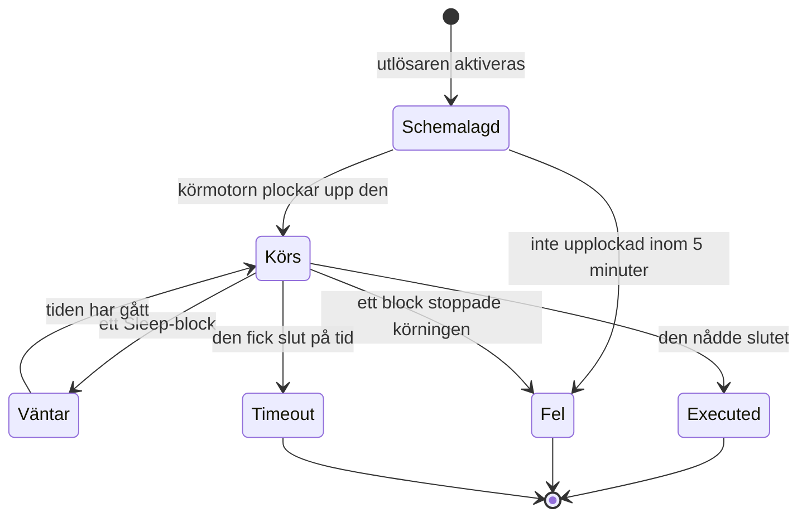

# Arbetsflödeskörningar

Varje gång ett arbetsflöde körs sparar OneUptime en redogörelse för vad som hände — när det kördes, om det lyckades och vad varje block tog emot och returnerade. Den redogörelsen kallas en **körning**. Med körningar bekräftar du att ett arbetsflöde fungerade, felsöker ett som inte gjorde det och ser tillbaka på tidigare aktivitet.

:::cards
- [Status för en körning](#status-för-en-körning): Vad Schemalagd, Väntar, Executed och de andra statusarna betyder.
- [Läs en körning](#läs-en-körning): Följ vägen en körning tog, block för block.
- [Felsökning](#felsökning): Ett arbetsflöde som inte kördes, ett block som aldrig kördes, ett värde som kom fram tomt.
:::

## Var du hittar dem

| Sida                                                 | Vad du ser                                                                                         |
| ---------------------------------------------------- | -------------------------------------------------------------------------------------------------- |
| **Arbetsflöden → Loggar → Körningar**                | Varje körning av varje arbetsflöde i projektet. Filtrera på arbetsflödets namn, status och tid.    |
| **Arbetsflöde → Loggar → Körningar**                 | Bara körningarna av just det här arbetsflödet. Här finns ett filter **Körnings-ID** i stället för ett arbetsflödesfilter. |
| **En enskild körning**                               | Öppnas med knappen **Visa loggar** på en körnings rad — själva raderna går inte att klicka på.     |

Startar du en körning från **Byggare** öppnas samma vy **Arbetsflödeskörning**, som redan följer körningen, så att du kan se den hända i stället för att leta efter den efteråt.

## Status för en körning

| Status                              | Vad den betyder                                                                                                                                                                                                                                                       |
| ----------------------------------- | --------------------------------------------------------------------------------------------------------------------------------------------------------------------------------------------------------------------------------------------------------------------- |
| **Schemalagd**                      | Utlösaren aktiverades och körningen står i kö för körmotorn. Vanligtvis en bråkdel av en sekund. En körning som fortfarande är schemalagd efter 5 minuter misslyckas: inget plockade upp den.                                                                       |
| **Körs**                            | Arbetsflödet pågår.                                                                                                                                                                                                                                                   |
| **Väntar**                          | Körningen står parkerad vid ett **Sleep**-block och fortsätter av sig själv. Den håller ingen worker medan den väntar.                                                                                                                                              |
| **Executed**                        | Körningen nådde slutet utan att misslyckas. Det är det lyckade läget: etiketten säger **Executed**, inte ”Lyckades”.                                                                                                                                                 |
| **Fel**                             | Ett block stoppade körningen. Används också när en köad körning aldrig plockas upp, när återupptagningen av en sovande körning går förlorad, när ett schemauttryck inte kan lösas upp och när arbetsflödet stängdes av eller arkiverades medan körningen väntade vid ett **Sleep**-block. |
| **Timeout**                         | Körningen tog längre tid än tillåtet: 2 minuter som standard. Se [Hur länge en körning får ta](/docs/workflows/configuration#hur-länge-en-körning-får-ta).                                                                                                              |
| **Execution Exceeded Current Plan** | Projektet har förbrukat sina arbetsflödeskörningar för de senaste 30 dagarna, eller så är abonnemanget obetalt. Körningen registreras men utförs inte. Endast OneUptime Cloud.                                                                                      |

Ett block som tar sin utgång **Error** — ett API-block som fick ett 4xx-svar, till exempel — får inte körningen att misslyckas. Blocken som är kopplade till **Error** körs, och körningen slutar ändå som **Executed**. Själva steget ritas i rött, så att du hittar det.

## Läs en körning

Klicka på **Visa loggar** på en körning för att öppna den. Vyn **Arbetsflödeskörning** har två flikar, **Steg** och **Full Log**.

### Fliken Steg

Vägen körningen tog, med ett numrerat kort per block, i den ordning de kördes. Utan att du öppnar något visar varje kort:

- Blockets titel och ID, om det är markerat **Lyckades** eller **Misslyckades**, och hur lång tid det tog.
- Vilken utgång det tog, med det namn arbetsytan ger den, och vart den ledde: nästa stegs nummer och namn, eller en notering om att inget är kopplat till den, så körningen eller den grenen slutade där. Ett steg den ledde till men som aldrig kördes säger **(did not run)**. Utgången Error ritas i rött; Yes och No är bara vägen körningen gick. Håll muspekaren över utgångens namn för att se vad den betyder.
- Stegets fel, om det misslyckades, och eventuella varningar om det — till exempel en `{{…}}`-referens som löstes upp till ingenting.

Öppna ett kort för att se två block med detaljer:

| Block        | Vad det visar                                                                                                                                                                                                   |
| ------------ | --------------------------------------------------------------------------------------------------------------------------------------------------------------------------------------------------------------- |
| **Received** | Inställningarna blocket fick, efter namn och i den ordning dess inställningslista har dem, efter att alla variabler fyllts i. En inställning som hänvisar till ett annat steg eller en variabel visar referensen bredvid värdet den blev, och **Did not resolve** när den blev ingenting. |
| **Returned** | Det det producerade, med varje värdes ID (den sista delen av en `returnValues`-referens). Listor och objekt visas med indrag.                                                                                    |

Misslyckade steg, steg med en varning och en körnings enda steg börjar öppna. Räknaren på fliken **Steg** blir röd när något misslyckades och orange när ett steg har en varning.

Några körningar läses annorlunda:

- **Ett test av ett steg.** En körning som startades med **Run just this step** säger **Only this step ran** högst upp. Stegen före det kördes inte, så värden som det läser från dem saknas (räkna med en varning **Did not resolve** för dem), och stegen efter det säger **(not run in this test)**. Använd **Kör arbetsflöde** för att prova hela vägen.
- **En körning som stoppades mellan steg.** Om körningen stoppades av en orsak som inget steg förklarar — den fick slut på tid mellan två steg, eller misslyckades före sitt första steg — slutar vägen med **The run stopped here** och orsaken.
- **En sovande körning.** En körning som väntar vid ett **Sleep**-block slutar med **Sleeping** och tidpunkten då den fortsätter av sig själv; stegen efter Sleep säger **(not run yet)**.

ID:t under varje stegs titel är exakt det som ska stå i en `{{local.components.<id>.returnValues.…}}`-referens, vilket gör det här till det snabbaste sättet att få en referens rätt.

Värdena som visas är det blocket tog emot, efter att variablerna fyllts i och innan blocket gjorde något med dem, med två undantag: hemligheter och fält som blocket markerar som känsliga döljs, och ett värde på mer än 4 000 tecken kapas med "… (truncated)". En körning behåller sina senaste 100 steg; en lång eller ofta återupptagen körning visar en orange notering där de tidigare släpptes. Körningar som registrerades innan utgångarnas namn sparades visar utgången med dess ID, utan vart den ledde.

### Fliken Full Log

Den råa loggen rad för rad som körmotorn skrev den, inklusive allt blocken loggade själva, som ett **Log**-blocks värde eller ett skripts `console.log`. Använd den när fliken Steg inte förklarar felet.

## Kopiera och ladda ner en körning

Högst upp i vyn **Arbetsflödeskörning**, bredvid stängningsknappen, lägger **Kopiera logg** hela **Full Log** i urklipp, redo att klistras in i en chatt eller ett ärende. **Ladda ner** sparar körningen som en fil:

| Nedladdning                             | Det här får du                                                                                                                                                                                                                         |
| --------------------------------------- | -------------------------------------------------------------------------------------------------------------------------------------------------------------------------------------------------------------------------------------- |
| **Ladda ner logg**                      | En `.txt`-fil med hela loggen precis som körmotorn skrev den, oavsett längd, under en kort rubrik: arbetsflödets namn och ID, körningens ID, dess status och när den schemalades, startade och slutfördes.                             |
| **Ladda ner körning som JSON**          | En `.json`-fil med samma uppgifter som data, stegen som fliken **Steg** visar (vad varje steg tog emot och returnerade, och vilken utgång det tog) och loggen som en lista med rader. Stegen har samma form som API:t returnerar en körnings `stepTrace` i, och precis som på fliken **Steg** är det körningens senaste 100. Loggen är alltid fullständig. |

Samma två nedladdningar finns i menyn **⋯** för varje körning i båda listorna över körningar, så att du kan spara en körning utan att öppna den. En körning som du startade från **Byggare** kan kopieras eller laddas ner medan den fortfarande pågår; du får det den har loggat hittills.

Filerna namnges efter arbetsflödet, körningen och när den startade, i UTC, så att en mapp med dem sorteras efter arbetsflöde och sedan efter tid: `nightly-sync-run-<run id>-2026-09-30T10-00-01.txt`.

En nedladdning innehåller inget som du inte redan kunde läsa i körningen. Hemligheter och fält som ett block markerar som känsliga döljs när körningen registreras, så de är dolda i filen också, och alla som kan öppna en körning kan ladda ner den.

## Felsökning

:::details Mitt arbetsflöde kördes inte
1. Se till att arbetsflödet är **Aktiverad**: brytaren sitter högst upp i dess **Byggare**, som säger det ovanför arbetsytan när arbetsflödet är avstängt. Nya arbetsflöden börjar inaktiverade, och ett inaktiverat arbetsflöde avvisar varje körning — även manuella. Ett webhook-anrop till det får HTTP 400 med ett meddelande om hur du slår på det.
2. För en utlösare för OneUptime-händelser bekräftar du att händelsen faktiskt inträffade: öppna posten och kontrollera dess historik. En **On Update**-utlösare med **Listen on** aktiveras bara när något av de fälten ändrades.
3. För en webhook-utlösare bekräftar du att det andra systemet skickar till rätt URL. De flesta verktyg loggar när de skickar en webhook — kontrollera där.
4. För en schemautlösare bekräftar du att cron-uttrycket stämmer med tiden du förväntar dig. Scheman körs i UTC.

Om körningen syns, med statusen **Execution Exceeded Current Plan**, har projektet förbrukat alla sina arbetsflödeskörningar för de senaste 30 dagarna, eller så är abonnemanget obetalt. Körningens logg nämner antalet och din plans gräns. Det gäller bara OneUptime Cloud.
:::

:::details Ett senare block kördes aldrig
Ett block som inte körs är oftast ett kopplingsproblem. Öppna **Byggare** och kontrollera:

- Är det tidigare blockets utgång kopplad till det här blockets ingång?
- Tog det tidigare blocket en annan utgång än du förväntade dig — **Error** i stället för **Success**, eller **No** i stället för **Yes**? Fliken **Steg** säger vilken utgång det tog och vart den ledde, eller att inget är kopplat till den.
:::

:::details Ett värde kom fram tomt, eller som {{…}}-text
Öppna körningen och titta på steget. En referens som inte löstes upp lyfts fram på själva steget som en varning, och dess inställning i blocket **Received** är markerad **Did not resolve**.

- Ser du den bokstavliga texten `{{local.components.…}}` löstes referensen inte upp. Oftast är det ett stavfel i komponent-ID:t eller returvärdets ID — kom ihåg att det är blockets **Identifier**, inte namnet som visas på det. Kontrollera också stavningen av själva `local.components`: `{{local.componets.api-get-1.returnValues.response-body}}` skickas som bokstavlig text och körningen rapporterar ändå **Executed**. Var körningen ett test med **Run just this step** kördes det tidigare blocket inte alls — kör hela arbetsflödet i stället.
- Ser du **Empty text** kördes det tidigare blocket men producerade inte det fältet.

Samma varning finns på fliken **Full Log** som en rad som börjar med `Warning:`.
:::

:::details Det fungerar när jag kör det manuellt men inte från utlösaren
Öppna **Byggare**, klicka på **Kör arbetsflöde** och fyll i utlösarens fält med värden som liknar det den riktiga utlösaren skickar. Jämför sedan den körningens **Received**-värden med den riktiga körningens, sida vid sida. Skillnaden ligger oftast i ett enda fälts namn eller typ.
:::

## Köra ett arbetsflöde igen

Det finns ingen knapp för att ”försöka den här körningen igen”. Gamla körningar körs aldrig om automatiskt, eftersom deras bieffekter — Slack-meddelanden, API-anrop, ärenden — kanske inte är säkra att upprepa. För att göra om arbetet rättar du arbetsflödet och låter nästa riktiga utlösare starta det, eller så öppnar du **Byggare** och klickar på **Kör arbetsflöde** med samma värden.

## Hur länge sparas körningar?

I OneUptime Cloud sparas körningar i **30 dagar** och tas sedan bort — det är därför båda listorna över körningar beskriver sig som att de täcker de senaste 30 dagarna. Självhostade installationer sparar körningar tills du tar bort dem; om ett arbetsflöde körs väldigt ofta och skräpar ned din historik stänger du av det eller tar bort det.

Körningar som registrerades innan stegspårning infördes har inget innehåll i **Steg** och visar bara sin **Full Log**.

## Nästa steg

:::cards
- [Konfiguration och säkerhet](/docs/workflows/configuration): Tidsgränser, plangränser och vad som döljs i loggar.
- [Variabler](/docs/workflows/variables): Referenssyntaxen som dina block använder.
- [Komponenter](/docs/workflows/components): Vad varje block returnerar och när det tar varje utgång.
:::
