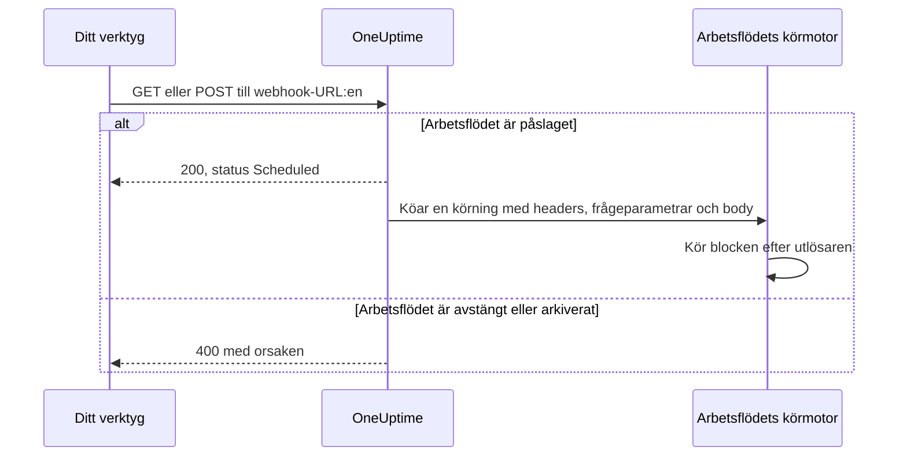
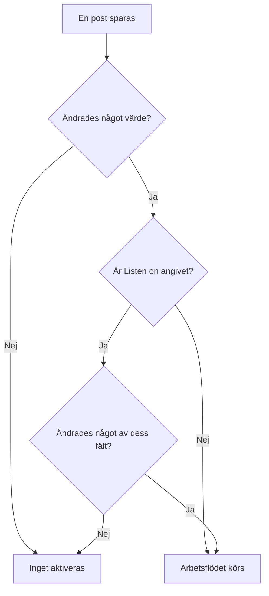

# Arbetsflödesutlösare

En utlösare är det första blocket i ett arbetsflöde — den avgör när arbetsflödet körs. Varje arbetsflöde har exakt en utlösare. Du väljer mellan fem typer.

:::cards
- [Manuell](#manual): Starta arbetsflödet från Byggare eller från ett annat arbetsflöde.
- [Schema](#schedule): Kör det enligt ett återkommande schema, skrivet som ett cron-uttryck.
- [Webhook](#webhook): Låt ett annat system starta det genom att anropa en URL.
- [Inkommande e-post](#incoming-email): Starta det med varje e-postmeddelande som skickas till dess egen adress.
- [Utlösare för OneUptime-händelser](#utlösare-för-oneuptime-händelser): Reagera när en post skapas, uppdateras eller tas bort.
:::

För att lägga till utlösaren klickar du på det streckade blocket **Choose what starts this workflow** på ett nytt arbetsflödes arbetsyta. För att ändra den tar du bort utlösarblocket, så kommer det streckade blocket tillbaka. Se [Skapa ett arbetsflöde](/docs/workflows/authoring#lägg-till-block).

## Vilken utlösare ska jag använda?

| Om du vill …                                   | Välj                        |
| ---------------------------------------------- | --------------------------- |
| Klicka på en knapp för att köra arbetsflödet   | **Manual**                  |
| Köra enligt ett återkommande schema            | **Schema**                  |
| Låta ett annat system skicka in data           | **Webhook**                 |
| Börja från ett e-postmeddelande                | **Incoming Email**          |
| Reagera på något i OneUptime                   | **OneUptime-händelse**      |

Ett arbetsflöde kan bara ha en utlösare. Behöver du två sätt att starta samma automatisering bygger du den gemensamma logiken i ett arbetsflöde med en **Manual**-utlösare och startar det från två tunna ”omslags”-arbetsflöden med ett **Execute Workflow**-block.

## Manual

Kör arbetsflödet när du vill: klicka på **Kör arbetsflöde** på sidan **Byggare**, fyll i utlösarens **JSON**, klicka på **Run Workflow Manually** och bekräfta med **Run**. Ett annat arbetsflöde kan också starta det med ett **Execute Workflow**-block.

Bra för: automatisering med ett klick som du vill ha en knapp för, som ”rotera den här nyckeln” eller ”skicka ett testlarm”, och logik som du delar mellan arbetsflöden.

**Returns**: **JSON** — det körningen startades med.

- Från **Kör arbetsflöde** är det JSON:en du skrev, som text. För att läsa ett fält i den skickar du den först genom ett **Text to JSON**-block.
- Från ett **Execute Workflow**-block är varje nyckel i blockets **Arguments** ett eget värde. Med `{"customerId": "42"}` läser ett senare block `{{local.components.manual-1.returnValues.customerId}}`, där `manual-1` är Manual-utlösarens ID.

## Schedule

Kör arbetsflödet enligt ett återkommande schema. Ange hur ofta i **Schedule at**: välj ett av **Common schedules**, skriv ett **Custom cron**-uttryck eller välj en **Variabel** som innehåller ett. Under fältet beskrivs schemat i ord, tillsammans med **Next runs**.

Bra för: städning på natten, synkronisering varje timme, veckorapporter.

Tiderna är i UTC, så räkna om från din egen tidszon när du väljer timme. De fem delarna i ett cron-uttryck är minut, timme, dag i månaden, månad och veckodag:

| Uttryck       | Körs                                   |
| ------------- | -------------------------------------- |
| `*/5 * * * *` | Var 5:e minut.                         |
| `0 * * * *`   | Varje hel timme.                       |
| `0 0 * * *`   | Varje dag vid midnatt UTC.             |
| `0 9 * * 1-5` | Varje vardag kl. 9:00 UTC.             |
| `0 9 * * 1`   | Varje måndag kl. 9:00 UTC.             |

Inget schemaläggs medan arbetsflödet är avstängt. Ett schema med **Variabel** läser en arbetsflödesvariabel eller en global variabel, som `{{local.variables.schedule}}`. Blir den inte ett giltigt cron-uttryck schemaläggs inte arbetsflödet, och en misslyckad körning i dess lista över körningar säger varför.

För att testa arbetsflödet utan att vänta på schemat klickar du på **Kör arbetsflöde** i **Byggare**: det startar en körning direkt.

## Webhook

OneUptime ger arbetsflödet en egen URL. Allt som anropar URL:en startar arbetsflödet och skickar med förfrågans headers, frågeparametrar och body.

Bra för: att ta emot data i OneUptime från ett annat verktyg — CI/CD-återanrop, larm från annan övervakning, registreringar i ditt CRM.

För att få URL:en klickar du på Webhook-utlösaren på arbetsytan. URL:en står högst upp i dess inställningar, med en knapp **Kopiera URL**, metoderna den accepterar och ett `curl`-kommando som du kan klistra in i en terminal för att prova den:

```bash
curl -X POST "https://oneuptime.example.com/workflow/trigger/<secret key>" \
  -H "Content-Type: application/json" \
  -d '{"message": "Hello"}'
```

URL:en accepterar både `GET` och `POST`. Anroparen får en snabb bekräftelse, `{"status": "Scheduled"}` — själva arbetsflödet körs i bakgrunden, så anroparen ser aldrig vad det gör. Ett anrop till ett arbetsflöde som är avstängt eller arkiverat avvisas med HTTP 400 och orsaken.



**Returns**:

| Värde                    | Vad det innehåller                                                                                                     |
| ------------------------ | ---------------------------------------------------------------------------------------------------------------------- |
| **Request Headers**      | Varje header i förfrågan, med namn i gemener, som `content-type`.                                                      |
| **Request Query Params** | Frågeparametrarna i URL:en, efter namn.                                                                                |
| **Request Body**         | Bodyn som anroparen skickade. En JSON-body, skickad med `Content-Type: application/json`, kan läsas fält för fält.     |

Läs ett enskilt fält genom att lägga till dess namn i referensen, som i `{{local.components.webhook-1.returnValues.request-body.message}}`.

När en förfrågan har kommit vet värdeväljaren i varje block efter utlösaren vad den innehöll: den visar bodyns fält, headers och frågeparametrar, vart och ett med sitt innehåll, så att du kan välja `incident.title` i stället för att skriva en sökväg. Fram till dess säger den att ingen förfrågan har kommit och erbjuder **Copy test request**, ett `curl`-kommando till URL:en; fälten dyker upp så snart körningen som förfrågan startar är klar. Se [Använd värden från tidigare block](/docs/workflows/authoring#använd-värden-från-tidigare-block).

För att testa arbetsflödet utan det andra verktyget klickar du på **Kör arbetsflöde** i **Byggare** och anger headers, frågeparametrar och en body.

### Håll URL:en privat

Den sista delen av URL:en är arbetsflödets hemliga nyckel, och alla som har URL:en kan starta arbetsflödet. Därför är nyckeln dold tills du klickar på **Visa**, och **Kopiera URL** kopierar hela URL:en utan att visa den.

Om URL:en läcker klickar du på **Återställ URL** på samma ställe: arbetsflödet får en ny URL och den gamla slutar fungera direkt, så uppdatera allt som anropar den. Bara personer som får redigera arbetsflödet kan se eller återställa dess URL — se [Webhook-säkerhet](/docs/workflows/configuration#webhook-säkerhet).

> [!WARNING]
> Behandla URL:en som ett lösenord. Alla som har den kan starta ditt arbetsflöde utan att logga in.

## Incoming Email

OneUptime ger arbetsflödet en egen e-postadress. Varje e-postmeddelande som skickas till den adressen startar arbetsflödet och skickar med meddelandet: vem som skickade det, vem det var till, ämnet, texten och HTML:en, headers och namnen på eventuella bilagor.

Bra för: att agera på e-post från system som inte kan anropa en webhook — larm från äldre övervakningsverktyg, en leverantörs statusmeddelanden, rapporten ett nattligt jobb skickar ut.

För att få adressen klickar du på Incoming Email-utlösaren på arbetsytan. Adressen står högst upp i dess inställningar, med en knapp **Kopiera adress**. Ge den till det som ska starta arbetsflödet: ett verktyg som bara kan skicka e-post, en leverantörs aviseringsinställningar eller en vidarebefordringsregel i din egen brevlåda.

Varje e-postmeddelande startar en egen körning. Meddelandet når arbetsflödet oavsett om adressen står i Till eller Kopia, är en hemlig kopia eller nås via en vidarebefordringsregel. Ett meddelande som nämner adressen två gånger startar en körning.

**Returns**:

| Värde           | Vad det innehåller                                                                                       |
| --------------- | -------------------------------------------------------------------------------------------------------- |
| **From**        | Avsändarens adress.                                                                                      |
| **To**          | Alla som meddelandet var adresserat till, på en rad, som `ops@example.com, oncall@example.com`.          |
| **CC**          | Alla som meddelandet skickades som kopia till, på en rad.                                                |
| **Subject**     | Ämnesraden.                                                                                              |
| **Body**        | Meddelandets oformaterade text.                                                                          |
| **HTML Body**   | Meddelandets HTML, när det har någon. Body och HTML Body kapas vardera vid 1 MB.                         |
| **Headers**     | Varje header i meddelandet, med namn i gemener, som `message-id`.                                        |
| **Attachments** | Namn, typ och storlek för varje bilaga. Själva filerna sparas inte.                                      |
| **Received At** | När OneUptime tog emot meddelandet.                                                                      |

När ett e-postmeddelande har kommit vet värdeväljaren i varje block efter utlösaren vad det innehöll: den visar varje header och varje bilaga meddelandet hade, med innehållet, så att du kan välja `headers.message-id` i stället för att skriva en sökväg. Fram till dess säger den att inget e-postmeddelande har nått adressen ännu. Se [Använd värden från tidigare block](/docs/workflows/authoring#använd-värden-från-tidigare-block).

För att prova arbetsflödet utan att skicka ett e-postmeddelande klickar du på **Kör arbetsflöde** på sidan **Byggare** och fyller i en avsändare, ett ämne och en body. Värden du utelämnar kommer fram tomma.

E-post startar bara arbetsflödet medan det är påslaget. E-post till ett arbetsflöde som är avstängt ignoreras, liksom e-post till ett arbetsflöde vars utlösare inte längre är Incoming Email.

### Håll adressen privat

Delen av adressen före `@` innehåller arbetsflödets hemliga nyckel, och alla som har adressen kan starta arbetsflödet. Därför är nyckeln dold tills du klickar på **Visa**, och **Kopiera adress** kopierar hela adressen utan att visa den.

Om adressen läcker klickar du på **Återställ adress** på samma ställe: arbetsflödet får en ny adress och e-post till den gamla ignoreras från och med då, så ge den nya till allt som skickar e-post till arbetsflödet. Bara personer som får redigera arbetsflödet kan se eller återställa dess adress — se [Säkerhet för inkommande e-post](/docs/workflows/configuration#säkerhet-för-inkommande-e-post).

> [!WARNING]
> Vem som helst kan sätta vilken avsändare som helst på ett e-postmeddelande, så **From** är inget bevis på vem som skickade det. Kontrollera något som bara den riktiga avsändaren vet innan ett steg gör något viktigt.

> [!NOTE]
> På en självhostad installation tar OneUptime emot e-post via en leverantör av inkommande e-post som din administratör konfigurerar — se [SendGrid Inbound Email](/docs/self-hosted/sendgrid-inbound-email). Fram till dess har utlösaren ingen adress, och dess inställningar säger det.

## Utlösare för OneUptime-händelser

Nästan allt i OneUptime — monitorer, incidenter, larm, schemalagda underhåll, statussidor, jourpolicyer, team — kan starta ett arbetsflöde. Var och en erbjuder upp till tre händelser:

- **On Create** — aktiveras när en ny läggs till.
- **On Update** — aktiveras när en ändras. Att spara en post med de värden den redan har, som ett formulär sparat utan ändringar eller en brytare skickad som den redan står, är ingen ändring och aktiverar den inte.
- **On Delete** — aktiveras när en tas bort.

Så bygger du ”när X händer i OneUptime, gör Y” utan att behöva kontrollera saker i en loop.

**On Update** kan begränsas till vissa fält med **Listen on**: då aktiveras den bara när en uppdatering ändrar något av dem, till vilket värde som helst — att slå av en brytare eller tömma ett fält räknas.



**On Create** och **On Update** skickar posten vidare till nästa block, med de fält du väljer i utlösarens **Select Fields**. Till exempel skickar utlösaren **Incident → On Create** den nya incidenten vidare, så att nästa block kan läsa dess titel, beskrivning, allvarlighetsgrad eller vilket annat fält du har valt, som `{{local.components.incident-on-create-1.returnValues.model.title}}`. Ett fält du inte valde kommer fram tomt.

**On Delete** skickar bara vidare ID:t för den borttagna posten: posten är borta när arbetsflödet körs, så dess övriga fält kan inte läsas.

För att testa en händelseutlösare utan att vänta på händelsen klickar du på **Kör arbetsflöde** i **Byggare** och anger ID:t för en befintlig post, som ett **Incident-ID**. Körningen läser den posten med de fält du valde.

### Händelserna team använder mest

| Resurs                                    | Vad team använder den till                                                                |
| ----------------------------------------- | ----------------------------------------------------------------------------------------- |
| **Incident**                              | Reagera när en incident deklareras, uppdateras (kvitterad, löst) eller tas bort.         |
| **Larm**                                  | Samma tre händelser, för larm.                                                            |
| **Övervakning**                           | Reagera när en monitor läggs till, redigeras eller tas bort.                              |
| **Schemalagd Underhåll Händelse**         | Meddela ett underhållsfönster automatiskt när det schemaläggs.                            |
| **Statussida Prenumerant**                | Välkomna någon som prenumererar på en statussida.                                         |
| **Jourpolicy**                            | Synkronisera ändringar i policyn med ett annat jourschemasystem.                          |

I panelen **Add Trigger** finns de under **OneUptime resources**: klicka på resursen och sedan på utlösaren. **Browse all resources** har alla, och sökfältet hittar en utlösare utifrån några få ord, som `incident created`.

## Nästa steg

:::cards
- [Komponenter](/docs/workflows/components): Åtgärderna du lägger till efter utlösaren.
- [Variabler](/docs/workflows/variables): Läs i senare block det utlösaren skickade med.
- [Körningar](/docs/workflows/runs-and-logs): Bekräfta att din utlösare aktiverades och se vad den hade med sig.
:::
