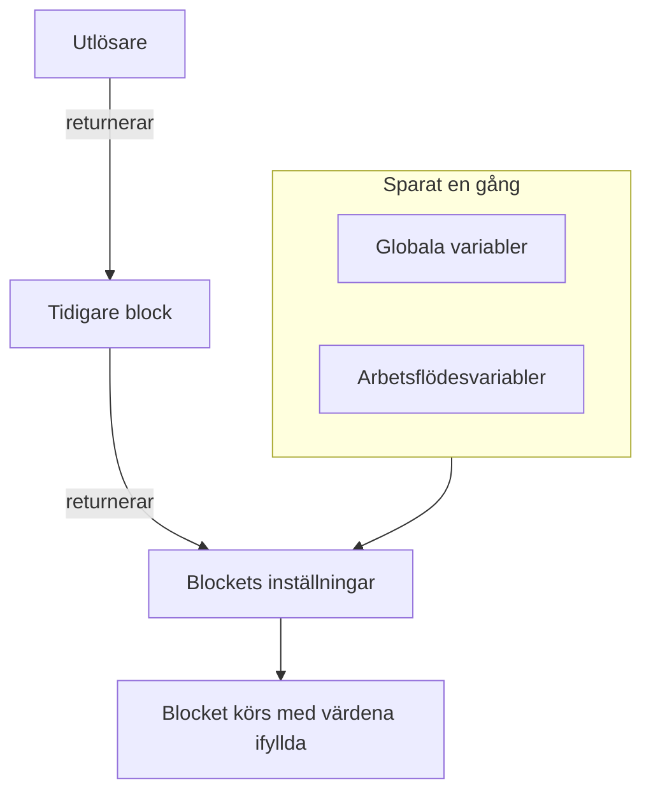
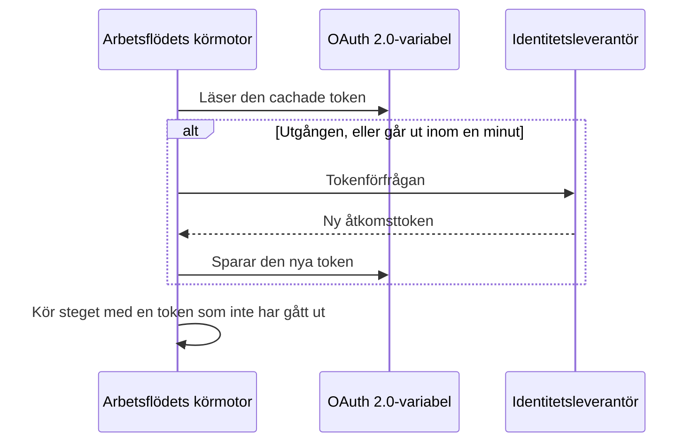

# Arbetsflödesvariabler

Variabler är sättet som data rör sig genom ett arbetsflöde: från utlösaren till det första blocket, från ett block till nästa och från värden du sparar en gång till varje block som behöver dem. En inställning på ett block läser ett värde med en referens inom dubbla klammerparenteser, och körmotorn fyller i den precis innan blocket körs.

| Värde                          | Var det kommer ifrån                                                 | Så läser ett block det                                |
| ------------------------------ | -------------------------------------------------------------------- | ----------------------------------------------------- |
| **Global variabel**            | Sparad under **Arbetsflöden → Globala variabler**                    | `{{global.variables.NAME}}`                          |
| **Arbetsflödesvariabel**       | Sparad på ett arbetsflödes sida **Arbetsflödesvariabler**            | `{{local.variables.NAME}}`                           |
| **Ett tidigare blocks värde**  | Det utlösaren eller ett tidigare block returnerade i den här körningen | `{{local.components.BLOCK_ID.returnValues.VALUE_ID}}` |



Du skriver sällan en referens. Klicka på **{ }** i slutet av en inställning, eller skriv `{{` i den, och välj värdet i en lista. Se [Använd värden från tidigare block](/docs/workflows/authoring#använd-värden-från-tidigare-block).

## Globala variabler

Värden för hela projektet som du sparar en gång och återanvänder i varje arbetsflöde: API-nycklar, URL:er, kanalnamn — allt du inte vill kopiera in i tio olika arbetsflöden.

:::steps
### Öppna de globala variablerna

Gå till **Arbetsflöden → Globala variabler** och klicka på **Skapa Arbetsflöde Variabel**.

### Namnge variabeln

Fyll i steget **Variabel**:

- **Namn** — det du hänvisar till den med. Minst två tecken, inga mellanslag och bara bokstäver, siffror, bindestreck och understreck. `UPPER_SNAKE_CASE` är en bra vana, eftersom det sticker ut i dina block.
- **Beskrivning** — valfri fritext som påminner dig om vad den är till för.

Klicka på **Nästa**.

### Ge den ett värde

Fyll i steget **Värde**:

- **Innehåll** — själva värdet. Det är ett fält för lång text, så värden på flera rader fungerar.
- **Hemlighet** — när den är påslagen tas värdet bort från körningsloggar och stegspår.

Klicka på **Skapa Arbetsflöde Variabel**. För att ändra namnet eller beskrivningen dessförinnan klickar du på **Variabel** i listan över steg bredvid formuläret (visas på breda skärmar); det du skrev i båda stegen behålls.
:::

Använd en global variabel i vilket arbetsflöde som helst med:

```text
{{global.variables.NAME}}
```

Har du till exempel sparat din PagerDuty-nyckel som `PAGERDUTY_KEY` kan vilket block som helst använda den som `{{global.variables.PAGERDUTY_KEY}}` — redigeraren sparar referensen, och arbetsflödets loggning tar bort det upplösta hemliga värdet.

Listan visar varje variabels namn och beskrivning. Klicka på **Visa** på en rad för att öppna variabelns sida. Den visar om variabeln är statisk eller OAuth 2.0, och det är där du gör allt annat:

| Knapp                                      | Vad den gör                                                                                                                                      |
| ------------------------------------------ | ------------------------------------------------------------------------------------------------------------------------------------------------ |
| **Redigera Variabel**                      | Ändrar namnet, beskrivningen och — för en statisk variabel som ännu inte är hemlig — hemlighetsmarkeringen. När en variabel väl är hemlig förblir den hemlig. |
| **Update Content**                         | Ersätter ett statiskt värde. Det sparade innehållet kan inte läsas tillbaka, så du skriver det nya värdet i sin helhet.                          |
| **Use in Workflows**                       | Visar den exakta referensen att klistra in i dina block, med en kopieringsknapp.                                                                 |
| **Ta bort Arbetsflöde Variabel**           | Tar bort den efter att ha bett dig bekräfta. Bekräftelsen nämner variabeln, så att du kan kontrollera att det är rätt.                            |

För att i stället skapa en variabel för en **OAuth 2.0-åtkomsttoken** öppnar du menyn **Mer** (**⋯**) bredvid **Skapa Arbetsflöde Variabel** och väljer **Create OAuth 2.0 Variable**. OAuth 2.0-variabler har [ett eget avsnitt](#oauth-20-variabler-token-som-förnyar-sig-själva) nedan. En variabels typ kan inte ändras efter att den har sparats.

Du kan också uppdatera en variabel via API:t, vilket beskrivs [i slutet av den här sidan](#uppdatera-en-variabel-från-ett-arbetsflöde). Globala variabler och arbetsflödesvariabler är en funktion i planen Growth.

## Lokala arbetsflödesvariabler

Variabler som hör till ett arbetsflöde, hanterade under **Arbetsflödesvariabler** i det arbetsflödets meny. De fungerar på samma sätt som globala variabler: **Skapa Arbetsflöde Variabel** skapar en statisk variabel, menyn **Mer** (**⋯**) skapar en OAuth 2.0-variabel och **Visa** öppnar en variabels sida. Hänvisa till dem med:

```text
{{local.variables.NAME}}
```

Använd en för ett värde som bara det arbetsflödet behöver, som en malls Slack-webhook-URL. Mallar som ber om inställningar sparar dem som arbetsflödesvariabler, så att du kan ändra dem senare utan att redigera blocken.

## OAuth 2.0-variabler (token som förnyar sig själva)

En bearer-token som klistrats in i en statisk variabel fungerar tills den går ut, vanligtvis inom en timme. Därefter misslyckas varje körning som använder den med `401 Unauthorized`, tills någon klistrar in en ny. En variabel för en **OAuth 2.0-åtkomsttoken** sparar det som OAuth-tokenutbytet behöver i stället för själva token, och OneUptime håller token aktuell.

Du använder den precis som vilken annan variabel som helst:

```http
Authorization: Bearer {{global.variables.CRM_API_TOKEN}}
```

### Så förblir token giltig



- Första gången ett arbetsflöde använder variabeln ber OneUptime din identitetsleverantörs tokenslutpunkt om en åtkomsttoken och sparar den.
- Före varje steg som hänvisar till variabeln kontrollerar körmotorn token. Har den gått ut, eller går den ut inom nästa minut, hämtas en ny innan steget körs. Komponenten får alltid en token som inte har gått ut, oavsett hur länge variabeln har legat oanvänd och hur länge körningen har pågått.
- Bara steg som faktiskt hänvisar till variabeln utlöser en förnyelse. En körning som aldrig använder en variabel hämtar aldrig dess token och misslyckas inte för att den leverantören ligger nere.
- När många körningar behöver en ny token samtidigt hämtar en av dem den och de andra använder den.
- Om leverantören inte säger när en token går ut (ingen `expires_in`, och token är inte en JWT med ett `exp`-anspråk) hämtar OneUptime en ny en gång per körning och delar den mellan körningens steg.

### Beviljandetyper

| Beviljandetyp                  | Använd den för                                                                                                                                                                                                                                      |
| ------------------------------ | --------------------------------------------------------------------------------------------------------------------------------------------------------------------------------------------------------------------------------------------------- |
| **Client Credentials**         | OneUptime loggar in som ditt program. Det vanliga valet för API:er mellan servrar som Microsoft Graph, Auth0:s eller Oktas API:er, eller en intern tjänst bakom Keycloak.                                                                        |
| **Uppdateringstoken**          | Delegerad åtkomst för en användares räkning. Godkänn programmet en gång (till exempel i din leverantörs OAuth-playground eller med Postman) och klistra in den refresh token du får. OneUptime växlar den mot åtkomsttoken och sparar varje ny refresh token om din leverantör roterar dem. En publik klient utan klienthemlighet fungerar också. |

### Skapa en

**Create OAuth 2.0 Variable** frågar efter en sak per steg:

1. **Variabel**: namnet som arbetsflöden hänvisar till den med, och en beskrivning.
2. **Leverantör**: välj din **Identitetsleverantör**, så fyller OneUptime i dess **Token-URL**:

   | Identitetsleverantör | Token-URL som fylls i |
   |---|---|
   | Microsoft Entra ID | `https://login.microsoftonline.com/{tenant-id}/oauth2/v2.0/token` |
   | Google | `https://oauth2.googleapis.com/token` |
   | Okta | `https://{your-domain}/oauth2/default/v1/token` |
   | Auth0 | `https://{your-domain}/oauth/token` |

   Ersätt delen inom klammerparenteser med ditt eget värde, som ditt katalog-ID (tenant) eller din Okta-domän. Formuläret går inte vidare så länge URL:en fortfarande har en. För vilken annan leverantör som helst väljer du **Annan leverantör** och anger dess tokenslutpunkt själv. Välj sedan **Beviljandetyp**. Väljer du Google väljs **Uppdateringstoken**, eftersom Googles OAuth-klienter inte kan använda Client Credentials. Leverantören fyller bara i formuläret; den sparas inte med variabeln.
3. **Autentiseringsuppgifter**: **Klient-ID** och **Klienthemlighet** för programmet du registrerade hos leverantören, och för beviljandetypen Refresh Token **Uppdateringstoken**. En publik klient med beviljandetypen Refresh Token kan lämna klienthemligheten tom.
4. **Avancerad**, allt valfritt:
   - **Omfattning**: separerade med mellanslag. Lämna tomt för att få leverantörens standardomfattningar. För Client Credentials kräver Microsoft Entra ID en omfattning som slutar på `/.default` (som `https://graph.microsoft.com/.default`), och Okta kräver en anpassad omfattning.
   - **Ytterligare parametrar**: extra formulärfält för tokenförfrågan, som `audience` för Auth0 (krävs för Client Credentials) eller `resource` för Azure AD v1. Alla som kan läsa variabeln kan läsa dem, så lägg inte hemligheter här.
   - **Klientautentisering**: om klient-ID och hemlighet skickas i en HTTP Basic-header (standard) eller i förfrågans body. Svarar din leverantör `invalid_client` provar du det andra.

Under vissa fält lägger formuläret till en hjälprad för leverantören du valde, till exempel var Microsoft Entra ID visar ditt tenant-ID, och att dess klienthemlighet är hemlighetens **Value**, inte dess **Secret ID**.

När du sparar en ny OAuth 2.0-variabel hämtar OneUptime dess första token direkt och berättar vad leverantören svarade. Ett stavfel i hemligheten eller URL:en syns då, inte timmar senare i en misslyckad körning. Att hämta en token skriver till variabeln, så det kräver behörighet att redigera arbetsflödesvariabler; kan du skapa variabler men inte redigera dem är det den första arbetsflödeskörningen som använder variabeln som hämtar dess token.

Variabelns sida (klicka på **Visa** på dess rad) har ett kort **OAuth 2.0 Settings**. **Redigera inställningar** går igenom samma steg **Leverantör** (token-URL), **Autentiseringsuppgifter** (klient-ID) och **Avancerad** (omfattning, ytterligare parametrar, klientautentisering). **Nästa** går vidare, och **Spara ändringar** finns på det sista steget. Varje steg är redan ifyllt, så steglistan bredvid formuläret öppnar vilket som helst av dem: ändra en inställning på dess steg, öppna sedan det sista steget och spara. Beviljandetypen är fast när den har sparats.

### Kortet Åtkomsttoken

Kortet **Åtkomsttoken** på en OAuth 2.0-variabels sida visar en av de här statusarna:

| Status                     | Vad den betyder                                                                                                                      |
| -------------------------- | ------------------------------------------------------------------------------------------------------------------------------------ |
| **Valid**                  | Den cachade token har inte gått ut ännu.                                                                                             |
| **Utgången**               | Normalt för en variabel som inget arbetsflöde har använt på sistone. Nästa körning som använder den hämtar en ny token.             |
| **Inte hämtad ännu**       | Ingen token har hämtats sedan variabeln skapades eller dess inställningar ändrades.                                                 |
| **No expiry reported**     | Leverantören sa inte när token går ut, så varje körning hämtar en ny.                                                                |
| **Refresh failed**         | Det senaste försöket att hämta en token misslyckades. Leverantörens orsak visas i sin helhet, med när det hände. Nästa lyckade förnyelse rensar den. |

**Uppdatera nu**, under statusen, hämtar en ny token direkt. Använd den för att kontrollera nya inställningar utan att köra ett arbetsflöde. **Update Credentials**, på kortet **OAuth 2.0 Settings**, ersätter klienthemligheten eller refresh token och hämtar sedan en token med dem. Ändrar du en inställning (token-URL, klient-ID, omfattning och så vidare) kasseras den cachade token, så att nästa körning hämtar en med de nya inställningarna.

### När leverantören säger nej

Steget som behövde token misslyckas innan det körs, och körningens logg nämner variabeln och citerar leverantörens svar, till exempel `Could not get an OAuth 2.0 access token for {{global.variables.CRM_API_TOKEN}}: The token endpoint refused the request (HTTP 400): invalid_grant - Token has been expired or revoked.` Samma orsak visas på variabelns kort **Åtkomsttoken**. `invalid_grant` på en Refresh Token-variabel betyder nästan alltid att själva refresh token har gått ut eller återkallats, och **Update Credentials** är lösningen.

Om förnyelsen misslyckas medan den cachade token faktiskt inte har gått ut ännu (den låg bara inom marginalen på en minut) fortsätter steget med den cachade token, och loggen säger det.

### Säkerhet

- OAuth 2.0-variabler är alltid hemliga. Åtkomsttoken ersätts med `[REDACTED]` i körningsloggar och stegspår, även en token som byttes ut mitt i en körning.
- Klienthemligheten, refresh token och åtkomsttoken är krypterade i databasen och kan aldrig läsas tillbaka via API:t eller instrumentpanelen. **Uppdatera nu** berättar när den nya token går ut, aldrig token.
- Token-URL:en måste vara `http` eller `https`. Förfrågningar till loopback-, link-local- och molnmetadata-adresser avvisas. I OneUptime Cloud avvisas även privata nätverksadresser. Självhostade installationer kan nå en identitetsleverantör på sitt eget nätverk. OneUptime följer inte omdirigeringar vid tokenförfrågningar, så peka Token-URL:en mot den adress som slutpunkten faktiskt svarar på. En tokenförfrågan ger upp efter 20 sekunder.

### Byt en befintlig statisk token till OAuth 2.0

En variabels typ är fast när den har sparats. Ta bort den statiska variabeln och skapa en OAuth 2.0-variabel med **samma namn**. Arbetsflöden hänvisar till variabler efter namn, så de börjar använda den nya utan någon ändring.

## Komponentoutput (data från tidigare block)

Varje utlösare och varje komponent kan producera utdata under en körning. Infoga en referens med knappen **{ }** i en inställning, eller genom att skriva `{{` i den, i stället för att skriva ut den — det infogar de exakta ID:n som körmotorn förväntar sig och visar värdet som en bricka som nämner blocket och värdet.

Du kan också börja från blocket som producerar värdet: dess inställningar visar varje utdata under **Returns**, med den exakta referensen och en knapp för att kopiera den.

Hänvisa till ett tidigare blocks utdata så här:

```text
{{local.components.COMPONENT_ID.returnValues.FIELD_ID}}
```

`COMPONENT_ID` är blockets **Identifier** — det korta ID som visas på blocket, inte namnet som står på det. Nya block får ett som `api-get-1`, och du kan byta namn på det i blockets avsnitt **ID**. Byter du namn på det slutar alla referenser som redan pekar på det att fungera, precis som när du byter namn på en variabel. `FIELD_ID` är värdets ID, och en sökväg efter det läser ett fält i ett JSON-värde.

| Efter ett block som …                                     | Läs                                                                                    |
| --------------------------------------------------------- | -------------------------------------------------------------------------------------- |
| Ett **API**-block med ID:t `lookup-user`                  | Dess statuskod: `{{local.components.lookup-user.returnValues.response-status}}`. Dess body: `{{local.components.lookup-user.returnValues.response-body}}`. |
| Ett **Run Custom JavaScript**-block med ID:t `transform`  | Det det returnerade: `{{local.components.transform.returnValues.returnValue}}`.       |
| En **On Create Incident**-utlösare med ID:t `incident-on-create-1` | Incidentens titel: `{{local.components.incident-on-create-1.returnValues.model.title}}`. Postutlösare returnerar ett värde, `model`, som du går ned i. |

Blockvärden finns bara under den aktuella körningen. Varje ny körning börjar om från början.

## Var variabler fungerar

Nästan alla textfält tar emot variabler:

- URL:en på ett API-block.
- Meddelandetexten på Slack, Teams, Discord, Telegram, IRC, Email.
- Ämnet och bodyn i ett e-postmeddelande.
- Headers och fält i bodyn (inuti strängvärden).
- Båda sidor av ett **If / Else**-block.

I JSON-fält — **Data (JSON Object)**, **Query** och **Select Fields** på postkomponenterna, ett API-blocks **Request Body**, **Arguments** på **Run Custom JavaScript** — fylls en referens i beroende på var den står:

- **Inom citattecken är den text.** `{"title": "Down: {{local.components.ci-webhook.returnValues.request-body.service}}"}` sätter in värdet i strängen. Citattecken, omvända snedstreck och radbrytningar i värdet escapas, så att JSON:en förblir giltig och värdet förblir en sträng.
- **Ensam är den själva värdet.** `{"customFields": {{local.components.transform.returnValues.returnValue}}}` infogar hela objektet, en lista förblir en lista och ett tal förblir ett tal. Text som själv är JSON — `5`, `true` eller ett objekt som ett block returnerade som JSON-text — infogas som det värdet. All annan text infogas som en sträng.

En referens inom en nyckels citattecken är också text. Behöver du bygga en struktur dynamiskt bygger du den med ett **Run Custom JavaScript**-block och skickar dess utdata vidare till nästa block.

**Run Custom JavaScript**-blocket får inte variabler automatiskt — inget injiceras i sandlådan. Lägg `{{global.variables.NAME}}` (eller valfri komponentreferens) i blockets JSON-fält **Arguments**; de värdena infogas innan skriptet körs och kommer fram som `args`.

## Loopa över arrayer

I ett textfält kan du upprepa en textbit för varje element i en lista med `{{#each path}}…{{/each}}`. Inne i blocket läser `{{property}}` från det aktuella elementet, `{{@index}}` är dess position från 0 och `{{this}}` är själva elementet i listor med enkla värden. Namn inne i ett `{{#each}}`-block trimmas, så extra mellanslag gör ingen skada där — till skillnad från överallt annars.

Till exempel visar den här **Message Text** varje larm som en webhook skickade:

```text title="Message Text"
{{#each local.components.ci-webhook.returnValues.request-body.alerts}}
- {{@index}}: {{name}} is {{status}}
{{/each}}
```

## Exempel

### Bygg en payload från en webhook

En webhook kommer med en body som `{ "service": "checkout", "status": "failed" }`. För att göra den till en OneUptime-incident:

1. En **Webhook**-utlösare med ID:t `ci-webhook`.
2. Ett **If / Else**-block: **Value to check** är fältet `status` i webhookens Request Body (`{{local.components.ci-webhook.returnValues.request-body.status}}`), **Comparison** är **is equal to** och **Compare with** är `failed`.
3. Från grenen **Yes** ett **Create One Incident**-block med:
   - Titel: `CI build failed: {{local.components.ci-webhook.returnValues.request-body.service}}`
   - Beskrivning: `See {{local.components.ci-webhook.returnValues.request-body.url}} for the logs.`

### Använd en hemlighet i ett API-anrop

Ett arbetsflöde som anropar PagerDuty:

1. Spara `PAGERDUTY_KEY` som en hemlig global variabel.
2. Sätt headern `Authorization` på **API**-blocket till `Token token={{global.variables.PAGERDUTY_KEY}}`.

Nyckeln hålls utanför arbetsflödet och loggarna.

### Kedja ihop två API-anrop

Det första anropet ger dig ett ID som det andra behöver:

1. **API**-komponenten `lookup-order`: i dess **URL**, efter `/orders?email=`, använder du **{ }** för att infoga den manuella utlösarens JSON med sökvägen `email`.
2. **API**-komponenten `cancel-order`: `POST /orders/{{local.components.lookup-order.returnValues.response-body.id}}/cancel`.

Om `lookup-order` misslyckas aktiveras dess utgång **Error** i stället för **Success**. Koppla den till ett Email- eller Slack-block så att fel inte går obemärkta förbi.

## Uppdatera en variabel från ett arbetsflöde

Ett vanligt mönster är att rotera en autentiseringsuppgift enligt ett schema: hämta en ny token från en tredje part och spara den sedan tillbaka i variabeln, så att nästa körning använder den. Gör det med ett **API**-block som anropar OneUptime-API:t.

Är autentiseringsuppgiften en OAuth 2.0-åtkomsttoken behöver du inte bygga detta själv. En [OAuth 2.0-variabel](#oauth-20-variabler-token-som-förnyar-sig-själva) hämtar och förnyar token av sig själv.

Skicka `PUT /api/workflow-variable/<variable-id>` med en `ApiKey`-header och — det är här folk går bet — fälten du vill ändra **inslagna i ett `data`-objekt**:

```json title="Request Body"
{
  "data": {
    "content": "{{local.components.get-token.returnValues.response-body.access_token}}"
  }
}
```

En platt body utan `data`-omslaget avvisas med en 400. Skicka bara de fält du faktiskt vill ändra; `name` och `description` kan lämnas utanför payloaden.

API-nyckeln måste ha **Edit Workflow Variables**. Ingen läsbehörighet krävs — uppdateringen läser inte tillbaka raden.

Två saker att se upp med:

- **Byt inte namn på en variabel som du hänvisar till.** `name` är en del av `{{local.variables.NAME}}`. Ändrar du det lämnas alla befintliga referenser olösta, och en olöst referens skickas vidare som bokstavlig text — se [Fallgropar](#fallgropar).
- **En variabel kan skrivas på det här sättet men aldrig läsas tillbaka.** `content` är bara skrivbart via API:t för alla variabler, hemliga eller inte. Det är det som gör en variabel till en säker plats att parkera en token som roteras. Markerar du den som hemlig hålls värdet dessutom utanför körningsloggar och stegspår.

## Fallgropar

- **Använd { } (eller skriv `{{`).** Det infogar de exakta komponent-, returvärdes- och variabel-ID:n som körmotorn förväntar sig och erbjuder bara värden som finns när blocket körs.
- **Variabelnamn är skiftlägeskänsliga.** `{{global.variables.MyKey}}` och `{{global.variables.mykey}}` är olika.
- **En referens som inte kan lösas upp lämnas som den är och blir inte tom.** Att hänvisa till något som inte finns är inget fel, och det ger dig inte heller en tom sträng: klammerparenteserna skickas vidare som de är, så `{{local.components.api-get-1.returnValues.body}}` med ett felstavat steg-ID hamnar ordagrant i ditt Slack-meddelande, din URL eller din förfrågans body, och körningen rapporterar ändå **Executed**. Körningens flik **Steg** visar en varning på steget som nämner varje referens som slank igenom och markerar inställningen den stod i med **Did not resolve**; körningens logg har samma varningsrad.
- **Problempanelen kan inte kontrollera variabelnamn.** Den flaggar komponentreferenser som den inte kan matcha — ett okänt steg-ID, ett okänt returvärde, en ogiltig rot — innan du sparar. Den kan inte se om en variabel finns. Ett blocks inställningar kan det: en referens till en saknad variabel visas där som en orange bricka. Annars fångas en variabel som bytt namn bara av körningens logg.
- **Mellanslag inom klammerparenteserna trimmas inte.** `{{ local.variables.NAME }}` är en annan uppslagning än `{{local.variables.NAME}}` och löses aldrig upp. Det enda undantaget är inne i ett `{{#each}}`-block, där namn trimmas.

## Nästa steg

:::cards
- [Komponenter](/docs/workflows/components): Vad varje block behöver och returnerar.
- [Körningar](/docs/workflows/runs-and-logs): Se vilket värde varje referens blev i en körning.
- [Konfiguration och säkerhet](/docs/workflows/configuration#hemligheter): Håll hemligheter utanför block, exporter och loggar.
:::
