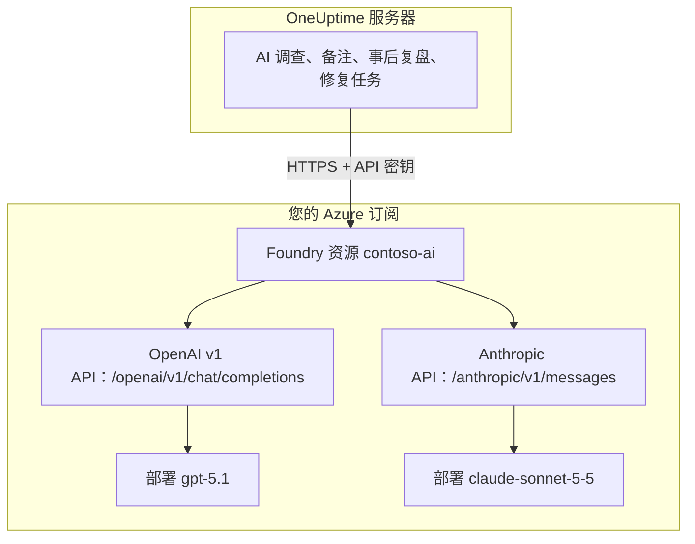

# Microsoft Foundry 与 Azure OpenAI

让 OneUptime 的 AI 功能运行在您部署于 Microsoft Foundry（原名 Azure AI Foundry）或 Azure OpenAI 的模型上。OneUptime 把每个请求直接发送到您 Azure 订阅中的资源，因此提示词和回答都由您选定的部署、在您选定的位置处理。本页带您从一个空订阅走到一个可用的提供商：Azure 资源、模型部署、终结点和密钥、OneUptime 的设置、网络，以及请求失败时该怎么办。

:::cards
- [设置 Azure](#设置-microsoft-foundry): 创建资源、部署模型、复制终结点和密钥。
- [连接 OneUptime](#连接-oneuptime): 在项目设置中填写四个字段，然后点测试按钮。
- [自托管](#用环境变量配置自托管实例): 用环境变量为所有项目注册一个提供商。
- [故障排除](#故障排除): 401、403、找不到部署、api-version。
:::

## 工作原理

OneUptime 从 OneUptime 服务器通过 HTTPS 调用您的 Foundry 资源，从不经由用户的浏览器。每个请求都带有资源的一个 API 密钥，并指明由哪个部署来回答。



一种提供商类型 **Azure OpenAI / Microsoft Foundry** 即可覆盖资源上的所有部署。基础 URL 告诉 OneUptime 要调用哪个 API：

| 您部署的模型 | OneUptime 调用的 API | 基础 URL |
| --- | --- | --- |
| OpenAI 模型，例如 GPT-5.1 和 GPT-4.1 | OpenAI v1 chat completions | `https://contoso-ai.openai.azure.com/openai/v1` |
| 支持 chat completions 的 Foundry Models，例如 DeepSeek 和 Grok | OpenAI v1 chat completions | `https://contoso-ai.services.ai.azure.com/openai/v1` |
| Claude | Anthropic Messages | `https://contoso-ai.services.ai.azure.com/anthropic` |

> [!IMPORTANT]
> OneUptime 的 AI 功能会调用工具：工作时它们会查询您的监控器、事件和遥测数据。请部署支持工具调用（function calling）的模型。提供商的 **测试** 按钮会替您检查这一点。

## 开始之前

您需要一个 Azure 订阅、一个可以创建和读取资源的角色，以及一个可以添加 LLM 提供商的 OneUptime 角色。

| 用途 | 在 Azure 中需要什么 |
| --- | --- |
| 创建资源 | 资源组上的 **Owner** 或 **Contributor**，或 **Foundry Account Owner** |
| 部署模型 | 资源组上的 **Owner** 或 **Contributor**，或资源上的 **Foundry Owner** 或 **Foundry Account Owner**。Claude 还需要订阅 Azure Marketplace 产品的权限 |
| 读取资源的密钥 | 拥有 `Microsoft.CognitiveServices/accounts/listKeys/action` 的角色，例如 **Owner**、**Contributor** 或 **Cognitive Services Contributor** |

OneUptime 本身不需要任何 Azure 角色。一个密钥本身就能访问资源上的所有部署，不经过角色检查，所以请像对待密码一样对待它。

在 OneUptime 中，向项目添加提供商需要 **Project Owner**、**Project Admin**、**Project Member**、**Settings Admin**、**Settings Member** 或 **Create LLM**。自托管实例也可以改用环境变量为所有项目注册一个提供商，这需要能访问服务器。

## 设置 Microsoft Foundry

:::steps
### 创建资源

在 [Foundry 门户](https://ai.azure.com) 中创建一个 Foundry 资源，或选择已有的资源。Azure OpenAI 资源的用法相同。记下资源的名称：它是终结点的第一部分，例如 `https://contoso-ai.openai.azure.com` 中的 `contoso-ai`。

选择提供所需模型的区域。暂时让资源的网络访问对所有网络开放；[网络要求](#网络要求) 说明了何时以及如何关闭它。

### 部署模型

在 Foundry 门户中依次选择 **Discover** 和 **Models**，然后选择一个模型，例如 `gpt-5.1` 或 `claude-sonnet-5-5`。选择 **Deploy**，然后选择 **Custom settings**：

- **Deployment name**：Foundry 会填入模型名称。OneUptime 按这个名称请求部署，所以请准确记下。
- **Deployment type**：决定在哪里处理提示词。请参阅 [数据在哪里处理](#数据在哪里处理)。

选择 **Deploy**，等待部署状态变为 **Succeeded**。

### 复制终结点和一个密钥

在 [Azure 门户](https://portal.azure.com) 中打开资源，然后进入 **Resource Management** > **Keys and Endpoint**。复制 **Endpoint** 和 **KEY 1**。把 **KEY 2** 留作轮换之用：先把 OneUptime 切换到它，再重新生成 **KEY 1**。

在 Foundry 门户中，同一个密钥位于部署的 **Details** 选项卡上，就在其 **Target URI** 旁边。
:::

:::details 更喜欢命令行？
用 Azure CLI 完成同样的步骤。`--model-version` 填写模型目录为该模型列出的版本。

```bash
az cognitiveservices account create \
  --name contoso-ai --resource-group oneuptime-ai \
  --kind AIServices --sku S0 --location eastus2 \
  --custom-domain contoso-ai

az cognitiveservices account deployment create \
  --name contoso-ai --resource-group oneuptime-ai \
  --deployment-name gpt-5.1 \
  --model-name gpt-5.1 --model-version <version> --model-format OpenAI \
  --sku-name GlobalStandard --sku-capacity 50

# KEY 1
az cognitiveservices account keys list \
  --name contoso-ai --resource-group oneuptime-ai \
  --query key1 --output tsv
```

使用 `--custom-domain contoso-ai` 时，资源的终结点是 `https://contoso-ai.openai.azure.com`。
:::

## 连接 OneUptime

:::steps
### 打开 LLM 提供商

前往 **项目设置** > **人工智能** > **LLM 提供商**，然后点击 **创建LLM 提供商**。

### 为提供商命名

在 **基本信息** 中输入 **名称**，例如 `Azure gpt-5.1`，如有需要再输入 **描述**。点击 **下一步**。

### 填写提供商设置

| 字段 | 填写内容 |
| --- | --- |
| **LLM 提供商** | **Azure OpenAI / Microsoft Foundry** |
| **API 密钥** | 资源的 **KEY 1** 或 **KEY 2** |
| **模型名称** | 与 Foundry 显示完全一致的部署名称，例如 `gpt-5.1` |
| **基础 URL** | 资源终结点加上 `/openai/v1`，例如 `https://contoso-ai.openai.azure.com/openai/v1`。Claude 使用：`https://contoso-ai.services.ai.azure.com/anthropic` |

**更多字段** 下的 **设为默认** 已开启：AI 功能使用项目的默认提供商。点击 **创建LLM 提供商**。

### 测试连接

在提供商所在行点击 **测试**。可用的提供商会回答 "Connection successful. The LLM provider responded to a test prompt and used tool calling." 如果测试失败，消息会说明 Azure 返回了什么、需要改什么；请参阅 [故障排除](#故障排除)。
:::

完成后的提供商示例：

```text
名称: Azure gpt-5.1
LLM 提供商: Azure OpenAI / Microsoft Foundry
API 密钥: <contoso-ai 的 KEY 1>
模型名称: gpt-5.1
基础 URL: https://contoso-ai.openai.azure.com/openai/v1
```

从现在起，项目的 AI 功能就使用这个部署。在 OneUptime Cloud 上，这些请求不从项目的 AI 额度中扣费，而由 Azure 计入您的订阅账单。

## 基础 URL 的格式

OneUptime 接受 Azure 门户和 Foundry 门户所显示的各种形式的终结点，并把每个请求发送到右侧的地址。请优先使用简短的形式：基础 URL 最多可容纳 100 个字符。

| 基础 URL | 请求发往 |
| --- | --- |
| `https://contoso-ai.openai.azure.com` | `https://contoso-ai.openai.azure.com/openai/v1/chat/completions` |
| `https://contoso-ai.openai.azure.com/openai/v1` | `https://contoso-ai.openai.azure.com/openai/v1/chat/completions` |
| `https://contoso-ai.services.ai.azure.com/openai/v1` | `https://contoso-ai.services.ai.azure.com/openai/v1/chat/completions` |
| `https://contoso-ai.openai.azure.com/openai/deployments/gpt-4o` | `https://contoso-ai.openai.azure.com/openai/deployments/gpt-4o/chat/completions?api-version=2024-10-21` |
| `https://contoso-ai.services.ai.azure.com/anthropic` | `https://contoso-ai.services.ai.azure.com/anthropic/v1/messages` |

- **v1 API**（`/openai/v1`）是 Microsoft 当前的 API。它不需要 `api-version`，把部署名称当作模型，同样服务于 OpenAI 模型和其他 Foundry Models。新的提供商请使用它。
- **部署 URL**（`/openai/deployments/<name>`）本身就指明了部署，Azure 以这个名称为准，而不是 **模型名称**。除非基础 URL 自带 `api-version`，否则 OneUptime 会加上 `api-version=2024-10-21`。以这种方式保存的提供商照常工作。
- **部署的 Target URI** 从 Foundry 门户整段粘贴也可以使用，只要不超过 100 个字符。
- **Claude**：Foundry 只通过 Anthropic Messages API 提供 Claude，位于资源的 `/anthropic` 路径下。OneUptime 使用同一个密钥调用它。提供商类型 **Anthropic** 用同样的基础 URL 也能访问它。

## 用环境变量配置自托管实例

在自托管实例上，`GLOBAL_LLM_PROVIDER_*` 变量会在启动时注册一个全局 LLM 提供商，所有没有自有提供商的项目都会使用它，AI 修复任务也不例外。项目自己的提供商始终优先。

```bash
GLOBAL_LLM_PROVIDER_TYPE=AzureOpenAI
GLOBAL_LLM_PROVIDER_NAME=Azure gpt-5.1
GLOBAL_LLM_PROVIDER_BASE_URL=https://contoso-ai.openai.azure.com/openai/v1
GLOBAL_LLM_PROVIDER_MODEL_NAME=gpt-5.1
GLOBAL_LLM_PROVIDER_API_KEY=<KEY 1 of contoso-ai>
```

:::tabs
@tab Docker Compose
把变量添加到 `config.env`，然后按您当初启动的方式重新启动 OneUptime：

```bash
(export $(grep -v '^#' config.env | xargs) && docker compose up --remove-orphans -d)
```
@tab Kubernetes
把密钥保存在 Secret 中，并通过图表全局的 `extraEnv` 传入变量：

```bash
kubectl create secret generic azure-foundry \
  --namespace oneuptime --from-literal=api-key='<KEY 1 of contoso-ai>'
```

```yaml title="values.yaml"
extraEnv:
  - name: GLOBAL_LLM_PROVIDER_TYPE
    value: AzureOpenAI
  - name: GLOBAL_LLM_PROVIDER_NAME
    value: Azure gpt-5.1
  - name: GLOBAL_LLM_PROVIDER_BASE_URL
    value: https://contoso-ai.openai.azure.com/openai/v1
  - name: GLOBAL_LLM_PROVIDER_MODEL_NAME
    value: gpt-5.1
  - name: GLOBAL_LLM_PROVIDER_API_KEY
    valueFrom:
      secretKeyRef:
        name: azure-foundry
        key: api-key
```

然后用这些值运行 `helm upgrade`。
:::

提供商跟随变量变化：修改变量后，它会在下次启动时更新；移除 `GLOBAL_LLM_PROVIDER_TYPE` 后，它会被删除。如果这种类型缺少密钥或基础 URL，启动日志会指出。所有变量和提供商类型请参阅 [LLM 提供商](/docs/ai/llm-provider)。

## 网络要求

OneUptime 服务器会通过 443 端口，向资源的主机名（例如 `contoso-ai.openai.azure.com` 或 `contoso-ai.services.ai.azure.com`）建立 HTTPS 连接。请在防火墙或代理中放行这些出站流量。

- **OneUptime Cloud** 通过互联网访问资源，因此资源必须接受公共流量。要让资源不暴露在互联网上，请自托管 OneUptime。
- **自托管，专用终结点**：把资源放在 OneUptime 服务器可以访问的虚拟网络中的专用终结点之后，并把专用 DNS 区域 `privatelink.openai.azure.com`、`privatelink.services.ai.azure.com` 和 `privatelink.cognitiveservices.azure.com` 链接到该网络，使资源平常的主机名解析为其专用地址。基础 URL 保持不变。
- **专用地址**：除非设置了 `DATA_SOURCE_BLOCK_PRIVATE_ADDRESSES=true`，自托管实例会连接专用地址。全局 LLM 提供商在任何情况下都会连接它们。
- **资源上的网络规则**：在资源的 **Networking** 中，**Selected networks and private endpoints** 会挡住其他所有流量。被规则拒绝的请求会以 403 失败。

## 数据在哪里处理

部署模型时选择的部署类型，决定 Azure 在哪里处理 OneUptime 的提示词和模型的回答。静态存储的数据保留在资源所在的 Azure 地域内。

| 部署类型 | 提示词和回答的处理位置 |
| --- | --- |
| Global Standard, Global Provisioned | 任意 Azure 区域 |
| Data Zone Standard, Data Zone Provisioned | 仅在数据区域内：美国、欧盟或亚太 |
| Standard, Regional Provisioned | 资源所在的 Azure 地域内 |

Claude 部署分为 **Hosted on Azure** 和 **Hosted on Anthropic** 两种。选择 **Hosted on Azure** 可让提示词和回答留在 Azure 内。详情请参阅 Microsoft 的 [部署类型](https://learn.microsoft.com/en-us/azure/foundry/foundry-models/concepts/deployment-types)。

## 请求和响应示例

要在 OneUptime 之外检查某个部署，请用 `curl` 向它发送 OneUptime 所发送的请求：

:::tabs
@tab OpenAI v1 API
```bash
curl https://contoso-ai.openai.azure.com/openai/v1/chat/completions \
  -H "Content-Type: application/json" \
  -H "api-key: $AZURE_API_KEY" \
  -d '{
    "model": "gpt-5.1",
    "messages": [
      { "role": "user", "content": "Reply with the word: OK" }
    ]
  }'
```

响应（已删节）：

```json
{
  "id": "chatcmpl-7R1nGnsXO8n4oi9UPz2f3UHdgAYMn",
  "object": "chat.completion",
  "model": "gpt-5.1",
  "choices": [
    {
      "index": 0,
      "finish_reason": "stop",
      "message": { "role": "assistant", "content": "OK" }
    }
  ],
  "usage": { "prompt_tokens": 12, "completion_tokens": 2, "total_tokens": 14 }
}
```
@tab Anthropic API
```bash
curl https://contoso-ai.services.ai.azure.com/anthropic/v1/messages \
  -H "Content-Type: application/json" \
  -H "x-api-key: $AZURE_API_KEY" \
  -H "anthropic-version: 2023-06-01" \
  -d '{
    "model": "claude-sonnet-5-5",
    "max_tokens": 1024,
    "messages": [
      { "role": "user", "content": "Reply with the word: OK" }
    ]
  }'
```

响应（已删节）：

```json
{
  "id": "msg_01XFDUDYJgAACzvnptvVoYEL",
  "type": "message",
  "role": "assistant",
  "model": "claude-sonnet-5-5",
  "content": [{ "type": "text", "text": "OK" }],
  "stop_reason": "end_turn",
  "usage": { "input_tokens": 14, "output_tokens": 4 }
}
```
:::

OneUptime 自己的请求包含更多内容：它的指令、对话、模型可以调用的工具，以及令牌上限。它从回答中读取文本、工具调用、模型停止的原因和令牌用量，这些用量会在 **项目设置** > **人工智能** > **AI 日志** 中逐个请求列出。提供商的 **附加参数** 会加入每个请求。

## Microsoft Entra ID 与不使用密钥的资源

OneUptime 使用资源的一个 API 密钥登录资源。尚不支持以服务主体或托管标识通过 Microsoft Entra ID 登录。

如果您的组织为 AI 资源关闭了密钥访问（`disableLocalAuth`），请求会以 `AuthenticationTypeDisabled` 失败。请在 OneUptime 使用的资源上允许密钥访问，或者在资源前面放置 Azure API Management：

1. 把资源的部署作为 Azure OpenAI API 导入 API Management。之后 API Management 会用自己的托管标识登录资源。
2. 把该 API 的订阅密钥标头名称设为 `api-key`。
3. 在 OneUptime 中，把 **基础 URL** 设为 API Management 中该部署对应的 API 地址，例如 `https://contoso-apim.azure-api.net/aoai/openai/deployments/gpt-5.1`，并像任何部署 URL 一样带上部署所需的 `api-version`。把 **API 密钥** 设为一个 API Management 订阅密钥。

只接受 Microsoft Entra ID 的 Claude 模型（例如 Claude Mythos）暂时还不能使用。

## 故障排除

OneUptime 会把需要修改的内容放在错误的开头，后面跟着 Azure 自己的回答。**测试** 按钮显示完整的错误；**AI 日志** 保存前 490 个字符。

:::details "Azure did not accept the API key" (401)
密钥错误、已重新生成，或属于另一个资源。请从基础 URL 所指资源的 **Keys and Endpoint** 重新复制 **KEY 1**，并粘贴到 **API 密钥** 中。
:::

:::details "Key-based authentication is turned off for this resource" (403)
Azure 返回了 `AuthenticationTypeDisabled`：该资源只接受 Microsoft Entra ID。请参阅 [Microsoft Entra ID 与不使用密钥的资源](#microsoft-entra-id-与不使用密钥的资源)。
:::

:::details "Azure refused the request" (403)
资源上的网络规则挡住了请求。请对照 [网络要求](#网络要求) 检查资源的 **Networking** 设置。
:::

:::details "This resource has no deployment named ..." (404)
Azure 返回了 `DeploymentNotFound`。请把 **模型名称** 设为与 Foundry 门户所列完全一致的部署名称。几分钟内刚创建的部署可能还没就绪。如果基础 URL 是部署 URL，需要检查的是 `/openai/deployments/` 后面的名称。
:::

:::details "Azure found nothing at this address" (404)
基础 URL 没有指向任何 Azure OpenAI API。请使用资源终结点加 `/openai/v1`，例如 `https://contoso-ai.openai.azure.com/openai/v1`。已停用的 Azure AI Inference SDK 的模型推理终结点（`/models`）不属于此类：请在同一资源上使用 `/openai/v1`。
:::

:::details "This model needs api-version ... or later" (400)
部署 URL 在未指定其他版本时会请求 `api-version=2024-10-21`，而较新的模型（例如 o 系列和 GPT-5）会拒绝这么旧的版本。请把基础 URL 改为 v1 API `https://contoso-ai.openai.azure.com/openai/v1`，并把部署名称填入 **模型名称**。或者把 Azure 给出的版本（例如 `?api-version=2024-12-01-preview`）加到基础 URL 上。
:::

:::details "Azure's v1 API takes no dated api-version" (400)
基础 URL 以 `/openai/v1` 结尾，同时还带有带日期的 `api-version`。请从基础 URL 中删除 `api-version`。
:::

:::details "基础 URL 不能超过 100 个字符。"
带 `api-version` 的 Target URI 往往比这更长。请使用资源终结点加 `/openai/v1`，并把部署名称填入 **模型名称**。
:::

:::details "...could not be reached" 或 "...host name could not be resolved"
OneUptime 服务器无法连接到资源。在 OneUptime Cloud 上，资源必须能从互联网访问。在自托管实例上，请检查服务器能否解析资源的主机名（使用专用终结点时通过专用 DNS 区域），以及是否允许出站 HTTPS。
:::

:::details 请求过多 (429)
部署的每分钟令牌配额已用完。AI 功能会等待后重试，在约五分钟内最多尝试十次，然后才报告失败；**测试** 按钮会更早放弃。请在 Foundry 门户中提高部署的配额，或把它改为其他部署类型。
:::

## 后续步骤

:::cards
- [LLM 提供商](/docs/ai/llm-provider): 所有提供商类型，以及项目如何选用其中之一。
- [AI SRE](/docs/ai/ai-sre): 使用此提供商运行的调查。
- [Ask AI](/docs/ai/ask-ai): 关于您系统的问题，在仪表板中获得回答。
:::
