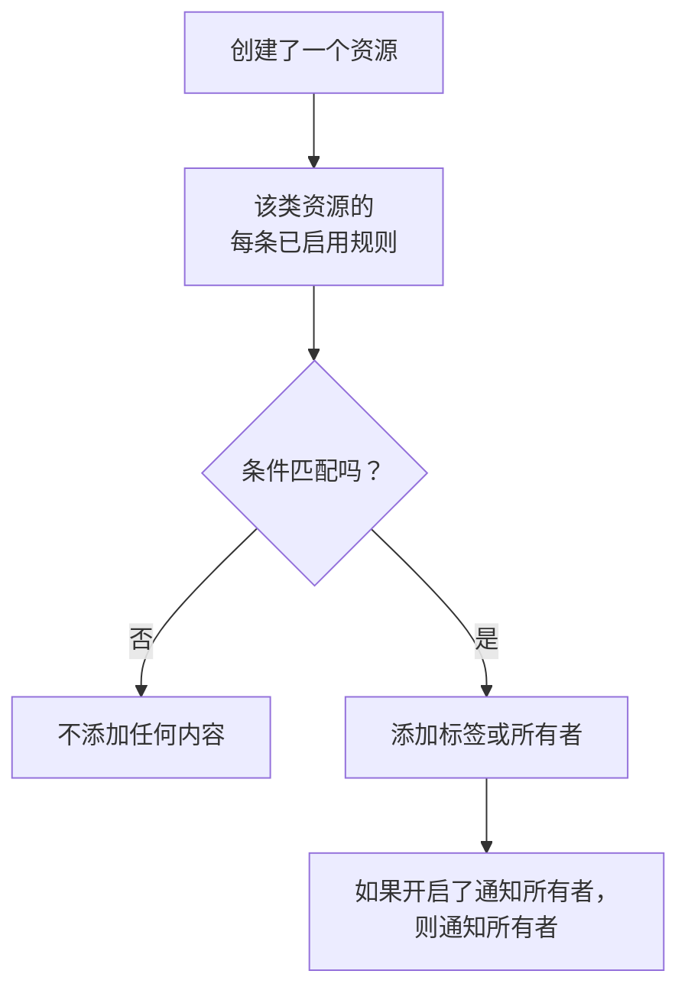

# 标签与所有者规则

标签规则和所有者规则会替您整理资源。**标签规则** 会给每个与之匹配的新资源打上标签，**所有者规则** 会把用户和团队添加为该资源的所有者。这样，一个新的数据库事件就会被打上 _Database_ 标签并归数据库团队所有，而无需任何人记着去做。

:::cards
- [创建规则](#创建规则): 两个步骤：先选规则匹配什么，再选它添加什么。
- [继承标签和所有者](#继承标签和所有者): 沿用事件的监视器、主机和服务所带的标签和所有者。
- [规则何时运行](#规则何时运行): 对新资源运行，对已有资源使用 **Run Now**。
:::

## 工作原理

规则在资源创建时运行。每条已启用的规则都会用自己的条件检查新资源，每条匹配的规则都会添加它要添加的内容。

标签和所有者决定了您如何筛选和分组资源、OneUptime 就这些资源通知谁，以及 [按标签限定和按所有权限定的权限](/docs/permissions/index) 能覆盖哪些资源。规则让它们保持一致，而无需任何人记着去做。

## 在哪里找到规则

每个带有标签和所有者的产品都有这两种规则，位于其 **设置** 下（在事件、警报和计划维护中位于 **规则** 下）：监视器、事件和事件片段、警报和警报片段、计划维护事件、状态页面、服务、主机、Kubernetes 集群、Docker 主机、Docker Swarm 集群、Podman 主机、Proxmox 集群、VMware vCenter、Ceph 集群、存储阵列、数据库、队列、IoT 设备群、无服务器函数、云资源、RUM 应用程序、仪表板、值班策略、值班计划、来电策略、工作流、运行手册、网络设备和 SLO。

例如，监视器标签规则位于 **监视器 → 设置 → 标签规则**，事件标签规则位于 **事件 → 规则 → 标签规则**。**设置** 和 **规则** 在侧边菜单中默认折叠：点击该部分的标题即可展开。事件和警报页面有一个 **Incident Rules**（或 **Alert Rules**）选项卡和一个 **Episode Rules** 选项卡。

## 创建规则

每条标签规则和所有者规则都以同样的方式分两步创建。

:::steps
### 打开规则列表

打开产品的 **标签规则** 或 **所有者规则** 页面，点击以规则命名的创建按钮，例如 **创建Monitor Label Rule**。

### 选择规则匹配什么

在 **匹配** 步骤中，为资源必须满足的每个条件点击一次 **添加条件**。有两个或更多条件时，选择 **匹配全部** 或 **匹配任一**。没有条件的规则会匹配每个新资源。

### 选择规则添加什么

在 **标签** 步骤中，选择 **要添加的标签**。在所有者规则中，这一步是 **所有者**：**添加所有者** 会打开一个包含人员和团队的列表。

**名称** 会根据您的选择自动填写（*添加 Production*、*将 Platform 添加为所有者*），并随您的选择而变化，直到您输入自己的名称。只做继承的规则则以其继承来源命名（见下文）。

### 检查折叠的字段

**更多字段** 中有可选的 **描述**，在所有者规则中还有默认开启的 **通知所有者**：规则添加的所有者会收到与手动添加的所有者相同的“您已被添加为所有者”通知。关闭它即可静默添加所有者。

### 保存规则

在最后一步，再次点击以规则命名的按钮，例如 **创建Monitor Label Rule**。规则创建后即为启用状态，列表中会显示绿色的 **已启用** 标记。
:::

新规则必须添加一些内容：至少一个标签（或所有者），或者在事件、警报或计划维护规则中，至少继承一项内容（见下文）。要暂停规则而不删除它，请在其编辑表单中关闭 **已启用**；列表随后会显示红色的 **已禁用** 标记。

### 无论规则如何创建

通过 API、Terraform、工作流或 [标签规则导入](/docs/configuration/label-rule-import-export) 创建的规则也是如此：OneUptime 会拒绝不添加任何内容的新规则，并返回一条说明需要填写哪些字段的消息。无论使用哪种语言，这些消息都以英文显示。

| 规则 | 消息 |
| --- | --- |
| 标签规则 | This label rule adds nothing. Choose at least one label in Labels to Add. |
| 事件、警报或计划维护标签规则 | This label rule adds nothing. Choose at least one label in Labels to Add, or turn on an Inherit Labels switch. |
| 所有者规则 | This owner rule adds nothing. Choose at least one user or team in Owner Users or Owner Teams. |
| 事件、警报或计划维护所有者规则 | This owner rule adds nothing. Choose at least one user or team in Owner Users or Owner Teams, or turn on an Inherit Owners switch. |

- **API**：将 `labelsToAdd`（或 `ownerUsers` / `ownerTeams`）设置为项目中的至少一条记录，或将规则的某个 `inheritLabelsFrom…`（`inheritOwnersFrom…`）开关设置为 `true`（JSON 布尔值）。
- **Terraform**：没有任何添加内容的标签规则或所有者规则资源会在 `terraform apply` 时失败，并显示上述消息。请为其设置 `labels_to_add`（或 `owner_users` / `owner_teams`），或开启其某个继承开关。

已有的规则不受影响，请参阅 [编辑规则](#编辑规则)。

## 继承标签和所有者

事件、警报和计划维护规则还可以沿用事件所涉及资源上的标签和所有者。在 **要添加的标签**（或 **所有者**）下方，折叠的 **继承标签**（或 **继承所有者**）部分包含六个开关：

- **从监视器继承标签**：事件的监视器上的每个标签也会附加到事件上。警报只有一个监视器，因此在警报规则中该开关为 **从监视器继承标签**（在警报所有者规则中为 **从监视器继承所有者**）。
- **从主机继承标签**、**从 Kubernetes 集群继承标签**、**从 Docker 主机继承标签**、**Inherit Labels From Podman Hosts** 和 **从服务继承标签** 对相应资源执行同样的操作。

所有者规则也有同样的六个开关，用于所有者（**从监视器继承所有者** 等）。在没有开启任何开关时，折叠的部分会说明其用途；在会继承的规则上，它会自动展开。片段规则没有继承开关。

会继承的规则可以让 **要添加的标签**（或 **所有者**）保持为空：它会添加继承到的内容。这样的规则以其继承来源命名：

| 开启的开关 | 名称 |
| --- | --- |
| **从监视器继承标签** | *从 监视器 继承标签* |
| **从监视器继承标签** 和 **从主机继承标签** | *从 监视器, 主机 继承标签* |
| 警报规则上的 **从监视器继承标签** | *从 监视器 继承标签* |

名称会随开关而变化，直到您选择一个标签（之后规则会以其标签命名）或输入自己的名称。

## 编辑规则

规则的编辑表单有同样的两个步骤，并多了 **已启用** 开关。它不强制要求规则添加内容：在 OneUptime 开始要求之前通过 API、Terraform、导入或旧表单保存的规则可能什么都不添加，而编辑也可能去掉规则添加的所有内容。

这样的规则仍然可以重命名、关闭或删除，也可以通过 API 和 Terraform 进行。列表会在不添加任何内容的规则的状态旁标记 **不添加任何内容**，规则自己的页面也会如此标记。请编辑它以选择要添加的内容，或将其删除。

## 规则何时运行

每条已启用的规则都会在资源创建时运行，无论资源是从仪表板还是通过 API 创建的，每条匹配的规则都会添加它要添加的内容：

- 多条匹配的规则会添加它们所有的标签和所有者。
- 规则从不删除任何内容：既不删除别人手动添加的标签或所有者，也不删除它自己添加的。
- 已禁用的规则什么也不做。

您今天编写的规则适用于此后创建的资源。要将其应用于已有资源，请使用 **Run Now**，请参阅 [对现有资源运行规则](/docs/configuration/run-rules-now)。标签规则还可以在项目之间复制，请参阅 [导入和导出标签规则](/docs/configuration/label-rule-import-export)。

## 后续步骤

:::cards
- [对现有资源运行规则](/docs/configuration/run-rules-now): 将规则应用于您已有的资源。
- [导入和导出标签规则](/docs/configuration/label-rule-import-export): 以 JSON 格式在项目之间复制标签规则。
- [事件设置与自动化](/docs/incidents/settings): 事件可以运行的其他规则。
- [SLO 标签和所有者规则](/docs/slo/label-and-owner-rules): SLO 规则匹配什么。
:::
