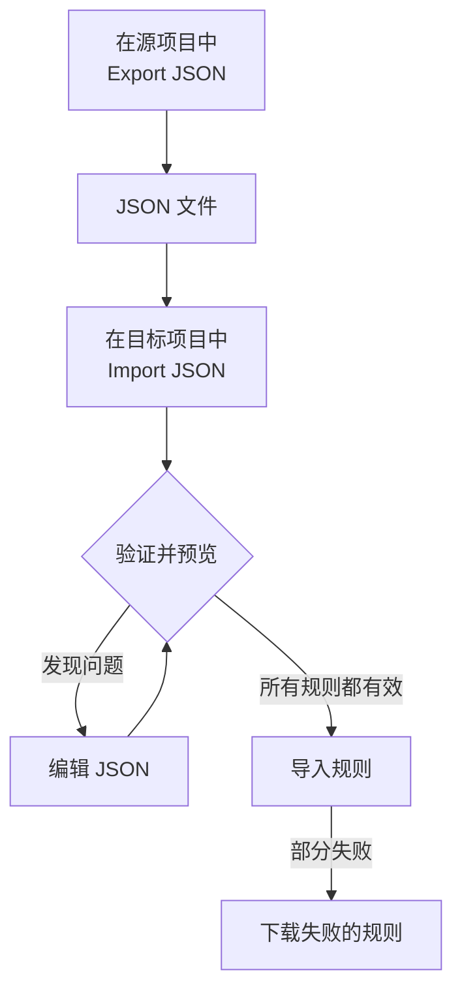

# 导入和导出标签规则

以 JSON 文件的形式在项目之间复制标签规则，或一次创建多条规则。每个 **标签规则** 页面的 **更多选项**（**⋯**）菜单中都有 **Export JSON** 和 **Import JSON** 操作，包括事件、警报、监视器和网络设备。唯一的例外是 VMware：它的 vCenter 标签规则两者都没有。



## 导出规则

打开 **更多选项** 并选择 **Export JSON**，即可下载当前项目中该类型的所有规则。导出包括表格其他页上的规则，并忽略表格筛选条件。

文件会保留每条规则的启用状态、条件、要添加的标签和标签继承选项。项目 ID、规则 ID 和审计字段不会包含在内。

关联的标签、监视器和严重程度以其确切名称写入。导入不会创建它们：它们必须已存在于目标项目中。

## 导入规则

:::steps
### 打开 Import JSON

打开目标项目的 **标签规则** 页面，选择 **更多选项 → Import JSON**。

### 添加文件

上传 JSON 导出文件，或粘贴其内容。

### 验证并预览

选择 **Validate and preview**。在创建任何规则之前会检查每条规则，并且所引用的资源必须以唯一且匹配的名称存在于目标项目中。

### 查看预览

检查规则名称、启用状态、标签和条件。规模较大的批次会分页显示。要更正内容，请选择 **Edit JSON** 并重新验证。

### 导入

选择显示规则数量的导入按钮（例如 **Import 2 rules**），并保持窗口打开，直到出现结果。
:::

导入会添加新规则并保留现有规则，因此再次导入同一文件会再创建一份副本。每条规则都适用常规的创建权限和服务器验证。

如果部分规则失败，请选择 **Download failed rules** 只保存这些行，更正后再次导入该文件。如果请求超时，请在重试前检查规则列表：服务器可能在响应丢失之前已经保存了规则。

## 用 JSON 创建批次

导出一条现有规则以获得适合您资源类型的示例，然后在 `items` 数组中编辑或添加条目。此示例创建两条监视器标签规则。标签 `Production` 和 `Infrastructure` 必须已存在于目标项目中。

```json title="monitor-label-rules.json"
{
  "fileType": "oneuptime-label-rules",
  "schemaVersion": 1,
  "resourceType": "MonitorLabelRule",
  "items": [
    {
      "name": "Production API monitors",
      "description": "Label production API monitors automatically",
      "isEnabled": true,
      "monitorNamePattern": "^api-prod-",
      "monitorLabels": [],
      "labelsToAdd": ["Production"]
    },
    {
      "name": "Database monitors",
      "isEnabled": false,
      "monitorNamePattern": "^database-",
      "labelsToAdd": ["Infrastructure"]
    }
  ]
}
```

| 字段 | 内容 |
| --- | --- |
| `fileType` | 始终为 `oneuptime-label-rules`。 |
| `schemaVersion` | 始终为 `1`。 |
| `resourceType` | 文件中规则的类型，例如 `MonitorLabelRule`。 |
| `items` | 规则，每条规则一个对象。文件中至少需要一条。 |

`isEnabled` 使用 JSON 布尔值，模式使用文本，关联资源使用名称数组。

以下情况会在导入步骤之前使整个批次停止：无效的模式、未知字段、缺少名称以及有歧义的引用。不添加任何内容的规则（`labelsToAdd` 为空，并且在事件、警报或计划维护规则中没有任何 `inheritLabelsFrom…` 开关设置为 `true`）也会如此，因为 OneUptime 拒绝创建这样的规则（请参阅 [标签与所有者规则](/docs/configuration/label-and-owner-rules#无论规则如何创建)）。如果这样的规则是在该检查出现之前保存的，导出中可能会包含它；请在导入前为其添加标签，或将其从文件中删除。

> [!NOTE]
> 文件和粘贴的 JSON 限制为 10 MB。

## 在资源类型之间复制

在文件中保留原始的 `resourceType`，并在目标页面上打开 **Import JSON**。兼容的主名称或标题模式、描述模式和前提标签会映射到目标的字段，预览会列出这些映射以便您检查。事件和警报的严重程度引用会与目标的严重程度名称进行匹配。

目标不支持的条件或操作会阻止导入。例如，限定于特定监视器的事件规则，在不编辑这些条件的情况下无法复制为网络设备规则。

> [!WARNING]
> 网络设备和 SLO 标签规则除正则表达式外还支持通配符匹配。在这些规则与其他类型的规则之间转移时，包含 `*` 或首尾空白的模式会被拒绝，因为它们在那里的匹配方式不同。请为目标编辑这些模式，或在同一资源类型内使用该规则。网络设备和 SLO 标签规则的匹配方式相同，因此它们之间可以互换任何模式。

## 后续步骤

:::cards
- [标签与所有者规则](/docs/configuration/label-and-owner-rules): 标签规则匹配什么、添加什么。
- [对现有资源运行规则](/docs/configuration/run-rules-now): 将导入的规则应用于您已有的资源。
:::
