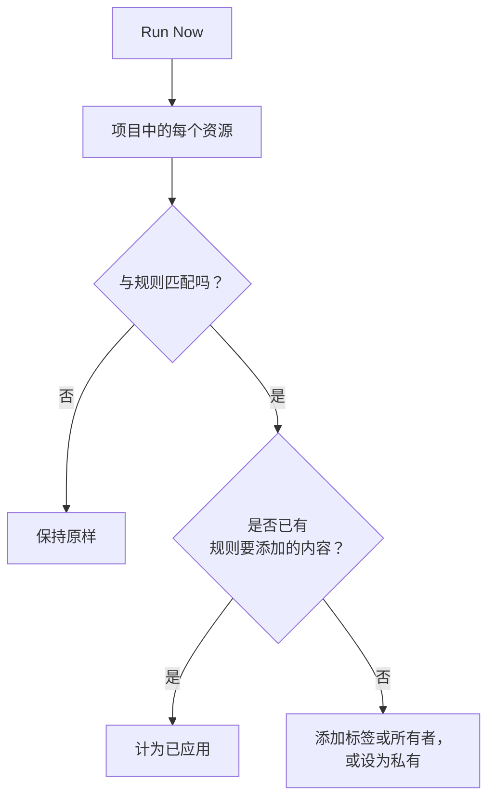

# 对现有资源运行规则

标签规则、所有者规则和隐私规则会在资源 **创建** 时自动运行。因此，您今天编写的规则不会对已有的监视器、事件或主机产生任何作用。**Run Now** 弥补了这一空缺：它将一条规则应用于项目中已存在的每个资源。

## 可以运行哪些规则

- **标签规则** 和 **所有者规则**，适用于所有具有这些规则的资源：监视器、事件、事件片段、警报、警报片段、计划维护事件、状态页面、服务、主机、Kubernetes 集群、Docker 主机、Docker Swarm 集群、Podman 主机、Proxmox 集群、VMware vCenter、Ceph 集群、存储阵列、数据库、队列、IoT 设备群、无服务器函数、云资源、RUM 应用程序、仪表板、值班策略、值班计划、来电策略、工作流、运行手册、网络设备和 SLO。
- **隐私规则**，适用于事件、警报、事件片段和警报片段。
- 状态页面上的 **Monitor Rules**。每次保存规则时，它们都会重新同步页面；运行它会立即重新同步。
- SLO 上的 **Monitor Rules**。每次保存规则时，它们都会重新同步 SLO；运行它会立即重新同步 SLO 的监视器。请参阅 [监视器与监视器规则](/docs/slo/monitor-rules)。

执行操作而非描述资源的规则（**值班规则**、**Runbook 规则**、**自动补救规则** 和 **分组规则**）无法针对现有记录运行。运行它们会为已经结束的事件呼叫人员、执行运行手册、启动修复或重新组织片段。

## 开始之前

要运行规则，您需要编辑该规则的权限 **和** 编辑它所更改资源的权限。例如，监视器标签规则既需要监视器标签规则的编辑权限，也需要监视器的编辑权限。所有者规则还需要添加所有者的权限。状态页面或 SLO 上的监视器规则只需要编辑该规则的权限。

> [!IMPORTANT]
> 仅限于特定标签或您所拥有资源的权限是不够的：一次运行可能会更改项目中的每个资源。团队阻止列表的作用与其他地方相同，仅限于某些标签的阻止也会被计入：运行会更改带有这些标签的资源，因此，如果对规则所更改资源的编辑设有带标签的阻止，运行将被拒绝。

在已有设备上运行网络的规则时，要求也一样。站点分配规则或设备标签规则的 **Run Now** 需要编辑该规则的权限和 **Edit Network Device**。自动导入规则的 **Dry Run** 和 **Run Rule** 需要编辑该规则的权限、**Create Network Device**，以及在规则带有监视器模板时的 **Create Monitor**。每项权限都必须覆盖整个项目。请参阅 [使用自动导入规则自动导入](/docs/monitor/network-device-monitor#importing-automatically-with-auto-import-rules)。

## 运行一条规则

:::steps
### 打开规则列表

打开规则页面，例如 **监视器 → 设置 → 标签规则**。

### 选择 Run Now

打开规则所在行末尾的 **⋯** 菜单并选择 **Run Now**，或选择 **查看**，然后在规则自己的页面上选择 **Run Now**。对话框会说明这次运行将做什么。

### 选择是否通知新所有者

对于所有者规则，选择是否开启 **Notify the owners this run adds**。它默认关闭，并且只有在规则本身开启了 **通知所有者** 时才会生效。所有者每被添加到一个资源，就会收到一次通知。

### 运行规则

选择 **Run Rule** 并保持对话框打开。在大型项目中，对话框会显示运行的进度。

### 阅读报告

运行完成后，对话框会报告规则匹配了多少资源、更改了多少资源，以及有多少资源已经具有规则要添加的内容。
:::

## 运行多条规则

在表格中选择规则，打开批量操作菜单并选择 **Run Now**。所选规则会依次运行。

- 批量运行添加的所有者永远不会收到通知。要通知他们，请改为单独运行一条规则。
- 无法运行的规则（例如因为已禁用）会连同原因一起列出，其他规则仍会运行。

## 运行会做什么

- **它只做添加。** 附加标签、添加所有者、将资源设为私有。不会删除任何内容，也不会将任何内容设为公开，因此再次运行规则是安全的：第二次运行会报告所有内容都已应用。
- **会评估项目中的每个资源**，包括已解决的事件和警报。
- **会跳过现有所有者**，绝不会重复添加。
- **只添加您项目自己的标签。** 规则指定的标签如果已不再是项目的标签，就会被跳过，规则的其他标签仍会添加。规则在新资源上运行时也是如此。
- **规则的应用方式与创建时相同**，包括从事件的监视器、主机和服务继承的标签和所有者。如果资源有活动动态，动态中会记录是哪条规则更改了它。
- **已禁用的规则不会运行。** 请先启用该规则。
- **状态页面监视器规则** 会添加它们匹配的监视器，并移除它们之前添加但已不再匹配的监视器。手动添加到页面的监视器永远不会被改动。
- **一次运行最多覆盖 100,000 个资源。** 在更大的项目中，运行会停止并给出提示；再次运行该规则即可继续。

## 后续步骤

:::cards
- [标签与所有者规则](/docs/configuration/label-and-owner-rules): 编写运行所应用的规则。
- [导入和导出标签规则](/docs/configuration/label-rule-import-export): 先从另一个项目导入标签规则。
- [事件设置与自动化](/docs/incidents/settings): 事件规则，包括隐私规则。
:::
