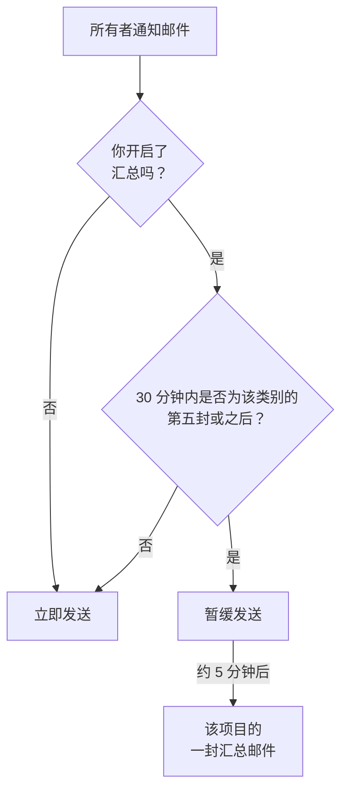

# 通知汇总

一旦出了大问题，往往不止出一次。一条不稳定的上游链路会让 40 个监视器宕机，40 个事件被宣布、确认再解决，而每位所有者在每一步都会收到一封邮件：一个收件箱里塞进 200 封邮件，再也没人去读。

OneUptime 会自动把这类集中爆发的通知汇总成一封邮件。它对所有人默认开启，无需任何配置；但如果你更希望每条通知都单独发一封邮件，可以按项目[为自己关闭汇总](#为自己关闭汇总)。

:::cards
- [工作原理](#工作原理): 前四封邮件立即发出，其余的一起送达。
- [永远不会被汇总的内容](#永远不会被汇总的内容): 值班呼叫、安全、账单和订阅者邮件。
- [关闭汇总](#为自己关闭汇总): 重新让每条通知单独成一封邮件。
- [减少例行邮件](#进一步减少邮件): 一次性关闭信息类邮件。
:::

## 工作原理

你收到的每一封所有者通知邮件都会计入一个小额度，这个额度按项目、收件人、邮箱地址和资源**类别**分别计算，类别包括事件、警报、监视器、计划维护、状态页面、探测器、SLO 等。



- 在任意 30 分钟窗口内，同一类别的**前四封**邮件会立即发送，与以往完全一样：相同的主题、相同的模板、相同的链接。
- 该窗口内的**第五封及之后**的邮件会被暂缓发送。
- 大约五分钟后，该项目中为你暂缓的所有通知（跨所有类别）会合并成**一封**邮件送达，列出发生了什么，并附上每个资源的链接。

汇总只包含发送时你仍然订阅的通知。如果某个事件的通知还在队列中时你关闭了它的邮件，这些通知就会从汇总中去掉。之后重新开启邮件，也不会补发这些被跳过的更新。

未达到阈值时，这个功能什么也不做。一个每天只产生三封所有者邮件的项目，仍然会把这三封邮件分别发送。

## 汇总邮件长什么样

打开之前，主题行就能告诉你这场通知风暴的规模*和类型*：

```text
[Acme Production] 112 notifications: 63 Monitors, 41 Incidents, 6 Alerts +2 more
```

邮件开头的摘要卡片给出总数、汇总覆盖的时间范围以及按类别的分布。其下按类别分成若干部分，最紧急的在前：先是事件，然后是警报，再是发现它们的监视器和探测器。因此摘要下面的第一项，就是最值得先点开的那一项。

每个部分按资源而不是按事件各占一行：

- **每一行显示资源的最终状态。** 如果一个事件先被创建、再被确认、最后被解决，它只占一行，显示最新状态，这让汇总比三封单独的邮件*更*及时。
- **数字对得上。** 每一行都标明最近一次更新的时间，合并了多条更新的行会注明条数，因此各部分与摘要卡片的总数始终一致。
- **显示严重程度和状态。** 警报和事件卡片会显示其最新通知中的严重程度和状态，包括自定义名称。缺少这些信息的旧排队通知仍会显示，只是省略缺失的标签。

时间以 UTC 显示；汇总跨越多天时还会显示日期。


## 永远不会被汇总的内容

汇总只影响所有者和成员通知，也就是“你负责的东西发生了变化”这一类。它位于这些通知唯一经过的代码路径中，其他通知都不经过那里，所以它影响不到任何其他内容。

永不延迟，也永不计数：

| 类别 | 示例 |
| ----------------------------------------- | ---------------------------------------------------------------------------------------------------- |
| 值班呼叫 | 每一次升级策略呼叫，以及每一次确认请求 |
| 值班时间 | “你现在正在值班”“下一个值班的是你”“你的班次即将开始”“你的班次已被重新分配” |
| 账号安全 | 重置密码、验证邮箱、密码已更改、双重验证备用码被使用或重新生成 |
| 关于你账号的管理通知 | 管理员更改了你的通知方式或值班规则 |
| 账单与余额 | 发票、订阅逾期、“由于银行卡被拒，我们无法呼叫任何人” |
| 实例健康 | 发给实例管理员的 Postgres、Valkey 和 ClickHouse 警告 |
| 状态页面订阅者 | 你的状态页面发给你自己的订阅者的每一封邮件 |
| SLA 违约 | 虽然复用了“事件已创建”通知类型，但会立即发送 |

只有邮件受影响。短信、电话、推送通知、WhatsApp、Telegram、Slack、Microsoft Teams 和 Webhook 都会立即送达，与以往完全相同，即使是邮件被暂缓的那些通知也一样。

## 限制

| 限制 | 值 |
| --- | --- |
| 一封汇总邮件中的通知数 | 最多 **500** 条。超出的部分留在队列中，随下一封汇总发出，最多晚五分钟。 |
| 一封汇总邮件中显示的行数 | 最多 **100** 行。行按资源合并，因此相当于 100 个不同的资源；超出时，邮件会给出完整总数并链接到项目。 |
| 一个项目发给一位收件人的汇总邮件 | 每小时最多 **12** 封。 |
| 被暂缓的通知额外增加的延迟 | 最坏情况下约六分钟。 |

每小时上限由数据库而不是计时器保证，因此即使通知风暴持续数小时也依然有效。

## 为自己关闭汇总

有人喜欢合并发送，也有人习惯在每条通知到达时立即归档，或者把邮箱交给会这样处理的工具，而汇总邮件会打乱这种做法。因此汇总可以按人、按项目关闭。

:::steps
### 打开邮件偏好设置

在项目中前往 **用户设置 → 邮件偏好设置**，也就是每封汇总邮件底部链接打开的页面。

### 关闭 Email Rollup

在 **Email Rollup** 卡片中关闭开关。设置会自动保存，随后卡片显示 "Off: every notification arrives as its own email, immediately."
:::

关闭后，该项目中所有所有者和成员通知邮件都会重新单独、立即地发给你：相同的主题、相同的模板、相同的链接，没有阈值，也没有五分钟的等待。关闭时已经在队列中等着发给你的内容，仍会在几分钟后作为最后一封汇总送达；此后的所有通知都逐封发送。

这个开关**只属于你，且只作用于一个项目**。关闭它不会改变同事收到的内容，也不会影响其他项目。因此，嘈杂的生产项目可以继续汇总，而安静的内部项目则逐封发送，反之亦然。在每个人自己关闭之前，它对所有人都是开启的。

它**不会**影响：

- **你收到哪些通知。** 这由 **用户设置 → 通知设置** 中按事件类型和渠道的设置决定，就在隔壁页面。汇总和这个开关只改变这些通知被装进多少封邮件。
- **值班呼叫和班次邮件**、**账号安全邮件**、**账单邮件**、实例健康警告以及状态页面订阅者邮件。这些本来就不会被汇总，所以关闭汇总对它们没有任何影响，参见[永远不会被汇总的内容](#永远不会被汇总的内容)。
- **其他任何渠道。** 短信、电话、推送、WhatsApp、Telegram、Slack、Microsoft Teams 和 Webhook 本来就是即时的。

## 进一步减少邮件

汇总会把例行更新打包在一起；你也可以干脆不再接收其中的大部分。

:::steps
### 从汇总邮件打开偏好设置

打开汇总邮件底部的偏好设置链接，或者前往 **用户设置 → 邮件偏好设置**。

### 选择 Reduce routine emails

在 **Fewer routine emails** 卡片中选择 **Reduce routine emails**。更改保存后，卡片会显示：**已关闭例行邮件。**
:::

这会在当前项目中为你关闭以下信息类邮件：

- 事件、警报、片段和计划维护中发布的备注。
- 你被添加为资源所有者的通知。
- 新的监视器和状态页面。
- 添加到现有片段中的事件或警报。
- 被加入值班策略或从中移除。

你对事件和警报的创建、状态变化、提醒、事件分配、监视器健康状况以及值班班次的现有选择都会保留，也不会重新开启你已关闭的任何邮件。值班呼叫、其他送达渠道、账号邮件、账单邮件以及状态页面订阅者邮件均不受影响。

这些更改会一起保存。要重新开启某一封邮件，请检查 **用户设置 → 通知设置** 中按事件的开关。这些偏好设置同样适用于正在等待汇总的通知；已经发出的邮件无法撤回。邮件汇总仍是一个独立的设置，用于控制你保留的事件如何合并发送。

## 故障排除

:::details 一封通知邮件晚到了几分钟
它是该类别在 30 分钟内的第五封或之后的邮件，因此被暂缓，大约五分钟后随汇总发出。请查找同一项目的汇总邮件：这条通知是其中的一行。值班呼叫和其他渠道没有被延迟。
:::

:::details 我关闭了汇总，却仍收到了一封汇总邮件
关闭时已经在队列中等着发给你的通知，会在几分钟后作为最后一封汇总送达。此后的所有通知都逐封发送。
:::

:::details 汇总邮件里缺少我期待的某条更新
每一行显示资源的最新状态，因此一个被创建、确认并解决的事件只占一行，并注明它合并的更新条数。另外，如果你在通知排队期间于 **用户设置 → 通知设置** 中关闭了该事件的邮件，这条通知也会被去掉。
:::

## 后续步骤

:::cards
- [SMTP 配置](/docs/emails/smtp): 通过你自己的邮件服务器发送 OneUptime 的邮件。
- [升级规则](/docs/on-call/escalation-rules): 值班呼叫如何送达到人，且永远不会被汇总。
:::
