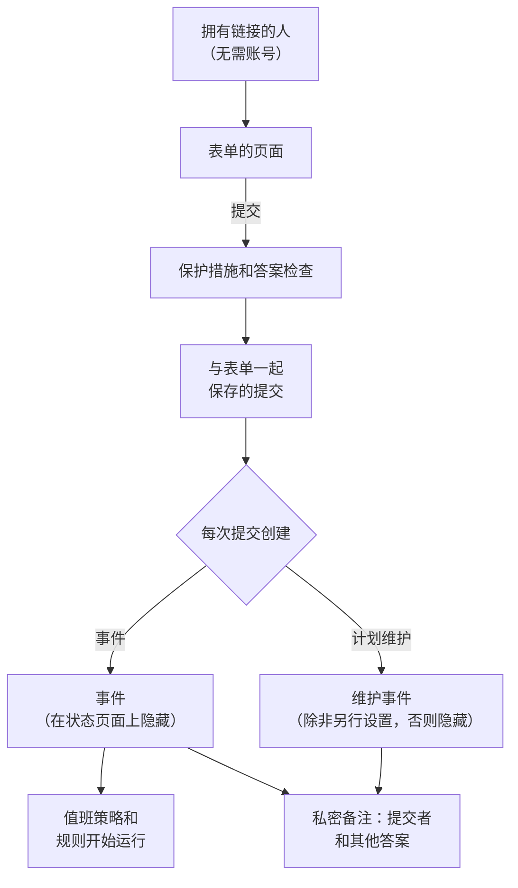

# 表单概览

表单是一个页面，任何拥有其链接的人都可以填写，无需 OneUptime 账号。每次提交都会在您的项目中创建一项内容：问题报告会创建一个 **事件**，变更和维护请求会创建一个 **计划维护事件**。您可以在拖放式构建器中设计表单的问题，决定答案如何变成记录，并把链接分享给应该使用它的人。

当发现问题或需要变更的人并不是负责处理事件和维护的人时，就可以使用表单：例如支持人员、其他部门的同事、门店经理或客户的运维团队。他们打开链接、回答您的问题，然后点击 **提交**。您的团队会收到一个普通的事件或维护事件，答案填在其字段中，并附有一条记录提交者身份的私密备注。

:::cards
- [创建您的第一个表单](#创建您的第一个表单): 从空白表单到可以分享的链接。
- [构建表单](/docs/forms/building): 问题、答案类型、隐藏的问题、模板和品牌。
- [提交会创建什么](/docs/forms/on-submit): 答案和设置如何变成事件或维护事件。
- [分享与安全](/docs/forms/sharing-and-security): 链接、IP 允许列表、速率限制和故障排查。
:::

## 表单的工作原理



每个请求都会先经过表单的保护措施：表单自己的页面、速率限制、IP 允许列表和验证码。答案符合要求的提交会被保存，并创建一条记录，这条记录根据答案、表单的 **提交时** 设置以及（对于事件）其事件模板填写。在您的团队决定之前，它创建的任何内容都不会出现在状态页面上。

## 概览

- **独立的产品** — **表单** 位于产品菜单中，地址为 `/dashboard/{projectId}/forms`。每个表单都有自己的链接，在 OneUptime Cloud 上类似 `https://oneuptime.com/accounts/form/<share-key>`。
- **无需账号** — 任何拥有链接的人都可以打开并提交表单，无需登录。
- **是构建器，而不是设置页面** — 添加您自己的问题（简短回答、段落、下拉列表、日期、复选框等）、表单所创建内容的字段（标题、描述、严重程度、监视器、标签、开始和结束时间）、您的自定义字段，以及提交者的姓名和电子邮件。拖动调整顺序，预览表单，然后保存。
- **每个值从哪里来由您决定** — **提交时** 页面会列出新事件或维护事件的每个字段及其来源：答案、默认值、始终适用的设置，或事件模板。
- **在有人发布之前保持隐藏** — 表单创建的事件在声明时绝不会显示在状态页面上，也不会发送给订阅者；维护事件同样如此，除非表单另有设置。
- **多层保护** — **接受提交** 开关、可选的 **IP 允许列表**、拒绝来自其他网站的请求、速率限制、实例的验证码，以及对每个答案的大小限制。
- **保留每一次提交** — 每个表单的 **提交记录** 页面，以及汇总所有表单的 **表单 → 提交记录**，都会列出答案，并链接到每次提交所创建的内容。
- **您自己的品牌** — 在 **构建** 页面的 **品牌** 部分上传显示在表单页面顶部的徽标，以及显示在浏览器标签页上的网站图标。在您上传之前，表单显示的是 OneUptime 的。
- **常见情况的模板** — 保存命名的答案集，例如 **应用程序故障** 或 **计划内维护**，人们可以在表单顶部选择一个来填写表单，或打开该模板自己的链接。每个模板还可以针对其情况将某个问题设为必填、可选或隐藏。一个表单、一个书签，就能服务整个团队。
- **隐藏的问题** — 隐藏没有人需要回答的问题（例如事件的描述），让每个模板代为回答，或者只在需要它的情况下提问。
- **复制表单** — 从一个运行良好的表单出发，连同其问题、模板和设置，为另一个团队创建表单。

## 表单可以创建什么

创建表单时，您需要选择 **每次提交创建** 什么。之后可以在表单的 **提交时** 页面上更改。

| 每次提交创建 | 用途 | 会发生什么 |
| --- | --- | --- |
| **事件** | 问题报告 | 立即声明一个事件，因此您的值班策略和规则会运行，值班人员会收到通知。在响应者发布之前，它不会出现在状态页面上。 |
| **计划维护** | 变更和维护请求 | 在提交者请求的时间窗口内安排一个维护事件。除非表单另有设置，它不会出现在状态页面上，也不会通知任何订阅者。 |

表单目前支持这两种，今后还会支持更多类型的记录。

## 开始之前

- **包含表单的套餐。** 在 OneUptime Cloud 上，表单需要 **Growth** 或更高的套餐。请参阅 [套餐](#套餐)。
- **创建表单的权限。** **Create Form** 属于项目所有者和管理员，以及您授予该权限的角色。请参阅 [权限](#权限)。
- **事件表单需要严重程度。** 每个事件都需要一个严重程度：来自某个问题、表单的设置或其事件模板。没有严重程度时，每次提交都会被拒绝。请参阅 [提交会创建什么](/docs/forms/on-submit#how-a-submission-becomes-an-incident)。

## 创建您的第一个表单

:::steps
### 创建表单

从产品菜单中打开 **表单**，然后点击 **创建表单**。为表单命名（即其公开页面的标题，在项目中必须唯一），选择 **每次提交创建** 什么，还可以选择用 Markdown 编写描述，显示在公开页面的顶部。

### 构建问题

表单会在其 **构建** 页面上打开，已经在询问标题、描述和提交者；如果是维护表单，还会询问维护的开始和结束时间。添加、删除问题并调整顺序，然后点击 **保存更改**。请参阅 [构建表单](/docs/forms/building)。

### 决定提交会创建什么

在 **提交时** 中，检查提交如何变成事件或维护事件，然后点击 **编辑设置** 为其设置默认值：严重程度、事件模板、始终附加的监视器和标签，以及要通知的所有者。请参阅 [提交会创建什么](/docs/forms/on-submit)。

### 如果经常报告同样的情况，添加模板

在 **模板** 中，为人们经常报告的每种情况保存一个模板：表单会在问题上方列出这些模板，根据所选模板自动填写，并按该模板的设置提问。某种情况需要的问题，可以在该情况的模板中设为必填，在其他模板中隐藏。请参阅 [模板](/docs/forms/building#templates)。

### 分享链接

在 **分享** 中复制链接，并发送给应该使用该表单的人。请参阅 [分享与安全](/docs/forms/sharing-and-security)。
:::

> [!IMPORTANT]
> 新表单一创建就处于 **接受提交** 状态，但在您分享其链接之前，没有人能访问它。请先设置好它的问题和保护措施。

## 表单的页面

| 页面 | 包含的内容 |
| --- | --- |
| **构建** | 表单的名称和描述、折叠的 **品牌**（徽标和网站图标），以及构建器：问题、问题面板和 **预览**。 |
| **模板** | 人们可以用来开始填写表单的命名答案集、每个模板如何提问、表单打开时使用的模板，以及每个模板自己的链接。 |
| **提交时** | 每次提交创建什么，以及其每个字段如何填写。**编辑设置** 用于更改默认值和始终适用的内容。 |
| **分享** | **接受提交**、**分享链接**、提交后显示的消息，以及 **IP 允许列表**。 |
| **提交记录** | 通过该表单进行的每一次提交，最新的在前，并显示答案和所创建的内容。 |
| **复制表单** | 位于 **高级** 下：表单的副本，会自动命名，带有原表单的问题、模板、提交时设置、品牌、感谢消息和 IP 允许列表，以及它自己的链接。副本创建时处于关闭状态，并在其构建器中打开。 |
| **删除表单** | 位于 **高级** 下，用于删除表单。其提交记录会一并删除，但它创建的事件和维护事件不会被删除。 |

与其他所有资源一样，表单菜单的 **开发者** 部分包含其 Terraform、API 和 AI 助手页面。

## 表单与事件模板

模板和表单都能让您不必重复输入同一个事件，但它们服务于不同的人：

| | 事件模板 | 表单 |
| --- | --- | --- |
| 谁使用 | 您的团队，已登录 OneUptime | 任何拥有链接的人，无需账号 |
| 在哪里 | 事件列表上的 **从模板创建** | 表单链接对应的独立页面 |
| 能更改什么 | 声明前事件的每个字段 | 只有您所选问题的答案 |
| 能看到什么 | 您的监视器、策略、所有者和每个字段 | 表单的名称、描述和问题，以及您选择提供的选项 |
| 状态页面 | 由模板和声明表单决定 | 在响应者发布事件之前保持隐藏 |

它们可以配合使用。在事件表单的 **提交时** 页面上为其指定一个 **事件 模板**，它声明的每个事件都会基于该模板声明：用模板准备您的团队在事件上需要的内容，用表单询问您想问提交者的问题。

## 提交记录

表单的 **提交记录** 页面会列出通过该表单进行的每一次提交，最新的在前，并显示 **提交时间**、**提交者**（提交者填写的姓名和电子邮件，或 **匿名**），以及 **已创建**（指向所创建的事件或维护事件的链接）。**查看回答** 会按提交者填写的原样显示每个答案。**表单 → 提交记录** 会列出项目中所有表单的提交。

提交由表单写入，从不手动编写，也无法编辑。删除一条提交会从列表中移除其答案以及提交者的姓名和电子邮件；它创建的事件或维护事件会保留，其中重复记录了提交者信息和答案的私密备注也会保留。当事件或维护事件被删除时，其提交会保留，其 **已创建** 列显示 **之后已删除**。

> [!WARNING]
> 删除某人的个人数据时，仅删除提交是不够的：还要编辑或删除该提交所创建的事件或维护事件上的私密备注。

## 权限

表单让团队以外的人可以在您的项目中创建事件和维护事件，因此表单由项目所有者和管理员，以及您授予 **Form** 权限的角色来管理。这些权限位于 [权限参考](/docs/permissions/reference) 的 **Form** 组中：

| 权限 | 允许的操作 | 默认拥有者 |
| --- | --- | --- |
| **Create Form** | 创建表单以及复制表单。 | Project Owner, Project Admin |
| **Edit Form** | 更改表单：其问题、品牌、模板、提交时设置、**接受提交**、链接和 **IP 允许列表**。 | Project Owner, Project Admin |
| **Delete Form** | 删除表单，其提交记录也随之删除。 | Project Owner, Project Admin |
| **Read Form** | 查看表单及其问题、设置和链接。 | 以上角色，以及 Project Member、Viewer，和事件与计划维护相关角色 |
| **Read Form Submission** | 查看提交及其答案。 | Project Owner, Project Admin |
| **Delete Form Submission** | 删除提交。 | Project Owner, Project Admin |

提交中包含陌生人输入的内容（姓名、电子邮件地址，以及可能永远不会进入记录的答案），因此除非您授予 **Read Form Submission**，否则只有项目所有者和管理员能看到它们。任何能读取表单的人都能看到并分享其链接。提交表单不需要任何权限。关于角色和细粒度权限如何组合，请参阅 [用户、团队与权限](/docs/permissions/index)。

## 套餐

在 OneUptime Cloud 上，表单需要 **Growth** 或更高的套餐，表单的 **IP 允许列表** 需要 **Scale**，无论是在创建表单时设置还是之后编辑时设置。低于 **Growth** 套餐或订阅未付款的项目，其链接会显示不可用的消息，并且不会创建任何内容。

## 通过 API 使用表单

表单是位于 `/api/form` 的普通 API 资源，其提交位于 `/api/form-submission`，提交可以读取和删除，但不能创建或编辑。[API 参考](/reference) 中有完整的请求和响应结构。

### 问题和设置

表单的问题在其 `fields` 列中，这是一个按表单提问顺序排列的 JSON 列表；其提交时设置在 `targetSettings` 中：

```json
{
  "data": {
    "targetType": "Incident",
    "fields": [
      {
        "id": "what",
        "source": "TargetField",
        "targetField": "title",
        "label": "What is wrong?",
        "isRequired": true
      },
      {
        "id": "office",
        "source": "Question",
        "type": "Dropdown",
        "label": "Which office are you in?",
        "dropdownOptions": "Berlin\nLondon",
        "isRequired": false
      },
      {
        "id": "email",
        "source": "Submitter",
        "submitterField": "Email",
        "label": "Your Email",
        "isRequired": true
      }
    ],
    "targetSettings": {
      "incidentSeverityId": "<severity-id>",
      "labelIds": ["<label-id>"]
    }
  }
}
```

每个问题都有自己的 `id`（字母、数字、`-` 和 `_`）、一个 `source`、一个 `label`，以及可选的 `helpText` 和 `isRequired`：

| `source` | 询问的内容 |
| --- | --- |
| `Question` | 表单自己的问题，按 `type` 作答：`Text`、`LongText`、`Markdown`、`Number`、`Dropdown`、`MultiSelectDropdown`、`Boolean`、`Date` 或 `DateTime`。下拉列表会列出其 `dropdownOptions`，每行一个。 |
| `TargetField` | 表单所创建内容的一个字段，由 `targetField` 指定：事件为 `title`、`description`、`incidentSeverityId`、`monitors`、`labels` 和 `impactStartedAt`；维护事件为 `title`、`description`、`startsAt`、`endsAt`、`monitors`、`statusPages` 和 `labels`。通过选择作答的字段会在 `allowedOptionIds` 中列出其提供的记录。 |
| `TargetCustomField` | 事件或维护事件的某个自定义字段，由 `customFieldId` 指定。 |
| `Submitter` | 提交者的 `Name` 或 `Email`，由 `submitterField` 指定。 |

`isHidden` 设置为 `true` 的问题不会显示在公开页面上，永远不是必填项，只能由提交所指定的模板来回答，除非该模板会提出这个问题。`isRequired` 和 `isHidden` 是表单的默认值；每个模板都可以用自己的方式提出问题。

### API 中的模板

表单的模板在其 `templates` 列中，这是一个按表单列出顺序排列的 JSON 列表。每个模板都有自己的 `id`（字母、数字、`-` 和 `_`）、一个最多 100 个字符且在表单内唯一的 `name`，以及以问题 ID 为键的 `answers`，每个答案的格式与提交时发送的相同：文本、数字、`true` 或 `false`、选项的值，或多选的值列表。将 `isDefault` 设置为 `true` 会使其成为表单打开时使用的模板；一个表单最多有一个这样的模板，最多有 50 个模板。

`fieldSettings` 同样以问题 ID 为键，说明模板如何提出问题：`Required`、`Optional` 或 `Hidden`。模板未列出（或列为 `null`）的问题按表单的方式提问，维护事件的 `startsAt` 和 `endsAt` 问题只能设为 `Required`：

```json
{
  "data": {
    "templates": [
      {
        "id": "outage",
        "name": "Application Outage",
        "isDefault": true,
        "answers": {
          "what": "The application is down",
          "office": "Berlin"
        },
        "fieldSettings": {
          "office": "Required",
          "email": "Optional"
        }
      }
    ]
  }
}
```

无论是从仪表板、API、Terraform 还是工作流保存，问题、模板和设置在每次保存时都会被检查，违反规则的列表会被拒绝，并附有说明问题所在的消息。`shareKey` 是表单链接中的密钥，由 OneUptime 在创建表单时设置，**重置链接** 就是用来更改它的。

### API 中的品牌

表单的品牌是其 `logoFileId`、`logoAltText` 和 `faviconFileId`。先在表单所在项目中使用 `POST /api/file` 上传图片：使用该项目的 API 密钥，或以该项目成员身份登录并在 `tenantid` 请求头中填入项目 ID。发送其 `name`、`fileType`（例如 `image/png`），以及在 `file` 中以 base64 编码的字节，然后设置返回的 `_id`。向您不是其成员的项目上传会被拒绝，并显示 "You can upload files only to a project you are a member of."。每次上传都是私有的：无论请求中写了什么，`isPublic` 都由 OneUptime 设置。每张图片会在保存表单时检查：它必须是在表单所在项目中上传的，徽标必须是 512 KB 或更小的 PNG、JPEG、GIF、WebP 或 SVG 图片，网站图标必须是上述格式之一或 128 KB 或更小的 ICO。将 ID 设置为 `null` 即可恢复为 OneUptime 的。请参阅 [品牌](/docs/forms/building#branding)。

### 读取提交记录

列出表单的提交记录：

```bash
curl -X POST https://oneuptime.com/api/form-submission/get-list \
  -H "apikey: $ONEUPTIME_API_KEY" \
  -H "Content-Type: application/json" \
  -d '{
    "query": { "formId": "<form-id>" },
    "select": { "submitterName": true, "submitterEmail": true, "answers": true, "incidentId": true, "scheduledMaintenanceId": true, "createdAt": true },
    "limit": 50,
    "skip": 0
  }'
```

### 工作流

表单拥有自动生成的工作流组件，例如 **On Create Form**、**On Update Form** 等。要对表单创建的内容执行操作，请使用 **On Create Incident** 或 **On Create Scheduled Maintenance**。

### 公开页面自己的端点

公开页面与两个不需要 API 密钥的路由通信：`GET /api/form/public/<shareKey>` 返回表单的名称、描述和问题，如果有的话，还会返回其徽标、徽标的替代文本和网站图标（图片为 base64），以及其模板和这些模板对页面所问问题的答案；`POST /api/form/public/<shareKey>/submit` 用于提交表单，并在 `templateId` 中指明提交者所用的模板。它们是页面自己的端点，而不是供您在其上构建的 API：每次调用都要经过表单的保护措施（请参阅 [分享与安全](/docs/forms/sharing-and-security)），并且会随页面一起变化。要从您自己的代码创建事件，请使用 API 密钥调用 `POST /api/incident`，请参阅 [声明事件](/docs/incidents/declaring-incidents)。

## 您的事件表单去了哪里

表单取代了以前位于 **事件 → 设置 → 表单** 下的 **Incident Forms**。升级时，每个事件表单都已迁移过来，链接和提交记录保持不变：

- 它的问题变成了构建器中的问题：标题；描述（除非它被隐藏）；严重程度（如果提交者可以选择）；它询问的每个自定义字段（按自定义字段的排序顺序）；以及 **Your Name** 和 **Your Email**，除非表单允许匿名报告，否则这两项为必填。
- 它的严重程度和事件模板变成了 **提交时** 的默认值。
- 它的 **已启用** 开关、成功消息和 **IP 允许列表** 保持不变，链接也不变：旧的 `/accounts/incident-form/<share-key>` 链接会在新地址打开表单。
- 对于拥有 **Incident Form** 权限的每个团队和 API 密钥，这些权限都变成了 **Form** 权限。

旧的仪表板页面会重定向到新页面。

## 后续步骤

:::cards
- [构建表单](/docs/forms/building): 问题、答案类型、关联字段、自定义字段和预览。
- [提交会创建什么](/docs/forms/on-submit): 答案和提交时设置如何变成事件或维护事件。
- [分享与安全](/docs/forms/sharing-and-security): 链接、IP 允许列表、速率限制、验证码和故障排查。
- [声明事件](/docs/incidents/declaring-incidents): 声明事件的其他方式。
:::
