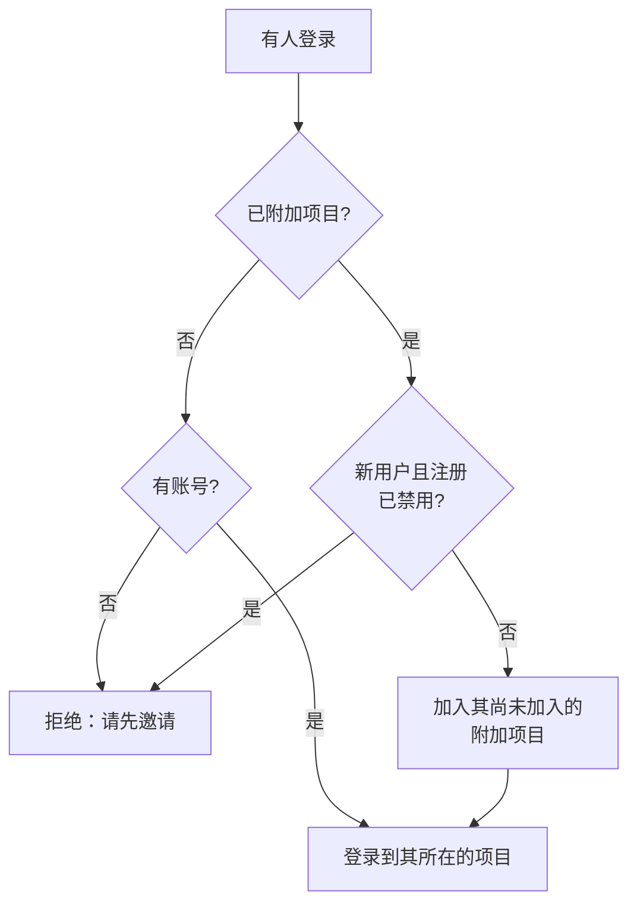

# 全局 SSO

全局 SSO 让 OneUptime 的 **实例管理员**（主管理员）在实例级别 **一次性** 配置 SAML 2.0 或 OpenID Connect（OIDC）身份提供商，并将其连接到服务器上的任何项目。不必让每个项目所有者各自配置身份提供商，由主管理员设置一个为整个实例服务的提供商即可。

> [!NOTE]
> 全局 SSO（包括整个实例的“Require SSO for Login”开关）属于 OneUptime 的所有版本：每个自托管实例都有它，包括 Community Edition，无需许可证。它属于实例管理功能，因此不适用于 OneUptime Cloud。各版本包含哪些功能，请参阅 [企业版](/docs/self-hosted/enterprise)。

:::cards
- [设置提供商](#设置全局-sso): 创建它，把 OneUptime 的 URL 交给身份提供商，然后进行测试。
- [用户如何登录](#用户如何登录): 仅限现有成员，或把新来的人加入您附加的项目。
- [强制使用 SSO](#强制使用-sso): 为一个项目或整个实例要求使用 SSO。
- [关闭提供商](#关闭或删除提供商): 哪些会结束，以及 OneUptime 会拒绝哪些更改。
:::

## 全局 SSO 与项目 SSO 对比

|          | 项目 SSO                           | 全局 SSO                                   |
| -------- | ---------------------------------- | ------------------------------------------ |
| 配置者   | 项目所有者/管理员（项目设置）       | 实例主管理员（Admin Dashboard）             |
| 范围     | 单个项目                           | 整个实例，可连接到任何项目                 |
| 登录结果 | 访问该单个项目                     | 访问用户可以访问的所有项目                 |

单个项目自己的提供商，请参阅 [SSO](/docs/identity/sso)。

## 设置全局 SSO

:::steps
### 打开提供商列表

:::tabs
@tab SAML
以主管理员身份登录，然后通过用户菜单中的 **管理员设置** 打开 Admin Dashboard。接着前往 **设置** > **认证** > **Global SSO**。
@tab OpenID Connect
以主管理员身份登录，然后通过用户菜单中的 **管理员设置** 打开 Admin Dashboard。接着前往 **设置** > **认证** > **Global OIDC**。
:::

### 创建提供商

:::tabs
@tab SAML
- 点击 **Create Global SSO**。
- 输入 **名称**、身份提供商的 **Sign On URL** 和 **Issuer**，并粘贴 **Public Certificate**。其余内容已在 **更多字段** 中填好：**Signature Method**（`RSA-SHA256`）、**Digest Method**（`SHA256`）以及描述（`Sign in with` 加名称）。仅当您的 IdP 需要时才更改它们。保存后会打开提供商的页面。
@tab OpenID Connect
- 点击 **Create Global OIDC**。
- 输入 **名称**、**Issuer URL**，以及您在 IdP 中注册的应用的 **Client ID** 和 **Client Secret**。也可以把 IdP 的发现 URL 粘贴到 **Issuer URL** 中。其余内容已在 **更多字段** 中填好：**Discovery URL**（签发者后接 `/.well-known/openid-configuration`）、**Scopes**（`openid email profile`）、`email` 和 `name` 声明名称，以及描述（`Sign in with` 加名称）。仅当您的 IdP 需要时才更改它们。保存后会打开提供商的页面。
:::

### 把 OneUptime 的 URL 复制到身份提供商

:::tabs
@tab SAML
在提供商的页面上，**Identity Provider URLs** 卡片会显示 **ACS URL (Assertion Consumer Service / Reply URL)** 和 **Issuer (Entity ID)**。把两者都粘贴到您的身份提供商中（Okta、Microsoft Entra ID、OneLogin、JumpCloud 等）。
@tab OpenID Connect
在提供商的页面上，**Identity Provider URL** 卡片会显示 **Redirect URI (Callback URL)**。把它添加到身份提供商允许的重定向 URI 中。
:::

### 开启提供商

新的提供商默认处于关闭状态。在提供商的页面上点击 **Edit Configuration**，然后开启 **已启用**。

启用全局提供商只会在登录页面上添加一个“Sign in with SSO”选项——它从不强制使用 SSO，也不会把任何人锁在外面，因此可以放心地启用、测试，并在需要时再次禁用。

### 测试提供商

使用 **Test this SSO provider** 卡片（OpenID Connect 为 **Test this OIDC provider**）中的链接，通过您的身份提供商完整地走一遍登录流程。您不需要先附加任何项目：测试会把您登录到您已加入的项目。提供商必须已启用，链接才能使用。
:::

## 用户如何登录

全局提供商的行为取决于您是否为其附加了项目：

- **未附加项目（全部项目 / 先邀请）：** 用户可以使用该提供商登录，并访问 **其已是成员的任何项目**。新用户 **不会** 被自动创建——用户必须先被邀请加入某个项目。适用于成员关系在其他地方管理的全公司 SSO。

- **已附加项目（自动预配）：** 打开该提供商并使用 **Attached Projects** 表附加一个或多个项目，每个项目均带有一组默认团队。登录的用户会被**自动预配**到这些项目中，并在首次登录时被添加到默认团队。附加的项目默认选中其成员团队；如果新用户应从不同的访问权限开始，请选择其他团队。一次添加一个项目及其团队来构建列表；若要更改某个附加项，请将其删除后重新添加。

已经是某个附加项目成员的人，会保留其在该项目中的团队。

提供商上的两个开关会改变这一行为。两者默认都处于关闭状态，并折叠在 **更多字段** 中：

| 开关 | 开启时的作用 |
| --- | --- |
| **Disable Sign Up with SSO** | 即使已附加项目，人员也必须先被邀请加入某个项目，才能使用此提供商登录。首次登录时不会创建新用户。 |
| **Restrict to Attached Projects** | 使用此提供商登录只会在附加到它的项目中满足 SSO 要求，因此已经登录的人可能会失去对其他项目的访问权限。关闭时，它会在此人所属的每个项目中满足要求，附加项目只决定新来的人被加入到哪里。 |

## 强制使用 SSO

配置全局提供商并不会强制任何人使用它；密码登录仍然有效。要要求使用 SSO，请为项目或整个实例开启该要求：

- **按项目：** 项目可以要求使用 SSO，并可以选择要求使用 _特定_ 的提供商（项目提供商或全局提供商）。请参阅 [为项目要求使用 SSO](/docs/identity/sso#为项目要求使用-sso)。
- **整个实例：** **Admin** > **设置** > **认证** 中有一个 **登录时要求使用 SSO** 开关，可为实例中的每个用户强制使用 SSO。开启前它会要求您确认，确认后立即保存。主管理员仍然不受此限制，因此不会被锁定在外。

开启 **登录时要求使用 SSO** 需要一个能让人登录的 SSO 提供商，以免有人因此被锁定在外：

- 对于整个实例，每个本身不要求使用 SSO 的项目都需要一个：项目自己的一个已开启的 SAML 或 OIDC 提供商，或者一个已开启且能把人登录到该项目的全局提供商。只要有项目没有这样的提供商，开启该开关就会被拒绝，消息会列出这些项目（数量很多时，列出前几个以及总数）。请先开启一个全局提供商，或者这些项目中的提供商。要求特定提供商的项目需要的正是那个提供商：当它已关闭、已删除或不能把人登录到该项目时，消息会单独列出该项目——请先开启那个提供商，或者在那里要求另一个提供商。
- 对于项目，同样的要求适用于该项目，以及它要求的提供商（如果它要求了某个提供商）。
- 在 **登录时要求使用 SSO** 已开启时仍以开启状态发送它的保存（与其他设置一起发送，或来自 API）会以同样的方式检查，无论是针对实例还是项目；指定项目已经要求的提供商的保存也是如此。
- 对于还没有自己提供商的新项目：当实例要求使用 SSO 时，创建项目需要一个已开启且能把人登录到每个项目的全局提供商，否则包括创建者在内，没有人能打开该项目。没有这样的提供商时，创建项目会被拒绝，消息会请服务器管理员开启一个。主管理员仍然可以创建项目。在 **登录时要求使用 SSO** 已开启的情况下创建的项目也需要同样的提供商，无论由谁创建。

关闭它永远不会被拒绝。

## 关闭或删除提供商

关闭全局提供商、删除它，或者将其限制为附加的项目，会在它不再让人登录的地方结束通过它进行的登录。在要求使用 SSO 的地方，通过它登录的人必须在下次请求时重新使用 SSO 登录，他们打开的页面会立即停止接收实时更新，有人在通过它登录后连接的 MCP 客户端也会在该项目中停止工作。

重新开启提供商不会恢复这些登录：用户需要再次通过它登录。升级时已经处于关闭状态的提供商，会被视为在升级时被关闭。

新的证书或客户端密钥、其他 URL 或新名称都会让所有人保持登录状态。

### 每个要求使用 SSO 的项目都会保留一条进入的途径

要求使用 SSO 的项目（无论是项目自身要求，还是因为整个实例要求）始终会保留一个人们可以用来登录它的提供商。因此，如果以下更改会让这样的项目完全没有提供商，或者夺走它要求的提供商，这些更改就会被拒绝：

- 关闭全局提供商、删除它，或者将其限制为附加的项目；
- 对于限制为附加项目的提供商：附加其第一个项目（在此之前，它会把人登录到每个项目）、关闭某个附加项、把附加项移到另一个项目或提供商，或者移除附加项。

消息会列出这些项目，或者列出前几个以及总数。请先为它们开启另一个提供商（它们自己的或全局的），或者在那里关闭 **登录时要求使用 SSO**。要求的正是此提供商的项目会被单独列出：请先在那里要求另一个提供商，或者关闭 **登录时要求使用 SSO**。

让提供商能登录更多人的更改——开启它或某个附加项、解除限制——永远不会被拒绝。这些更改会立即到达每个应用服务器，就像关闭 **登录时要求使用 SSO** 一样：人们可以立即通过该提供商登录。只有当恰好在同一时刻保存了对同一提供商的另一项更改时，应用服务器最多才可能需要一分钟才能跟上。

关于谁可以登录的两项更改会依次检查。如果同一时刻正在保存另一项更改且耗时比平常长（为整个实例开启 **登录时要求使用 SSO** 会读取每个项目），更改会被拒绝，并显示 "Another change to who can sign in with SSO is being saved. Try again in a moment."：请再次保存。在那一刻创建的项目也会等待该更改，如果等待时间过长，会被拒绝并显示 "The server's SSO settings are being changed. Create the project again in a moment."

## 故障排查

:::details "You must be invited to a project on this OneUptime instance before you can sign in with SSO"
此人还没有 OneUptime 账号，而提供商也不会创建账号：要么没有项目附加到它，要么 **Disable Sign Up with SSO** 已开启。请邀请此人加入某个项目，或者把一个项目附加到该提供商。
:::

:::details "This SSO provider does not grant access to any project you are a member of"
**Restrict to Attached Projects** 已开启，而此人不是任何附加到该提供商的项目的成员。请附加此人的某个项目，或者把此人加入某个附加项目。
:::

:::details "You are not a member of any project on this OneUptime instance"
此人有账号，但不属于任何项目，而提供商也没有可以把此人加入的地方。请邀请此人加入某个项目，或者把一个带有默认团队的项目附加到该提供商。
:::

:::details "Issuer URL does not match"
对于 SAML 提供商，身份提供商响应中的签发者不是提供商上保存的 **Issuer**。请从身份提供商重新复制；两者必须完全一致。
:::

## 后续步骤

:::cards
- [SSO](/docs/identity/sso): 设置项目自己的 SAML 或 OIDC 提供商。
- [SCIM](/docs/identity/scim): 让身份提供商自动添加和移除人员。
- [用户、团队与权限](/docs/permissions/index): 新来的人加入的团队允许他们做什么。
:::
