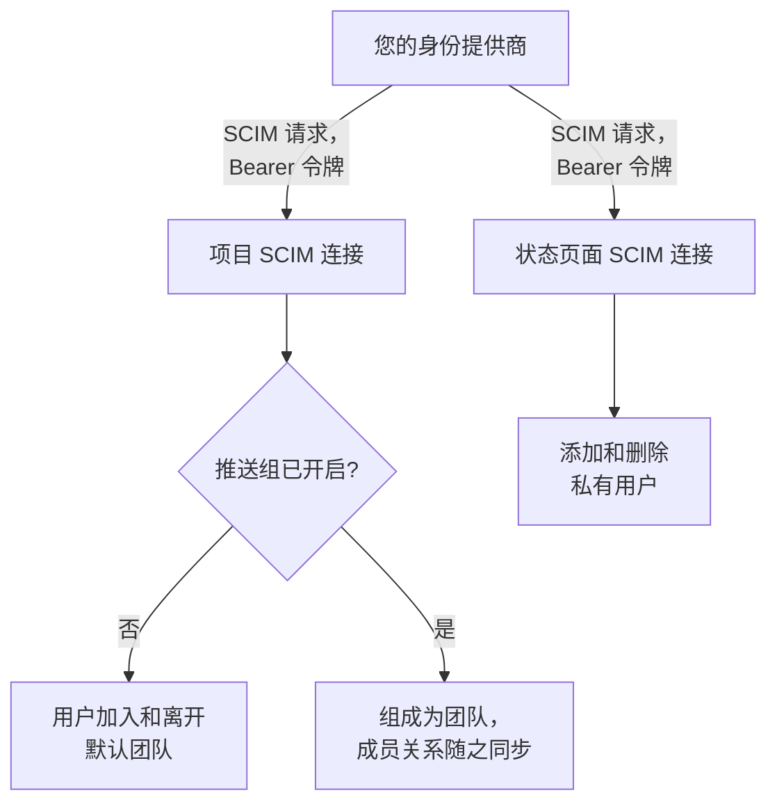
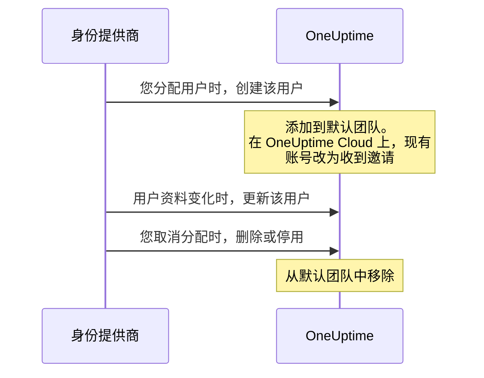
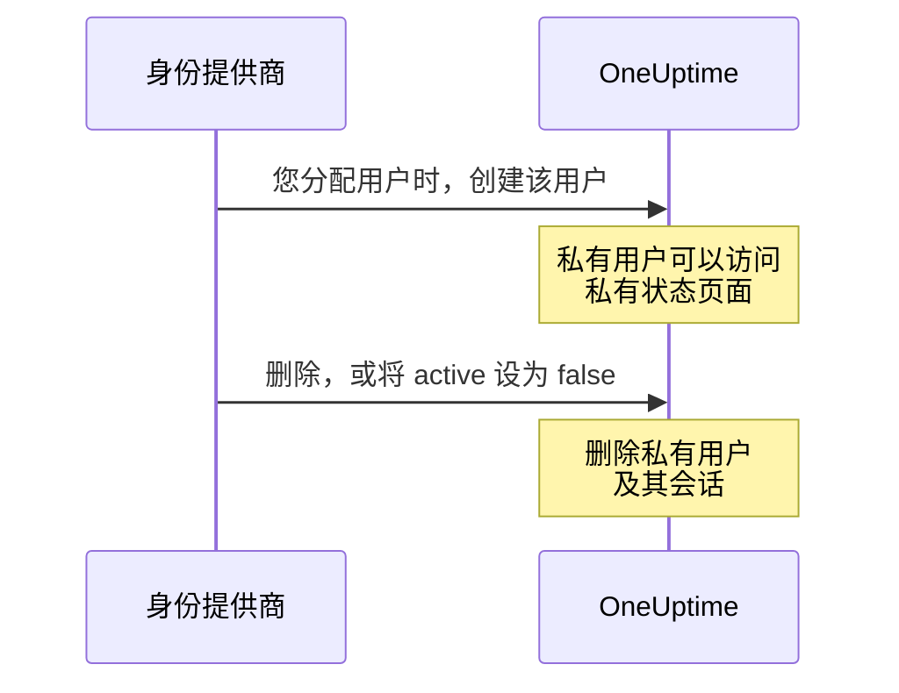

# SCIM

SCIM（System for Cross-domain Identity Management）会自动为人员预配和取消预配。您的身份提供商（IdP），例如 Microsoft Entra ID、Okta 或任何其他 SCIM 2.0 系统，会在您分配人员时把他们添加到您的 OneUptime 项目和私有状态页面，并在您取消分配时将其移除。

> [!NOTE]
> **版本：** SCIM 属于 OneUptime Enterprise Edition。在 OneUptime Cloud 上，**Scale** 及以上套餐可用。自托管部署需要 Enterprise Edition 镜像和许可证。请参阅 [企业版](/docs/self-hosted/enterprise)。如果没有有效的许可证（14 天试用期结束后，或许可证过期 30 天后），SCIM 请求会被拒绝，直到激活许可证为止。

:::cards
- [设置项目 SCIM](#设置项目-scim): 创建连接，并把其 URL 和令牌交给您的 IdP。
- [设置状态页面 SCIM](#设置状态页面-scim): 为状态页面预配私有用户。
- [连接您的身份提供商](#连接您的身份提供商): Microsoft Entra ID 和 Okta 的分步说明。
- [常见问题](#常见问题): 现有用户、取消预配、电子邮件地址更改。
:::

## 工作原理

每当您分配、更改或取消分配某人时，您的身份提供商都会使用 Bearer 令牌进行身份验证，调用 OneUptime 的 SCIM 端点。请求更改的内容取决于连接所在的位置：



SCIM 集成提供以下优势：

- **自动预配用户**：在您的 IdP 中分配用户时，会在 OneUptime 中创建该用户。
- **自动取消预配用户**：在您的 IdP 中取消分配用户时，会从 OneUptime 中移除该用户。
- **用户属性同步**：用户信息在您的 IdP 和 OneUptime 之间保持一致。
- **集中访问管理**：从您现有的身份管理系统管理 OneUptime 的访问权限。

SCIM 和 [SSO](/docs/identity/sso) 是相互独立的：SCIM 决定谁在项目中，SSO 决定他们如何登录。大多数组织会同时使用两者。

## 项目 SCIM

项目 SCIM 让身份提供商可以管理 OneUptime 项目中的团队成员。

### 设置项目 SCIM

只有项目所有者可以添加或更改项目的 SCIM 连接，或者查看或重置其 Bearer 令牌：通过 SCIM，您的身份提供商可以把人员添加到项目中的任何团队。
:::steps
1. **导航至项目设置**

   - 进入您的 OneUptime 项目
   - 导航至 **项目设置** > **安全** > **SCIM**

2. **配置 SCIM 设置**

   - 输入 **名称**。**默认团队** 默认是项目的成员团队：新用户会被添加到这些团队
   - 在 **更多字段** 中，**自动预配用户**（在您的 IdP 中分配用户时添加用户）和 **自动取消预配用户**（在您的 IdP 中取消分配用户时移除用户）处于开启状态，**启用推送组** 处于关闭状态。如有需要，请在那里更改
   - 保存。显示用于 IdP 配置的 **SCIM Base URL** 和 **Bearer Token** 的对话框会立即打开

3. **配置您的身份提供商**

   - 使用对话框中的 **SCIM Base URL**。在 OneUptime Cloud 上，它是 `https://oneuptime.com/identity/scim/v2/<scim-id>`；自托管部署会显示其自己的主机
   - 使用对话框中的 **Bearer Token** 配置 Bearer 令牌身份验证
   - 映射用户属性（电子邮件为必填项）。[连接您的身份提供商](#连接您的身份提供商) 中提供了 Microsoft Entra ID 和 Okta 的详细信息
:::

要再次查看这些 URL，请在连接所在行选择 **查看 SCIM URL**。**重置 Bearer 令牌** 会替换令牌；请用新令牌更新您的身份提供商。

### 项目用户如何被预配



已经有 OneUptime 账号的人，在 OneUptime Cloud 上接受邀请后即可加入（请参阅 [常见问题](#常见问题)）。通过连接默认团队之外的团队授予的访问权限不受影响。

## 状态页面 SCIM

状态页面 SCIM 让身份提供商可以为能够访问私有状态页面的状态页面私有用户进行预配和取消预配。

### 设置状态页面 SCIM

:::steps
1. **导航至状态页面设置**

   - 打开 **状态页面** 并选择您的状态页面
   - 导航至 **安全** > **SCIM**

2. **配置 SCIM 设置**

   - 输入 **名称**。在 **更多字段** 中，**自动预配用户**（在您的 IdP 中分配时添加私有用户）和 **自动取消预配用户**（在您的 IdP 中取消分配时删除私有用户）处于开启状态。如有需要，请在那里更改
   - 保存。显示用于 IdP 配置的 **SCIM Base URL** 和 **Bearer Token** 的对话框会立即打开

3. **配置您的身份提供商**

   - 使用对话框中的 **SCIM Base URL**。在 OneUptime Cloud 上，它是 `https://oneuptime.com/identity/status-page-scim/v2/<scim-id>`
   - 使用显示的令牌配置 Bearer 令牌身份验证
   - 映射用户属性（电子邮件为必填项）
:::

要再次查看这些 URL，请在连接所在行选择 **显示 SCIM 端点 URL**。

状态页面 SCIM 只支持用户，不支持组或组预配。

### 私有用户如何被预配



> [!WARNING]
> 取消预配会永久删除状态页面私有用户及其在该状态页面上的所有会话。如果以后再次分配该用户，会将其作为新的私有用户预配。当 **自动取消预配用户** 关闭时，将 `active` 设为 `false` 的更新会被忽略，DELETE 请求会被拒绝。

## 连接您的身份提供商

下面的每个提供商都从在 OneUptime 中创建项目 SCIM 连接开始，然后把您的身份提供商连接到它。

### Microsoft Entra ID（原 Azure AD）

Microsoft Entra ID 提供带有 SCIM 预配的企业级身份管理。您需要：

- 拥有 Premium P1 或 P2 许可证的 Microsoft Entra ID 租户（自动预配需要）。
- OneUptime Cloud 上使用 **Scale** 或更高套餐的 OneUptime 项目。
- Microsoft Entra ID 和 OneUptime 的管理员访问权限。

:::steps
#### 为 Entra ID 创建 SCIM 连接

1. 登录您的 OneUptime 仪表板
2. 导航至 **项目设置** > **安全** > **SCIM**
3. 点击 **创建SCIM**
4. 输入一个易于识别的名称（例如 "Microsoft Entra ID Provisioning"）
5. 检查设置：
   - **默认团队**：默认是项目的成员团队；新用户会被添加到这些团队
   - **自动预配用户** 和 **自动取消预配用户**：已开启，位于 **更多字段** 中
   - **启用推送组**：位于 **更多字段** 中；如果您想通过 Entra ID 组管理团队成员，请开启它
6. 保存配置
7. 从打开的对话框中复制 **SCIM Base URL** 和 **Bearer Token**——在 Entra ID 中需要它们

#### 在 Entra ID 中创建企业应用程序

1. 登录 [Microsoft Entra admin center](https://entra.microsoft.com)
2. 导航至 **Identity** > **Applications** > **Enterprise applications**
3. 点击 **+ New application**，然后点击 **+ Create your own application**
4. 输入名称（例如 "OneUptime"）
5. 选择 **Integrate any other application you don't find in the gallery (Non-gallery)**，然后点击 **Create**

#### 将 Entra ID 连接到 OneUptime

1. 在您的 OneUptime 企业应用程序中前往 **Provisioning**，点击 **Get started**
2. 将 **Provisioning Mode** 设为 **Automatic**
3. 在 **Admin Credentials** 下，将 **Tenant URL** 设为 OneUptime 的 **SCIM Base URL**（例如 `https://oneuptime.com/identity/scim/v2/<scim-id>`），将 **Secret Token** 设为 **Bearer Token**
4. 点击 **Test Connection** 验证配置，然后点击 **Save**

#### 在 Entra ID 中映射用户属性

1. 在 Provisioning 部分点击 **Mappings**，然后点击 **Provision Azure Active Directory Users**
2. 配置以下属性映射，移除不需要的映射，然后点击 **Save**：

| Azure AD 属性                                                 | OneUptime SCIM 属性            | 是否必填 |
| ------------------------------------------------------------- | ------------------------------ | -------- |
| `userPrincipalName`                                           | `userName`                     | 是       |
| `mail`                                                        | `emails[type eq "work"].value` | 推荐     |
| `displayName`                                                 | `displayName`                  | 推荐     |
| `givenName`                                                   | `name.givenName`               | 可选     |
| `surname`                                                     | `name.familyName`              | 可选     |
| `Switch([IsSoftDeleted], , "False", "True", "True", "False")` | `active`                       | 推荐     |

#### 在 Entra ID 中映射组（可选）

如果您在 OneUptime 中开启了 **启用推送组**：

1. 返回 **Mappings**，点击 **Provision Azure Active Directory Groups**
2. 将 **Enabled** 设为 **Yes**
3. 配置以下属性映射，然后点击 **Save**：

| Azure AD 属性 | OneUptime SCIM 属性 |
| ------------- | ------------------- |
| `displayName` | `displayName`       |
| `members`     | `members`           |

#### 在 Entra ID 中分配用户和组

1. 在您的 OneUptime 企业应用程序中前往 **Users and groups**
2. 点击 **+ Add user/group**，选择要预配到 OneUptime 的用户和组，然后点击 **Assign**

#### 在 Entra ID 中开始预配

1. 前往 **Provisioning** > **Overview**，点击 **Start provisioning**
2. 第一个预配周期开始；首次同步最长可能需要 40 分钟
3. 在 **Provisioning logs** 中检查错误。您分配的人员会出现在 OneUptime 中项目的团队里
:::

### Okta

Okta 提供支持 SCIM 的灵活身份管理。您需要：

- 具备预配功能（Lifecycle Management 功能）的 Okta 租户。
- OneUptime Cloud 上使用 **Scale** 或更高套餐的 OneUptime 项目。
- Okta 和 OneUptime 的管理员访问权限。

:::steps
#### 为 Okta 创建 SCIM 连接

1. 登录您的 OneUptime 仪表板
2. 导航至 **项目设置** > **安全** > **SCIM**
3. 点击 **创建SCIM**
4. 输入一个易于识别的名称（例如 "Okta Provisioning"）
5. 检查设置：
   - **默认团队**：默认是项目的成员团队；新用户会被添加到这些团队
   - **自动预配用户** 和 **自动取消预配用户**：已开启，位于 **更多字段** 中
   - **启用推送组**：位于 **更多字段** 中；如果您想通过 Okta 组管理团队成员，请开启它
6. 保存配置
7. 从打开的对话框中复制 **SCIM Base URL** 和 **Bearer Token**——在 Okta 中需要它们

#### 创建或打开 Okta 应用程序

在 Okta Admin Console 中前往 **Applications** > **Applications**：

- 如果您已经在 OneUptime 中使用 Okta 进行 SSO，请打开该应用程序。
- 否则，点击 **Create App Integration**，选择 **SAML 2.0**，将其命名为 "OneUptime"，并完成 SAML 设置（请参阅 [SSO](/docs/identity/sso)）。

#### 在 Okta 中开启 SCIM 预配

1. 前往您的 OneUptime 应用程序的 **General** 选项卡
2. 在 **App Settings** 部分点击 **Edit**，在 **Provisioning** 下选择 **SCIM**，然后点击 **Save**
3. 会出现一个新的 **Provisioning** 选项卡

#### 将 Okta 连接到 OneUptime

1. 在 **Provisioning** 选项卡上点击 **Integration**，然后点击 **Configure API Integration**，并勾选 **Enable API integration**
2. 配置以下内容：
   - **SCIM connector base URL**：OneUptime 的 **SCIM Base URL**（例如 `https://oneuptime.com/identity/scim/v2/<scim-id>`）
   - **Unique identifier field for users**：`userName`
   - **Supported provisioning actions**：Import New Users and Profile Updates、Push New Users、Push Profile Updates，如果使用基于组的预配，还有 Push Groups
   - **Authentication Mode**：**HTTP Header**
   - **Authorization**：OneUptime 的 **Bearer Token**。OneUptime 需要 `Authorization: Bearer <token>` 请求头；如果 Okta 已在字段前显示 Bearer 一词，只需输入令牌
3. 点击 **Test API Credentials** 验证连接，然后点击 **Save**

#### 选择 Okta 预配的内容

1. 在 **Provisioning** 选项卡上点击 **To App**，然后点击 **Edit**
2. 开启 **Create Users**、**Update User Attributes** 和 **Deactivate Users**，然后点击 **Save**

#### 在 Okta 中映射用户属性

向下滚动到 **Attribute Mappings** 并检查以下映射。移除不需要的映射：

| Okta 属性          | OneUptime SCIM 属性             | 方向          |
| ------------------ | ------------------------------- | ------------- |
| `userName`         | `userName`                      | Okta 到应用   |
| `user.email`       | `emails[primary eq true].value` | Okta 到应用   |
| `user.firstName`   | `name.givenName`                | Okta 到应用   |
| `user.lastName`    | `name.familyName`               | Okta 到应用   |
| `user.displayName` | `displayName`                   | Okta 到应用   |

#### 从 Okta 推送组（可选）

如果您在 OneUptime 中开启了 **启用推送组**：

1. 前往 **Push Groups** 选项卡，点击 **+ Push Groups**
2. 选择 **Find groups by name** 或 **Find groups by rule**
3. 搜索并选择要推送的组，然后点击 **Save**

#### 在 Okta 中分配人员

1. 前往 **Assignments** 选项卡
2. 点击 **Assign** > **Assign to People** 或 **Assign to Groups**，选择要预配的人，为每个人点击 **Assign**，然后点击 **Done**

#### 在 Okta 中检查预配

1. 在 Okta Admin Console 中前往 **Reports** > **System Log**，按您的 OneUptime 应用程序筛选
2. 确认预配事件已成功，并且人员出现在 OneUptime 中项目的团队里
:::

### 其他身份提供商

OneUptime 的 SCIM 实现遵循 SCIM v2.0 规范，可与任何兼容的身份提供商配合使用：

| 设置 | 值 |
| --- | --- |
| SCIM Base URL | OneUptime 的 **SCIM Base URL**：项目为 `https://oneuptime.com/identity/scim/v2/<scim-id>`，状态页面为 `https://oneuptime.com/identity/status-page-scim/v2/<scim-id>` |
| 身份验证 | HTTP Bearer 令牌 |
| 唯一用户标识符 | `userName`，必须是有效的电子邮件地址 |
| 操作 | 在项目 SCIM 和状态页面 SCIM 中，对 Users 执行 GET、POST、PUT、PATCH 和 DELETE。Groups 仅在项目 SCIM 中受支持。 |

## SCIM API 参考

路径相对于连接的 **SCIM Base URL**。

| 端点                     | 方法                    | 说明                                      |
| ------------------------ | ----------------------- | ----------------------------------------- |
| `/ServiceProviderConfig` | GET                     | SCIM 服务器功能                           |
| `/Schemas`               | GET                     | 可用的资源架构                            |
| `/ResourceTypes`         | GET                     | 可用的资源类型                            |
| `/Users`                 | GET, POST               | 列出和创建用户                            |
| `/Users/{id}`            | GET, PUT, PATCH, DELETE | 管理单个用户                              |
| `/Groups`                | GET, POST               | 列出和创建组/团队（仅限项目 SCIM）         |
| `/Groups/{id}`           | GET, PUT, PATCH, DELETE | 管理单个组（仅限项目 SCIM）               |
| `/Bulk`                  | POST                    | 在一个请求中执行多个操作                  |

`/ServiceProviderConfig` 报告的内容：

| 功能 | 是否支持 |
| --- | --- |
| PATCH | 是 |
| Bulk | 是，每个请求最多 1,000 个操作和 1 MB |
| Filter | 是，最多 200 个结果 |
| 排序 | 是 |
| 更改密码 | 否 |
| ETag | 否 |
| 身份验证 | HTTP Bearer 令牌 |

您的身份提供商创建的组会成为项目中同名的团队；如果已有同名团队，则使用该团队，而不是新建团队。

:::details SCIM 用户架构
```json
{
  "schemas": ["urn:ietf:params:scim:schemas:core:2.0:User"],
  "userName": "user@example.com",
  "name": {
    "givenName": "John",
    "familyName": "Doe",
    "formatted": "John Doe"
  },
  "displayName": "John Doe",
  "emails": [
    {
      "value": "user@example.com",
      "type": "work",
      "primary": true
    }
  ],
  "active": true
}
```
:::

:::details SCIM 组架构
```json
{
  "schemas": ["urn:ietf:params:scim:schemas:core:2.0:Group"],
  "displayName": "Engineering Team",
  "members": [
    {
      "value": "user-id-here",
      "display": "user@example.com"
    }
  ]
}
```
:::

## 套餐和许可证

在 OneUptime Cloud 上，SCIM 需要 **Scale** 套餐。如页面顶部的说明所述，自托管部署需要 Enterprise Edition 和许可证。

### 低于 Scale 套餐时

在 OneUptime Cloud 上，只有当项目处于 **Scale** 或更高套餐时，SCIM 预配才能完全工作。低于该套餐时（Scale 试用期结束或套餐降级后），项目的 SCIM 连接以及其状态页面的 SCIM 连接只会移除人员，因此任何离开的人仍会失去访问权限：

- **仍然有效：** 停用用户（在设置为移除其停用人员的连接上，将 `active` 设为 `false`）、删除用户、从组中移除成员（Entra ID 对 `members` 执行以成员为值的 `Remove`，Okta 对 `members[value eq "..."]` 执行 `remove`，或者用组中已有成员的一部分替换成员）、删除组，以及仅由 `DELETE` 组成的 `Bulk` 请求。查询也会得到响应——列出和筛选用户和组，这是身份提供商在移除某人之前会做的——但低于该套餐时，查询永远不会创建任何人。
- **会被拒绝：** 创建用户或组、重新激活用户（对连接会重新放回其某个团队的人，将 `active` 设为 `true`）、把某人添加到其不在的组，以及仅更改用户的电子邮件或姓名，或组的名称。添加某人的请求会被整体拒绝，即使它同时移除人员也是如此，因为 SCIM 的 `PATCH` 要么全部生效，要么全不生效。拒绝结果是带有 SCIM 格式错误的 `402`，您的身份提供商会显示它：`SCIM provisioning needs the Scale plan. This project's plan does not include it, so its SCIM connections can only remove people: requests that add or change people or groups are refused. The connections are kept: upgrade the project to Scale in Project Settings > Billing and they work fully again.` 每次拒绝也会记录在连接的 SCIM 日志中。
- **同时更改个人资料的移除**——发送新电子邮件或新姓名的停用，或者在移除成员的同时重命名组的组更新——会通过，而电子邮件、姓名或组名保持不变。身份提供商会重新发送它们发现不同的内容，因此被拒绝过一次的更改会随它们之后的请求再次到来，而移除永远不必等待套餐。在不会移除其停用人员的连接上（自动取消预配已关闭，或改为推送组）进行的停用不会移除任何人，因此随之发送的新电子邮件或新姓名会作为单独的更改被拒绝。
- **不做任何更改的请求会照常得到响应**——Okta 对已在连接所有团队中的人按原样 `PUT` 用户并将 `active` 设为 `true`；把某人添加到其已在的组；以不同大小写重新发送的电子邮件；OneUptime 不存储的属性，例如职位或部门。状态页面私有用户要么在页面上，要么根本不存在，因此将 `active` 设为 `true` 永远不会改变这样的用户。

不会删除任何内容。升级到 **Scale** 后，连接会照原样再次完全工作，使用相同的 Bearer 令牌，无需在您的身份提供商中重新设置；套餐变更会在一分钟内生效。身份提供商会按自己的计划继续调用：Okta 会在其预配错误中显示这些拒绝，Entra ID 会在其预配日志中显示它们，并可能隔离持续失败的作业，这会使同步（包括移除）减慢到大约每天一次。升级后请在那里重新启动预配，以便预配在此期间添加的人员。

低于 **Scale** 时，**项目设置** > **安全** > **SCIM** 和状态页面的 **SCIM** 页面会在套餐升级提示下方显示这些连接（**仍在配置的 SCIM 连接**），并说明它们只会移除人员。要移除某个连接，请将其删除。添加连接、更改连接或替换其 Bearer 令牌都需要 **Scale**。列表不会显示 Bearer 令牌，并且在任何套餐上，只有项目所有者才能读取令牌。

## 故障排查

先查看 **项目设置** > **安全** > **SCIM**（或状态页面的 **SCIM** 页面）中的 **日志** 选项卡。它会列出您的身份提供商发送的 SCIM 请求及其状态，**查看详情** 会显示请求以及 OneUptime 的响应。

:::details Entra ID: Test Connection 失败
请检查 **Tenant URL** 是否与 OneUptime 显示的 **SCIM Base URL** 完全一致，以及 **Secret Token** 是否为当前的 **Bearer Token**。执行 **重置 Bearer 令牌** 后，旧令牌将不再有效。
:::

:::details Okta: API 凭据测试失败，或请求收到 401 Unauthorized
请检查 **SCIM connector base URL** 和令牌。OneUptime 读取 `Authorization: Bearer <token>` 请求头，因此请确保 Bearer 一词只发送一次。如果令牌丢失或泄露，请在 OneUptime 中选择 **重置 Bearer 令牌** 并更新 Okta。
:::

:::details 用户未被预配
请检查用户是否已在您的身份提供商中分配到应用程序、那里是否已开启预配，以及属性映射是否正确。在 Entra ID 中，**Provisioning logs** 会显示每个错误；在 Okta 中，由 **System Log** 显示。
:::

:::details Okta 中出现重复用户
请确保 `userName` 唯一，并与用户的电子邮件地址对应。
:::

:::details 推送组时出错
请检查这些组是否存在于您的身份提供商中且成员正确，以及 OneUptime 中是否已开启 **启用推送组**。
:::

:::details 来自 Entra ID 的更改需要一段时间才生效
Entra ID 按自己的计划进行预配：首次同步最长可能需要 40 分钟，之后的同步大约每 40 分钟运行一次。被 Entra ID 隔离的作业同步频率更低；请修复 **Provisioning logs** 中的错误并重新启动该作业。
:::

## 常见问题

:::details 用户被取消预配后会发生什么？
可以通过 DELETE 请求，或在 PUT/PATCH 更新中将 `active` 设为 `false` 来请求取消预配：

- **项目 SCIM**：开启 **自动取消预配用户** 时，用户会从 SCIM 设置中配置的默认团队中移除，而其 OneUptime 账号会保留。通过其他团队获得的访问权限不受影响。开启推送组时，团队成员由组预配管理。
- **状态页面 SCIM**：开启 **自动取消预配用户** 时，状态页面私有用户及其在该状态页面上的所有会话会被永久删除。这不会删除项目中单独的 OneUptime 用户账号。
:::

:::details 我可以在不使用 SSO 的情况下使用 SCIM 吗？
可以，SCIM 和 SSO 是相互独立的功能。您可以使用 SCIM 预配用户，同时让用户使用其 OneUptime 密码或其他身份验证方式登录。
:::

:::details 如何处理 OneUptime 中已存在的用户？
当 SCIM 尝试创建一个已存在的用户（按电子邮件匹配）时，OneUptime 不会创建重复用户。接下来会发生什么取决于 OneUptime 的运行位置：

- **自托管**：现有用户会立即被添加到配置的默认团队（使用推送组时，则添加到该组对应的团队）。
- **OneUptime Cloud**：OneUptime 账号属于用户本人，而不属于任何一个项目，因此 SCIM 不能擅自让某人成为您项目的成员。现有用户会改为被 **邀请** 加入这些团队，并收到常规的邀请邮件。用户在 OneUptime 的 **项目邀请** 中接受邀请，或者通过 OneUptime 在其首次使用 SSO 登录时发送的邮件确认您项目的单点登录（SSO）后，即可加入。在此之前，该用户显示为待处理。当某个组添加一名尚未成为您项目成员的现有用户时，同样如此。

由 SCIM 自己创建的用户以及您项目的成员，在两种环境下都会被立即添加。确认您项目的 SSO 会使某人成为成员，因此此人也会被立即添加；此后已离开您项目的人会被重新邀请。
:::

:::details SCIM 能否更改用户的电子邮件地址或姓名？
OneUptime 账号的电子邮件地址是此人登录其所属的每个项目时使用的地址，也是密码重置链接的发送地址。因此：

- **OneUptime Cloud**：SCIM 从不更改电子邮件地址。会更改电子邮件地址的请求将被拒绝，并返回类型为 `mutability` 的 SCIM `400` 错误，该请求中的任何内容都不会生效；您的身份提供商会显示原因。请让用户在自己的 OneUptime 个人资料中自行更改地址。如果请求中提交的地址与账号现有地址相同，则不属于更改，请求会成功。
- **自托管**：只有当用户已加入此项目、不属于任何其他项目且不是 OneUptime 管理员时，SCIM 才会更改其电子邮件地址。任何其他更改都会以同样的方式被拒绝。

姓名在任何地方都遵循相同的规则：只有当用户已加入此项目、不属于任何其他项目且不是 OneUptime 管理员时，SCIM 才会更新其姓名。对于其他所有人，姓名保持不变，请求的其余部分仍会成功。
:::

:::details 默认团队和推送组有什么区别？
- **默认团队**：通过 SCIM 预配的所有用户都会被添加到相同的预定义团队
- **推送组**：团队成员由您的身份提供商管理，因此不同用户可以根据其在 IdP 中的组加入不同的团队
:::

:::details 多久同步一次？
这取决于您的身份提供商：

- **Microsoft Entra ID**：首次同步最长可能需要 40 分钟；之后每 40 分钟同步一次
- **Okta**：大多数操作接近实时，并定期进行完整同步
:::

## 后续步骤

:::cards
- [SSO](/docs/identity/sso): 让 SCIM 预配的人员使用您的身份提供商登录。
- [用户、团队与权限](/docs/permissions/index): 默认团队允许新用户做什么。
- [全局 SSO](/docs/identity/global-sso): 在自托管实例上为所有项目使用一个身份提供商。
:::
